# Building Your Own AI Research OS Workshop

<p align="center">
This is the repo for the talk at the <strong>AI Engineer World's Fair</strong> conference,<br/>
presented by Louis-François Bouchard (<a href="https://x.com/Whats_AI">X</a> ·
<a href="https://www.linkedin.com/in/whats-ai/">LinkedIn</a>) and Paul Iusztin
(<a href="https://x.com/pauliusztin_">X</a> ·
<a href="https://www.linkedin.com/in/pauliusztin/">LinkedIn</a>).
</p>

**I'm always losing my research.**

5,000+ notes in Obsidian, 5,000+ highlights in Readwise, plus Notion and Google Drive —
growing ~250 files a month. And every research session still starts from zero: paste the
same links into Codex, watch it rebuild context on the fly, then lose all of it when the
chat ends.

Access to information was never the bottleneck. **Reusing it was.**

`AI Research OS` turns your Second Brain into a living research memory your agents maintain —
research that compounds over weeks, months, and years instead of dying in a conversation.

<p align="center">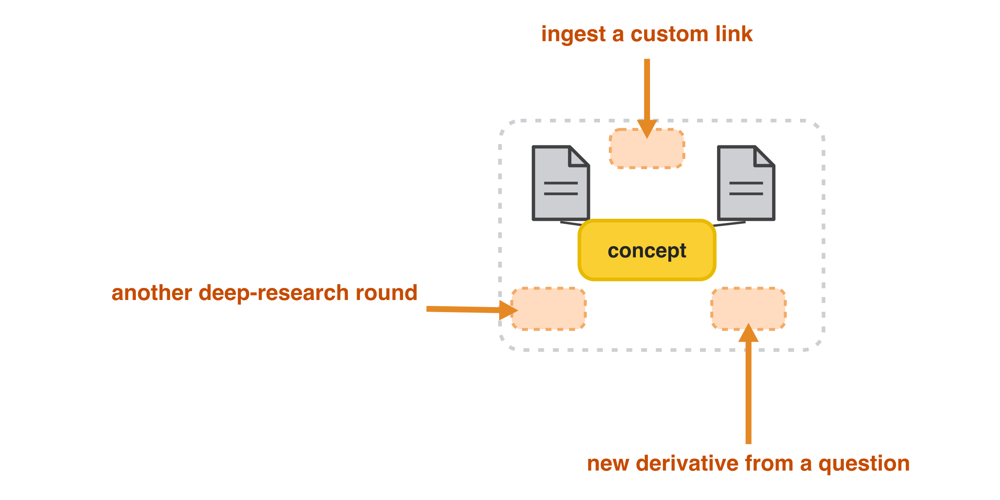</p>

Codex gives you an answer. This gives Codex a reusable research workspace:

- `raw/` - copied or fetched source material
- `wiki/sources/` - per-source summaries
- `wiki/concepts/`, `wiki/entities/`, `wiki/comparisons/` - reusable synthesis pages
- `wiki/overview.md` and `wiki/synthesis.md` - the current thesis
- `index.yaml` and `index.md` - the catalog future agents read first
- `log.md` and `wiki/open-questions.md` - what happened and what to research next

The point is not to replace Codex. The point is to stop re-researching the same topic
every week.

## What this is

`AI Research OS` is a set of local AI skills for building and querying a persistent
research wiki from your own sources:

- Obsidian notes
- Readwise highlights
- NotebookLM notebooks
- GitHub repos
- YouTube videos with public transcripts
- web links
- PDFs and local files

Obsidian is optional. It is just a visual IDE for browsing the generated markdown wiki.
The system can run purely through Codex or Claude Code from a normal working directory.

<p align="center">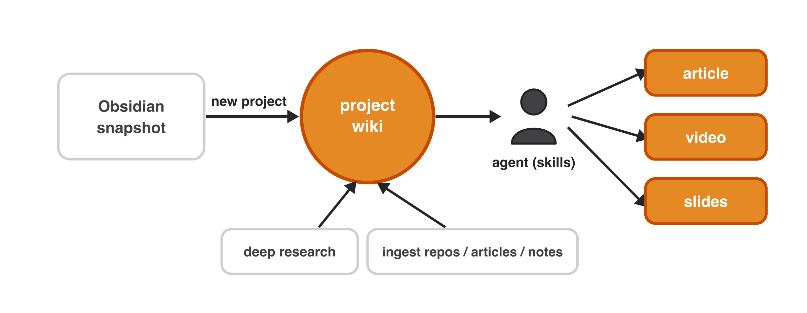</p>

## Slides and video

- Slides: [] (coming soon)
- Video: [] (coming soon)

## [Whenever You're Ready, Here's How to Go Deeper](https://academy.towardsai.net/courses/agent-engineering?utm_source=github&utm_medium=aieng&utm_campaign=2026_aieng_sf_online)

<a href="https://academy.towardsai.net/courses/agent-engineering?utm_source=github&utm_medium=aieng&utm_campaign=2026_aieng_sf_online">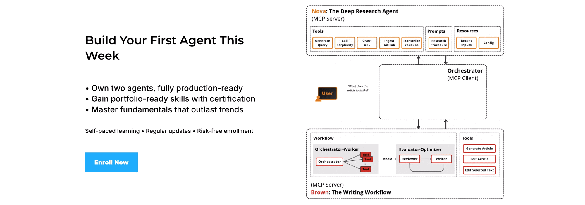</a>

Our `AI Research OS` runs locally via skills.

Our [**Agent AI Engineering course**](https://academy.towardsai.net/courses/agent-engineering?utm_source=github&utm_medium=aieng&utm_campaign=2026_aieng_sf_online), built with Towards AI, shows how to ship it to production as a multi-agent system: MCP servers with LangGraph, an evaluator-optimizer loop, observability, evals and GCP deployment.

35 lessons. 3 end-to-end portfolio projects. A certificate. And a Discord community with direct access to industry experts and me.

Built for software, data engineers or scientists transitioning into AI engineering.

_Rated 5/5 by 300+ students. The first 7 lessons are free:_

[**Start here →**](https://academy.towardsai.net/courses/agent-engineering?utm_source=github&utm_medium=aieng&utm_campaign=2026_aieng_sf_online)

## Architecture

<p align="center">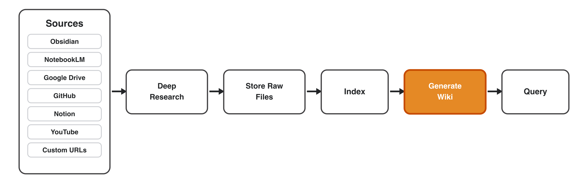</p>

Sources flow through deep research, get stored as raw files, indexed, synthesized into a
wiki, and then queried:

```text
user question / sources
        |
        v
  /research router
        |
        +--> query existing wiki
        +--> append known sources
        +--> run deep discovery
        |
        v
 raw sources -> source pages -> concepts/entities/comparisons
        |
        v
 index.yaml + overview.md + synthesis.md + open-questions.md
```

## Examples

Three end-to-end runs, each browsable in [`examples/`](examples/). Open the linked prompt
in Claude Code / Codex with `/research` to reproduce it; each screenshot shows the resulting
wiki browsed in Obsidian.

### 1. Deep research from an outline + web resources

Discover sources, summarize, and synthesize them into a topic wiki.

**How to use it:** `/research` [`example_1_deep_research/prompt.md`](examples/example_1_deep_research/prompt.md)

<p align="center">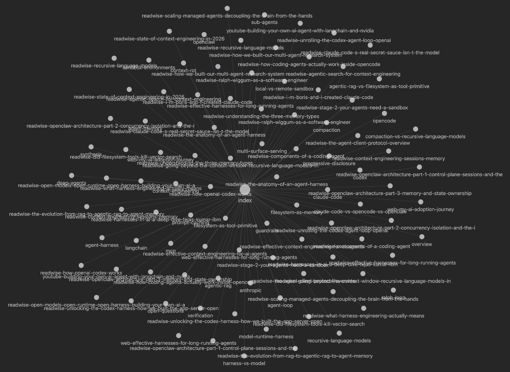</p>

A full research wiki on agentic harnesses, built from a content outline and reference links.

### 2. Ingest GitHub repos

Compute per-repo notes (architecture, agents, memory, permissions) and cross-repo
comparisons, skipping deep discovery.

**How to use it:** `/research` [`example_2_github/prompt.md`](examples/example_2_github/prompt.md)

<p align="center">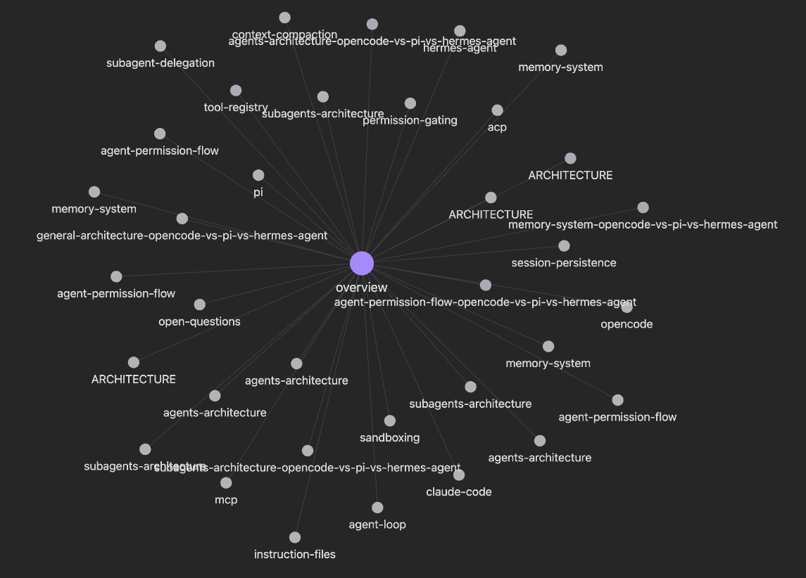</p>

Side-by-side comparison pages across three coding-agent repositories.

### 3. Ingest web links

Pull a handful of specific articles into the wiki without running deep research.

**How to use it:** `/research` [`example_3_ingest_links/prompt.md`](examples/example_3_ingest_links/prompt.md)

<p align="center">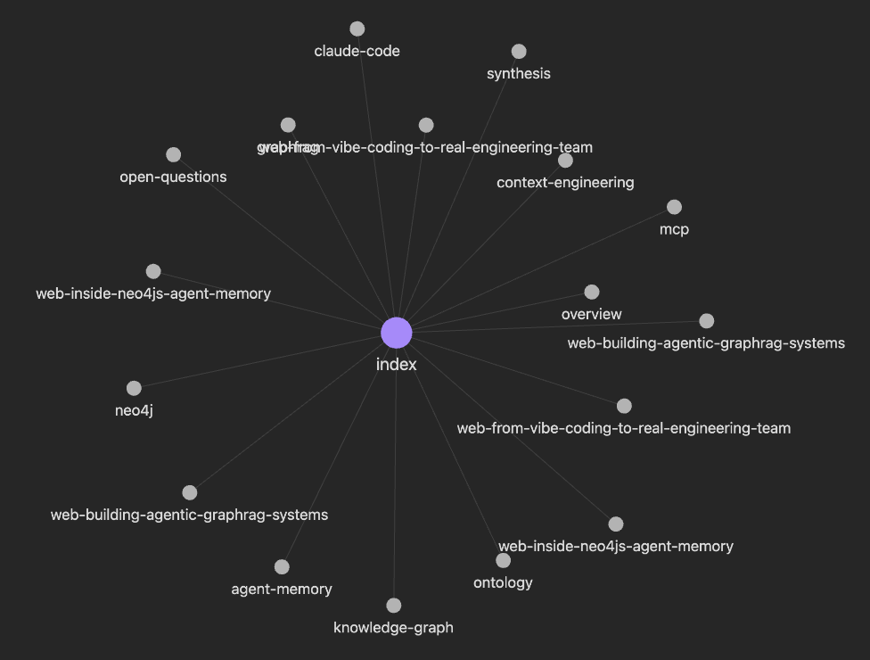</p>

Source pages and synthesis built from three custom URLs.

## How to use it

1. Start with a question and a few sources.
2. Run `/research`.
3. Show the generated `working-dir/research-<topic>/` directory.
4. Ask a follow-up question that answers from the existing wiki instead of re-ingesting.
5. Add a YouTube video or GitHub repo and show the wiki update.

## When to use it

Use this when:

- you are researching a topic over multiple sessions
- you want sources, summaries, claims, and open questions preserved
- you want to compare several repos, papers, videos, or notes
- you want future Codex / Claude runs to reuse prior research
- you want a local markdown wiki you can inspect, edit, and version
- you want deep research to write durable artifacts, not just a chat answer

Do not use this when:

- you have one simple question
- you only need a quick answer from one link
- you do not care about saving the result
- you need a fully managed hosted knowledge base
- you want semantic search infrastructure only, without an agent workflow

## Compared to alternatives

| Tool | Best for | Limitation | Where `AI Research OS` fits |
|---|---|---|---|
| Codex one-shot | Fast answers, coding help, repo Q&A | The answer is not automatically turned into a durable research workspace | Use Codex directly for simple questions; use this when the research should be reused and extended |
| NotebookLM | Chatting with a fixed set of uploaded sources | Less programmable, less agent-native, not designed around repo parsing, wiki updates, or repeated source ingestion loops | Creates local files, source pages, indexes, and synthesis that agents can keep editing |
| Deep research agents | Broad discovery and synthesis | Often produce a one-time report | Stores the report as a living wiki with raw sources, open questions, and append workflows |
| RAG / vector databases | Retrieval over large corpora | Infrastructure-heavy; retrieval alone does not create source pages, comparisons, or a thesis | Keeps the workflow lightweight and artifact-first; indexing is human/agent-readable |
| `AI Research OS` | Research that compounds across notes, repos, videos, links, and follow-up questions | More setup than a one-shot prompt | Gives Codex / Claude Code a reusable research workspace |

## Skills

| Skill | What it does |
|---|---|
| `/research` | Init, append, or query a per-topic research directory. |
| `/research-distill` | Distill a research directory into a compact `research.md` for a specific piece of content. |
| `/research-lint` | Health-check a research directory for orphan sources, broken links, stale claims, contradictions, and missing hubs. |
| `/research-render` | Render wiki pages into slides, charts, canvases, or content briefs. |

The shared data contract lives in
`plugins/ai-research-os/skills/research/CONVENTIONS.md`.

## Research modes

`/research` routes requests before doing expensive work:

| Mode | Use when | Behavior |
|---|---|---|
| `query` | Ask from an existing research directory | Reads `index.yaml` and `wiki/`; no ingest or discovery. |
| `append` | Add the sources you provide | Ingests the provided sources only; no discovery rounds. |
| `deep` | Explicitly request deep research | Runs source discovery rounds (at a `fast`/`light`/`deep` depth preset), dedup, and wiki updates. |
| `init` | Start a new research directory | Creates `working-dir/research-<topic>/`. |

Deep discovery is opt-in and runs at one of three depth presets — `fast` (1 round, 3 queries),
`light` (2 rounds, 3 + 2 queries), or `deep` (3 rounds, 3 queries each). Long runs show a plan
first: selected mode, sources to ingest, expected runtime, and files to write.

In `query` mode the agent drills down progressively — index summary first, then the source
wiki page, then derivatives, and only the raw source if it still needs it — so the context
window stays small:

<p align="center">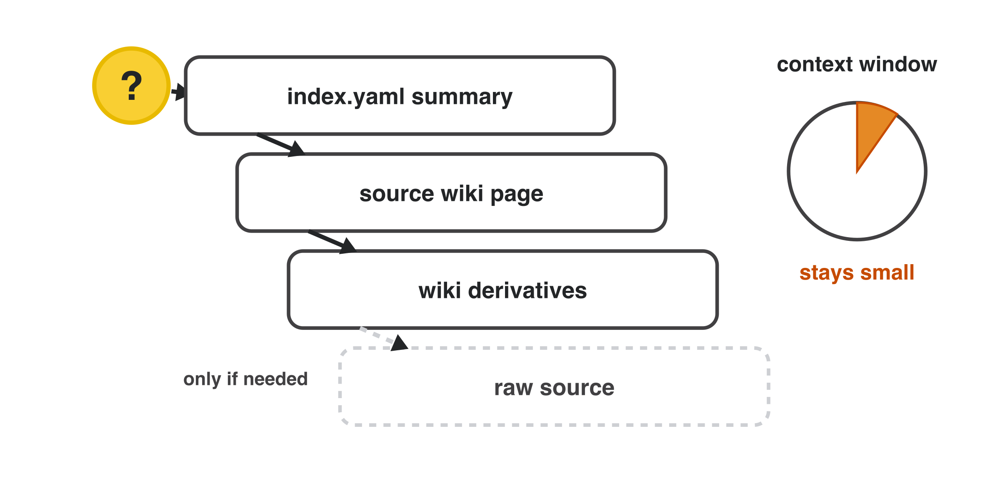</p>

A question can also grow the wiki: it spawns new notes and comparisons off existing concepts,
and your open questions accumulate for future rounds:

<p align="center">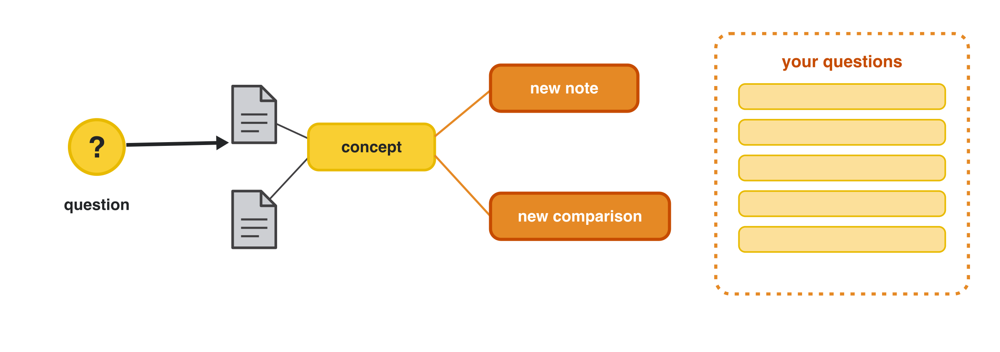</p>

## Install

You only need three things to get going:

1. **Claude Code** (or Codex) — the agent that runs the skills.
2. **`uv`** — runs the helper scripts (see [Dependencies](#dependencies)).
3. **This plugin** — installed with one of the two options below.

Always run the agent from the directory where you want research saved: your Obsidian
vault root, a project root, or any working folder. Research outputs are created in a
`working-dir/` subfolder of wherever you start.

### Option A - Claude Code plugin (recommended)

Inside Claude Code, run:

```text
/plugin marketplace add iusztinpaul/ai-research-os-workshop
/plugin install ai-research-os@iusztinpaul
```

That's it — the `/research`, `/research-distill`, `/research-lint`, and
`/research-render` skills are now available everywhere you use Claude Code.

### Option B - local skills (for testing or development)

Use this if you want to edit the skills, test a PR branch, or run without the
marketplace plugin.

```bash
git clone https://github.com/iusztinpaul/ai-research-os-workshop.git

# from the vault or project where you want to use the skills:
cd /path/to/your/vault-or-project
mkdir -p .claude/skills
cp -R /path/to/ai-research-os-workshop/plugins/ai-research-os/skills/* .claude/skills/
```

To test a specific branch, `git checkout <branch-name>` in the clone before copying.

> Tip: instead of copying, symlink the skills so your edits are picked up live:
> `ln -s /path/to/ai-research-os-workshop/plugins/ai-research-os/skills/research .claude/skills/research`

### First run

1. Open Claude Code or Codex from your vault/project directory.
2. Type `/` and confirm `research` appears in the skill list (this verifies the install).
3. Run `/research` with a topic and a couple of sources, for example:
   `/research compare LangGraph and CrewAI for multi-agent orchestration`.
4. Inspect the generated `working-dir/research-<topic>/` directory.
5. Ask a follow-up — the agent answers from the existing wiki instead of re-ingesting.

If a source CLI is missing, `/research` warns you and continues with what it can reach,
so you can start with zero extra setup and add connectors later (see
[Source CLIs](#source-clis)).

## Dependencies

Install `uv` first:

```bash
# macOS
brew install uv

# Windows
winget install --id=astral-sh.uv -e
```

The helper scripts use `uv run --script`, so script dependencies install into isolated
environments automatically.

Per-script dependencies include `pyyaml`, `httpx`, `pymupdf`, `pymupdf4llm`,
`youtube-transcript-api`, and `matplotlib`.

## Source CLIs

These are optional source connectors. Missing CLIs degrade gracefully: `/research` warns
you and continues with the sources it can access.

| CLI | Used for | Setup |
|---|---|---|
| `obsidian` | Search local Obsidian notes | Enable Obsidian CLI in Obsidian settings. On Windows, the skill also tries `%LOCALAPPDATA%\Programs\Obsidian\Obsidian.com`. |
| `readwise` | Search Readwise library and feed | `npm install -g @readwise/cli`, then authenticate. |
| `nlm` | Search NotebookLM notebooks | See the bundled `nlm-skill`. |
| Web pages | Fetch generic HTML sites | None — uses preinstalled `curl` + a `python3` stdlib HTML stripper. `WebFetch` is the fallback for JS-rendered or bot-walled pages. |
| `git` | Ingest GitHub repos | Install system Git. |
| YouTube captions | Ingest public YouTube transcripts | No API key required. Public captions must be available. |

Your PARA vault (Projects, Areas, Resources, Archive) is pulled into an immutable Obsidian
snapshot — notes, resources, and highlights — that research builds on without mutating your
originals:

<p align="center">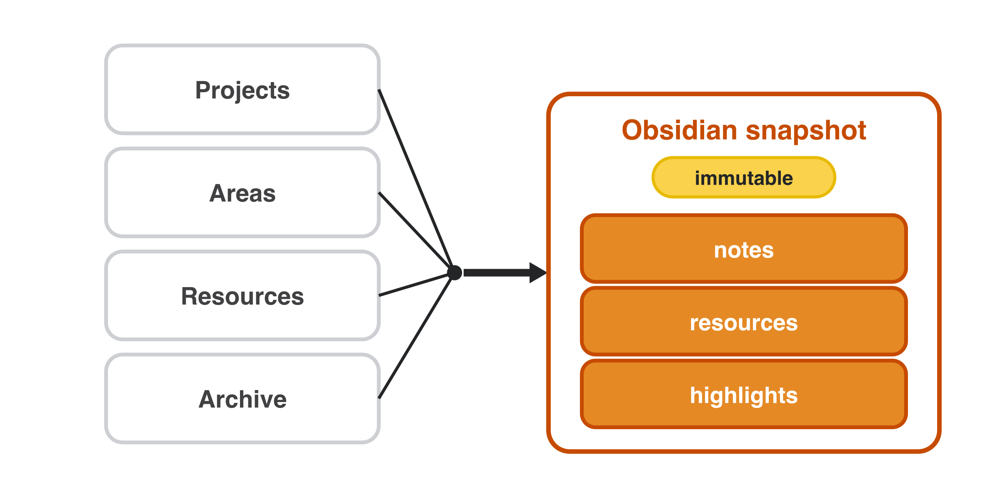</p>

## Output layout

Research outputs are created under:

```text
working-dir/research-<topic>/
  index.yaml
  index.md
  log.md
  raw/
  wiki/
    overview.md
    synthesis.md
    open-questions.md
    sources/
    concepts/
    entities/
    comparisons/
```

`index.yaml` is the canonical machine-readable catalog. `index.md` is the
Obsidian-friendly view.

The agent reads `index.yaml` first and follows its pointers to wiki pages, derivatives, or
raw sources — the index *is* the retrieval layer, so there is no vector DB:

<p align="center">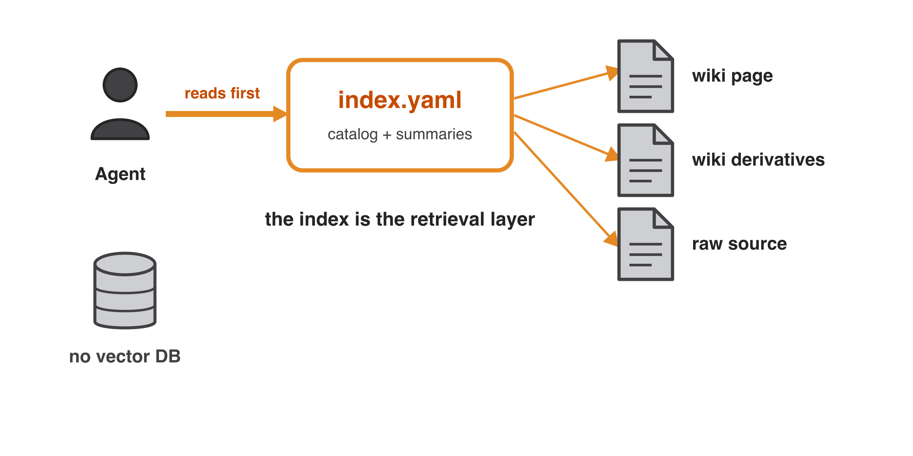</p>
