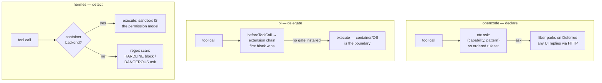

# Agent permission flow — opencode vs. pi vs. hermes-agent

> How does each harness decide that a dangerous action may run — and who, exactly, gets asked?

## At a glance

| | [[wiki/sources/opencode\|opencode]] | [[wiki/sources/pi\|pi]] | [[wiki/sources/hermes-agent\|hermes-agent]] |
|---|---|---|---|
| **Philosophy** | Declaration-based: every tool asks against a config ruleset | No built-in gate; ships the seam, not the policy | Detection-based: regex taxonomy over command *content* |
| **Rule model** | `(capability, pattern)` vs. ordered wildcard rules, last match wins, default `ask` | None; `tool_call` extension chain, first block wins | `HARDLINE` (unbypassable) + `DANGEROUS` (~60, approvable) tiers |
| **Approval surface** | Async `Deferred` + event bus; TUI / app / CLI / [[wiki/concepts/acp\|ACP]] all reply over HTTP | Extension-rendered `ctx.ui.select` dialogs; no-op headless | CLI modal, chat-gateway `/approve` queue, aux-LLM "smart" reviewer |
| **"Always" scope** | V1 in-memory per instance; V2 SQLite per project | Whatever the gate author persists | Pattern-keyed once/session/always; `always` → `config.yaml` allowlist |
| **Sandbox stance** | Gate everything in-process | OS/container is the only real boundary | Container backends bypass the gate stack entirely |

## Definitional contrast

The three repos occupy three corners of the [[wiki/concepts/permission-gating]] design space. [[wiki/sources/opencode]] gates by **tool identity plus argument pattern**: every irreversible tool call funnels through one API (`ctx.ask`) evaluated against an ordered, last-match-wins wildcard ruleset whose merge order *is* precedence, and "modes" like plan/build/explore are nothing but ruleset deltas [[wiki/repos/opencode/agent-permission-flow.md#The rule model and evaluation|cite]] [[wiki/repos/opencode/agent-permission-flow.md#Config → ruleset compilation|cite]]. [[wiki/sources/pi]] ships **no permission system at all** — by documented design ("Pi does not include a built-in permission system…") — only a synchronous `beforeToolCall` chokepoint where user-space extensions can veto or rewrite any call, with [[wiki/concepts/sandboxing]] via containers prescribed as the actual boundary [[wiki/repos/pi/agent-permission-flow.md#Module purpose|cite]] [[wiki/repos/pi/agent-permission-flow.md#Design philosophy: why no built-in gate|cite]]. [[wiki/sources/hermes-agent]] gates by **command content**: most shell commands run unprompted, but anything matching its regex taxonomy routes to an approval surface — except `HARDLINE_PATTERNS`, which no mode, flag, or allowlist can ever approve [[wiki/repos/hermes-agent/agent-permission-flow.md#The layered gate stack|cite]].

## Mechanism: tool call → decision → execution

The code paths differ in concurrency model but converge on one semantic: **rejection becomes an error tool result the model reads, never an exception**. In opencode, the tool's Effect fiber parks on a `Deferred` while a `permission.asked` event fans out to every attached client; a reject cascades to all pending asks in the session and can carry user feedback that becomes the model-facing error text — the gate doubles as a steering channel [[wiki/repos/opencode/agent-permission-flow.md#End-to-end flow: tool call → decision → execution|cite]]. In pi, `prepareToolCall` in the [[wiki/concepts/agent-loop]] calls the hook chain sequentially; a `{block: true}` short-circuits to an error result, handlers may mutate `event.input` in place, and a throwing gate blocks the tool (fail-safe) [[wiki/repos/pi/agent-permission-flow.md#Data flow 1: tool call → gate → execution/rejection|cite]]. In hermes, the synchronous agent thread blocks on a `threading.Event` until a `/approve` arrives from Discord/Telegram (or a 300 s timeout denies), with the deny message written against model evasion: "Silence is not consent" [[wiki/repos/hermes-agent/agent-permission-flow.md#Data flow — tool call to execution/rejection|cite]].

Granularity also lands differently: opencode lets each tool pick its pattern (arity-trimmed bash prefixes, file paths, subagent names; [[wiki/concepts/mcp\|MCP]] tools are coarse per-tool keys) [[wiki/repos/opencode/agent-permission-flow.md#Per-tool gating: what `patterns` and `always` mean|cite]]; hermes keys approvals by pattern *description*, so one grant covers a command family [[wiki/repos/hermes-agent/agent-permission-flow.md#Pattern detection — the "what is dangerous" taxonomy|cite]]. For [[wiki/concepts/subagent-delegation]], opencode derives child rulesets (parent denies propagate; recursion deny-by-default) [[wiki/repos/opencode/agent-permission-flow.md#Subagent permission flow|cite]], while hermes installs auto-deny callbacks in worker threads so children can never escalate to the user [[wiki/repos/hermes-agent/agent-permission-flow.md#Subagent permission flow|cite]].

## Trade-offs

| Dimension | opencode | pi | hermes-agent | Context-dependent |
|---|---|---|---|---|
| Policy expressiveness in config | x | | | [[wiki/repos/opencode/agent-permission-flow.md#Config → ruleset compilation|cite]] |
| Gate-code auditability / minimal core | | x | | [[wiki/repos/pi/agent-permission-flow.md#Key types & entry points|cite]] |
| Low friction (un-flagged actions never ask) | | | x | [[wiki/repos/hermes-agent/agent-permission-flow.md#Module purpose|cite]] |
| Floor that survives every bypass mode | | | x | [[wiki/repos/hermes-agent/agent-permission-flow.md#The layered gate stack|cite]] |
| Multi-client / remote approval answering | x | | x | opencode via event bus [[wiki/repos/opencode/agent-permission-flow.md#Approval UI surfaces|cite]]; hermes via chat gateways [[wiki/repos/hermes-agent/agent-permission-flow.md#Approval surfaces (UI flow)|cite]] |
| Honesty that in-process gating ≠ security | | x | | [[wiki/repos/pi/agent-permission-flow.md#Design philosophy: why no built-in gate|cite]] |
| Self-protection of the policy store | | | x | agent cannot edit `config.yaml` [[wiki/repos/hermes-agent/agent-permission-flow.md#Parallel file-tool gates (deny, not ask)|cite]] |

## When to study/adopt each

- **opencode** — when designing a *policy engine*: ordered-ruleset evaluation, modes-as-rulesets, deny enforced at both tool advertisement and call time, and the async multi-client ask handshake; its V2 (deny-by-default, SQLite-persisted grants that never beat configured denies) shows where the design matures [[wiki/repos/opencode/agent-permission-flow.md#The V2 system (`packages/core`) — where this is heading|cite]].
- **pi** — when designing a *mechanism without policy*: the cleanest middleware seam (validate → hook → execute), block-as-error semantics, fail-safe-on-throw, plus the project-trust gate that prevents an untrusted repo from injecting the gate code itself [[wiki/repos/pi/agent-permission-flow.md#Data flow 2: project trust — the input-loading gate|cite]].
- **hermes-agent** — when designing for *unattended and remote operation*: pattern-keyed approval scopes, the hardline floor above `--yolo`, the LLM smart reviewer, paired file/terminal denies on the policy file, and the gateway approval queue; it doubles as an index of peer ideas ([[8 - Projects/Building Your Own AI Research OS/example_3_ingest_links/research-custom-urls/wiki/entities/claude-code]] deny rules, Codex smart approvals) [[wiki/repos/hermes-agent/agent-permission-flow.md#Comparative takeaways for the research topic|cite]].

## Where they're confused / conflated

All three explicitly reject the conflation of permission prompts with a security boundary — the differences are in what they do about it. pi refuses to ship the gate at all, calling a partial in-process sandbox "easy to misunderstand as a security boundary" [[wiki/repos/pi/agent-permission-flow.md#Design philosophy: why no built-in gate|cite]]; hermes ships deep gating but labels its read-denies "NOT a security boundary … defense-in-depth" and lets containers bypass the stack entirely [[wiki/repos/hermes-agent/agent-permission-flow.md#Parallel file-tool gates (deny, not ask)|cite]]; opencode treats gating as consent UX and policy, leaving isolation out of the gate's claims [[wiki/repos/opencode/agent-permission-flow.md#Comparative takeaways (for the research topic)|cite]].

> Synthesis: Context-dependent, but the layers compose rather than compete: pi is right that the real boundary is the OS, hermes is right that a hardline floor and content detection cut prompt fatigue for unattended agents, and opencode is right that consent UX wants a declarative, multi-client policy engine. For this study's purposes opencode is the best default *reference architecture* for the tool-call→decision→execution path (one chokepoint, typed outcomes, modes as data), with hermes's hardline-above-all-modes invariant and sandbox-bypass rule as the safety ideas most worth porting, and pi as the proof that the whole layer can live behind a single middleware seam.
