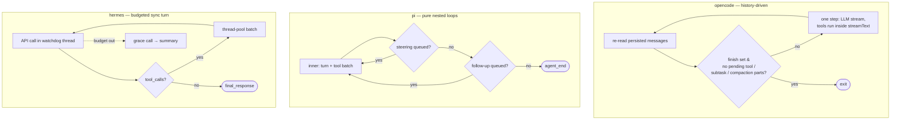

# Agents architecture: opencode vs. pi vs. hermes-agent

> Three answers to the same question — what *is* an agent, and where does its loop live: in data, in a pure function, or in a mutable object?

## At a glance

| | [[wiki/sources/opencode|opencode]] | [[wiki/sources/pi|pi]] | [[wiki/sources/hermes-agent|hermes-agent]] |
|---|---|---|---|
| **Agent is** | a config record (`Agent.Info`) interpreted by one loop | a pure `runLoop` function + stateful wrappers | one god-object class (`AIAgent`, ~70-param init) |
| **Loop style** | history-driven steps over persisted messages | two nested in-memory loops (turns / follow-ups) | synchronous `while`, 90-iteration cap + budget |
| **Provider seam** | dual runtime (AI SDK / native) → `LLMEvent` stream | `streamSimple` + registry keyed by API shape | OpenAI format as IR + per-protocol transports |
| **Tool execution** | inside the provider stream (`streamText` callbacks) | prepare→hook→execute→finalize, parallel by default | thread-pool batches via singleton registry |
| **Session store** | Session→Message→Part tree, k-sortable IDs | append-only JSONL tree + leaf pointer | SQLite (WAL, FTS5), one row per message |
| **Strength** | resumability; multi-client serving | embeddability; clean DI seams | provider resilience; searchable history |
| **Weakness** | heaviest machinery (Effect, server) | policy left entirely to userland | sprawling mutable state, threads |

## Definitional contrast

- [[wiki/sources/opencode]] makes the agent **data**: built-ins, markdown files (same shape as [[8 - Projects/Building Your Own AI Research OS/example_3_ingest_links/research-custom-urls/wiki/entities/claude-code]]'s `.claude/agents/*.md`), JSON config, and even LLM-generated configs all yield an `Agent.Info` record — name, mode, [[wiki/concepts/permission-gating|permission ruleset]], optional model/prompt overrides — interpreted by a single shared loop [[wiki/repos/opencode/agents-architecture.md#Where agent definitions come from|cite]].
- [[wiki/sources/pi]] makes the agent **a library**: `runLoop` is a pure ~740-line function with zero I/O; auth, context transforms, queues, and hooks are all injected via `AgentLoopConfig`, with `Agent` and `AgentHarness` layering state on top [[wiki/repos/pi/agents-architecture.md#The agent loop|cite]].
- [[wiki/sources/hermes-agent]] makes the agent **an object**: every surface constructs an `AIAgent` and calls `run_conversation()`; the class is a mutable state bag whose methods forward to decomposed `agent/*.py` free functions [[wiki/repos/hermes-agent/agents-architecture.md#Role in the system|cite]].

## Mechanism — three [[wiki/concepts/agent-loop|agent loop]] designs

The deepest difference is **where loop state lives**. opencode's loop is stateless between iterations: each pass re-derives intent from the persisted message list, and queued work (subtask, compaction) is encoded as message `Part`s — so crash recovery and "continue" are the same code path, and [[wiki/concepts/session-persistence|session persistence]] *is* the control flow [[wiki/repos/opencode/agents-architecture.md#6. Session / message data model|cite]]. pi keeps state in memory and gets its flexibility from injection points: `prepareNextTurn` can swap context/model mid-run (how [[wiki/concepts/context-compaction|compaction]] applies without restarting), and steering vs. follow-up queues distinguish mid-run injection from post-stop continuation [[wiki/repos/pi/agents-architecture.md#The agent loop|cite]]. hermes bounds its loop with explicit accounting — per-turn iteration cap, cross-turn shared `IterationBudget`, one-shot grace call — and devotes ~80% of the loop file to recovery machinery: retry/fallback chains, credential rotation, stale-stream watchdogs [[wiki/repos/hermes-agent/agents-architecture.md#Contrast hooks for the comparative study|cite]].

The provider layers mirror this. opencode normalizes two runtimes (Vercel AI SDK, native) into one `LLMEvent` stream, and — unusually — tools execute *inside* `streamText`, with the processor merely observing tool events [[wiki/repos/opencode/agents-architecture.md#4. Provider / model layer|cite]]. pi's loop never touches a vendor SDK: `streamSimple` resolves providers by **API shape** (`anthropic-messages`, `openai-responses`) from a runtime-extensible registry, and failures are encoded in the stream, never thrown [[wiki/repos/pi/agents-architecture.md#Provider/model layer (pi-ai)|cite]]. hermes keeps OpenAI chat-completions dicts as the internal lingua franca and adapts them per wire protocol via `ProviderTransport`, branching on `api_mode` and normalizing every response into `NormalizedResponse` [[wiki/repos/hermes-agent/agents-architecture.md#Annotated code|cite]]. On tools, opencode and hermes ship central [[wiki/concepts/tool-registry|registries]] (filtered per agent/permission vs. per toolset); pi has none in core — the tool list rides along in `AgentContext` per run [[wiki/repos/pi/agents-architecture.md#Tool registry & execution pipeline|cite]] [[wiki/repos/hermes-agent/agents-architecture.md#Tool registry & execution pipeline|cite]] [[wiki/repos/opencode/agents-architecture.md#5. Tool registry & execution pipeline|cite]].

## Trade-offs

| Dimension | Favors | Why |
|---|---|---|
| Crash recovery / resumability | opencode | loop re-derives everything from persisted history [[wiki/repos/opencode/agents-architecture.md#2. The main agent loop — SessionPrompt.runLoop|cite]] |
| Embedding / reuse / testing | pi | pure loop, DI'd `streamFn`, `faux` provider for tests [[wiki/repos/pi/agents-architecture.md#Comparative notes (for the cross-repo study)|cite]] |
| Flaky-provider resilience | hermes-agent | credential rotation, fallback chains, stream watchdogs [[wiki/repos/hermes-agent/agents-architecture.md#Loop walk-through (with exact anchors)|cite]] |
| Loop safety built in | opencode | doom-loop detection escalates to a permission ask [[wiki/repos/opencode/agents-architecture.md#3. Stream processing — SessionProcessor|cite]] |
| Mid-run steerability | context-dependent | pi (queues) and hermes (drain checks) both first-class; opencode wraps interjections as system-reminders [[wiki/repos/pi/agents-architecture.md#The agent loop|cite]] [[wiki/repos/hermes-agent/agents-architecture.md#The agent loop|cite]] [[wiki/repos/opencode/agents-architecture.md#Per-step assembly|cite]] |
| Agent's history as queryable data | hermes-agent | SQLite + FTS5 makes `session_search` a tool [[wiki/repos/hermes-agent/agents-architecture.md#Contrast hooks for the comparative study|cite]] |

## When to study/adopt each

**opencode** — study it for agents-as-data, the three-layer loop split (orchestration / event materialization / runtime selection), and permission-woven design where even internal summarizers are hidden agents [[wiki/repos/opencode/agents-architecture.md#Comparative takeaways (for the cross-repo study)|cite]]. Adopt when you need a multi-client, server-first harness with durable resumable sessions.

**pi** — study it for the cleanest separation of loop / state / policy in the cohort, the `AgentMessage`→`convertToLlm` split (apps carry custom message types; only the converter decides what the model sees), and the API-shape provider registry [[wiki/repos/pi/agents-architecture.md#The agent loop|cite]]. Adopt as an embeddable runtime when you want to own policy ([[wiki/concepts/permission-gating|permissions]], [[wiki/concepts/subagent-delegation|subagents]]) yourself.

**hermes-agent** — study it for production resilience engineering and for hand-rolled provider normalization without an SDK dependency (transports + profiles) [[wiki/repos/hermes-agent/agents-architecture.md#Annotated code|cite]]. Adopt in Python, multi-surface, long-running deployments where surviving bad providers matters more than architectural purity.

## Where they're confused / conflated

"The loop" sits at different altitudes and is not directly comparable line-for-line: opencode's `runLoop` orchestrates *steps over persisted history*, pi's `runLoop` is a *pure in-memory run*, and hermes's `run_conversation()` is *one user turn* of up to 90 API calls [[wiki/repos/opencode/agents-architecture.md#2. The main agent loop — SessionPrompt.runLoop|cite]] [[wiki/repos/pi/agents-architecture.md#The agent loop|cite]] [[wiki/repos/hermes-agent/agents-architecture.md#The agent loop|cite]]. Likewise "agent" names a config record, a function invocation, and a class instance respectively — comparisons across the three should fix the level (definition vs. loop vs. wrapper) first.

> Synthesis: For this study's purpose — extracting reusable design patterns for coding-agent harnesses — the verdict is context-dependent, but pi is the best *first* read: its pure loop with injected side effects is the minimal kernel the other two elaborate, making opencode legible as "that kernel plus persistence-as-control-flow, agents-as-data, and a server," and hermes as "that kernel plus an armor plating of resilience and accounting." If you are building, start from pi's seams; steal opencode's history-driven resumability the moment sessions must survive crashes or serve multiple clients; and mine hermes's retry/fallback/budget machinery when you graduate to hostile production traffic. The three converge on one quiet consensus worth noting: every harness normalizes providers into a single internal event/message grammar and keeps the loop vendor-blind — that seam, not the loop itself, is where each codebase spent its abstraction budget.
