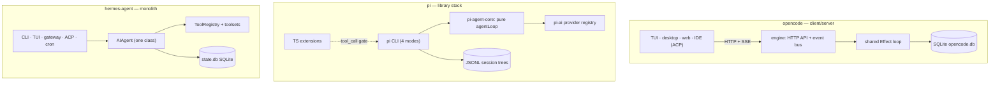

# General architecture: opencode vs. pi vs. hermes-agent

> Three coding-agent harnesses, three irreconcilable answers to the same question: where should the harness boundary sit — behind a server API, inside a library, or around one big object?

## At a glance

| | [[wiki/sources/opencode\|opencode]] | [[wiki/sources/pi\|pi]] | [[wiki/sources/hermes-agent\|hermes-agent]] |
|---|---|---|---|
| **What it is** | Client/server engine; every UI is a client | Four-package library stack; CLI is one consumer | Python monolith; one class behind many surfaces |
| **Language / runtime** | TypeScript on Bun, Effect framework | TypeScript on Node ≥ 22, minimal deps | Python, synchronous core |
| **Process model** | Server (worker-thread or headless) + HTTP/SSE clients | Single process; subagents = child OS processes | One process family; subagents = worker threads |
| **Loop style** | Effect fibers, streaming, resumable | Pure ~740-line function, zero I/O, DI config | Sync while-loop, max 90 iterations |
| **Extensibility surface** | Plugins, skills, markdown agents, MCP, ACP | TypeScript extensions (~30 hooks) — *the* product | Plugins, self-improving skills, MCP both ways |
| **Strength** | Multi-client by construction; one agent impl | Auditable core; everything else is user space | Lives everywhere (20+ messaging platforms, cron) |
| **Weakness** | Heaviest machinery; mid v1→v2 rewrite | Nothing built in; you assemble your own harness | 12k-LOC god object; no process boundary |

## Three system shapes

## Definitional contrast

- [[wiki/sources/opencode]] is a **server-first harness**: a Bun/Effect engine exposing an OpenAPI HTTP API plus SSE events, where the TUI runs the server in a worker thread and every other surface — desktop, web, IDE via [[wiki/concepts/acp]] — is an interchangeable client of one agent implementation [[wiki/repos/opencode/ARCHITECTURE.md#1. Bird's-eye view|cite]] [[wiki/repos/opencode/ARCHITECTURE.md#5. Client/server split & the event bus|cite]].
- [[wiki/sources/pi]] is a **runtime-as-library**: four lock-stepped, acyclic npm packages (TUI lib, provider API, pure agent core, CLI assembler) whose subtractive philosophy — no [[wiki/concepts/mcp]], no built-in [[wiki/concepts/subagent-delegation|subagents]], no [[wiki/concepts/permission-gating|permission popups]] — pushes every policy into a jiti-loaded TypeScript extension system [[wiki/repos/pi/ARCHITECTURE.md#1. Bird's-eye view|cite]] [[wiki/repos/pi/ARCHITECTURE.md#3. Monorepo & package stack|cite]].
- [[wiki/sources/hermes-agent]] is a **monolith with many faces**: one synchronous `AIAgent` class constructed directly by every surface — CLI, Ink TUI, Electron app, a ~20-platform messaging gateway, ACP, cron — with "no daemon/server split; the narrow waist is a Python object, not an RPC boundary" [[wiki/repos/hermes-agent/ARCHITECTURE.md#1. Bird's-eye view|cite]].

## Mechanism / how they differ

**Where the boundary lives.** opencode draws it at an RPC seam: clients POST, the engine publishes typed bus events, UIs re-render from the stream — which is what lets *any* attached client answer a permission ask [[wiki/repos/opencode/ARCHITECTURE.md#5. Client/server split & the event bus|cite]]. pi draws it at the package edge: `pi-agent-core`'s [[wiki/concepts/agent-loop|loop]] is a pure function with all side effects injected through `AgentLoopConfig`, so the CLI, RPC embedders, and child processes all consume the same runtime [[wiki/repos/pi/ARCHITECTURE.md#1. Bird's-eye view|cite]] [[wiki/repos/pi/ARCHITECTURE.md#12. Operating modes & the TUI|cite]]. Hermes draws no boundary at all — surfaces construct the object in-process; only the TUI/desktop talk JSON-RPC over stdio to a thin gateway [[wiki/repos/hermes-agent/ARCHITECTURE.md#11. Interactive surfaces — CLI, TUI, desktop, dashboard|cite]].

**Layering discipline.** opencode layers via Effect services (every subsystem a `Layer`), with agents as pure config interpreted by one shared loop [[wiki/repos/opencode/ARCHITECTURE.md#7. Agents & subagents|cite]]. pi layers via a strict acyclic dependency stack, each package independently publishable [[wiki/repos/pi/ARCHITECTURE.md#3. Monorepo & package stack|cite]]. Hermes layers via doctrine instead of structure: the "Footprint Ladder" routes new capability into skills/plugins/MCP rather than core tools, and a strict one-way import chain disciplines the [[wiki/concepts/tool-registry]] [[wiki/repos/hermes-agent/ARCHITECTURE.md#6. Tool registry, toolsets & the footprint ladder|cite]].

**Persistence shape follows process shape.** Server-shaped opencode is database-shaped — SQLite with an event-sourced v2 engine in flight [[wiki/repos/opencode/ARCHITECTURE.md#14. The v1 → v2 engine rewrite|cite]]; library-shaped pi keeps [[wiki/concepts/session-persistence|sessions]] as append-only JSONL trees per cwd [[wiki/repos/pi/ARCHITECTURE.md#10. Sessions, memory & compaction|cite]]; monolith Hermes shares one `state.db` (WAL + FTS5) across every surface, constrained by its prompt-cache invariant [[wiki/repos/hermes-agent/ARCHITECTURE.md#9. Memory & state|cite]]. All three converge on [[wiki/concepts/instruction-files]] (`AGENTS.md`/`CLAUDE.md`) and [[wiki/concepts/context-compaction]]; none uses a vector store.

## Trade-offs

| Dimension | Favors opencode | Favors pi | Favors hermes-agent | Context-dependent |
|---|---|---|---|---|
| Multi-client / IDE / remote UIs | x — free via HTTP+SSE+ACP [[wiki/repos/opencode/ARCHITECTURE.md#13. External protocol bridges: ACP, MCP, SDK\|cite]] | | | |
| Core auditability & embedding | | x — pure loop, 7 tools, DI seams [[wiki/repos/pi/ARCHITECTURE.md#7. Built-in tool surface\|cite]] | | |
| Ambient reach (messaging, cron, fleets) | | | x — gateway + cron + kanban [[wiki/repos/hermes-agent/ARCHITECTURE.md#12. Messaging gateway\|cite]] | |
| Subagent isolation strength | | x — process isolation [[wiki/repos/pi/ARCHITECTURE.md#11. Subagents & multi-agent\|cite]] | | opencode: permission-based; hermes: threads [[wiki/repos/hermes-agent/ARCHITECTURE.md#10. Subagents & delegation\|cite]] |
| Out-of-box completeness | x | | x | pi requires assembling extensions |
| Conceptual complexity to fork/study | | x | | opencode mid-rewrite [[wiki/repos/opencode/ARCHITECTURE.md#14. The v1 → v2 engine rewrite\|cite]]; hermes 12k-LOC core [[wiki/repos/hermes-agent/ARCHITECTURE.md#4. Core agent loop\|cite]] |
| Security boundary honesty | | x — defers to OS [[wiki/concepts/sandboxing\|sandboxing]] [[wiki/repos/pi/ARCHITECTURE.md#9. Permission & trust model\|cite]] | | hermes: sandbox bypasses approvals [[wiki/repos/hermes-agent/ARCHITECTURE.md#7. Execution environments (terminal backends)\|cite]] |

## When to study / adopt each

- **opencode** — study it for how a server-first harness buys multi-client permission answering, live subagent inspection, and IDE bridging with exactly one agent implementation; adopt it if you need many surfaces over one engine [[wiki/repos/opencode/ARCHITECTURE.md#1. Bird's-eye view|cite]]. Its markdown agents and skills mirror [[8 - Projects/Building Your Own AI Research OS/example_3_ingest_links/research-custom-urls/wiki/entities/claude-code]] conventions [[wiki/repos/opencode/ARCHITECTURE.md#7. Agents & subagents|cite]].
- **pi** — study it as the cleanest reference for what a harness *minimally is*: a pure loop, a provider seam keyed by API shape, and chokepoints instead of policies; adopt it to embed an agent runtime or build your own opinionated harness in user space [[wiki/repos/pi/ARCHITECTURE.md#8. Extension system|cite]].
- **hermes-agent** — study it for invariant-driven monolith design (byte-stable prompts for cache warmth, narrow-waist doctrine) and for the richest interop story — MCP client *and* server, plus ACP [[wiki/repos/hermes-agent/ARCHITECTURE.md#14. Protocol bridges — MCP & ACP|cite]]; adopt it for an always-on assistant that lives in your chat apps, not just your terminal [[wiki/repos/hermes-agent/ARCHITECTURE.md#12. Messaging gateway|cite]].

> Synthesis: The three harnesses are not rivals on one axis but three coherent local optima: opencode optimizes for *surfaces* (client/server, one loop, everything an event), pi for *composability* (library core, user-space policy), hermes for *presence* (one object reachable from anywhere, disciplined by invariants instead of boundaries). For this research topic — extracting architectural patterns for building coding agents — pi is the best first read because its subtractive core makes the essential harness anatomy visible, opencode is the best blueprint if multiple clients or an IDE protocol surface is a requirement, and hermes-agent is the best vocabulary mine for operational concerns (cache-stable prompts, footprint ladders, approval queues) that the other two barely name. Verdict: context-dependent — the right default depends on whether your scarce resource is surfaces, simplicity, or reach.
