# Memory system — opencode vs. pi vs. hermes-agent

> How do three coding-agent harnesses persist sessions, manage the context window, load instruction files, and (whether at all) carry knowledge across sessions?

## At a glance

| | [[wiki/sources/opencode|opencode]] | [[wiki/sources/pi|pi]] | [[wiki/sources/hermes-agent|hermes-agent]] |
|---|---|---|---|
| **Substrate** | Event-sourced SQLite `opencode.db` (WAL) | Append-only JSONL tree per session | One shared SQLite `state.db` + FTS5 |
| **History model** | seq-ordered rows; context = compaction-aware query | `parentId` tree; context = root→leaf replay | Linear rows; compaction splits session lineage |
| **Compaction** | Overflow → prune → anchored summary + tail | Threshold → turn-boundary cut → UPDATE summary | 50% threshold → head/tail protect → aux-model summary |
| **Cross-session memory** | None model-written; AGENTS.md + resumable transcripts | None; resume/fork session files only | MEMORY.md/USER.md + `session_search` + provider plugins |
| **Distinctive** | "Compaction is a query, not a delete" | "Session log = all durable agent state" | Pluggable memory providers, frozen-snapshot prompt discipline |
| **Source count** | 1 | 1 | 1 |

## Definitional contrast

All three sit at the *explicit* end of the agent-memory spectrum — none has a vector store or embedding recall — but they differ in how much memory is curated versus derived.

- [[wiki/sources/opencode]] composes four deterministic layers: event-sourced SQLite, a context-window manager, user-curated instruction files, and disk caches — explicitly "no auto-written memory file, no embedding/semantic recall" [[wiki/repos/opencode/memory-system.md#Module purpose|cite]] [[wiki/repos/opencode/memory-system.md#Other persistence touching memory|cite]].
- [[wiki/sources/pi]] is the minimalist: "a per-session append-only JSONL tree plus prompt-time instruction files — no semantic/vector memory store and no automatic cross-session knowledge carryover" [[wiki/repos/pi/memory-system.md#Module purpose|cite]].
- [[wiki/sources/hermes-agent]] is "the most layered of the three": SQLite transcripts with FTS5, a pluggable `ContextEngine`, bounded curated `MEMORY.md`/`USER.md`, and one-at-a-time external memory plugins (Mem0, Honcho, Hindsight, …) [[wiki/repos/hermes-agent/memory-system.md#Module purpose|cite]].

## Mechanism — storage and compaction pipelines

**Storage substrate.** opencode publishes events that projectors materialize into read-model tables — a durable, replayable transcript with WAL-mode SQLite [[wiki/repos/opencode/memory-system.md#Session persistence — event-sourced SQLite|cite]]. pi appends typed entries (messages, model changes, compactions, labels, extension state) to one JSONL file whose `parentId` links form a branchable tree; `/tree` time-travel and forking need no file copies [[wiki/repos/pi/memory-system.md#2. Session persistence — an append-only JSONL tree|cite]]. hermes shares a single `state.db` across CLI, TUI, gateway, and cron processes, with jittered write retries, FTS5 triggers, and schema self-repair [[wiki/repos/hermes-agent/memory-system.md#1. Session persistence — state.db|cite]].

**Conversation history.** All three derive — never store — the model-facing context (see [[wiki/concepts/session-persistence]] and [[wiki/concepts/context-compaction]]). opencode loads rows at-or-after the latest compaction `seq` — "the context window is a *view*" [[wiki/repos/opencode/memory-system.md#Session persistence — event-sourced SQLite|cite]]; pi replays the root-to-leaf path through the latest `CompactionEntry` [[wiki/repos/pi/memory-system.md#3. Conversation history model — rebuilding LLM context from the tree|cite]]; hermes rebuilds in-memory history from rows on `--resume` [[wiki/repos/hermes-agent/memory-system.md#1. Session persistence — state.db|cite]].

```mermaid
flowchart TD
    subgraph OC["opencode"]
        O1["overflow: tokens ≥ limit − 20k buffer"] --> O2["prune stale tool outputs<br/>(protect 2 turns / 40k)"]
        O2 --> O3["compaction agent → anchored summary<br/>+ preserved tail (2 turns)"]
        O3 --> O4[("SQLite: summary msg;<br/>old rows kept — view shifts")]
    end
    subgraph PI["pi"]
        P1["tokens > window − reserveTokens (16k)"] --> P2["findCutPoint at turn boundary<br/>keep ~20k recent"]
        P2 --> P3["UPDATE-prompt summary<br/>+ cumulative file lists"]
        P3 --> P4[("JSONL: CompactionEntry appended;<br/>tree intact, replay skips")]
    end
    subgraph HM["hermes-agent"]
        H1["prompt_tokens ≥ 50% of context"] --> H2["cross-process lock →<br/>prune + protect head/tail"]
        H2 --> H3["auxiliary model summary<br/>('REFERENCE ONLY' prefix)"]
        H3 --> H4[("state.db: end old session,<br/>create child via parent_session_id")]
    end
```

**Compaction strategy.** The summaries converge (structured goal/progress/decisions templates, iterative re-summarization that preserves the prior summary) but the persistence semantics diverge sharply. opencode runs compaction as a hidden agent, replays the pending user message verbatim after overflow, and prunes tool outputs first as cheap reclamation [[wiki/repos/opencode/memory-system.md#Context-window management — overflow, compaction, prune|cite]] [[wiki/repos/opencode/memory-system.md#Pruning — cheap reclamation before summarizing|cite]]. pi never cuts between a tool call and its result, splits oversized turns with dual summaries, tracks read/modified files cumulatively, and lets extensions override the whole pipeline [[wiki/repos/pi/memory-system.md#4. Context-window management — auto-compaction|cite]]; it alone summarizes abandoned branches back into context [[wiki/repos/pi/memory-system.md#5. Branch summarization — memory across tree navigation|cite]]. hermes treats compaction as a *session boundary* — the old session ends with `end_reason='compression'` and a child row is minted — defensively frames the summary as "REFERENCE ONLY", and is the only one needing a cross-process compaction lock [[wiki/repos/hermes-agent/memory-system.md#2. Context-window management & compaction|cite]].

**Instruction files** ([[wiki/concepts/instruction-files]]). opencode stacks global → first project match → config globs, then *lazily attaches* deeper `AGENTS.md` as the agent reads files, with v2 epoch-based drift detection when files change mid-session [[wiki/repos/opencode/memory-system.md#Project memory — AGENTS.md and instruction files|cite]]. pi inlines global-then-ancestors (root-most first) into the system prompt at startup [[wiki/repos/pi/memory-system.md#6. Project memory — AGENTS.md / CLAUDE.md instruction files|cite]]. hermes loads exactly *one* project source, first-match-wins (`.hermes.md` → `AGENTS.md` → `CLAUDE.md` → `.cursorrules` — reading [[8 - Projects/Building Your Own AI Research OS/example_3_ingest_links/research-custom-urls/wiki/entities/claude-code]]'s format among competitors'), threat-scanned, into a cache-stable prompt tier [[wiki/repos/hermes-agent/memory-system.md#5. Project memory — instruction files in the system prompt|cite]].

**Cross-session knowledge** is the real differentiator. opencode and pi offer only resumable transcripts plus human-curated files — neither lets the model write memory [[wiki/repos/opencode/memory-system.md#Other persistence touching memory|cite]] [[wiki/repos/pi/memory-system.md#6. Project memory — AGENTS.md / CLAUDE.md instruction files|cite]]. hermes gives the model three channels: a bounded, write-gated `memory` tool over `MEMORY.md`/`USER.md` (frozen snapshot, threat-scanned) [[wiki/repos/hermes-agent/memory-system.md#3. Curated memory — MEMORY.md / USER.md and the memory tool|cite]]; FTS5 `session_search` over all past sessions [[wiki/repos/hermes-agent/memory-system.md#1. Session persistence — state.db|cite]]; and the `MemoryProvider` plugin ABC with prefetch/sync lifecycle and fenced, scrubbed recall blocks [[wiki/repos/hermes-agent/memory-system.md#4. Pluggable memory providers — MemoryProvider / MemoryManager|cite]].

## Trade-offs

| Dimension | opencode | pi | hermes-agent |
|---|---|---|---|
| Multi-surface durability | strong (event-sourced DB) | per-session files | strong (shared DB, multi-process) |
| Inspectability / portability | DB tooling needed | best — plain JSONL | DB tooling needed |
| Branching / time-travel | revert snapshots only | best — native tree | session lineage only |
| Agent-writable long-term memory | none (by design) | none (by design) | yes, bounded + gated |
| Prompt-cache discipline | epoch/system-message updates | rebuilds on tool change | strictest — frozen snapshots |

Backing: [[wiki/repos/opencode/memory-system.md#Storage topology — where bytes live|cite]], [[wiki/repos/pi/memory-system.md#2. Session persistence — an append-only JSONL tree|cite]], [[wiki/repos/hermes-agent/memory-system.md#6. Caches & prompt-cache discipline|cite]], [[wiki/repos/opencode/memory-system.md#v2: instructions as versioned "system context" with drift detection|cite]].

## When to study/adopt each

**opencode** — when you need durable, replayable state behind multiple clients: event sourcing, compaction-as-view, tool-output spilling to disk, and instruction-drift epochs are the most production-engineered context plumbing here [[wiki/repos/opencode/memory-system.md#Session persistence — event-sourced SQLite|cite]] [[wiki/repos/opencode/memory-system.md#Pruning — cheap reclamation before summarizing|cite]].

**pi** — when you want the cleanest mental model: one append-only tree as the *only* durable state, branch summaries, and a storage-abstracted harness extraction underway [[wiki/repos/pi/memory-system.md#2. Session persistence — an append-only JSONL tree|cite]] [[wiki/repos/pi/memory-system.md#8. The parallel "durable harness" session layer (packages/agent)|cite]].

**hermes-agent** — when cross-session knowledge is the point: the only harness with model-writable memory, searchable transcripts as a memory tier, pluggable external memory backends, and prompt-caching treated as a first-class memory constraint [[wiki/repos/hermes-agent/memory-system.md#3. Curated memory — MEMORY.md / USER.md and the memory tool|cite]] [[wiki/repos/hermes-agent/memory-system.md#4. Pluggable memory providers — MemoryProvider / MemoryManager|cite]] [[wiki/repos/hermes-agent/memory-system.md#6. Caches & prompt-cache discipline|cite]].

> Synthesis: For this comparative study, the three repos form a clean spectrum rather than a rivalry: pi proves how little memory machinery a coding agent needs (one append-only tree, context always derived), opencode shows what hardening that idea for multi-client production looks like (event sourcing, pruning tiers, drift epochs), and hermes-agent is the only one that treats memory as a *subsystem* — model-writable, searchable, and pluggable — at the cost of the most moving parts. Notably, all three independently converged on the same compaction core (threshold trigger, protected recent tail, structured iterative LLM summary, nothing ever deleted), which suggests that pattern is settled practice; the open design question they answer differently is cross-session knowledge, where hermes-agent's gated `MEMORY.md` + provider plugins is the richest reference and the other two deliberately abstain. Verdict: context-dependent — study pi for the model, opencode for the engineering, hermes-agent for memory beyond the session.
