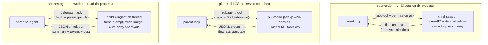

# opencode vs. pi vs. hermes-agent — Subagents architecture

> Three answers to the same question — how does a coding agent delegate work to a child without polluting its own context — using three different isolation primitives: sessions, processes, and threads.

## At a glance

| | [[wiki/sources/opencode|opencode]] | [[wiki/sources/pi|pi]] | [[wiki/sources/hermes-agent|hermes-agent]] |
|---|---|---|---|
| **Spawn primitive** | Built-in `task` tool → child session | Extension tool → child `pi` OS process | Built-in `delegate_task` → child `AIAgent` thread |
| **Isolation unit** | In-process session (`parentID` link) | Separate process, JSONL over stdout | In-process worker thread, same class |
| **Agent identity** | Named agent catalog (config + markdown) | Markdown agents, userland discovery | No registry — ad hoc goal + role |
| **Capability rule** | Inherit parent denies; subagent defines rest | `--tools` allowlist from frontmatter | Parent's tools ∩ requested − blocklist |
| **Result channel** | Last text part as tool result | Final assistant text; transcript in `details` | JSON envelope: summary + cost + telemetry |
| **Parallelism** | Model fan-out on fibers; async background mode | ≤8 tasks, ≤4 concurrent | `ThreadPoolExecutor`, default 3 concurrent |
| **Detail page** | [[wiki/repos/opencode/subagents-architecture.md#Module purpose\|cite]] | [[wiki/repos/pi/subagents-architecture.md#The headline: no built-in subagents — by deliberate design\|cite]] | [[wiki/repos/hermes-agent/subagents-architecture.md#Module purpose\|cite]] |

## Definitional contrast

All three implement [[wiki/concepts/subagent-delegation]] as a single tool the model calls, but they disagree on *where* the child lives. opencode's `task` tool creates a first-class persisted child session that runs the exact same prompt loop, tool registry, and permission engine as the parent — a subagent is just an `Agent.Info` record with `mode: "subagent"` plus a derived ruleset [[wiki/repos/opencode/subagents-architecture.md#Module purpose|cite]]. pi ships **zero** subagent machinery in core, by explicit philosophy ("No sub-agents. … build your own with extensions"); its ~1,000-line reference extension spawns separate `pi --mode json -p --no-session` processes and parses their event stream [[wiki/repos/pi/subagents-architecture.md#The headline: no built-in subagents — by deliberate design|cite]]. hermes-agent's `delegate_task` constructs child `AIAgent` objects in-process and runs them on worker threads — there is no separate subagent class, only isolation flags on the constructor [[wiki/repos/hermes-agent/subagents-architecture.md#Module purpose|cite]].

- [[wiki/sources/opencode]]: subagent = **session** — durable, resumable, permission-scoped.
- [[wiki/sources/pi]]: subagent = **process** — crash-isolated, ephemeral, userland-owned.
- [[wiki/sources/hermes-agent]]: subagent = **thread** — cheap, shared-state, attenuation-only.

## Mechanism: three spawn models

The consequences track the primitive. opencode's children re-enter the same [[wiki/concepts/agent-loop]] via injected `promptOps`, so they get compaction, retries, and [[wiki/concepts/session-persistence]] for free — and `task_id` lets the parent resume or even steer a *running* background child [[wiki/repos/opencode/subagents-architecture.md#Result return: foreground, background, and promotion|cite]]. pi's children rebuild everything from scratch per process; the parent never proxies model traffic, it is merely a JSONL client of the child's event bus, and `--no-session` makes runs ephemeral and non-resumable [[wiki/repos/pi/subagents-architecture.md#Subagent sessions vs parent session|cite]]. hermes-agent's children share the process — which forces careful engineering: serial construction on the main thread around a global tool-name cache, a nested second executor purely to enforce timeouts, and interrupt-aware polling instead of `as_completed()` [[wiki/repos/hermes-agent/subagents-architecture.md#Spawn / return flow|cite]].

## Capability and permission inheritance

This is where [[wiki/concepts/permission-gating]] philosophies diverge most. opencode derives the child's ruleset asymmetrically — only parent **deny** rules and `external_directory` rules propagate; capabilities come from the subagent's own definition, and recursive `task`/`todowrite` are deny-by-default [[wiki/repos/opencode/subagents-architecture.md#Child permission derivation|cite]]. hermes-agent is strictly attenuation-only — parent's tools ∩ requested toolsets − `DELEGATE_BLOCKED_TOOLS` — and a child can *never* escalate to the user: worker threads get a non-interactive auto-deny approval callback, flipped to auto-approve only by explicit config [[wiki/repos/hermes-agent/subagents-architecture.md#Permission flow inside children|cite]]. pi, with no core permission system, narrows capability via the agent's `tools` frontmatter → `--tools` allowlist, and gates only one threat — repo-controlled agent definitions require a `ctx.ui.confirm` before project-scoped agents run; everything else is OS-level [[wiki/concepts/sandboxing]] [[wiki/repos/pi/subagents-architecture.md#Permission & trust flow|cite]].

Nesting follows the same gradient: opencode makes recursion a permission grant, hermes caps depth at 1 unless an `orchestrator` role plus `max_spawn_depth ≥ 2` opt-in unlocks trees [[wiki/repos/hermes-agent/subagents-architecture.md#Nested orchestration|cite]], and pi's children could spawn freely if their toolset includes the extension.

## Trade-offs

| Dimension | opencode | pi | hermes-agent |
|---|---|---|---|
| Context isolation | Strong (session) | Strongest (process) | Strong (fresh conversation) |
| Crash isolation | Shared process | Full | Shared process |
| Spawn cost | Cheap (fiber + DB row) | Process startup per child | Cheapest (thread) |
| Resumability / steering | `task_id` resume + background extend | None (`--no-session`) | Interrupt/pause only, no resume |
| Orchestration vocabulary | Fire task; model-driven fan-out | single / parallel / chain with `{previous}` | single / batch / orchestrator role |
| Child observability | Child sessions listable live via HTTP | UI `details` transcript only | Spectator windows + JSON-RPC controls |
| Hackability | Config-level (markdown agents) | Total — the whole tool is userland | Config knobs; no registry |

Rows backed by: [[wiki/repos/opencode/subagents-architecture.md#Parallelism|cite]], [[wiki/repos/pi/subagents-architecture.md#Delegation modes: single, parallel, chain|cite]], [[wiki/repos/hermes-agent/subagents-architecture.md#Observability & runtime control|cite]].

## When to study/adopt each

- **opencode** — when subagents should be durable, inspectable infrastructure: resumable child sessions, permission-derived isolation, background/promotion mechanics, and a per-agent permission-filtered spawn catalog [[wiki/repos/opencode/subagents-architecture.md#Comparative notes (for the cross-repo study)|cite]].
- **pi** — when you want maximal isolation with minimal core: the process-spawn pattern, the richest delegation vocabulary (chains with `{previous}` piping), and proof that the whole feature fits in ~1,000 userland lines [[wiki/repos/pi/subagents-architecture.md#Comparative takeaways (for the research topic)|cite]].
- **hermes-agent** — when operational telemetry matters: cost rollup into parent accounting, file-staleness reminders on the return path, heartbeats, and runtime pause/interrupt controls over a live spawn tree [[wiki/repos/hermes-agent/subagents-architecture.md#Results flowing back to the parent|cite]].

## Where they converge

Despite the divergent primitives, all three return **only the child's final text** to the parent model — intermediate tool calls never enter the parent's context window [[wiki/repos/opencode/subagents-architecture.md#Spawn / return flow|cite]] [[wiki/repos/pi/subagents-architecture.md#How results flow back to the parent|cite]] [[wiki/repos/hermes-agent/subagents-architecture.md#Results flowing back to the parent|cite]]. And two of three converge on the [[8 - Projects/Building Your Own AI Research OS/example_3_ingest_links/research-custom-urls/wiki/entities/claude-code]]-style markdown-frontmatter agent file as the definition format — opencode in core, pi in userland — while hermes-agent deliberately rejects named agents for ad hoc goal+role parameterization, leaning on [[wiki/concepts/acp]] (`acp_command`) to delegate to foreign harnesses instead [[wiki/repos/hermes-agent/subagents-architecture.md#Named agents? No — roles and goals instead|cite]].

> Synthesis: The three harnesses agree on the contract (one delegation tool in, final text out, no transcript leakage) and disagree only on the isolation substrate — and each substrate is the honest expression of its host architecture: opencode's server-and-sessions engine makes child *sessions* natural, pi's minimal-core philosophy makes child *processes* the only option that keeps core clean, and hermes's synchronous Python monolith makes *threads* the pragmatic fit despite the deadlock and global-state scar tissue visible in the code. For this study's purposes the comparison is context-dependent rather than a ranking: opencode is the strongest reference for production-grade delegation infrastructure (resume, background, permission derivation), pi for the cleanest separation of mechanism from policy, and hermes-agent for the richest result-envelope and runtime-control ideas — a builder would do well to combine opencode's permission asymmetry, pi's chain vocabulary, and hermes's cost/staleness return path.
