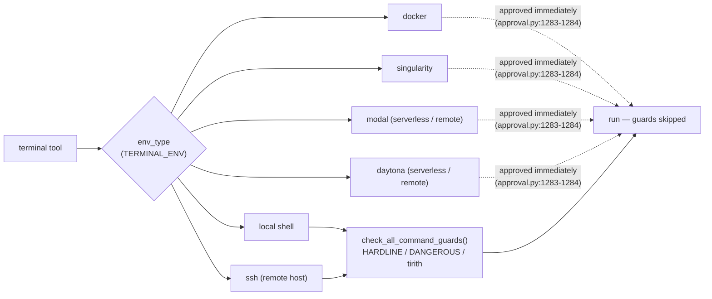

# Sandboxing

> Containing a coding agent's side effects at the operating-system or container boundary (process, container, VM, remote runner) instead of — or alongside — in-process permission checks.

## Definition

Sandboxing is the strategy of enforcing safety *outside* the agent process: the harness runs the agent (or its shell commands) inside an OS-level container — Docker, Singularity, Modal, Daytona, a separate user account, a VM — so that whatever the model does, the blast radius is bounded by the environment rather than by code the agent could route around. Both sources that engage with the idea treat it as the counterpart (or replacement) for in-process [[wiki/concepts/permission-gating]].

The two harnesses frame it from opposite directions. pi makes OS-level containment the *only* security boundary: it ships no permission system at all and tells users that real isolation must come from the operating system [[wiki/sources/pi]]. hermes-agent ships a deep in-process approval stack but treats sandboxing as a full substitute for it — when execution is routed to an isolated backend, the approval machinery is skipped entirely because "isolation *is* the permission model" [[wiki/sources/hermes-agent]].

## Key claims

- pi deliberately omits any built-in permission system; gating decomposes into extension hooks, a project-trust gate, and OS-level containment as the only real security boundary. [[wiki/sources/pi]]
- pi's stated design philosophy is that in-process permission systems are theater — "real isolation needs to come from the operating system." [[wiki/sources/pi]]
- In hermes-agent, sandboxing substitutes for permission: the docker/singularity/modal/daytona terminal backends skip the entire approval stack, while only the local and ssh backends pass through the layered gates. [[wiki/sources/hermes-agent]]
- Both harnesses converge on the equivalence "isolation boundary = permission boundary," arriving there from opposite ends: pi by shipping no gates, hermes by switching its gates off whenever a sandbox supplies the boundary. [[wiki/sources/pi]], [[wiki/sources/hermes-agent]]
- pi reuses the same OS-boundary instinct for context: its subagents are separate child `pi` OS processes, so context isolation is literally process isolation. [[wiki/sources/pi]]

## Notable quotes

> "Pi does not include a built-in permission system for restricting filesystem, process, network, or credential access. By default, it runs with the permissions of the user and process that launched it."
> — [[wiki/sources/pi]]

> "real isolation needs to come from the operating system"
> — [[wiki/sources/pi]]

## Relationships

- **[[wiki/concepts/permission-gating]]**: the in-process alternative sandboxing either replaces (pi) or bypasses (hermes' isolated backends); hermes' local/ssh backends are the only ones the gate stack actually covers. [[wiki/sources/hermes-agent]], [[wiki/sources/pi]]
- **[[wiki/concepts/subagent-delegation]]**: pi extends the OS-boundary philosophy to delegation — subagents are spawned child processes, so the same isolation primitive bounds both safety and context. [[wiki/sources/pi]]

## How remote sandboxing works & how it plugs into the harness

The mechanics live in hermes-agent — the only studied harness that implements sandboxed execution as a first-class backend. The `terminal` tool is **backend-pluggable** across six `BaseEnvironment` subclasses in `tools/environments/`; `env_type` selects which, read from the `TERMINAL_ENV` env var ([terminal_tool.py:1073-1077](https://github.com/nousresearch/hermes-agent/blob/d62979a6f34f64f2ed840f159aac66e24d7cad78/tools/terminal_tool.py#L1073-L1077)). [[wiki/sources/hermes-agent]]

- **What "remote" means here:** Modal and Daytona are *serverless* runners — the agent's environment **hibernates between sessions** and wakes on demand (the README's "$5 VPS" pitch). docker/singularity are local containers; `ssh` is remote but ungated-host, so it keeps gates ON. Remoteness alone isn't the sandbox — *isolation* is. [[wiki/sources/hermes-agent]]
- **Session model:** each conversation/subagent gets its own `task_id`-scoped terminal session; background processes can fire `notify_on_complete`. [[wiki/sources/hermes-agent]]
- **The wiring / short-circuit:** every command normally passes `terminal_tool()` → `check_all_command_guards()` before running ([terminal_tool.py:2053](https://github.com/nousresearch/hermes-agent/blob/d62979a6f34f64f2ed840f159aac66e24d7cad78/tools/terminal_tool.py#L2053)). For `docker`/`singularity`/`modal`/`daytona`, that function **returns approved immediately** ([approval.py:1283-1284](https://github.com/nousresearch/hermes-agent/blob/d62979a6f34f64f2ed840f159aac66e24d7cad78/tools/approval.py#L1283-L1284)) — comment: *"Containerized backends already bypass the dangerous-command layer because nothing they do can touch the host."* Only `local` and `ssh` route through the layered gates + approval surfaces. [[wiki/sources/hermes-agent]]

So the dispatch order is: resolve `env_type` → if sandboxed backend, skip the **entire** approval stack and run; otherwise gate normally. This is the operational form of "isolation = permission model."

## Tensions

- hermes-agent invests heavily in in-process gating — including a `HARDLINE_PATTERNS` floor that no mode, `--yolo` included, can bypass — while pi dismisses exactly this category of in-process permission system as theater that cannot substitute for OS isolation. [[wiki/sources/hermes-agent]] vs. [[wiki/sources/pi]]

## Open questions

- Does hermes-agent's unconditional hardline floor still apply inside sandboxed backends? One claim says those backends "skip the entire approval stack," another says hardline patterns "block unconditionally before any bypass" — the sources don't reconcile the two. [[wiki/sources/hermes-agent]]
- pi defers isolation entirely to the user, but the sources don't document what containment setup pi expects in practice (container, VM, dedicated user), nor any threat model for network or credential access. [[wiki/sources/pi]]
- Only two of the three studied harnesses engage with sandboxing at all; where the third (opencode) sits on the in-process-gates vs. OS-boundary spectrum is unresolved in the current wiki.

> Synthesis: Sandboxing is the hinge concept of this study's permission-flow dimension — it is the one safety mechanism both poles of the design spectrum agree is real. pi (minimal core) and hermes-agent (maximal monolith) disagree about nearly everything else in permissioning, yet both ultimately locate the trustworthy boundary at the OS: pi by refusing to build anything weaker, hermes by letting a container stand in for its entire approval stack. That convergence suggests in-process gating in these harnesses is best read as UX for *unsandboxed* operation rather than as a security layer in its own right.
