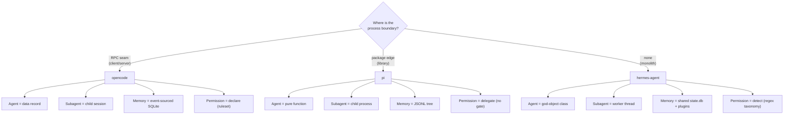

# Unified architecture — one view of four concepts across three harnesses

> A single master view of how [[wiki/sources/opencode|opencode]], [[wiki/sources/pi|pi]], and [[wiki/sources/hermes-agent|hermes-agent]] each answer four questions — *what is an agent, how does it delegate, how does it remember, and how does it decide an action may run* — and how all four answers fall out of one upstream choice. The per-concept deep dives live in the comparison pages linked below; this note is the consolidated cross-concept grid.

## The one idea that unifies all four

Every divergence in the grid below is downstream of a single commitment: **where each harness draws its process boundary.** opencode draws it at an RPC seam (client/server), pi at a package edge (embeddable library), hermes-agent nowhere (synchronous monolith). Fix that one choice and the other three concepts are *determined*, not independently designed.

## Master matrix — 4 concepts × 3 repos

| Concept | [[wiki/sources/opencode\|opencode]] | [[wiki/sources/pi\|pi]] | [[wiki/sources/hermes-agent\|hermes-agent]] |
|---|---|---|---|
| **[[wiki/comparisons/agents-architecture-opencode-vs-pi-vs-hermes-agent\|Agents architecture]]** | Agent is a **config record** (`Agent.Info`) interpreted by one shared, history-driven loop; tools execute *inside* the provider stream; dual runtime → one `LLMEvent` stream | Agent is a **pure `runLoop` function** (~740 lines, zero I/O) with state injected via `AgentLoopConfig`; two nested in-memory loops (turns / follow-ups); provider chosen by API *shape* | Agent is a **god-object class** (`AIAgent`, ~70-param init); synchronous `while` loop, 90-iteration cap + shared budget; ~80% of the loop is retry/fallback/watchdog resilience |
| **[[wiki/comparisons/subagents-architecture-opencode-vs-pi-vs-hermes-agent\|Subagents architecture]]** | Subagent = **child session** (`task` tool, `parentID` link); inherits parent *denies*, defines its own capabilities; resumable + steerable via `task_id`; background/promotion mechanics | Subagent = **child OS process** — *zero core machinery by design* ("build your own with extensions"); `pi --mode json -p --no-session`; richest vocabulary (single/parallel/chain with `{previous}` piping) | Subagent = **worker thread** (`delegate_task`, same class); attenuation-only (parent tools ∩ requested − blocklist); auto-deny approvals; cost/telemetry rolled into parent; depth capped at 1 unless `orchestrator` |
| **[[wiki/comparisons/memory-system-opencode-vs-pi-vs-hermes-agent\|Memory system]]** | **Event-sourced SQLite** (`opencode.db`, WAL); context = compaction-aware *query* ("a query, not a delete"); overflow → prune → anchored summary + tail; lazy-attached `AGENTS.md` with drift epochs; **no model-written memory** | **Append-only JSONL tree** per session (`parentId` links); context = root→leaf replay; native branching/time-travel/fork; alone summarizes abandoned branches back in; **no cross-session memory by design** | **Shared `state.db` + FTS5** across all surfaces; compaction = *session boundary* (old session ends, child minted); **only one with model-writable memory** — gated `MEMORY.md`/`USER.md` tool, `session_search`, pluggable `MemoryProvider` backends |
| **[[wiki/comparisons/agent-permission-flow-opencode-vs-pi-vs-hermes-agent\|Agent permission flow]]** | **Declare**: every irreversible call → `ctx.ask` against an ordered, last-match-wins `(capability, pattern)` ruleset; modes = ruleset deltas; async `Deferred` + event bus, any client answers over HTTP | **Delegate**: *no built-in gate*; one synchronous `beforeToolCall` seam where extensions veto/rewrite (first block wins, fail-safe on throw); OS/container is "the only real boundary" | **Detect**: regex taxonomy over command *content* — most run unprompted; `DANGEROUS` (~60) → approve, `HARDLINE` → unbypassable even under `--yolo`; chat-gateway `/approve` queue + LLM "smart" reviewer |

## Each repo as a coherent whole

- **[[wiki/sources/opencode|opencode]] — the durable, multi-client engine.** Persistence *is* the control flow: a stateless loop re-derives intent from persisted messages every pass, so crash-recovery, "continue", subagents, and compaction are all just message `Part`s in the same SQLite store. Everything (agents, subagents, even internal summarizers) is permission-woven and resumable. Heaviest machinery; strongest production resumability. Hub: [[wiki/repos/opencode/ARCHITECTURE.md]].
- **[[wiki/sources/pi|pi]] — the minimal kernel.** A pure loop with injected side effects; the smallest core the other two elaborate. Policy, subagents, and permissions are *deliberately* pushed to userland — pi ships the seam, not the policy. Best for embedding and for reading first: opencode is "pi + persistence-as-control-flow + a server", hermes is "pi + armor plating". Hub: [[wiki/repos/pi/ARCHITECTURE.md]].
- **[[wiki/sources/hermes-agent|hermes-agent]] — the resilient, memory-rich monolith.** A synchronous Python god-object hardened for hostile production: credential rotation, fallbacks, watchdogs, budgets. The only harness that treats memory as a *subsystem* (writable, searchable, pluggable) and the only one with a safety floor (`HARDLINE`) that survives every bypass. Hub: [[wiki/repos/hermes-agent/ARCHITECTURE.md]].

## The settled kernel — what all three agree on

Despite no shared implementation lineage, all three converge on the same core (this is the "copy, don't redesign" layer):

- **One vendor-blind [[wiki/concepts/agent-loop|agent loop]]** over a normalized internal provider event/message grammar — the provider *seam*, not the loop, is where each spent its abstraction budget.
- **History as an append-only, never-delete log; the context window is a derived *view*** ([[wiki/concepts/session-persistence]]).
- **Threshold-triggered, tail-protecting, iterative LLM [[wiki/concepts/context-compaction|compaction]]** — same template-driven summary core in all three; nothing ever deleted.
- **Human-curated [[wiki/concepts/instruction-files|instruction files]]** (`AGENTS.md` / `CLAUDE.md` / kin) as project memory — **no harness uses a vector store**.
- **One delegation contract** ([[wiki/concepts/subagent-delegation]]): one tool call in, final text out, intermediate tool calls never leak into the parent context — across all three isolation primitives.
- **Rejection as a model-readable error result, never an exception** ([[wiki/concepts/permission-gating]]).

## The contested layers — where to actually spend design effort

Only two layers have *no* consensus answer:

1. **Trust / permission philosophy** spans the full spectrum — **declare** (opencode config ruleset), **delegate** (pi: no gate at all), **detect** (hermes regex taxonomy). All three explicitly reject conflating a permission prompt with a security boundary — and then draw opposite conclusions about what to build. [[wiki/concepts/sandboxing]] · [[wiki/concepts/mcp]] is the sharpest adopt/reject/extend fault line.
2. **Cross-session memory** — only hermes lets the *model* write durable memory; opencode and pi abstain by design (resumable transcripts + human-curated files only).

## A builder's recipe (the unified takeaway)

Start from **pi**'s seams (the minimal kernel). Steal **opencode**'s history-driven resumability and permission-derived child sessions the moment sessions must survive crashes or serve multiple clients. Mine **hermes**'s retry/fallback/budget machinery, hardline-floor invariant, and writable+searchable+pluggable memory once you graduate to unattended, hostile, long-running production. Copy the settled kernel verbatim; pick the process boundary for your scarce resource (surfaces / composability / presence); and argue only about trust and cross-session memory.

## See also

- Cross-cutting thesis: [[8 - Projects/Building Your Own AI Research OS/example_3_ingest_links/research-custom-urls/wiki/synthesis]] · catalog: [[8 - Projects/Building Your Own AI Research OS/example_3_ingest_links/research-custom-urls/wiki/overview]]
- Fifth dimension (system shape): [[wiki/comparisons/general-architecture-opencode-vs-pi-vs-hermes-agent]]
- Per-repo concept docs: agents [[wiki/repos/opencode/agents-architecture.md]] · [[wiki/repos/pi/agents-architecture.md]] · [[wiki/repos/hermes-agent/agents-architecture.md]] — subagents [[wiki/repos/opencode/subagents-architecture.md]] · [[wiki/repos/pi/subagents-architecture.md]] · [[wiki/repos/hermes-agent/subagents-architecture.md]] — memory [[wiki/repos/opencode/memory-system.md]] · [[wiki/repos/pi/memory-system.md]] · [[wiki/repos/hermes-agent/memory-system.md]] — permissions [[wiki/repos/opencode/agent-permission-flow.md]] · [[wiki/repos/pi/agent-permission-flow.md]] · [[wiki/repos/hermes-agent/agent-permission-flow.md]]

> Synthesis: This note collapses four per-concept comparisons into one boundary-placement story; it would be extended or revised by a fourth harness that breaks the kernel consensus (e.g. a vector-store memory, or a loop that isn't vendor-blind), or by sources that take a fourth position on trust beyond declare/delegate/detect.
