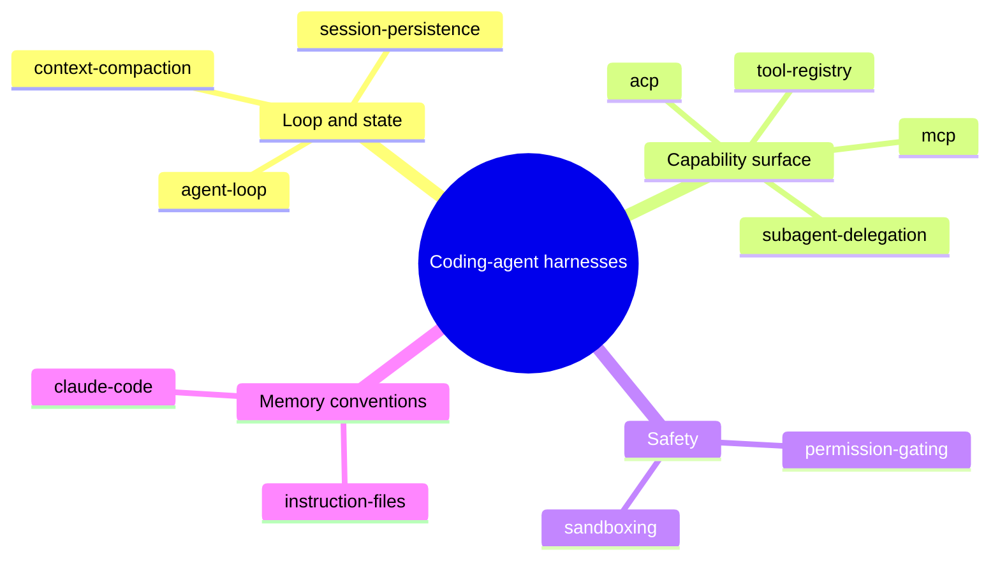

# AI coding agent architectures — opencode, pi, and hermes-agent — Overview

> Comparative architecture study of three coding-agent harnesses (opencode, pi, hermes-agent) across five dimensions: general architecture, agents architecture, subagents architecture, memory system, and agent permission flow. Per-repo spec notes plus cross-cutting concepts and three-way comparisons.

## Themes

### One loop, a durable log, a derived window

All three harnesses route everything through exactly one [[wiki/concepts/agent-loop]] sitting on an append-only, never-delete [[wiki/concepts/session-persistence]] substrate, with [[wiki/concepts/context-compaction]] turning the prompt into a *view* derived from history ("a query, not a delete") rather than a rewrite. This convergence is the spine of the study — every other dimension hangs off it. Strongest pages: [[wiki/sources/opencode]], [[wiki/sources/pi]].

### Capability surfaces: registry, protocol, delegation

Registration vs. exposure is a deliberate seam in every [[wiki/concepts/tool-registry]]; [[wiki/concepts/mcp]] is the sharpest adopt/reject/extend fault line (opencode first-class, pi deliberately absent, hermes-agent on both sides); and [[wiki/concepts/subagent-delegation]] shares one invariant — only condensed results return to the parent — across three isolation primitives: sessions, processes, threads. [[wiki/concepts/acp]] extends the same story to editor/IDE clients. Strongest pages: [[wiki/sources/hermes-agent]], [[wiki/sources/pi]].

### Safety: in-process gates vs. OS boundaries

[[wiki/concepts/permission-gating]] spans the full spectrum — opencode's declarative (capability, pattern) ruleset engine, hermes-agent's regex taxonomy with an unbypassable hardline floor, pi's deliberate absence — while [[wiki/concepts/sandboxing]] shows pi and hermes-agent converging from opposite ends on "isolation boundary = permission boundary." This is where the three philosophies are most irreconcilable. Strongest pages: [[wiki/sources/hermes-agent]], [[wiki/sources/pi]].

### Memory by convention, Claude Code as the reference

No harness uses a vector store; durable cross-session memory is human-curated [[wiki/concepts/instruction-files]] (AGENTS.md, CLAUDE.md and kin) plus the transcript itself. [[8 - Projects/Building Your Own AI Research OS/example_2_github/research-coding-agent-architectures/wiki/entities/claude-code]] appears only through its compatibility surfaces — every harness parses its files, emulates its `/compact`, or defines itself against it. Strongest pages: [[wiki/sources/hermes-agent]], [[wiki/sources/opencode]].

## Index

### Entities (1)
- [[8 - Projects/Building Your Own AI Research OS/example_2_github/research-coding-agent-architectures/wiki/entities/claude-code]] — Anthropic's coding-agent CLI as the reference harness all three emulate or define themselves against; 3 sources.

### Concepts (10)
- [[wiki/concepts/agent-loop]] — the single core iteration cycle each harness funnels everything through; 3 sources.
- [[wiki/concepts/session-persistence]] — append-only durable transcripts (SQLite, JSONL tree, lineage rows) from which context is derived; 3 sources.
- [[wiki/concepts/context-compaction]] — LLM-written summaries that keep long sessions in-window without deleting history; 3 sources.
- [[wiki/concepts/tool-registry]] — which tools exist, which the model sees, and the call pipeline; 3 sources.
- [[wiki/concepts/permission-gating]] — run / ask / deny on the tool-execution path, from policy engine to deliberate absence; 3 sources.
- [[wiki/concepts/subagent-delegation]] — scoped child agents returning condensed results: sessions vs. processes vs. threads; 3 sources.
- [[wiki/concepts/instruction-files]] — user-curated AGENTS.md/CLAUDE.md-style project memory injected into the prompt; 3 sources.
- [[wiki/concepts/mcp]] — external tool-server protocol; the adopt/reject/extend fault line; 3 sources.
- [[wiki/concepts/sandboxing]] — OS/container-level containment as counterpart or substitute for in-process gates; 2 sources.
- [[wiki/concepts/acp]] — editor/IDE-as-client protocol; surface in opencode and hermes-agent; 2 sources.

### Comparisons (5)
- [[wiki/comparisons/general-architecture-opencode-vs-pi-vs-hermes-agent]] — where the harness boundary sits: server API vs. library vs. monolith object.
- [[wiki/comparisons/agents-architecture-opencode-vs-pi-vs-hermes-agent]] — what an agent *is*: config record vs. pure function vs. god-object class.
- [[wiki/comparisons/subagents-architecture-opencode-vs-pi-vs-hermes-agent]] — delegation isolation primitives: sessions vs. processes vs. threads.
- [[wiki/comparisons/memory-system-opencode-vs-pi-vs-hermes-agent]] — persistence substrate, compaction strategy, instruction files, cross-session memory.
- [[wiki/comparisons/agent-permission-flow-opencode-vs-pi-vs-hermes-agent]] — how a dangerous action gets to run, and who gets asked.

### Per-repo notes (15)
Each repo carries a full spec set: an ARCHITECTURE.md plus four topic docs (agents architecture, subagents architecture, memory system, agent permission flow).

- **opencode** — [[wiki/repos/opencode/ARCHITECTURE.md]] · [[wiki/repos/opencode/agents-architecture.md]] · [[wiki/repos/opencode/subagents-architecture.md]] · [[wiki/repos/opencode/memory-system.md]] · [[wiki/repos/opencode/agent-permission-flow.md]]
- **pi** — [[wiki/repos/pi/ARCHITECTURE.md]] · [[wiki/repos/pi/agents-architecture.md]] · [[wiki/repos/pi/subagents-architecture.md]] · [[wiki/repos/pi/memory-system.md]] · [[wiki/repos/pi/agent-permission-flow.md]]
- **hermes-agent** — [[wiki/repos/hermes-agent/ARCHITECTURE.md]] · [[wiki/repos/hermes-agent/agents-architecture.md]] · [[wiki/repos/hermes-agent/subagents-architecture.md]] · [[wiki/repos/hermes-agent/memory-system.md]] · [[wiki/repos/hermes-agent/agent-permission-flow.md]]

### Notable sources (3, all score 1.0)
- [[wiki/sources/opencode]] — anomalyco, 1.0 — TypeScript/Bun client-server engine; every UI is a client of one HTTP/SSE server.
- [[wiki/sources/pi]] — earendil-works, 1.0 — minimal four-package TypeScript library; pure `runLoop`, extensions as the product.
- [[wiki/sources/hermes-agent]] — nousresearch, 1.0 — Python monolith; one `AIAgent` class behind CLI, messaging, ACP, and cron surfaces.

## Open threads

Top active questions from [[8 - Projects/Building Your Own AI Research OS/example_2_github/research-coding-agent-architectures/wiki/open-questions]] (31 logged):

- How does opencode's v1 → v2 event-sourced rewrite change the loop, session schema, and permission engine? It recurs as the unknown across three concept pages. [[wiki/concepts/agent-loop]], [[wiki/concepts/permission-gating]], [[wiki/concepts/session-persistence]]
- Does hermes-agent's hardline floor still apply inside sandboxed backends? Two claims pull in opposite directions — the nearest thing the wiki has to a contradiction. [[wiki/concepts/sandboxing]]
- Both opencode and pi chain summaries of summaries; no source addresses fidelity degradation across compaction generations. [[wiki/concepts/context-compaction]]
- Is vendor-neutral `AGENTS.md` displacing `CLAUDE.md` as the standard instruction-file name? hermes-agent already ranks it higher. [[8 - Projects/Building Your Own AI Research OS/example_2_github/research-coding-agent-architectures/wiki/entities/claude-code]], [[wiki/concepts/instruction-files]]
- No source quantifies the token/cost economics of delegation vs. compaction as competing context-management strategies. [[wiki/concepts/subagent-delegation]]

## Health

- Source pages: 3
- Entities: 1 (avg source_count across them: 3.0)
- Concepts: 10
- Comparisons: 5
- Per-repo spec docs: 15
- Contradictions logged: 0 (no contradictions.md)
- Open questions: 31
