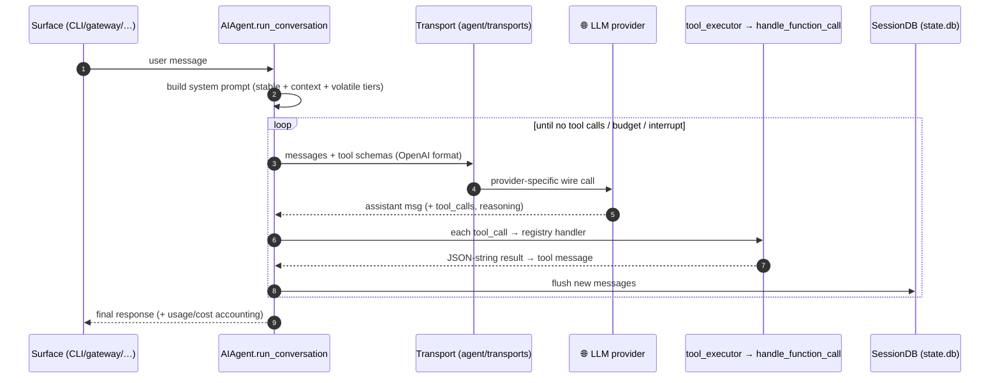
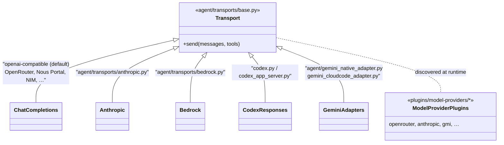
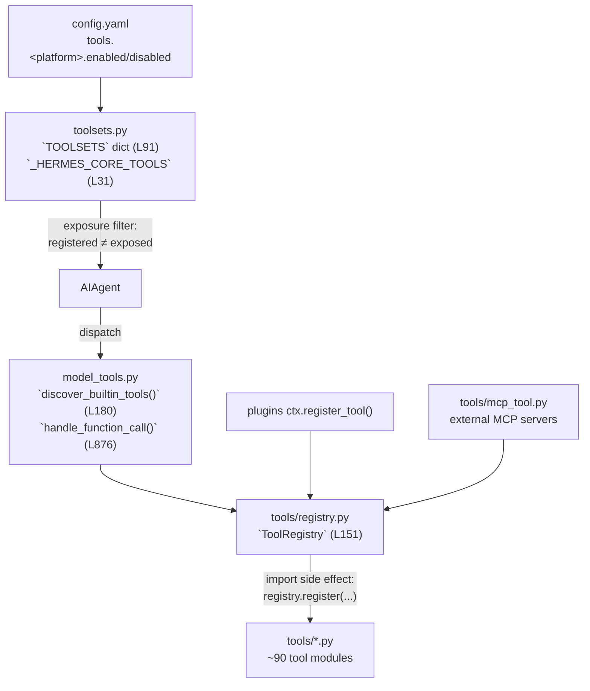
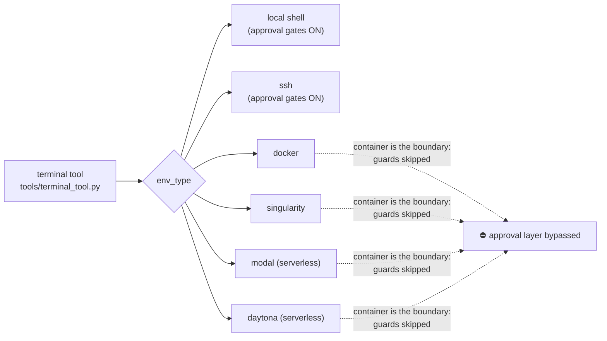
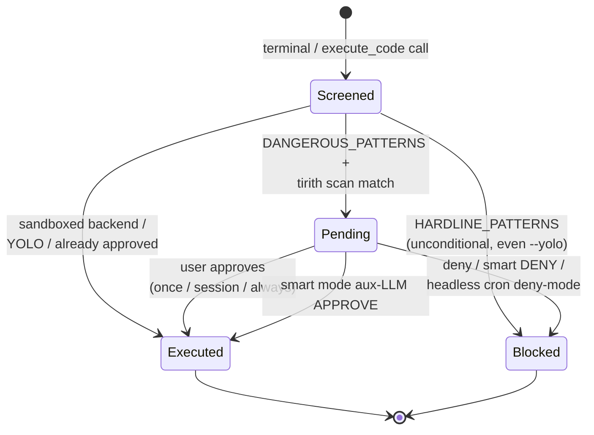
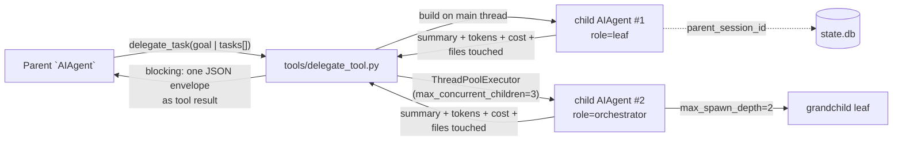
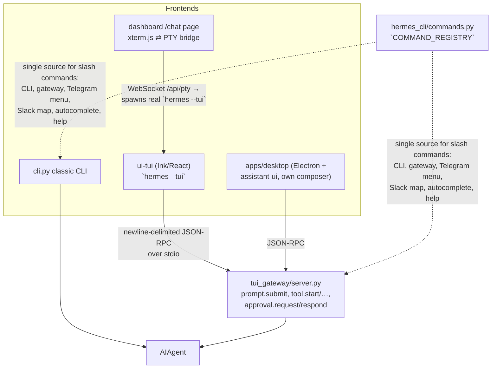
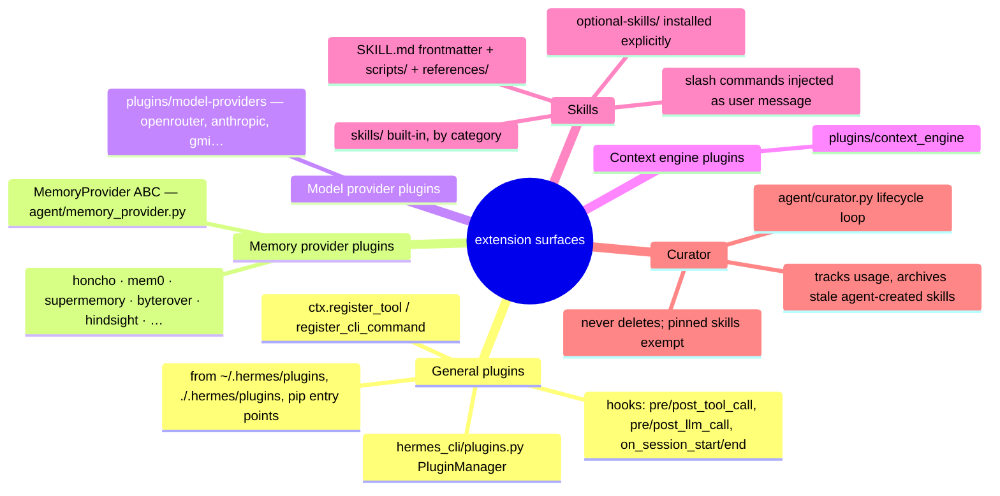
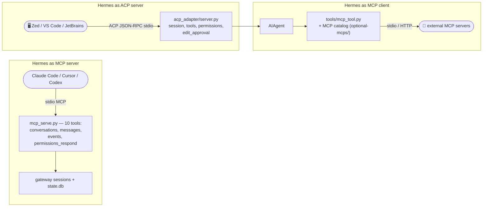
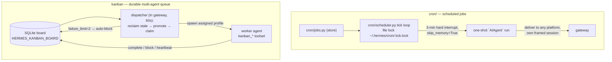

# hermes-agent — High-Level Architecture

> Source: https://github.com/nousresearch/hermes-agent @ `d62979a` (branch `main`, full SHA `d62979a6f34f64f2ed840f159aac66e24d7cad78`)
> A visual tour of the codebase. Diagrams are written in Mermaid so they render inline on GitHub / most Markdown viewers.

> Scope: the general architecture of Nous Research's Hermes Agent harness — entry flow, agent loop, tools, permissions, memory, subagents, and the surface/bridge layers — framed for the comparative study of the opencode, pi, and hermes-agent coding-agent harnesses (general architecture, agents, subagents, memory, permission flows).

---

## 1. Bird's-eye view

Hermes is a **Python monolith with many faces**: one synchronous agent core (`AIAgent`, ~12k LOC in `run_agent.py`) is driven by an interactive CLI, an Ink/React TUI, an Electron desktop app, a ~20-platform messaging gateway, an ACP server for IDEs, a cron scheduler, and a batch trajectory runner — all in the same process family, all persisting to the same SQLite `state.db`. Where opencode splits client/server in TypeScript and pi stays minimal, Hermes is *expansive at the edges and conservative at the waist*: its dev guide ([AGENTS.md](https://github.com/nousresearch/hermes-agent/blob/d62979a6f34f64f2ed840f159aac66e24d7cad78/AGENTS.md)) names two invariants that shape everything — **per-conversation prompt caching is sacred** (the system prompt is byte-stable for a conversation's life), and **the core is a narrow waist** (new capability lands as skills/plugins/MCP servers, almost never as new core tools).

```mermaid
flowchart LR
    User([👤 User]) --> CLI["cli.py<br/>`HermesCLI` (prompt_toolkit)"]
    User --> TUI["ui-tui (Ink/React)<br/>+ desktop + dashboard"]
    User --> MSG(["💬 Telegram / Discord / Slack /<br/>WhatsApp / Signal / 20+ platforms"])
    IDE([🖥️ Zed / VS Code / JetBrains]) -->|ACP| ACP["acp_adapter/"]
    MCPC([🔌 Claude Code / Cursor]) -->|MCP stdio| MCPS["mcp_serve.py"]
    subgraph Process["hermes process family (Python)"]
        direction LR
        CLI --> Agent
        TUI -->|JSON-RPC stdio| TGW["tui_gateway/"] --> Agent
        GW["gateway/run.py<br/>asyncio `GatewayRunner`"] --> Agent
        ACP --> Agent
        CRON["cron/scheduler.py"] --> Agent
        Agent["`AIAgent`<br/>run_agent.py + agent/*"] <--> Tools["tools/* via registry"]
        Agent --> DB[("~/.hermes/state.db<br/>SQLite + FTS5")]
        Agent --> Mem["memory files +<br/>provider plugins"]
    end
    MSG <--> GW
    MCPS --> GW
    Agent -->|6 wire protocols,<br/>OpenAI format internally| LLM([🌐 LLM providers])
    Tools -->|local / docker / ssh /<br/>singularity / modal / daytona| Env([💻 execution backends])
```

The single most important thing to internalise: **everything funnels through one class**. Every surface constructs an `AIAgent` and calls `run_conversation()`; subagents are just more `AIAgent` instances on threads; cron jobs are `AIAgent` runs with memory disabled. There is no daemon/server split — the "narrow waist" is a Python object, not an RPC boundary.

---

## 2. Module Index

Deep-dive docs staged alongside this file:

- [agents-architecture](./agents-architecture.md) — `AIAgent` god-object, synchronous tool loop, transport registry, OpenAI-format lingua franca. *(≤15 words: core agent class, conversation loop, provider transports, tool dispatch, session persistence.)*
- [subagents-architecture](./subagents-architecture.md) — `delegate_task` tool: in-process threaded child `AIAgent`s, leaf/orchestrator roles, deny-by-default permissions. *(child agents on worker threads, blocking parent, rich result envelopes.)*
- [memory-system](./memory-system.md) — SQLite transcripts, `ContextEngine` compaction with session splitting, curated `MEMORY.md`/`USER.md`, pluggable providers, instruction files. *(four-layer memory stack designed around prompt-cache stability.)*
- [agent-permission-flow](./agent-permission-flow.md) — pattern-based command guards (`HARDLINE`/`DANGEROUS`), three approval surfaces, once/session/always scopes, container bypass. *(layered gate stack in `tools/approval.py`; isolation replaces approval in sandboxes.)*

Other top-level packages you'll meet below (no dedicated doc): `hermes_cli/` (subcommands, config, plugins loader, skin engine), `gateway/` (messaging), `tui_gateway/` + `ui-tui/` (TUI), `acp_adapter/`, `tools/environments/` (terminal backends), `plugins/`, `skills/` + `optional-skills/`, `cron/`, `apps/desktop/`, `website/` (docs).

---

## 3. Process startup / entry flow

Three console scripts are declared in [pyproject.toml L272-L275](https://github.com/nousresearch/hermes-agent/blob/d62979a6f34f64f2ed840f159aac66e24d7cad78/pyproject.toml#L272-L275): `hermes` → `hermes_cli.main:main`, `hermes-agent` → `run_agent:main` (headless one-shot), `hermes-acp` → `acp_adapter.entry:main`. The umbrella `main()` ([hermes_cli/main.py L11033](https://github.com/nousresearch/hermes-agent/blob/d62979a6f34f64f2ed840f159aac66e24d7cad78/hermes_cli/main.py#L11033)) builds a large argparse tree where `chat` is the default subcommand; every entry path imports `hermes_bootstrap` first (Windows UTF-8 stdio) and resolves a profile-aware `HERMES_HOME` before anything else.

```mermaid
flowchart TD
    A["`hermes` console script<br/>hermes_cli/main.py:main()"] --> B["import hermes_bootstrap<br/>+ profile override → HERMES_HOME"]
    B --> C["build_top_level_parser()<br/>default = cmd_chat"]
    C --> D{Subcommand?}
    D -->|"(none) / chat"| E["cli.py `HermesCLI`<br/>interactive prompt_toolkit loop"]
    D -->|"--tui / HERMES_TUI=1"| F["Node Ink UI ⇄ stdio JSON-RPC ⇄<br/>tui_gateway/server.py"]
    D -->|gateway| G["gateway/run.py<br/>`start_gateway()` asyncio"]
    D -->|acp| H["acp_adapter/ (stdio JSON-RPC<br/>for editors)"]
    D -->|"mcp serve"| I["mcp_serve.py<br/>stdio MCP server"]
    D -->|"cron / kanban / tools / setup /<br/>model / skills / doctor …"| J["hermes_cli/subcommands/*<br/>(config & infra, no agent)"]
    E & F & G & H --> K["construct `AIAgent`<br/>(run_agent.py:320)"]
```

Key tricks:

- The config story is split three ways — `load_cli_config()` (CLI), `load_config()` (`hermes_cli/config.py`, subcommands), and a raw YAML load in the gateway — a known source of "CLI sees the key, gateway doesn't" bugs ([AGENTS.md L614-L623](https://github.com/nousresearch/hermes-agent/blob/d62979a6f34f64f2ed840f159aac66e24d7cad78/AGENTS.md#L614-L623)).
- Profiles (multi-instance support) work by overriding `HERMES_HOME`; hardcoding `~/.hermes` is a named pitfall.
- `~/.hermes/config.yaml` holds all behavioral settings; `.env` is for secrets only — an enforced contribution rule.

---

## 4. Core agent loop

The heart of the system, covered in depth in [agents-architecture](./agents-architecture.md). `AIAgent` ([run_agent.py L320](https://github.com/nousresearch/hermes-agent/blob/d62979a6f34f64f2ed840f159aac66e24d7cad78/run_agent.py#L320)) takes ~60 constructor params and exposes two entry points: `chat()` (string in/out) and `run_conversation()` ([L5144](https://github.com/nousresearch/hermes-agent/blob/d62979a6f34f64f2ed840f159aac66e24d7cad78/run_agent.py#L5144)), a fully **synchronous** while-loop capped at `max_iterations=90` plus an `IterationBudget` with a one-turn grace call. Messages live in OpenAI chat-completions format end-to-end; reasoning is stashed in `assistant_msg["reasoning"]`.



Cross-cutting concerns handled inside the loop: interrupt checks, retry/fallback-model logic, usage & cost accounting (`agent/account_usage.py`), compaction triggering (see [memory-system](./memory-system.md)), strict role alternation, and plugin lifecycle hooks (`pre_llm_call`/`post_llm_call`). The class contract is documented in [AGENTS.md L303-L361](https://github.com/nousresearch/hermes-agent/blob/d62979a6f34f64f2ed840f159aac66e24d7cad78/AGENTS.md#L303-L361).

---

## 5. Provider & transport layer

Hermes is aggressively provider-agnostic: internally everything is OpenAI chat-completions format, and a transport registry adapts that shape per provider at the API boundary — ~6 wire protocols today (details in [agents-architecture](./agents-architecture.md)).



- `api_mode` on `AIAgent` ("chat_completions" | "codex_responses" | …) selects the transport; `hermes model` / `/model` switch provider+model with no code changes.
- Auxiliary side-LLM work (compaction summaries, vision, title generation, smart approvals) resolves its own provider/model per task via `agent/auxiliary_client.py::_resolve_auto`.
- Dependency policy is itself architectural: every direct dep is exact-pinned (`==X.Y.Z`) as supply-chain defense — see the rationale comment at [pyproject.toml L25-L45](https://github.com/nousresearch/hermes-agent/blob/d62979a6f34f64f2ed840f159aac66e24d7cad78/pyproject.toml#L25-L45).

---

## 6. Tool registry, toolsets & the footprint ladder

Tools self-register at import time; toolsets decide what an agent actually sees. The repo's "Footprint Ladder" doctrine (extend code → CLI+skill → service-gated tool → plugin → MCP catalog → new core tool, *last resort*) exists because every core tool schema ships on every API call.



- Dependency chain is strictly one-way: `tools/registry.py` ← `tools/*.py` ← `model_tools.py` ← `run_agent.py`/`cli.py`/`batch_runner.py` ([AGENTS.md L289-L301](https://github.com/nousresearch/hermes-agent/blob/d62979a6f34f64f2ed840f159aac66e24d7cad78/AGENTS.md#L289-L301)).
- ~30 toolset keys (`terminal`, `file`, `web`, `browser`, `delegation`, `memory`, `kanban`, `messaging`, …); platforms pick a base toolset, e.g. Telegram uses `messaging`. Mid-conversation toolset swaps are forbidden (cache invariant).
- `check_fn` / `requires_env` gating means service-specific tools (Home Assistant, image gen, …) have zero schema footprint until configured.
- Agent-level tools (`todo`, `memory`) are intercepted in `run_agent.py` *before* `handle_function_call()`.

---

## 7. Execution environments (terminal backends)

The `terminal` tool is pluggable across six backends in [`tools/environments/`](https://github.com/nousresearch/hermes-agent/blob/d62979a6f34f64f2ed840f159aac66e24d7cad78/tools/environments) — this matters for the permission story because **sandboxed backends bypass the approval layer entirely** (isolation *is* the permission model; see [agent-permission-flow](./agent-permission-flow.md)).



- Modal/Daytona give serverless persistence — the agent's environment hibernates between sessions (the "$5 VPS" pitch in the README).
- Each conversation/subagent gets its own `task_id`-scoped terminal session; background processes can notify on completion (`terminal(background=True, notify_on_complete=True)`).

---

## 8. Permission & safety layer

Fully mapped in [agent-permission-flow](./agent-permission-flow.md); the headline for the comparative study is that Hermes gates by **risk pattern, not by tool**: most shell commands run unprompted, and only regex-flagged dangerous ones route to an approval surface. Hardline blocks fire before any bypass — no mode (`--yolo` included) can approve `rm -rf /`.



- One source of truth: [`tools/approval.py`](https://github.com/nousresearch/hermes-agent/blob/d62979a6f34f64f2ed840f159aac66e24d7cad78/tools/approval.py); callers are `terminal_tool()` ([terminal_tool.py L2053](https://github.com/nousresearch/hermes-agent/blob/d62979a6f34f64f2ed840f159aac66e24d7cad78/tools/terminal_tool.py#L2053)) and `execute_code` ([code_execution_tool.py L1104](https://github.com/nousresearch/hermes-agent/blob/d62979a6f34f64f2ed840f159aac66e24d7cad78/tools/code_execution_tool.py#L1104)).
- Three approval surfaces: CLI modal (prompt_toolkit callback), gateway `/approve`–`/deny` queue across messaging platforms, and an auxiliary-LLM "smart" reviewer that can auto-approve/deny/escalate.
- Adjacent gates: file writes (`agent/file_safety.py`), persistent memory/skill writes (`tools/write_approval.py`), skill installs (`tools/skills_guard.py`), and auto-deny callbacks inside [subagents](./subagents-architecture.md).

---

## 9. Memory & state

The most layered memory stack of the three harnesses — four separately-designed layers, all constrained by the prompt-cache invariant. Full treatment in [memory-system](./memory-system.md).

```mermaid
flowchart TB
    subgraph L1["Layer 1 — transcripts"]
        DB[("`SessionDB` — hermes_state.py:657<br/>~/.hermes/state.db (WAL + FTS5)")]
    end
    subgraph L2["Layer 2 — context window"]
        CE["`ContextEngine` ABC → `ContextCompressor`<br/>summarize middle turns, split session"]
    end
    subgraph L3["Layer 3 — curated memory"]
        MEM[("MEMORY.md + USER.md<br/>§-delimited, frozen snapshot in prompt")]
    end
    subgraph L4["Layer 4 — external providers"]
        EXT["one plugin at a time:<br/>honcho / mem0 / supermemory / byterover /<br/>hindsight / holographic / openviking / retaindb"]
    end
    LOOP["conversation loop"] --> DB
    LOOP -->|"should_compress()"| CE --> DB
    MEMT["`memory` tool"] --> MEM --> SP["system_prompt.py"]
    MM["agent/memory_manager.py"] --> EXT -->|prefetch / sync_turn| LOOP
    CTX[(".hermes.md / AGENTS.md / CLAUDE.md /<br/>.cursorrules / SOUL.md")] --> SP
```

- Compaction **splits the SQLite session** (ends the old one, creates a child) rather than rewriting history in place — the one sanctioned cache break.
- Project instruction files (`.hermes.md`, `AGENTS.md`, `CLAUDE.md`, `SOUL.md`) load into the prompt's stable tier; skill slash commands inject as *user messages* specifically to avoid touching the system prompt.
- Cross-session recall = FTS5 `session_search` tool + LLM summarization; `--resume` restores transcripts from `state.db`.

---

## 10. Subagents & delegation

One tool, `delegate_task`, implements the whole multi-agent story — child `AIAgent`s on **worker threads in the same process**, never subprocesses. Full mechanics in [subagents-architecture](./subagents-architecture.md).



- Leaf children are deny-by-default: `delegate_task`, `clarify`, `memory`, `send_message`, `execute_code` are stripped (`DELEGATE_BLOCKED_TOOLS`); `role="orchestrator"` re-grants spawning only.
- Synchronous and **not durable** — the dev guide explicitly routes long-running work to `cronjob` or background terminal instead.
- The TUI's `/agents` overlay gets live child status via JSON-RPC (`delegation.status`, `subagent.interrupt`).
- A separate, heavier multi-agent surface exists in the [kanban work queue](#15-automation-cron--kanban) — durable tasks dispatched to worker *profiles*, vs. delegate_task's ephemeral in-process children.

---

## 11. Interactive surfaces — CLI, TUI, desktop, dashboard

Four user-facing frontends share one backend brain. The classic CLI is `HermesCLI` ([cli.py L3139](https://github.com/nousresearch/hermes-agent/blob/d62979a6f34f64f2ed840f159aac66e24d7cad78/cli.py#L3139), ~14k LOC, Rich + prompt_toolkit + a data-driven skin engine). The modern TUI splits screen from brain: TypeScript owns rendering, Python owns sessions/tools/models.



- The dashboard deliberately **embeds** the real TUI over a PTY WebSocket rather than re-implementing chat in React — a stated architectural rule ([AGENTS.md L468-L480](https://github.com/nousresearch/hermes-agent/blob/d62979a6f34f64f2ed840f159aac66e24d7cad78/AGENTS.md#L468-L480)).
- Approvals, clarify prompts, sudo/secret prompts all flow as JSON-RPC request/response pairs (`approval.request` → `approval.respond`) — the TUI leg of the [permission flow](./agent-permission-flow.md).
- Slash commands are defined once as `CommandDef` entries; aliases, help text, Telegram bot menus, and autocomplete all derive automatically.

---

## 12. Messaging gateway

`gateway/run.py` (~16k LOC) runs an asyncio `GatewayRunner` ([L1977](https://github.com/nousresearch/hermes-agent/blob/d62979a6f34f64f2ed840f159aac66e24d7cad78/gateway/run.py#L1977), entry `start_gateway()` [L15761](https://github.com/nousresearch/hermes-agent/blob/d62979a6f34f64f2ed840f159aac66e24d7cad78/gateway/run.py#L15761)) hosting one adapter per platform under [`gateway/platforms/`](https://github.com/nousresearch/hermes-agent/blob/d62979a6f34f64f2ed840f159aac66e24d7cad78/gateway/platforms) — Telegram, Discord, Slack, WhatsApp, Signal, Matrix, email, SMS, WeCom, Weixin, Feishu, QQ, BlueBubbles, Yuanbao, webhooks, a REST `api_server`, and more. This is the "agent that lives where you do" differentiator versus opencode/pi.

```mermaid
flowchart LR
    TG([Telegram]) & DC([Discord]) & SL([Slack]) & WA([WhatsApp]) & SIG([Signal]) & MORE(["… 15+ more"]) --> AD["platform adapters<br/>gateway/platforms/*.py<br/>(subclass gateway/base.py)"]
    AD --> RUN["`GatewayRunner`<br/>asyncio event loop"]
    RUN -->|"per-session AIAgent<br/>(platform='telegram', …)"| AG["agent core"]
    RUN --> Q["approval queue<br/>/approve · /deny"]
    Q -.-> AG
    CRON["cron deliveries"] -->|"own session,<br/>header/footer frame"| RUN
    AG -->|toolset base = 'messaging'| TS["toolsets.py"]
```

- Sessions are keyed per platform/chat; cross-platform conversation continuity rides on the shared `state.db` ([memory-system](./memory-system.md)).
- The gateway has **two** message guards, and both must bypass approval/control commands — a documented pitfall; the approval queue is the messaging leg of the [permission flow](./agent-permission-flow.md).
- Cron deliveries are framed into their own sessions to preserve strict role alternation in the main conversation.

---

## 13. Plugins & skills (the self-improving edge)

Capability growth happens here, not in core. Plugins are Python extension points; skills are markdown procedures (agentskills.io-compatible) that the agent can *create and improve itself* — the "closed learning loop" headline feature.



- Hook invocation sites: `model_tools.py` (pre/post tool) and `run_agent.py` (lifecycle); discovery runs as a side effect of importing `model_tools.py` — a documented timing pitfall.
- The curator only governs skills with `created_by: "agent"` provenance; bundled and hub-installed skills are off-limits. Skill writes/installs pass through the [write-approval and skills-guard gates](./agent-permission-flow.md).
- Skill commands surface uniformly in CLI, TUI, desktop palette, and gateway via the shared command registry.

---

## 14. Protocol bridges — MCP & ACP

Hermes sits on both sides of MCP and speaks ACP to editors, making the harness embeddable in other agents' ecosystems (directly relevant to comparing harness interop surfaces).



- `mcp_serve.py` deliberately mirrors OpenClaw's 9-tool channel-bridge surface plus a `channels_list` extra — an external agent can read/send Hermes conversations and even answer pending approval requests (`permissions_respond`).
- The ACP adapter has its own `permissions.py` / `edit_approval.py` so editor-side edit confirmation maps onto the same underlying [permission flow](./agent-permission-flow.md).
- MCP toolsets can be inherited by [subagents](./subagents-architecture.md) via `delegation.inherit_mcp_toolsets`.

---

## 15. Automation — cron & kanban

Two durable-work systems complement the ephemeral [delegate_task](./subagents-architecture.md): a cron scheduler for unattended jobs and a SQLite kanban board for multi-profile agent fleets.



- Agents schedule their own jobs via the `cronjob` tool; users via `hermes cron` or `/cron`. Jobs support skill loading, model overrides, pre-run scripts, job chaining (`context_from`), and per-job `workdir` with its `AGENTS.md`/`CLAUDE.md` loaded.
- Kanban isolation: board = hard boundary (env-pinned), tenant = soft namespace within a board; workers get a dedicated `kanban_*` toolset so the schema footprint is zero outside kanban tasks.
- Cron runs intentionally skip the [memory layer](./memory-system.md) — unattended sessions shouldn't write the user model.

---

## 16. Communication / edge cheat-sheet

| Edge | Mechanism | Transport |
| --- | --- | --- |
| User ⇄ classic CLI | `HermesCLI` loop (`cli.py`) | terminal (prompt_toolkit) |
| Ink TUI / desktop ⇄ Python | `tui_gateway/server.py` JSON-RPC (`prompt.submit`, `tool.*`, `approval.*`) | newline-delimited JSON over stdio |
| Dashboard ⇄ TUI | `hermes_cli/pty_bridge.py` + `/api/pty` | WebSocket carrying raw PTY bytes |
| Messaging platforms ⇄ gateway | adapters in `gateway/platforms/` | per-platform HTTPS/WS APIs |
| Surfaces ⇄ agent core | direct construction of `AIAgent` + `run_conversation()` | in-process |
| Agent ⇄ LLM providers | transport registry (`agent/transports/`), OpenAI format internally | HTTPS (6 wire protocols) |
| Agent ⇄ tools | `handle_function_call()` via `tools/registry.py` | in-process (JSON-string results) |
| Tools ⇄ shells | `tools/environments/` backends | local exec / SSH / Docker / Modal / Daytona |
| Parent ⇄ subagent | `delegate_task` → child `AIAgent` | in-process worker threads |
| Editors ⇄ Hermes | `acp_adapter/` (ACP) | JSON-RPC over stdio |
| External agents ⇄ Hermes | `mcp_serve.py` (MCP server) / `tools/mcp_tool.py` (MCP client) | MCP over stdio/HTTP |
| Everything ⇄ state | `SessionDB` (`hermes_state.py`) | SQLite WAL, `~/.hermes/state.db` |

---

## 17. Recommended reading order

To grok the codebase, walk it in this order:

1. [`AGENTS.md`](https://github.com/nousresearch/hermes-agent/blob/d62979a6f34f64f2ed840f159aac66e24d7cad78/AGENTS.md) — the dev guide *is* the architecture doc: the two invariants, the footprint ladder, the project tree.
2. [`hermes_cli/main.py`](https://github.com/nousresearch/hermes-agent/blob/d62979a6f34f64f2ed840f159aac66e24d7cad78/hermes_cli/main.py) `main()` — entry + subcommand dispatch.
3. [`run_agent.py`](https://github.com/nousresearch/hermes-agent/blob/d62979a6f34f64f2ed840f159aac66e24d7cad78/run_agent.py) — focus on `AIAgent.__init__` and `run_conversation()` (the core loop), with [agents-architecture](./agents-architecture.md) open beside it.
4. [`tools/registry.py`](https://github.com/nousresearch/hermes-agent/blob/d62979a6f34f64f2ed840f159aac66e24d7cad78/tools/registry.py) + [`toolsets.py`](https://github.com/nousresearch/hermes-agent/blob/d62979a6f34f64f2ed840f159aac66e24d7cad78/toolsets.py) + [`model_tools.py`](https://github.com/nousresearch/hermes-agent/blob/d62979a6f34f64f2ed840f159aac66e24d7cad78/model_tools.py) — registration vs. exposure vs. dispatch.
5. [`tools/approval.py`](https://github.com/nousresearch/hermes-agent/blob/d62979a6f34f64f2ed840f159aac66e24d7cad78/tools/approval.py) with [agent-permission-flow](./agent-permission-flow.md) — the layered gate stack.
6. [`hermes_state.py`](https://github.com/nousresearch/hermes-agent/blob/d62979a6f34f64f2ed840f159aac66e24d7cad78/hermes_state.py) + `agent/context_engine.py` + `agent/memory_manager.py` with [memory-system](./memory-system.md).
7. [`tools/delegate_tool.py`](https://github.com/nousresearch/hermes-agent/blob/d62979a6f34f64f2ed840f159aac66e24d7cad78/tools/delegate_tool.py) with [subagents-architecture](./subagents-architecture.md).
8. [`gateway/run.py`](https://github.com/nousresearch/hermes-agent/blob/d62979a6f34f64f2ed840f159aac66e24d7cad78/gateway/run.py) + one adapter (e.g. `gateway/platforms/telegram.py`) — the multi-platform layer.
9. [`tui_gateway/server.py`](https://github.com/nousresearch/hermes-agent/blob/d62979a6f34f64f2ed840f159aac66e24d7cad78/tui_gateway/server.py) — the JSON-RPC method/event catalog shared by TUI and desktop.
10. `hermes_cli/plugins.py` + a memory plugin under `plugins/memory/` — the extension surfaces where the system actually grows.
