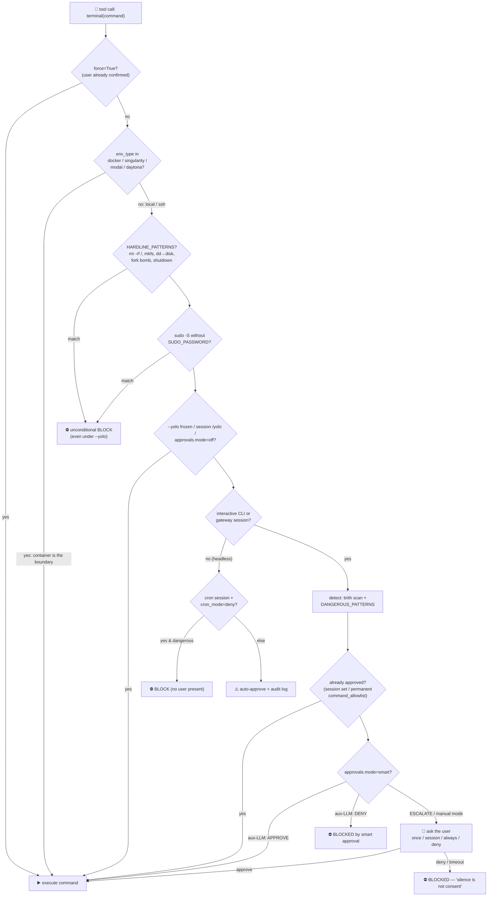
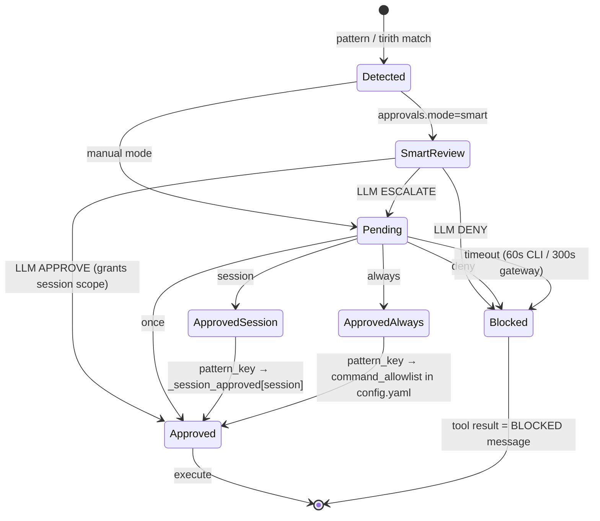

# hermes-agent — Agent permission flow

> Part of [hermes-agent](./ARCHITECTURE.md) @ d62979a

## Module purpose

hermes-agent gates dangerous actions with a **layered, pattern-based approval system** centred on one file: [`tools/approval.py`](https://github.com/nousresearch/hermes-agent/blob/d62979a6f34f64f2ed840f159aac66e24d7cad78/tools/approval.py) (its docstring calls itself "the single source of truth for the dangerous command system"). Unlike opencode/pi-style per-tool permission rules, Hermes does **not** ask before every shell command — it pattern-matches each command against a regex taxonomy (`HARDLINE_PATTERNS` for unconditional blocks, `DANGEROUS_PATTERNS` for approvable risks), routes anything flagged through a context-appropriate approval surface (CLI modal, gateway `/approve` queue across Discord/Telegram/WhatsApp/etc., or an auxiliary-LLM "smart" reviewer), and persists user decisions at three scopes: `once`, `session`, `always`. Containerized execution backends bypass the whole layer — isolation *is* the permission model there.

## Role in the system

Upstream callers are the two execution tools: `terminal_tool()` ([tools/terminal_tool.py:2053](https://github.com/nousresearch/hermes-agent/blob/d62979a6f34f64f2ed840f159aac66e24d7cad78/tools/terminal_tool.py#L2053)) calls `check_all_command_guards()` before every command, and `execute_code` ([tools/code_execution_tool.py:1104-1105](https://github.com/nousresearch/hermes-agent/blob/d62979a6f34f64f2ed840f159aac66e24d7cad78/tools/code_execution_tool.py#L1104-L1105)) calls `check_execute_code_guard()` before spawning the Python child. Downstream, the approval module reaches the user through one of three bridges: the CLI's `prompt_toolkit` callback (registered via `set_approval_callback`), the gateway's per-session notify-callback + blocking queue (resolved by `/approve` / `/deny` slash commands), or a plain `input()` fallback. Adjacent but separate gates cover file writes (`agent/file_safety.py`, `tools/file_tools.py`), persistent memory/skill writes (`tools/write_approval.py`), skill installation ([skills](./skills.md) via `tools/skills_guard.py`), and subagent threads ([delegate_task](./subagents.md) via auto-deny callbacks).

## The layered gate stack

Every terminal command passes through ordered gates; each layer can short-circuit. The crucial design choice is the **ordering**: hardline and sudo-stdin blocks fire *before* the YOLO bypass, so no mode, flag, or config can ever approve a `rm -rf /`.



Key gates with code anchors:

- **Sandbox skip** — `check_all_command_guards` returns approved immediately for container backends ([tools/approval.py:1283-1284](https://github.com/nousresearch/hermes-agent/blob/d62979a6f34f64f2ed840f159aac66e24d7cad78/tools/approval.py#L1283-L1284)); the comment at L224-228 explains: "Containerized backends already bypass the dangerous-command layer because nothing they do can touch the host". `env_type` comes from the `TERMINAL_ENV` env var ([tools/terminal_tool.py:1073-1077](https://github.com/nousresearch/hermes-agent/blob/d62979a6f34f64f2ed840f159aac66e24d7cad78/tools/terminal_tool.py#L1073-L1077)), backed by `BaseEnvironment` subclasses like `DockerEnvironment` ([tools/environments/docker.py:503](https://github.com/nousresearch/hermes-agent/blob/d62979a6f34f64f2ed840f159aac66e24d7cad78/tools/environments/docker.py#L503)).
- **Hardline floor** — `detect_hardline_command()` ([tools/approval.py:326-336](https://github.com/nousresearch/hermes-agent/blob/d62979a6f34f64f2ed840f159aac66e24d7cad78/tools/approval.py#L326-L336)) checked *before* YOLO ([L1286-1293](https://github.com/nousresearch/hermes-agent/blob/d62979a6f34f64f2ed840f159aac66e24d7cad78/tools/approval.py#L1286-L1293)).
- **YOLO freeze** — `_YOLO_MODE_FROZEN` is read from `HERMES_YOLO_MODE` **once at module import** ([tools/approval.py:26-29](https://github.com/nousresearch/hermes-agent/blob/d62979a6f34f64f2ed840f159aac66e24d7cad78/tools/approval.py#L26-L29)): "Reading os.environ on every call would allow any skill running inside the process to set this variable and instantly bypass all approval checks — a prompt-injection escalation path."
- **Headless auto-approve** — outside CLI/gateway/ask contexts the guard logs a warning and approves ([tools/approval.py:1318-1335](https://github.com/nousresearch/hermes-agent/blob/d62979a6f34f64f2ed840f159aac66e24d7cad78/tools/approval.py#L1318-L1335)) — trusted-by-config, except cron under `approvals.cron_mode: deny`.

## Pattern detection — the "what is dangerous" taxonomy

Two pattern tiers, pre-compiled at import, are matched against a **normalized** command to defeat obfuscation. `_normalize_command_for_detection()` ([tools/approval.py:531-558](https://github.com/nousresearch/hermes-agent/blob/d62979a6f34f64f2ed840f159aac66e24d7cad78/tools/approval.py#L531-L558)) strips ANSI escapes, null bytes, NFKC-normalizes fullwidth Unicode, removes backslash escapes (`r\m` → `rm`) and empty-string splits (`r''m` → `rm`), and rewrites the resolved `$HERMES_HOME` path back to `~/.hermes/` so absolute-path references to the config can't dodge the patterns.

| Tier | Count | Examples | Bypassable? |
| --- | --- | --- | --- |
| `HARDLINE_PATTERNS` ([L255-277](https://github.com/nousresearch/hermes-agent/blob/d62979a6f34f64f2ed840f159aac66e24d7cad78/tools/approval.py#L255-L277)) | 12 | `rm -rf /`, `mkfs`, `dd of=/dev/sd*`, fork bomb, `kill -1`, `shutdown`/`reboot` | **Never** — not by `--yolo`, `/yolo`, `approvals.mode=off`, or cron approve mode |
| `DANGEROUS_PATTERNS` ([L373-494](https://github.com/nousresearch/hermes-agent/blob/d62979a6f34f64f2ed840f159aac66e24d7cad78/tools/approval.py#L373-L494)) | ~60 | recursive `rm`, `chmod 777`, SQL `DROP`/`TRUNCATE`/`DELETE` sans `WHERE`, `curl \| sh`, heredoc script eval, `git reset --hard`, force-push, writes to `.env`/`config.yaml`/`/etc/`/sshrc, self-termination (`pkill hermes`), docker lifecycle | Yes — via approval, allowlist, yolo, or smart mode |

A notable self-protection cluster: the agent cannot freely edit `~/.hermes/config.yaml` — "config.yaml IS the security policy: approvals.mode, yolo, and the permanent-approval allowlist live here … the agent could flip approvals.mode=off and immediately bypass the gate" ([L169-175](https://github.com/nousresearch/hermes-agent/blob/d62979a6f34f64f2ed840f159aac66e24d7cad78/tools/approval.py#L169-L175)). Terminal-side patterns gate `sed -i`/`tee`/`>` against it, paired with a hard deny in the file tools (below). Similarly, gateway/self-termination commands (`hermes gateway stop`, `pkill hermes`, `kill $(pgrep -f hermes)`) require approval ([L417-439](https://github.com/nousresearch/hermes-agent/blob/d62979a6f34f64f2ed840f159aac66e24d7cad78/tools/approval.py#L417-L439)).

```python title="tools/approval.py (L255-268, trimmed)"
HARDLINE_PATTERNS = [
    # rm recursive targeting the root filesystem or protected roots
    (r'\brm\s+(-[^\s]*\s+)*(/|/\*|/ \*)(\s|$)', "recursive delete of root filesystem"),
    [...]
    (r'\brm\s+(-[^\s]*\s+)*(~|\$HOME)(/?|/\*)?(\s|$)', "recursive delete of home directory"),
    (r'\bmkfs(\.[a-z0-9]+)?\b', "format filesystem (mkfs)"),
    (r'\bdd\b[^\n]*\bof=/dev/(sd|nvme|hd|mmcblk|vd|xvd)[a-z0-9]*', "dd to raw block device"),
    (r':\(\)\s*\{\s*:\s*\|\s*:\s*&\s*\}\s*;\s*:', "fork bomb"),
    (r'\bkill\s+(-[^\s]+\s+)*-1\b', "kill all processes"),
    (_CMDPOS + r'(shutdown|reboot|halt|poweroff)\b', "system shutdown/reboot"),
    [...]
]
```

The approval *key* for a matched pattern is its human-readable description string (`pattern_key = description`, [L600-605](https://github.com/nousresearch/hermes-agent/blob/d62979a6f34f64f2ed840f159aac66e24d7cad78/tools/approval.py#L594-L605)) — so approving "recursive delete" once covers every command matching that pattern, not just the literal command text. Legacy regex-derived keys are aliased for backwards compatibility (`_approval_key_aliases`, [L517-524](https://github.com/nousresearch/hermes-agent/blob/d62979a6f34f64f2ed840f159aac66e24d7cad78/tools/approval.py#L517-L524)).

## Key types & entry points

- `check_all_command_guards(command, env_type, approval_callback)` ([tools/approval.py:1273](https://github.com/nousresearch/hermes-agent/blob/d62979a6f34f64f2ed840f159aac66e24d7cad78/tools/approval.py#L1273)) — the main pre-exec gate: combines tirith + dangerous-pattern findings into **one** approval prompt (so a `force=True` replay can't bypass a check the user never saw).
- `check_execute_code_guard(code, env_type)` ([tools/approval.py:1570](https://github.com/nousresearch/hermes-agent/blob/d62979a6f34f64f2ed840f159aac66e24d7cad78/tools/approval.py#L1570)) — whole-script approval for `execute_code`, which can call `subprocess`/`os.system` without ever passing through `terminal()` patterns.
- `check_dangerous_command(command, env_type, approval_callback)` ([tools/approval.py:1037](https://github.com/nousresearch/hermes-agent/blob/d62979a6f34f64f2ed840f159aac66e24d7cad78/tools/approval.py#L1037)) — older single-check entry point, same shape minus tirith.
- `detect_dangerous_command` / `detect_hardline_command` ([L594](https://github.com/nousresearch/hermes-agent/blob/d62979a6f34f64f2ed840f159aac66e24d7cad78/tools/approval.py#L594) / [L326](https://github.com/nousresearch/hermes-agent/blob/d62979a6f34f64f2ed840f159aac66e24d7cad78/tools/approval.py#L326)) — pure detection, returns `(is_dangerous, pattern_key, description)`.
- `prompt_dangerous_approval(command, description, …)` ([L822](https://github.com/nousresearch/hermes-agent/blob/d62979a6f34f64f2ed840f159aac66e24d7cad78/tools/approval.py#L822)) — CLI prompt; returns `'once' | 'session' | 'always' | 'deny'`.
- `_ApprovalEntry` ([L627-634](https://github.com/nousresearch/hermes-agent/blob/d62979a6f34f64f2ed840f159aac66e24d7cad78/tools/approval.py#L627-L634)) — one pending gateway approval: a `threading.Event` + data + result slot.
- `register_gateway_notify` / `resolve_gateway_approval` ([L641](https://github.com/nousresearch/hermes-agent/blob/d62979a6f34f64f2ed840f159aac66e24d7cad78/tools/approval.py#L641) / [L666](https://github.com/nousresearch/hermes-agent/blob/d62979a6f34f64f2ed840f159aac66e24d7cad78/tools/approval.py#L666)) — the gateway bridge: per-session notify callback in, FIFO `/approve` resolution out.
- `_await_gateway_decision` ([L1172](https://github.com/nousresearch/hermes-agent/blob/d62979a6f34f64f2ed840f159aac66e24d7cad78/tools/approval.py#L1172)) — enqueue, notify, block the agent thread with heartbeat polling until resolved or timeout (default 300 s).
- `_smart_approve` ([L990](https://github.com/nousresearch/hermes-agent/blob/d62979a6f34f64f2ed840f159aac66e24d7cad78/tools/approval.py#L990)) — auxiliary-LLM risk verdict: `APPROVE | DENY | ESCALATE` ("Inspired by OpenAI Codex's Smart Approvals guardian subagent").
- `is_approved` / `approve_session` / `approve_permanent` / `save_permanent_allowlist` ([L758-815](https://github.com/nousresearch/hermes-agent/blob/d62979a6f34f64f2ed840f159aac66e24d7cad78/tools/approval.py#L758-L815)) — three-scope decision persistence; `always` writes `command_allowlist` into `config.yaml`.
- Session state lives in module-level dicts guarded by a `threading.Lock` ([L612-616](https://github.com/nousresearch/hermes-agent/blob/d62979a6f34f64f2ed840f159aac66e24d7cad78/tools/approval.py#L612-L616)): `_pending`, `_session_approved`, `_session_yolo`, `_permanent_approved`. Session identity flows via `contextvars` (`set_current_session_key`, [L77-79](https://github.com/nousresearch/hermes-agent/blob/d62979a6f34f64f2ed840f159aac66e24d7cad78/tools/approval.py#L77-L79)) because gateway runs concurrent turns in executor threads.

## Data flow — tool call to execution/rejection

`terminal_tool(command, …, force=False)` ([tools/terminal_tool.py:1823-1828](https://github.com/nousresearch/hermes-agent/blob/d62979a6f34f64f2ed840f159aac66e24d7cad78/tools/terminal_tool.py#L1823-L1828)) resolves its execution environment, then — unless `force=True` ("use after user confirms") — calls `_check_all_guards()`, a thin wrapper that injects the thread-local CLI approval callback ([L260-263](https://github.com/nousresearch/hermes-agent/blob/d62979a6f34f64f2ed840f159aac66e24d7cad78/tools/terminal_tool.py#L260-L263)). The result dict drives three outcomes at the call site ([L2050-2086](https://github.com/nousresearch/hermes-agent/blob/d62979a6f34f64f2ed840f159aac66e24d7cad78/tools/terminal_tool.py#L2050-L2086)): `status: pending_approval` (legacy async surface, no notify callback registered), `status: blocked` (the model receives the `BLOCKED:` message as the tool result), or approved — optionally annotating the result with "Command required approval (…) and was approved by the user."

The gateway path is the most interesting: the approval **blocks the synchronous agent thread** mid-tool-call while the user decides asynchronously on a chat platform.

```mermaid
sequenceDiagram
    autonumber
    participant M as 🤖 Model (agent loop)
    participant T as terminal_tool
    participant G as check_all_command_guards
    participant Q as _gateway_queues<br/>(per-session FIFO)
    participant GW as Gateway adapter<br/>(Discord/Telegram/…)
    participant U as 👤 User

    M->>T: terminal("git push --force")
    T->>G: _check_all_guards(cmd, env_type)
    Note over G: hardline ✓ sudo-guard ✓ yolo ✗<br/>tirith + DANGEROUS_PATTERNS → flagged<br/>not in session/permanent allowlist
    G->>Q: append _ApprovalEntry(threading.Event)
    G->>GW: notify_cb(approval_data)  [sync→async bridge]
    GW->>U: ⚠️ approval request (buttons or /approve text)
    Note over G: event.wait() in 1s slices, ~300s timeout,<br/>heartbeats keep watchdog from killing agent
    U->>GW: /approve session  (or button tap)
    GW->>Q: resolve_gateway_approval(session_key, "session")
    Q-->>G: entry.result="session"; event.set()
    G->>G: approve_session(session_key, pattern_key)
    G-->>T: {"approved": true, "user_approved": true}
    T->>T: execute command
    T-->>M: output + "Command required approval … approved by the user."
```

On deny or timeout the agent instead receives a hard consent message ([tools/approval.py:1448-1477](https://github.com/nousresearch/hermes-agent/blob/d62979a6f34f64f2ed840f159aac66e24d7cad78/tools/approval.py#L1448-L1477)) written specifically against model evasion: "Do NOT retry this command, do NOT rephrase it, and do NOT attempt the same outcome via a different command. … Silence is not consent." Timeout and explicit deny are distinguished in the plugin hooks (`pre_approval_request` / `post_approval_response`, fired at [L1206-1214](https://github.com/nousresearch/hermes-agent/blob/d62979a6f34f64f2ed840f159aac66e24d7cad78/tools/approval.py#L1206-L1214) and [L1260-1269](https://github.com/nousresearch/hermes-agent/blob/d62979a6f34f64f2ed840f159aac66e24d7cad78/tools/approval.py#L1260-L1269)).

### Decision state machine



Scope persistence after a grant ([tools/approval.py:1479-1491](https://github.com/nousresearch/hermes-agent/blob/d62979a6f34f64f2ed840f159aac66e24d7cad78/tools/approval.py#L1479-L1491)): `once` persists nothing; `session` adds the pattern key to `_session_approved[session_key]`; `always` additionally writes the key into `command_allowlist` in `config.yaml` via `save_permanent_allowlist()`, reloaded at every process start ([L1750-1751](https://github.com/nousresearch/hermes-agent/blob/d62979a6f34f64f2ed840f159aac66e24d7cad78/tools/approval.py#L1750-L1751)). One asymmetry: tirith (content-level security) findings are **never** allowed permanent scope — `always` is downgraded to `session` and the UI hides the `[a]lways` option (`allow_permanent=not has_tirith`, [L1430-1434](https://github.com/nousresearch/hermes-agent/blob/d62979a6f34f64f2ed840f159aac66e24d7cad78/tools/approval.py#L1430-L1434)).

## Approval surfaces (UI flow)

| Surface | Mechanism | Resolution |
| --- | --- | --- |
| Interactive CLI | `cli.py` registers `self._approval_callback` via `set_approval_callback` ([cli.py:5047](https://github.com/nousresearch/hermes-agent/blob/d62979a6f34f64f2ed840f159aac66e24d7cad78/cli.py#L5047)); modal prompt_toolkit panel with countdown, choices once/session/always/deny + `view` for long commands ([cli.py:9577-9617](https://github.com/nousresearch/hermes-agent/blob/d62979a6f34f64f2ed840f159aac66e24d7cad78/cli.py#L9577-L9617)) | Synchronous return; 60 s default timeout → deny |
| Gateway (chat platforms) | `gateway/run.py` binds session key + registers `_approval_notify_sync` per turn ([gateway/run.py:14466-14467](https://github.com/nousresearch/hermes-agent/blob/d62979a6f34f64f2ed840f159aac66e24d7cad78/gateway/run.py#L14466-L14467)); adapters render buttons (Discord `send_exec_approval`, Telegram/Feishu/WhatsApp inline buttons) or plain text | `/approve [all] [session\|always]`, `/deny [all]` handlers ([gateway/slash_commands.py:3416-3449](https://github.com/nousresearch/hermes-agent/blob/d62979a6f34f64f2ed840f159aac66e24d7cad78/gateway/slash_commands.py#L3416-L3449)) call `resolve_gateway_approval`; FIFO, multi-pending for parallel subagents |
| Headless `input()` | Fallback in `prompt_dangerous_approval` with a fail-closed guard: if prompt_toolkit owns the terminal but no callback is registered, **deny fast** instead of deadlocking on stdin ([tools/approval.py:849-874](https://github.com/nousresearch/hermes-agent/blob/d62979a6f34f64f2ed840f159aac66e24d7cad78/tools/approval.py#L849-L874)) | `input()` on a daemon thread with timeout |
| Smart (LLM) | `_smart_approve` sends command + flag reason to the auxiliary model, `temperature=0, max_tokens=16` ([tools/approval.py:1016-1021](https://github.com/nousresearch/hermes-agent/blob/d62979a6f34f64f2ed840f159aac66e24d7cad78/tools/approval.py#L1016-L1021)) | APPROVE auto-grants session scope; DENY hard-blocks; ESCALATE falls to manual |

The CLI thread-local callback design is itself a security fix: callbacks live in `threading.local()` "so overlapping ACP sessions … don't stomp on each other's callbacks. See GHSA-qg5c-hvr5-hjgr" ([tools/terminal_tool.py:164-200](https://github.com/nousresearch/hermes-agent/blob/d62979a6f34f64f2ed840f159aac66e24d7cad78/tools/terminal_tool.py#L164-L200)).

## Permission modes & configuration

All knobs live under `approvals:` in `~/.hermes/config.yaml` (which the agent itself cannot edit — see below):

| Setting | Values | Effect |
| --- | --- | --- |
| `approvals.mode` | `manual` (default) / `smart` / `off` | manual = always prompt; smart = aux-LLM triage first; off = skip all approvable checks (hardline still applies). YAML-bool footgun handled: bare `off` parses as `False` and is normalized back to `"off"` ([tools/approval.py:937-949](https://github.com/nousresearch/hermes-agent/blob/d62979a6f34f64f2ed840f159aac66e24d7cad78/tools/approval.py#L937-L949)) |
| `approvals.timeout` / `approvals.gateway_timeout` | seconds (60 / 300) | CLI prompt and gateway wait deadlines; timeout = deny |
| `approvals.cron_mode` | `deny` (default) / `approve` | Cron has no user present; deny tells the model to "find an alternative approach" ([L1320-1334](https://github.com/nousresearch/hermes-agent/blob/d62979a6f34f64f2ed840f159aac66e24d7cad78/tools/approval.py#L1320-L1334)) |
| `command_allowlist` | list of pattern keys | The permanent allowlist written by `always` grants |
| `--yolo` / `HERMES_YOLO_MODE` | process-scoped, frozen at import | Bypass approvable layer (never hardline) |
| `/yolo` | per-session toggle | `enable_session_yolo(session_key)` ([L713-718](https://github.com/nousresearch/hermes-agent/blob/d62979a6f34f64f2ed840f159aac66e24d7cad78/tools/approval.py#L713-L718)); CLI shows a `⚠ YOLO` status-bar badge and survives session renames ([cli.py:7954-8006](https://github.com/nousresearch/hermes-agent/blob/d62979a6f34f64f2ed840f159aac66e24d7cad78/cli.py#L7954-L8006)) |
| `delegation.subagent_auto_approve` | bool, default `false` | Subagent dangerous-command policy (below) |
| `memory.write_approval` / `skills.write_approval` | bool, default `false` | Stage persistent-store writes for review (below) |

## The `execute_code` escape hatch, closed

Arbitrary Python can spawn subprocesses that never touch `terminal()` patterns. `check_execute_code_guard` ([tools/approval.py:1570-1747](https://github.com/nousresearch/hermes-agent/blob/d62979a6f34f64f2ed840f159aac66e24d7cad78/tools/approval.py#L1570-L1747)) therefore approves the **whole script one-shot** before the child spawns, in gateway/ask contexts — same allowlist scopes, same smart-mode triage, same blocking queue, with `pattern_key="execute_code"`. The script is rendered to the user as `execute_code <<'PY' … PY`. The docstring honestly documents the residual gap: a purely local, non-interactive, non-gateway session runs code without approval — "trusted-by-config." Additionally, [subagents](./subagents.md) simply never get `execute_code` at all (`DELEGATE_BLOCKED_TOOLS`, below).

## Parallel file-tool gates (deny, not ask)

The `write_file`/`patch`/`read_file` tools enforce **hard denials** — no approval prompt, just refusal — for a curated set of paths, shared via `agent/file_safety.py`:

- `is_write_denied()` ([agent/file_safety.py:96-130](https://github.com/nousresearch/hermes-agent/blob/d62979a6f34f64f2ed840f159aac66e24d7cad78/agent/file_safety.py#L96-L130)) blocks SSH keys/`authorized_keys`, `.env` (active profile *and* global root), `.anthropic_oauth.json`, shell rc files, and the Hermes control-plane files `auth.json` / `config.yaml` / `webhook_subscriptions.json` across all profile views.
- `get_read_block_error()` ([agent/file_safety.py:165-203](https://github.com/nousresearch/hermes-agent/blob/d62979a6f34f64f2ed840f159aac66e24d7cad78/agent/file_safety.py#L165-L203)) blocks *reads* of credential stores, `mcp-tokens/`, and project `.env*` files everywhere on disk — with a refreshingly honest caveat: "**This is NOT a security boundary.** The terminal tool runs as the same OS user … The read-deny exists as defense-in-depth" that works because models empirically respect tool denials, plus it leaves an audit trail.
- `_check_sensitive_path()` ([tools/file_tools.py:315-343](https://github.com/nousresearch/hermes-agent/blob/d62979a6f34f64f2ed840f159aac66e24d7cad78/tools/file_tools.py#L315-L343)) additionally refuses writes to system prefixes and to the resolved config path: "a malicious or prompt-injected agent could silently disable exec approval by writing to this file."

```python title="tools/file_tools.py (L330-341)"
    # Prevent agents from modifying the Hermes config file directly.
    # approvals.mode and other security settings live here; a malicious or
    # prompt-injected agent could silently disable exec approval by writing to
    # this file.
    hermes_config = _get_hermes_config_resolved()
    if hermes_config and (resolved == hermes_config or normalized == hermes_config):
        return (
            f"Refusing to write to Hermes config file: {filepath}\n"
            "Agent cannot modify security-sensitive configuration. "
            "Edit ~/.hermes/config.yaml directly or use 'hermes config' instead."
        )
```

These file-tool denies are deliberately **paired** with terminal-side `DANGEROUS_PATTERNS` covering `sed -i`/`tee`/`>`/`cp` against the same targets — the approval.py comment calls an unpaired deny "theater" ([tools/approval.py:169-175](https://github.com/nousresearch/hermes-agent/blob/d62979a6f34f64f2ed840f159aac66e24d7cad78/tools/approval.py#L169-L175)).

## Subagent permission flow

Subagents (the [delegate_task](./subagents.md) tool) run in `ThreadPoolExecutor` workers that don't inherit the CLI's thread-local approval callback — and a worker calling `input()` would deadlock against the parent's prompt_toolkit TUI. So delegate installs a **non-interactive policy callback** into every worker via the executor initializer ([tools/delegate_tool.py:1564-1569](https://github.com/nousresearch/hermes-agent/blob/d62979a6f34f64f2ed840f159aac66e24d7cad78/tools/delegate_tool.py#L1564-L1569)):

```python title="tools/delegate_tool.py (L72-84)"
def _subagent_auto_deny(command: str, description: str, **kwargs) -> str:
    """Auto-deny dangerous commands in subagent threads (safe default).

    Returns 'deny' so the subagent sees a refusal it can recover from, and
    never calls input() (which would deadlock the parent TUI).
    """
    logger.warning(
        "Subagent auto-denied dangerous command: %s (%s). "
        "Set delegation.subagent_auto_approve: true to allow.",
        command, description,
    )
    return "deny"
```

`delegation.subagent_auto_approve: true` swaps in `_subagent_auto_approve` (returns `'once'`, opt-in YOLO for cron/batch); both log for audit. Gateway sessions are unaffected — their approvals resolve via the per-session queue, so a subagent's flagged command surfaces to the user like any other ([L57-71](https://github.com/nousresearch/hermes-agent/blob/d62979a6f34f64f2ed840f159aac66e24d7cad78/tools/delegate_tool.py#L57-L71)), and `/approve all` exists precisely because parallel subagents can queue several approvals at once. Capability-wise, children are also statically stripped of `DELEGATE_BLOCKED_TOOLS = {delegate_task, clarify, memory, send_message, execute_code}` ([tools/delegate_tool.py:44-54](https://github.com/nousresearch/hermes-agent/blob/d62979a6f34f64f2ed840f159aac66e24d7cad78/tools/delegate_tool.py#L44-L54)) — no recursion, no user interaction, no shared-memory writes, no script escape hatch.

## Adjacent gates (same philosophy, different assets)

- **Tirith content scanning** — [`tools/tirith_security.py`](https://github.com/nousresearch/hermes-agent/blob/d62979a6f34f64f2ed840f159aac66e24d7cad78/tools/tirith_security.py#L1-L21) shells out to a pinned, SHA-256-verified `tirith` binary scanning for homograph URLs, pipe-to-interpreter, terminal injection; exit code 0/1/2 = allow/block/warn. Both block and warn route into the same combined approval prompt (`check_command_security` at [L697](https://github.com/nousresearch/hermes-agent/blob/d62979a6f34f64f2ed840f159aac66e24d7cad78/tools/tirith_security.py#L697), merged at [tools/approval.py:1341-1368](https://github.com/nousresearch/hermes-agent/blob/d62979a6f34f64f2ed840f159aac66e24d7cad78/tools/approval.py#L1341-L1368)).
- **Persistent-store write approval** — [`tools/write_approval.py`](https://github.com/nousresearch/hermes-agent/blob/d62979a6f34f64f2ed840f159aac66e24d7cad78/tools/write_approval.py#L1-L41) gates [memory](./memory.md) (`MEMORY.md`/`USER.md`) and skill writes when `write_approval: true`: foreground CLI memory writes prompt inline through the same approval callback; background-review and gateway writes are **staged** to `<HERMES_HOME>/pending/{memory,skills}/<id>.json` (`stage_write`, [L114-151](https://github.com/nousresearch/hermes-agent/blob/d62979a6f34f64f2ed840f159aac66e24d7cad78/tools/write_approval.py#L114-L151)) for out-of-band review via `/memory pending`.
- **Skill installation** — [`tools/skills_guard.py`](https://github.com/nousresearch/hermes-agent/blob/d62979a6f34f64f2ed840f159aac66e24d7cad78/tools/skills_guard.py#L1-L23) statically scans every externally-sourced skill pre-install (exfiltration, prompt injection, persistence patterns) under a trust hierarchy: `builtin` never scanned, `trusted` (openai/skills, anthropics/skills) allows caution verdicts, `community` blocks on any finding unless `--force`.
- **Slash-command confirmation** — [`tools/slash_confirm.py`](https://github.com/nousresearch/hermes-agent/blob/d62979a6f34f64f2ed840f159aac66e24d7cad78/tools/slash_confirm.py#L1-L22) reuses the queue pattern for expensive-but-safe gateway commands (`/reload-mcp`), with Approve Once / Always / Cancel buttons.
- **Loop guardrails** — `agent/tool_guardrails.py` classifies tools as `IDEMPOTENT_TOOL_NAMES` vs `MUTATING_TOOL_NAMES` ([L20-59](https://github.com/nousresearch/hermes-agent/blob/d62979a6f34f64f2ed840f159aac66e24d7cad78/agent/tool_guardrails.py#L20-L59)) — used by the [agent loop](./agent-loop.md) to halt repeated identical calls, a runaway-behavior gate rather than a consent gate.

## Comparative takeaways for the research topic

1. **Detection-based, not declaration-based.** opencode-style systems gate by *tool identity* (per-tool ask/allow/deny rules); Hermes gates by *command content* — a curated regex taxonomy plus an external scanner plus an optional LLM judge. Everything un-flagged runs without asking.
2. **A hardline floor above all modes** is the distinctive invariant: yolo, `mode: off`, cron-approve, and the permanent allowlist all sit *below* the unconditional blocklist and the sudo-stdin guard.
3. **Approval state is keyed by pattern, not by command**, at three scopes (once/session/always), with the permanent tier persisted as `command_allowlist` in user config the agent is structurally barred from editing.
4. **The chat-gateway approval queue** (blocking a sync agent thread on a `threading.Event` until a `/approve` arrives from Discord/Telegram, with watchdog heartbeats) is the most architecturally novel surface — a consequence of Hermes being a multi-platform gateway agent rather than a terminal-only tool.
5. **Sandboxing substitutes for permission**: container backends (`docker`, `singularity`, `modal`, `daytona`) skip the entire guard stack by design.
6. The codebase repeatedly cites peers — Claude Code 2.1.113 deny rules, OpenAI Codex smart approvals, Mercury Agent's blocklist — making it a useful index of cross-harness permission ideas.

## Source files

| File | Ranges | GitHub |
| --- | --- | --- |
| `tools/approval.py` | L1-29, L133-151, L161-211, L255-336, L373-524, L531-605, L612-755, L758-815, L822-1034, L1037-1138, L1172-1270, L1273-1567, L1570-1751 | [link](https://github.com/nousresearch/hermes-agent/blob/d62979a6f34f64f2ed840f159aac66e24d7cad78/tools/approval.py) |
| `tools/terminal_tool.py` | L164-263, L1073-1077, L1823-1832, L2050-2086 | [link](https://github.com/nousresearch/hermes-agent/blob/d62979a6f34f64f2ed840f159aac66e24d7cad78/tools/terminal_tool.py) |
| `tools/code_execution_tool.py` | L1104-1105 | [link](https://github.com/nousresearch/hermes-agent/blob/d62979a6f34f64f2ed840f159aac66e24d7cad78/tools/code_execution_tool.py) |
| `tools/delegate_tool.py` | L40-110, L1564-1569 | [link](https://github.com/nousresearch/hermes-agent/blob/d62979a6f34f64f2ed840f159aac66e24d7cad78/tools/delegate_tool.py) |
| `tools/write_approval.py` | L1-151 | [link](https://github.com/nousresearch/hermes-agent/blob/d62979a6f34f64f2ed840f159aac66e24d7cad78/tools/write_approval.py) |
| `tools/slash_confirm.py` | L1-40 | [link](https://github.com/nousresearch/hermes-agent/blob/d62979a6f34f64f2ed840f159aac66e24d7cad78/tools/slash_confirm.py) |
| `tools/tirith_security.py` | L1-60, L697 | [link](https://github.com/nousresearch/hermes-agent/blob/d62979a6f34f64f2ed840f159aac66e24d7cad78/tools/tirith_security.py) |
| `tools/skills_guard.py` | L1-40 | [link](https://github.com/nousresearch/hermes-agent/blob/d62979a6f34f64f2ed840f159aac66e24d7cad78/tools/skills_guard.py) |
| `tools/file_tools.py` | L300-343 | [link](https://github.com/nousresearch/hermes-agent/blob/d62979a6f34f64f2ed840f159aac66e24d7cad78/tools/file_tools.py) |
| `agent/file_safety.py` | L1-60, L96-203 | [link](https://github.com/nousresearch/hermes-agent/blob/d62979a6f34f64f2ed840f159aac66e24d7cad78/agent/file_safety.py) |
| `agent/tool_guardrails.py` | L1-60 | [link](https://github.com/nousresearch/hermes-agent/blob/d62979a6f34f64f2ed840f159aac66e24d7cad78/agent/tool_guardrails.py) |
| `gateway/run.py` | L14285-14295, L14460-14470 | [link](https://github.com/nousresearch/hermes-agent/blob/d62979a6f34f64f2ed840f159aac66e24d7cad78/gateway/run.py) |
| `gateway/slash_commands.py` | L3400-3480 | [link](https://github.com/nousresearch/hermes-agent/blob/d62979a6f34f64f2ed840f159aac66e24d7cad78/gateway/slash_commands.py) |
| `cli.py` | L5047-5052, L7954-8026, L9577-9617 | [link](https://github.com/nousresearch/hermes-agent/blob/d62979a6f34f64f2ed840f159aac66e24d7cad78/cli.py) |
| `tools/environments/docker.py` | L503 | [link](https://github.com/nousresearch/hermes-agent/blob/d62979a6f34f64f2ed840f159aac66e24d7cad78/tools/environments/docker.py) |
