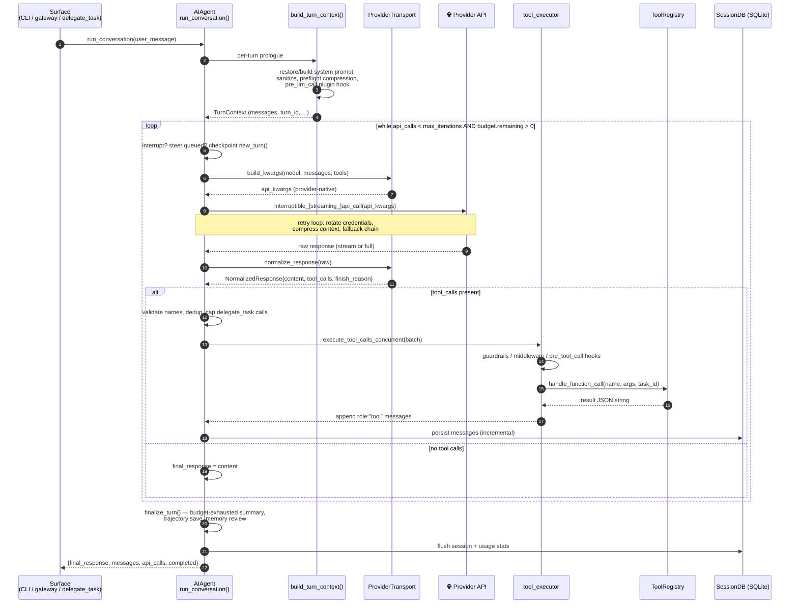
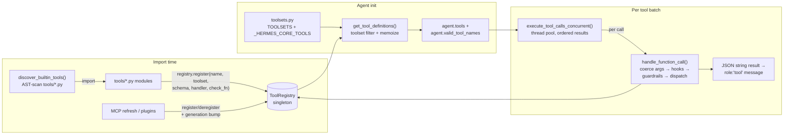

# hermes-agent — Agents architecture

> Part of [hermes-agent](./ARCHITECTURE.md) @ d62979a
> Source: https://github.com/nousresearch/hermes-agent @ `d62979a6f34f64f2ed840f159aac66e24d7cad78` (branch `main`)

## Module purpose

This doc covers the core agent abstraction of Hermes: the `AIAgent` class, the synchronous tool-calling conversation loop, the provider/transport layer that normalizes ~6 wire protocols into one message shape, the self-registering tool registry, and the SQLite session/message store. Hermes is a Python harness (vs. opencode's TypeScript client/server and pi's minimal TypeScript core), and its defining architectural traits are: **one god-object agent decomposed into forwarder modules**, **OpenAI chat-completions format as the internal lingua franca**, and **a transport registry that adapts that format per provider at the API boundary**.

## Role in the system

Every surface constructs an `AIAgent` and drives it through `run_conversation()` / `chat()`: the interactive CLI (`HermesCLI`, `cli.py:3139`, drives it at `cli.py:10192`), the messaging gateway (`gateway/run.py:10089`), the batch runner (`batch_runner.py:325`), and the `delegate_task` tool, which spawns child `AIAgent` instances as subagents (`tools/delegate_tool.py:2914` — see the subagents doc). Downstream, the agent calls provider SDKs through the transport layer, dispatches tool calls into `model_tools.handle_function_call()`, and persists every message into `SessionDB` (SQLite). The repo's own dev guide documents the class contract at [AGENTS.md L303-L361](https://github.com/nousresearch/hermes-agent/blob/d62979a6f34f64f2ed840f159aac66e24d7cad78/AGENTS.md#L303-L361).

A note on code organization that matters for reading this repo: `run_agent.py` (5,400 lines) declares `AIAgent` and hundreds of small methods, but the heavy logic has been decomposed into `agent/*.py` modules ("god-file decomposition"). Methods on `AIAgent` are frequently one-line **forwarders** — e.g. `AIAgent.run_conversation` at `run_agent.py:5144` does nothing but import and call `agent.conversation_loop.run_conversation(self, ...)`. The class instance acts as a mutable state bag threaded through free functions.

## Key types & entry points

| Symbol | Location | Purpose |
| --- | --- | --- |
| `AIAgent` | [run_agent.py L320](https://github.com/nousresearch/hermes-agent/blob/d62979a6f34f64f2ed840f159aac66e24d7cad78/run_agent.py#L320) | The agent: config, credentials, callbacks, session state, loop entry |
| `AIAgent.__init__` (~70 params) | [run_agent.py L343](https://github.com/nousresearch/hermes-agent/blob/d62979a6f34f64f2ed840f159aac66e24d7cad78/run_agent.py#L343) | Forwards to `agent.agent_init.init_agent` ([agent/agent_init.py L154](https://github.com/nousresearch/hermes-agent/blob/d62979a6f34f64f2ed840f159aac66e24d7cad78/agent/agent_init.py#L154)) |
| `run_conversation()` | [agent/conversation_loop.py L371](https://github.com/nousresearch/hermes-agent/blob/d62979a6f34f64f2ed840f159aac66e24d7cad78/agent/conversation_loop.py#L371) | **The agent loop** — one user turn, N API calls + tool rounds |
| main `while` loop | [agent/conversation_loop.py L461](https://github.com/nousresearch/hermes-agent/blob/d62979a6f34f64f2ed840f159aac66e24d7cad78/agent/conversation_loop.py#L461) | Iteration/budget-bounded tool-calling loop |
| `AIAgent.chat()` | [run_agent.py L5157](https://github.com/nousresearch/hermes-agent/blob/d62979a6f34f64f2ed840f159aac66e24d7cad78/run_agent.py#L5157) | Simple wrapper: returns `result["final_response"]` |
| `TurnContext` / `build_turn_context()` | [agent/turn_context.py L37, L64](https://github.com/nousresearch/hermes-agent/blob/d62979a6f34f64f2ed840f159aac66e24d7cad78/agent/turn_context.py#L37-L64) | Per-turn prologue: system prompt, sanitization, preflight compression, plugin hooks |
| `finalize_turn()` | [agent/turn_finalizer.py L30](https://github.com/nousresearch/hermes-agent/blob/d62979a6f34f64f2ed840f159aac66e24d7cad78/agent/turn_finalizer.py#L30) | Post-loop epilogue: budget-exhausted summary, persistence, result dict |
| `interruptible_api_call()` | [agent/chat_completion_helpers.py L125](https://github.com/nousresearch/hermes-agent/blob/d62979a6f34f64f2ed840f159aac66e24d7cad78/agent/chat_completion_helpers.py#L125) | Non-streaming LLM call in a worker thread, branched per `api_mode` |
| `interruptible_streaming_api_call()` | [agent/chat_completion_helpers.py L1567](https://github.com/nousresearch/hermes-agent/blob/d62979a6f34f64f2ed840f159aac66e24d7cad78/agent/chat_completion_helpers.py#L1567) | Streaming variant with stale-stream watchdogs |
| `ProviderTransport` | [agent/transports/base.py L16](https://github.com/nousresearch/hermes-agent/blob/d62979a6f34f64f2ed840f159aac66e24d7cad78/agent/transports/base.py#L16) | ABC: `convert_messages → convert_tools → build_kwargs → normalize_response` |
| `NormalizedResponse` / `ToolCall` / `Usage` | [agent/transports/types.py L90, L19, L80](https://github.com/nousresearch/hermes-agent/blob/d62979a6f34f64f2ed840f159aac66e24d7cad78/agent/transports/types.py#L19-L150) | Canonical cross-provider response shape |
| `ProviderProfile` | [providers/base.py L38](https://github.com/nousresearch/hermes-agent/blob/d62979a6f34f64f2ed840f159aac66e24d7cad78/providers/base.py#L38) | Declarative provider descriptor (auth, endpoints, quirks) |
| `ToolRegistry` / `ToolEntry` | [tools/registry.py L151, L77](https://github.com/nousresearch/hermes-agent/blob/d62979a6f34f64f2ed840f159aac66e24d7cad78/tools/registry.py#L77-L151) | Singleton registry; tools self-register at import time |
| `discover_builtin_tools()` | [tools/registry.py L57](https://github.com/nousresearch/hermes-agent/blob/d62979a6f34f64f2ed840f159aac66e24d7cad78/tools/registry.py#L57) | AST-scans `tools/*.py`, imports modules that call `registry.register()` |
| `get_tool_definitions()` | [model_tools.py L272](https://github.com/nousresearch/hermes-agent/blob/d62979a6f34f64f2ed840f159aac66e24d7cad78/model_tools.py#L272) | Toolset-filtered, memoized OpenAI-format tool schemas |
| `handle_function_call()` | [model_tools.py L876](https://github.com/nousresearch/hermes-agent/blob/d62979a6f34f64f2ed840f159aac66e24d7cad78/model_tools.py#L876) | Tool dispatcher: arg coercion, tool_search bridge unwrap, hooks, registry dispatch |
| `execute_tool_calls_concurrent()` | [agent/tool_executor.py L243](https://github.com/nousresearch/hermes-agent/blob/d62979a6f34f64f2ed840f159aac66e24d7cad78/agent/tool_executor.py#L243) | Thread-pool execution of a tool batch (sequential variant at L770) |
| `_HERMES_CORE_TOOLS` / `TOOLSETS` | [toolsets.py L31, L91](https://github.com/nousresearch/hermes-agent/blob/d62979a6f34f64f2ed840f159aac66e24d7cad78/toolsets.py#L31-L91) | Default tool list (~45 tools) and named toolset bundles |
| `SessionDB` | [hermes_state.py L657](https://github.com/nousresearch/hermes-agent/blob/d62979a6f34f64f2ed840f159aac66e24d7cad78/hermes_state.py#L657) | SQLite session store (WAL, FTS5); schema at L510-L590 |
| `IterationBudget` | [agent/iteration_budget.py L17](https://github.com/nousresearch/hermes-agent/blob/d62979a6f34f64f2ed840f159aac66e24d7cad78/agent/iteration_budget.py#L17) | Cross-turn iteration accounting shared with subagents |

## The agent loop

One call to `run_conversation()` = one user turn. Internally it loops up to `max_iterations` (default 90) API calls, executing tool batches between calls, until the model returns a response with no tool calls. The loop is **entirely synchronous** (LLM calls run in watchdog'd worker threads; tool batches use a thread pool), and **interrupt/steer checks are woven through every stage** — a `/steer` message arriving mid-API-call is drained into the message list before the next API call ([conversation_loop.py L523](https://github.com/nousresearch/hermes-agent/blob/d62979a6f34f64f2ed840f159aac66e24d7cad78/agent/conversation_loop.py#L523)).



### Loop walk-through (with exact anchors)

1. **Prologue** — `build_turn_context()` ([turn_context.py L64](https://github.com/nousresearch/hermes-agent/blob/d62979a6f34f64f2ed840f159aac66e24d7cad78/agent/turn_context.py#L64)) does all once-per-turn setup: stdio guarding, surrogate sanitization, todo/nudge hydration, system-prompt restore-or-build, crash-resilience persistence, preflight compression, the `pre_llm_call` plugin hook, and external-memory prefetch. It returns a `TurnContext` dataclass whose fields become the loop's locals.
2. **Runtime bypass** — if `api_mode == "codex_app_server"`, the whole turn is handed to a Codex app-server subprocess and the native loop is skipped ([conversation_loop.py L452-L460](https://github.com/nousresearch/hermes-agent/blob/d62979a6f34f64f2ed840f159aac66e24d7cad78/agent/conversation_loop.py#L452-L460)).
3. **Loop condition** — iteration cap AND shared `IterationBudget`, plus a one-shot `_budget_grace_call` that grants the model one final call after exhaustion ([L461](https://github.com/nousresearch/hermes-agent/blob/d62979a6f34f64f2ed840f159aac66e24d7cad78/agent/conversation_loop.py#L461)).
4. **API call with retry** — an inner `while retry_count < max_retries` loop ([L811](https://github.com/nousresearch/hermes-agent/blob/d62979a6f34f64f2ed840f159aac66e24d7cad78/agent/conversation_loop.py#L811)) wraps each LLM request with: provider rate-limit guards, `_build_api_kwargs` via the transport, LLM request middleware + plugin hooks, streaming-vs-non-streaming selection ([L977-L1007](https://github.com/nousresearch/hermes-agent/blob/d62979a6f34f64f2ed840f159aac66e24d7cad78/agent/conversation_loop.py#L977-L1007) — streaming is preferred even with no UI consumer, for stale-stream health checking), credential-pool rotation, context-compression-on-overflow, and a multi-provider fallback chain (`try_activate_fallback`, [chat_completion_helpers.py L1045](https://github.com/nousresearch/hermes-agent/blob/d62979a6f34f64f2ed840f159aac66e24d7cad78/agent/chat_completion_helpers.py#L1045)).
5. **Tool branch** — if `assistant_message.tool_calls` is non-empty ([L3499](https://github.com/nousresearch/hermes-agent/blob/d62979a6f34f64f2ed840f159aac66e24d7cad78/agent/conversation_loop.py#L3499)): invalid tool names are rejected back to the model as tool-result errors, `delegate_task` calls are capped, duplicates dropped, then `agent._execute_tool_calls(...)` runs the batch ([L3731](https://github.com/nousresearch/hermes-agent/blob/d62979a6f34f64f2ed840f159aac66e24d7cad78/agent/conversation_loop.py#L3731)). A guardrail can halt the whole turn ([L3733-L3754](https://github.com/nousresearch/hermes-agent/blob/d62979a6f34f64f2ed840f159aac66e24d7cad78/agent/conversation_loop.py#L3733-L3754) — see the permission-flows doc), otherwise `continue`.
6. **Final branch** — no tool calls means the content is the final response ([L3830-L3832](https://github.com/nousresearch/hermes-agent/blob/d62979a6f34f64f2ed840f159aac66e24d7cad78/agent/conversation_loop.py#L3830-L3832)), with empty-response recovery (thinking-prefill retries, partial-stream salvage) before the loop breaks.
7. **Epilogue** — `finalize_turn()` ([turn_finalizer.py L30](https://github.com/nousresearch/hermes-agent/blob/d62979a6f34f64f2ed840f159aac66e24d7cad78/agent/turn_finalizer.py#L30)): if the budget ran out with no final response, `handle_max_iterations()` makes one extra **toolless** API call asking the model to summarize ([chat_completion_helpers.py L1305](https://github.com/nousresearch/hermes-agent/blob/d62979a6f34f64f2ed840f159aac66e24d7cad78/agent/chat_completion_helpers.py#L1305)); then trajectory save, session flush, post-turn memory review, and assembly of the result dict. Every exit path records a `_turn_exit_reason` diagnostic string.

Messages stay in **OpenAI chat format** throughout (`{"role": "system|user|assistant|tool", ...}`); reasoning lives in `assistant_msg["reasoning"]` and provider-specific reasoning artifacts in dedicated keys.

## Annotated code

### `agent/conversation_loop.py` — the loop head

The condition encodes the three loop-termination inputs: per-turn iteration cap, cross-turn shared budget, and the one-shot grace call.

```python title="agent/conversation_loop.py (L461-L487, trimmed)"
while (api_call_count < agent.max_iterations and agent.iteration_budget.remaining > 0) or agent._budget_grace_call:
    # Reset per-turn checkpoint dedup so each iteration can take one snapshot
    agent._checkpoint_mgr.new_turn()

    # Check for interrupt request (e.g., user sent new message)
    if agent._interrupt_requested:
        interrupted = True
        _turn_exit_reason = "interrupted_by_user"
        [...]
        break

    api_call_count += 1
    agent._api_call_count = api_call_count
    agent._touch_activity(f"starting API call #{api_call_count}")

    # Grace call: the budget is exhausted but we gave the model one
    # more chance.  Consume the grace flag so the loop exits after
    # this iteration regardless of outcome.
    if agent._budget_grace_call:
        agent._budget_grace_call = False
    elif not agent.iteration_budget.consume():
        _turn_exit_reason = "budget_exhausted"
        [...]
        break
```

[Full file on GitHub](https://github.com/nousresearch/hermes-agent/blob/d62979a6f34f64f2ed840f159aac66e24d7cad78/agent/conversation_loop.py) · [L461-L487](https://github.com/nousresearch/hermes-agent/blob/d62979a6f34f64f2ed840f159aac66e24d7cad78/agent/conversation_loop.py#L461-L487)

### `run_agent.py` — `AIAgent` as forwarder shell

What this shows: the decomposition pattern — the public class keeps the API surface, the implementation lives in `agent/` modules.

```python title="run_agent.py (L5144-L5170, trimmed)"
def run_conversation(
    self,
    user_message: str,
    system_message: str = None,
    conversation_history: List[Dict[str, Any]] = None,
    task_id: str = None,
    stream_callback: Optional[callable] = None,
    persist_user_message: Optional[str] = None,
) -> Dict[str, Any]:
    """Forwarder — see ``agent.conversation_loop.run_conversation``."""
    from agent.conversation_loop import run_conversation
    return run_conversation(self, user_message, system_message,
                            conversation_history, task_id, stream_callback,
                            persist_user_message)

def chat(self, message: str, stream_callback: Optional[callable] = None) -> str:
    """Simple chat interface that returns just the final response."""
    result = self.run_conversation(message, stream_callback=stream_callback)
    return result["final_response"]
```

[Full file on GitHub](https://github.com/nousresearch/hermes-agent/blob/d62979a6f34f64f2ed840f159aac66e24d7cad78/run_agent.py) · [L5144-L5170](https://github.com/nousresearch/hermes-agent/blob/d62979a6f34f64f2ed840f159aac66e24d7cad78/run_agent.py#L5144-L5170)

Agent construction is the same pattern: `__init__` ([L343](https://github.com/nousresearch/hermes-agent/blob/d62979a6f34f64f2ed840f159aac66e24d7cad78/run_agent.py#L343)) takes ~70 keyword params — credentials/routing (`provider`, `api_mode`, `model`, `fallback_model`, `credential_pool`), loop config (`max_iterations`, `iteration_budget`, `enabled_toolsets`/`disabled_toolsets`), 14 surface callbacks (`tool_progress_callback`, `stream_delta_callback`, `clarify_callback`, `step_callback`, ...), session identity (`session_id`, `parent_session_id`, `platform`, `user_id`, `chat_id`, `thread_id`), and checkpoint config — and forwards everything to `init_agent` ([agent/agent_init.py L154](https://github.com/nousresearch/hermes-agent/blob/d62979a6f34f64f2ed840f159aac66e24d7cad78/agent/agent_init.py#L154)), which resolves the tool list once per agent:

```python title="agent/agent_init.py (L950-L959)"
    # Get available tools with filtering
    agent.tools = _ra().get_tool_definitions(
        enabled_toolsets=enabled_toolsets,
        disabled_toolsets=disabled_toolsets,
        quiet_mode=agent.quiet_mode,
    )

    # Show tool configuration and store valid tool names for validation
    agent.valid_tool_names = set()
    if agent.tools:
        agent.valid_tool_names = {tool["function"]["name"] for tool in agent.tools}
```

[L950-L959](https://github.com/nousresearch/hermes-agent/blob/d62979a6f34f64f2ed840f159aac66e24d7cad78/agent/agent_init.py#L950-L959)

### Provider/model layer — transports + profiles

Two complementary abstractions split the provider problem:

- **`ProviderTransport`** (one per *wire protocol*, i.e. `api_mode`) owns format conversion: `convert_messages → convert_tools → build_kwargs → normalize_response`. Registered implementations: `chat_completions`, `anthropic` (Messages API), `codex` (OpenAI Responses), `bedrock` (Converse) — auto-discovered on first `get_transport()` call ([agent/transports/__init__.py L26-L50](https://github.com/nousresearch/hermes-agent/blob/d62979a6f34f64f2ed840f159aac66e24d7cad78/agent/transports/__init__.py#L26-L50)). The base class docstring is explicit about the boundary: a transport does **not** own client construction, streaming, credential refresh, prompt caching, interrupts, or retries — "those stay on AIAgent" ([agent/transports/base.py L1-L8](https://github.com/nousresearch/hermes-agent/blob/d62979a6f34f64f2ed840f159aac66e24d7cad78/agent/transports/base.py#L1-L8)).
- **`ProviderProfile`** (one per *vendor*) is a declarative dataclass — auth type, env vars, base/models URLs, vision support, fallback model catalog, request quirks ([providers/base.py L38](https://github.com/nousresearch/hermes-agent/blob/d62979a6f34f64f2ed840f159aac66e24d7cad78/providers/base.py#L38)). Vendor plugins under `plugins/model-providers/` (openrouter, anthropic, gmi, ...) ship profiles; the transport reads the profile "instead of receiving 20+ boolean flags."

The actual dispatch happens inside `interruptible_api_call`, branching on `api_mode`:

```python title="agent/chat_completion_helpers.py (L203-L239, trimmed)"
            result["response"] = agent._run_codex_stream(api_kwargs, ...)
        elif agent.api_mode == "anthropic_messages":
            result["response"] = agent._anthropic_messages_create(api_kwargs)
        elif agent.api_mode == "bedrock_converse":
            # Bedrock uses boto3 directly — no OpenAI client needed.
            # normalize_converse_response produces an OpenAI-compatible
            # SimpleNamespace so the rest of the agent loop can treat
            # bedrock responses like chat_completions responses.
            [...]
            result["response"] = normalize_converse_response(raw_response)
        else:
            request_client = _set_request_client(
                agent._create_request_openai_client(
                    reason="chat_completion_request", api_kwargs=api_kwargs)
            )
            result["response"] = request_client.chat.completions.create(**api_kwargs)
```

[Full file on GitHub](https://github.com/nousresearch/hermes-agent/blob/d62979a6f34f64f2ed840f159aac66e24d7cad78/agent/chat_completion_helpers.py) · [L203-L239](https://github.com/nousresearch/hermes-agent/blob/d62979a6f34f64f2ed840f159aac66e24d7cad78/agent/chat_completion_helpers.py#L203-L239)

Every raw response is normalized to `NormalizedResponse` — note the backward-compat properties that let 45+ legacy call sites keep reading `tc.function.name`:

```python title="agent/transports/types.py (L89-L110, trimmed)"
@dataclass
class NormalizedResponse:
    """Normalized API response from any provider."""

    content: str | None
    tool_calls: list[ToolCall] | None
    finish_reason: str  # "stop", "tool_calls", "length", "content_filter"
    reasoning: str | None = None
    usage: Usage | None = None
    provider_data: dict[str, Any] | None = field(default=None, repr=False)
    # provider_data examples:
    #   Anthropic: {"reasoning_details": [...]}
    #   Codex:     {"codex_reasoning_items": [...], "codex_message_items": [...]}
```

[L89-L145](https://github.com/nousresearch/hermes-agent/blob/d62979a6f34f64f2ed840f159aac66e24d7cad78/agent/transports/types.py#L89-L145) — `ToolCall.function` is a property returning `self` so `tc.function.name`/`tc.function.arguments` work without a shim ([L19-L52](https://github.com/nousresearch/hermes-agent/blob/d62979a6f34f64f2ed840f159aac66e24d7cad78/agent/transports/types.py#L19-L52)).

### Tool registry & execution pipeline

Dependency chain (from [AGENTS.md L289-L300](https://github.com/nousresearch/hermes-agent/blob/d62979a6f34f64f2ed840f159aac66e24d7cad78/AGENTS.md#L289-L300)): `tools/registry.py` (no deps) ← `tools/*.py` (each calls `registry.register()` at import time) ← `model_tools.py` (triggers discovery) ← `run_agent.py` / `cli.py` / `batch_runner.py`.



Key mechanics, each load-bearing for the comparison with opencode/pi:

- **Self-registration with availability gating.** `ToolEntry` carries `schema`, `handler`, `check_fn` (runtime availability probe, TTL-cached 30s), `requires_env`, `max_result_size_chars`, and `dynamic_schema_overrides` (callable merged into the schema at definition time so e.g. `delegate_task`'s description reflects live config limits) — [tools/registry.py L77-L106](https://github.com/nousresearch/hermes-agent/blob/d62979a6f34f64f2ed840f159aac66e24d7cad78/tools/registry.py#L77-L106). The registry is thread-safe with a generation counter for cache invalidation under live MCP refresh ([L151-L176](https://github.com/nousresearch/hermes-agent/blob/d62979a6f34f64f2ed840f159aac66e24d7cad78/tools/registry.py#L151-L176)); `register(..., override=True)` is an explicit opt-in for plugins replacing built-ins ([L234-L260](https://github.com/nousresearch/hermes-agent/blob/d62979a6f34f64f2ed840f159aac66e24d7cad78/tools/registry.py#L234-L260)).
- **Toolsets, not raw tool lists.** Sessions are scoped by named toolset bundles; `_HERMES_CORE_TOOLS` (~45 tools: `terminal`, `read_file`/`write_file`/`patch`/`search_files`, browser family, `todo`, `memory`, `clarify`, `execute_code`, `delegate_task`, `cronjob`, kanban family, ...) is the default — [toolsets.py L31-L77](https://github.com/nousresearch/hermes-agent/blob/d62979a6f34f64f2ed840f159aac66e24d7cad78/toolsets.py#L31-L77). A deliberately constrained `_HERMES_WEBHOOK_SAFE_TOOLS` list exists for untrusted webhook input ([L80-L87](https://github.com/nousresearch/hermes-agent/blob/d62979a6f34f64f2ed840f159aac66e24d7cad78/toolsets.py#L80-L87)).
- **Tool Search bridge.** Large catalogs are collapsed behind `tool_search`/`tool_describe`/`tool_call` meta-tools. Both dispatch layers *unwrap* `tool_call` to the underlying tool before any hook fires — "hooks must observe the real tool name" — and enforce session toolset scope on the unwrapped name so a restricted subagent can't escape via the bridge ([model_tools.py L924-L990](https://github.com/nousresearch/hermes-agent/blob/d62979a6f34f64f2ed840f159aac66e24d7cad78/model_tools.py#L924-L990), [agent/tool_executor.py L283-L315](https://github.com/nousresearch/hermes-agent/blob/d62979a6f34f64f2ed840f159aac66e24d7cad78/agent/tool_executor.py#L283-L315)).
- **Dispatcher contract.** `handle_function_call(function_name, function_args, task_id, ...) -> str` (JSON string). It coerces string args to schema types (`"42"` → `42`, [coerce_tool_args L619](https://github.com/nousresearch/hermes-agent/blob/d62979a6f34f64f2ed840f159aac66e24d7cad78/model_tools.py#L619)), runs tool-request middleware and pre/post tool-call plugin hooks, then invokes the registered handler. `task_id` isolates terminal/browser sessions between concurrent tasks.
- **Concurrent batch execution.** `execute_tool_calls_concurrent` ([agent/tool_executor.py L243](https://github.com/nousresearch/hermes-agent/blob/d62979a6f34f64f2ed840f159aac66e24d7cad78/agent/tool_executor.py#L243)) parses all calls, evaluates guardrail blocks *before* checkpoint snapshots, runs the batch in a thread pool, and appends `role:"tool"` results in the model's original order. Interrupts cancel remaining tools with synthetic "cancelled" results ([L253-L261](https://github.com/nousresearch/hermes-agent/blob/d62979a6f34f64f2ed840f159aac66e24d7cad78/agent/tool_executor.py#L253-L261)).

### Session/message data model — `SessionDB`

Sessions and messages live in one SQLite DB (WAL mode with fallback, malformed-DB self-repair, FTS5 search for the `session_search` tool). The schema is the clearest statement of the data model — note `parent_session_id` (subagent lineage), token/cost accounting columns, and per-message reasoning columns for three provider families:

```sql title="hermes_state.py (L514-L570, trimmed)"
CREATE TABLE IF NOT EXISTS sessions (
    id TEXT PRIMARY KEY,
    source TEXT NOT NULL,            -- "cli", "telegram", "delegate", ...
    user_id TEXT, model TEXT, model_config TEXT,
    system_prompt TEXT,
    parent_session_id TEXT,          -- subagent / delegate lineage
    started_at REAL NOT NULL, ended_at REAL, end_reason TEXT,
    message_count INTEGER DEFAULT 0, tool_call_count INTEGER DEFAULT 0,
    input_tokens INTEGER DEFAULT 0, output_tokens INTEGER DEFAULT 0,
    cache_read_tokens INTEGER DEFAULT 0, cache_write_tokens INTEGER DEFAULT 0,
    reasoning_tokens INTEGER DEFAULT 0,
    cwd TEXT, billing_provider TEXT, [...]
    estimated_cost_usd REAL, actual_cost_usd REAL, [...]
    title TEXT, api_call_count INTEGER DEFAULT 0,
    handoff_state TEXT, handoff_platform TEXT, [...]
    rewind_count INTEGER NOT NULL DEFAULT 0,
    archived INTEGER NOT NULL DEFAULT 0,
    FOREIGN KEY (parent_session_id) REFERENCES sessions(id)
);

CREATE TABLE IF NOT EXISTS messages (
    id INTEGER PRIMARY KEY AUTOINCREMENT,
    session_id TEXT NOT NULL REFERENCES sessions(id),
    role TEXT NOT NULL,
    content TEXT,
    tool_call_id TEXT, tool_calls TEXT, tool_name TEXT,
    timestamp REAL NOT NULL,
    token_count INTEGER, finish_reason TEXT,
    reasoning TEXT, reasoning_content TEXT, reasoning_details TEXT,
    codex_reasoning_items TEXT, codex_message_items TEXT,
    platform_message_id TEXT,
    observed INTEGER DEFAULT 0,
    active INTEGER NOT NULL DEFAULT 1   -- soft-delete for rewind/compression
);
```

[Full file on GitHub](https://github.com/nousresearch/hermes-agent/blob/d62979a6f34f64f2ed840f159aac66e24d7cad78/hermes_state.py) · [L510-L590](https://github.com/nousresearch/hermes-agent/blob/d62979a6f34f64f2ed840f159aac66e24d7cad78/hermes_state.py#L510-L590)

Persistence is incremental: the loop calls `agent._persist_session(messages, ...)` ([run_agent.py L1479](https://github.com/nousresearch/hermes-agent/blob/d62979a6f34f64f2ed840f159aac66e24d7cad78/run_agent.py#L1479)) on every iteration and on most error exits, so a crash mid-turn loses at most one message. A `compression_locks` table serializes context compression across concurrent processes sharing a session ([L577-L582](https://github.com/nousresearch/hermes-agent/blob/d62979a6f34f64f2ed840f159aac66e24d7cad78/hermes_state.py#L577-L582)).

## Contrast hooks for the comparative study

- **Sync Python god-object vs. opencode's client/server TS and pi's small-core TS.** Hermes keeps one mutable `AIAgent` instance and free functions that mutate it; concurrency is threads + watchdogs, not async runtimes.
- **OpenAI format as internal IR.** opencode normalizes via the Vercel AI SDK; Hermes hand-rolls the equivalent with `ProviderTransport` + `NormalizedResponse`, keeping OpenAI chat-completions dicts as the canonical history shape even for Anthropic/Bedrock/Codex backends.
- **Resilience engineering dominates the loop.** Roughly 80% of `conversation_loop.py`'s 4,245 lines is recovery machinery: retry/fallback chains, credential rotation, truncated-tool-call repair, empty-response prefill recovery, steer draining, stale-stream watchdogs. The happy path is the ~30 lines quoted above.
- **Session = DB row, not JSON file.** opencode/pi persist session JSON; Hermes uses SQLite with token/cost accounting and FTS5 search as first-class schema, which is what enables `session_search` as a *tool* the agent can call on its own history.

## Source files

| File | Ranges analyzed | GitHub |
| --- | --- | --- |
| `run_agent.py` | L320-L470, L4391-L4440, L5100-L5230 | [link](https://github.com/nousresearch/hermes-agent/blob/d62979a6f34f64f2ed840f159aac66e24d7cad78/run_agent.py) |
| `agent/conversation_loop.py` | L371-L530, L805-L900, L960-L1015, L3690-L3760, L3820-L3845, L4180-L4245 | [link](https://github.com/nousresearch/hermes-agent/blob/d62979a6f34f64f2ed840f159aac66e24d7cad78/agent/conversation_loop.py) |
| `agent/turn_context.py` | L37-L110 | [link](https://github.com/nousresearch/hermes-agent/blob/d62979a6f34f64f2ed840f159aac66e24d7cad78/agent/turn_context.py) |
| `agent/turn_finalizer.py` | L30-L80 | [link](https://github.com/nousresearch/hermes-agent/blob/d62979a6f34f64f2ed840f159aac66e24d7cad78/agent/turn_finalizer.py) |
| `agent/chat_completion_helpers.py` | L125, L200-L265, L555, L1045, L1305, L1567, L1831 | [link](https://github.com/nousresearch/hermes-agent/blob/d62979a6f34f64f2ed840f159aac66e24d7cad78/agent/chat_completion_helpers.py) |
| `agent/agent_init.py` | L154, L930-L985 | [link](https://github.com/nousresearch/hermes-agent/blob/d62979a6f34f64f2ed840f159aac66e24d7cad78/agent/agent_init.py) |
| `agent/transports/base.py` | L1-L120 | [link](https://github.com/nousresearch/hermes-agent/blob/d62979a6f34f64f2ed840f159aac66e24d7cad78/agent/transports/base.py) |
| `agent/transports/__init__.py` | L1-L80 | [link](https://github.com/nousresearch/hermes-agent/blob/d62979a6f34f64f2ed840f159aac66e24d7cad78/agent/transports/__init__.py) |
| `agent/transports/types.py` | L1-L150 | [link](https://github.com/nousresearch/hermes-agent/blob/d62979a6f34f64f2ed840f159aac66e24d7cad78/agent/transports/types.py) |
| `providers/base.py` | L1-L80 | [link](https://github.com/nousresearch/hermes-agent/blob/d62979a6f34f64f2ed840f159aac66e24d7cad78/providers/base.py) |
| `tools/registry.py` | L57-L76, L77-L126, L151-L260, L337 | [link](https://github.com/nousresearch/hermes-agent/blob/d62979a6f34f64f2ed840f159aac66e24d7cad78/tools/registry.py) |
| `model_tools.py` | L272-L300, L619, L876-L990 | [link](https://github.com/nousresearch/hermes-agent/blob/d62979a6f34f64f2ed840f159aac66e24d7cad78/model_tools.py) |
| `agent/tool_executor.py` | L243-L330, L770 | [link](https://github.com/nousresearch/hermes-agent/blob/d62979a6f34f64f2ed840f159aac66e24d7cad78/agent/tool_executor.py) |
| `toolsets.py` | L31-L130 | [link](https://github.com/nousresearch/hermes-agent/blob/d62979a6f34f64f2ed840f159aac66e24d7cad78/toolsets.py) |
| `hermes_state.py` | L510-L600, L657 | [link](https://github.com/nousresearch/hermes-agent/blob/d62979a6f34f64f2ed840f159aac66e24d7cad78/hermes_state.py) |
| `agent/iteration_budget.py` | L17 | [link](https://github.com/nousresearch/hermes-agent/blob/d62979a6f34f64f2ed840f159aac66e24d7cad78/agent/iteration_budget.py) |
| `AGENTS.md` | L213-L365 (project structure, AIAgent contract, dependency chain) | [link](https://github.com/nousresearch/hermes-agent/blob/d62979a6f34f64f2ed840f159aac66e24d7cad78/AGENTS.md) |
| `cli.py`, `hermes`, `tools/delegate_tool.py`, `gateway/run.py`, `batch_runner.py` | instantiation/drive sites only (grep) | [cli.py L10192](https://github.com/nousresearch/hermes-agent/blob/d62979a6f34f64f2ed840f159aac66e24d7cad78/cli.py#L10192) |
