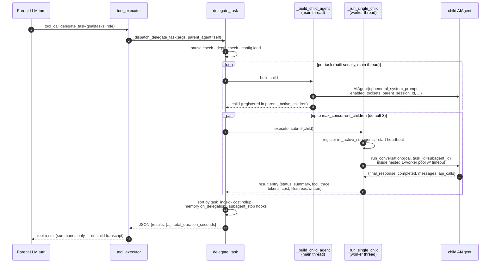
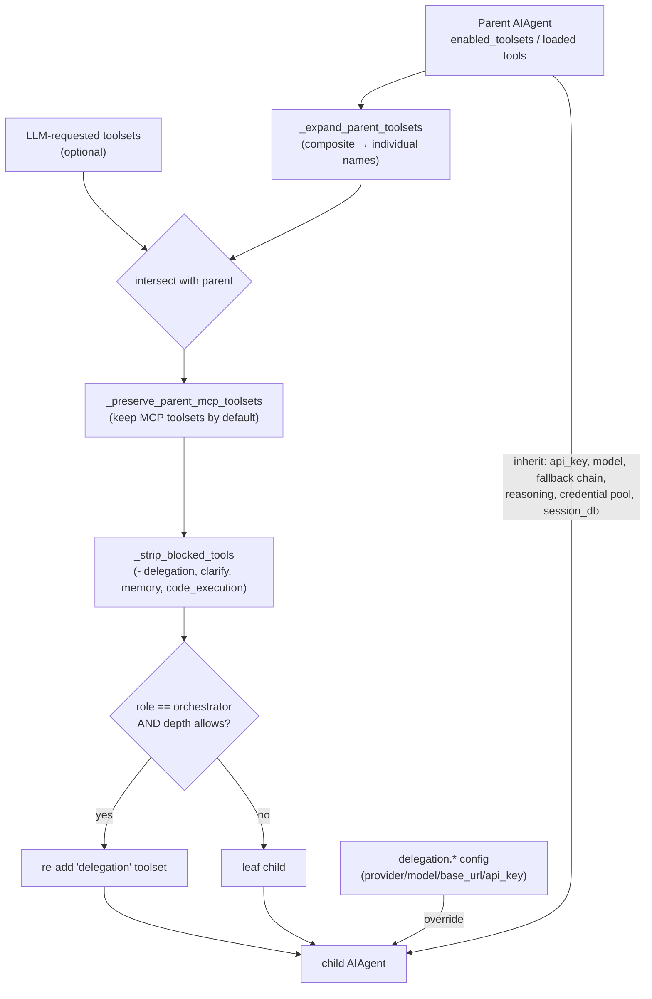

# hermes-agent — Subagents architecture

> Part of [hermes-agent](./ARCHITECTURE.md) @ d62979a

## Module purpose

hermes-agent's subagent system is a single tool — `delegate_task` — implemented almost entirely in [`tools/delegate_tool.py`](https://github.com/nousresearch/hermes-agent/blob/d62979a6f34f64f2ed840f159aac66e24d7cad78/tools/delegate_tool.py) (~2,930 lines). It spawns child `AIAgent` instances **in-process, on worker threads**, each with a fresh conversation, its own terminal/file-ops `task_id`, a restricted toolset, and a focused system prompt built from the delegated goal. The parent blocks until all children finish and only ever sees the delegation call plus each child's summary — never the child's intermediate tool calls or reasoning. The module-level docstring states the contract directly ([L2-17](https://github.com/nousresearch/hermes-agent/blob/d62979a6f34f64f2ed840f159aac66e24d7cad78/tools/delegate_tool.py#L2-L17)).

For the comparative study, the headline design choices are: **threads, not subprocesses** (children are Python objects sharing the process; cf. opencode/pi which tend to spawn sessions); **flat by default** with an opt-in `orchestrator` role for nested trees; **deny-by-default permissions** inside children; and a **rich result envelope** (summary + tool trace + tokens + cost + files touched) that rolls up into the parent's session accounting.

## Role in the system

Upstream: the agent loop's tool dispatcher recognises `delegate_task` and routes it through `AIAgent._dispatch_delegate_task`, injecting `parent_agent=self` ([agent/tool_executor.py:L1087-L1124](https://github.com/nousresearch/hermes-agent/blob/d62979a6f34f64f2ed840f159aac66e24d7cad78/agent/tool_executor.py#L1087-L1124), [run_agent.py:L5066-L5084](https://github.com/nousresearch/hermes-agent/blob/d62979a6f34f64f2ed840f159aac66e24d7cad78/run_agent.py#L5066-L5084)). The tool itself is registered in the `delegation` toolset ([toolsets.py:L246-L250](https://github.com/nousresearch/hermes-agent/blob/d62979a6f34f64f2ed840f159aac66e24d7cad78/toolsets.py#L246-L250)) with a dynamically rebuilt schema ([delegate_tool.py:L2791-L2932](https://github.com/nousresearch/hermes-agent/blob/d62979a6f34f64f2ed840f159aac66e24d7cad78/tools/delegate_tool.py#L2791-L2932)).

Downstream: it constructs `AIAgent` children (the same class as the parent — there is no separate "subagent" class), writes child sessions into the shared SQLite `SessionDB` with `parent_session_id` set, relays progress events to the CLI spinner / gateway SSE, and exposes a control surface (`delegation.status`, `delegation.pause`, `subagent.interrupt`) consumed by the TUI's `/agents` overlay via JSON-RPC ([tui_gateway/server.py:L5010-L5052](https://github.com/nousresearch/hermes-agent/blob/d62979a6f34f64f2ed840f159aac66e24d7cad78/tui_gateway/server.py#L5010-L5052)).

## Key types & entry points

- `delegate_task(goal|tasks, context, toolsets, role, parent_agent)` ([delegate_tool.py:L1988](https://github.com/nousresearch/hermes-agent/blob/d62979a6f34f64f2ed840f159aac66e24d7cad78/tools/delegate_tool.py#L1988)) — the tool entry; single or batch mode, returns a JSON `{results: [...], total_duration_seconds}` envelope.
- `_build_child_agent(...)` ([L910](https://github.com/nousresearch/hermes-agent/blob/d62979a6f34f64f2ed840f159aac66e24d7cad78/tools/delegate_tool.py#L910)) — constructs the child `AIAgent` on the **main thread** (thread-safe construction); resolves role, toolsets, credentials, identity.
- `_run_single_child(...)` ([L1391](https://github.com/nousresearch/hermes-agent/blob/d62979a6f34f64f2ed840f159aac66e24d7cad78/tools/delegate_tool.py#L1391)) — runs one pre-built child in a worker thread with timeout, heartbeat, registry bookkeeping, and result shaping.
- `_build_child_system_prompt(goal, context, role, ...)` ([L603](https://github.com/nousresearch/hermes-agent/blob/d62979a6f34f64f2ed840f159aac66e24d7cad78/tools/delegate_tool.py#L603)) — the child's ephemeral system prompt; appends an orchestrator capability block when nesting is allowed.
- `_build_child_progress_callback(...)` ([L717](https://github.com/nousresearch/hermes-agent/blob/d62979a6f34f64f2ed840f159aac66e24d7cad78/tools/delegate_tool.py#L717)) — relays child tool events to the parent's display (CLI tree lines or gateway SSE), tagged with subagent identity.
- `DelegateEvent` ([L566-L583](https://github.com/nousresearch/hermes-agent/blob/d62979a6f34f64f2ed840f159aac66e24d7cad78/tools/delegate_tool.py#L566-L583)) — formal event enum (`delegate.task_thinking`, `delegate.tool_started`, …) with a legacy-string normalisation map.
- `DELEGATE_BLOCKED_TOOLS` ([L45-L53](https://github.com/nousresearch/hermes-agent/blob/d62979a6f34f64f2ed840f159aac66e24d7cad78/tools/delegate_tool.py#L45-L53)) — tools children can never have: `delegate_task` (unless orchestrator), `clarify`, `memory`, `send_message`, `execute_code`.
- Control surface: `set_spawn_paused` / `interrupt_subagent` / `list_active_subagents` ([L160-L223](https://github.com/nousresearch/hermes-agent/blob/d62979a6f34f64f2ed840f159aac66e24d7cad78/tools/delegate_tool.py#L160-L223)) over a module-level `_active_subagents` registry.
- `IterationBudget` ([agent/iteration_budget.py:L17-L30](https://github.com/nousresearch/hermes-agent/blob/d62979a6f34f64f2ed840f159aac66e24d7cad78/agent/iteration_budget.py#L17-L30)) — each child gets a fresh budget (default 50 via `delegation.max_iterations`), independent of the parent's 90.

## Spawn / return flow

`delegate_task` is synchronous from the parent's perspective: validate → build all children on the calling thread → run them (directly for one task, `ThreadPoolExecutor` for batch) → aggregate results into one JSON string that becomes the tool result message in the parent's conversation.



Key waypoints:

- **Guards first**: spawning fails fast if the operator paused delegation ([L2019-L2024](https://github.com/nousresearch/hermes-agent/blob/d62979a6f34f64f2ed840f159aac66e24d7cad78/tools/delegate_tool.py#L2019-L2024)) or the caller is already at `max_spawn_depth` ([L2032-L2044](https://github.com/nousresearch/hermes-agent/blob/d62979a6f34f64f2ed840f159aac66e24d7cad78/tools/delegate_tool.py#L2032-L2044)).
- **Build on main thread, run on workers**: all children are constructed serially before any runs, because `AIAgent()` mutates a process-global tool-name cache that must be saved/restored ([L2125-L2161](https://github.com/nousresearch/hermes-agent/blob/d62979a6f34f64f2ed840f159aac66e24d7cad78/tools/delegate_tool.py#L2125-L2161)).
- **Double thread nesting for timeout**: each `_run_single_child` worker submits `child.run_conversation` into a second single-worker `ThreadPoolExecutor` so it can enforce `delegation.child_timeout_seconds` (default 600 s) via `future.result(timeout=...)` ([L1562-L1584](https://github.com/nousresearch/hermes-agent/blob/d62979a6f34f64f2ed840f159aac66e24d7cad78/tools/delegate_tool.py#L1562-L1584)). On timeout the child is interrupted, and a 0-API-call timeout dumps a stack diagnostic ([`_dump_subagent_timeout_diagnostic`, L1247](https://github.com/nousresearch/hermes-agent/blob/d62979a6f34f64f2ed840f159aac66e24d7cad78/tools/delegate_tool.py#L1247)).
- **Interrupt-aware batch wait**: instead of `as_completed()`, the batch path polls `concurrent.futures.wait(timeout=0.5)` so a parent interrupt can abandon stuck children with fabricated `interrupted` entries ([L2196-L2262](https://github.com/nousresearch/hermes-agent/blob/d62979a6f34f64f2ed840f159aac66e24d7cad78/tools/delegate_tool.py#L2196-L2262)).

## Child construction: inheritance vs isolation

`_build_child_agent` is the single point where the child's capability envelope is decided. The rule is *attenuation only*: a child can be narrower than its parent, never wider.



What the child **inherits**: model + credentials (unless `delegation.provider`/`base_url` overrides route children to a cheaper model — `_resolve_delegation_credentials`, [L2476-L2500](https://github.com/nousresearch/hermes-agent/blob/d62979a6f34f64f2ed840f159aac66e24d7cad78/tools/delegate_tool.py#L2476-L2500)), the fallback-provider chain, reasoning effort (overridable via `delegation.reasoning_effort`), the parent's credential pool when same-provider (so rate-limit rotation stays synchronized, [`_resolve_child_credential_pool`, L2391-L2413](https://github.com/nousresearch/hermes-agent/blob/d62979a6f34f64f2ed840f159aac66e24d7cad78/tools/delegate_tool.py#L2391-L2413)), the session DB handle, and OpenRouter provider-routing filters.

What the child gets **fresh or stripped**: no conversation history (`ephemeral_system_prompt` only), `skip_context_files=True`, `skip_memory=True`, `clarify_callback=None` (no user interaction), `quiet_mode=True`, `platform="subagent"`, its own `IterationBudget`, and its own terminal session / file-ops cache keyed by `subagent_id`. The constructor call shows the isolation flags in one place:

`tools/delegate_tool.py` (L1148-L1182), trimmed — the child is a vanilla `AIAgent` with isolation flags:

```python
    child = AIAgent(
        base_url=effective_base_url,
        api_key=effective_api_key,
        model=effective_model,
        [...]
        max_iterations=max_iterations,
        fallback_model=parent_fallback,
        enabled_toolsets=child_toolsets,
        quiet_mode=True,
        ephemeral_system_prompt=child_prompt,
        log_prefix=f"[subagent-{task_index}]",
        platform="subagent",
        skip_context_files=True,
        skip_memory=True,
        clarify_callback=None,
        thinking_callback=child_thinking_cb,
        session_db=getattr(parent_agent, "_session_db", None),
        parent_session_id=getattr(parent_agent, "session_id", None),
        [...]
        tool_progress_callback=child_progress_cb,
        iteration_budget=None,  # fresh budget per subagent
    )
```

[Full file on GitHub](https://github.com/nousresearch/hermes-agent/blob/d62979a6f34f64f2ed840f159aac66e24d7cad78/tools/delegate_tool.py) · [L1148-L1182](https://github.com/nousresearch/hermes-agent/blob/d62979a6f34f64f2ed840f159aac66e24d7cad78/tools/delegate_tool.py#L1148-L1182)

Identity is stamped right after construction: `child._delegate_depth = child_depth`, `child._subagent_id = "sa-<idx>-<uuid8>"`, `child._parent_subagent_id`, `child._subagent_goal`, and `_delegate_from` in the session's `model_config` ([L1185-L1201](https://github.com/nousresearch/hermes-agent/blob/d62979a6f34f64f2ed840f159aac66e24d7cad78/tools/delegate_tool.py#L1185-L1201)). The child is also appended to `parent_agent._active_children` so `AIAgent.interrupt()` recurses into running children ([run_agent.py:L2336-L2342](https://github.com/nousresearch/hermes-agent/blob/d62979a6f34f64f2ed840f159aac66e24d7cad78/run_agent.py#L2336-L2342)).

## Named agents? No — roles and goals instead

Unlike opencode's named agent definitions (markdown agents with their own prompts/models), hermes-agent has **no named subagent registry**. The LLM parameterises each spawn ad hoc: `goal`, `context`, `toolsets`, and a `role` that is either `leaf` or `orchestrator` ([`_normalize_role`, L345-L359](https://github.com/nousresearch/hermes-agent/blob/d62979a6f34f64f2ed840f159aac66e24d7cad78/tools/delegate_tool.py#L345-L359)). The closest analogue to model-per-agent config is the global `delegation.provider`/`delegation.model` override (all children, not per-name). An escape hatch exists for foreign harnesses: `acp_command` spawns the child over an **ACP subprocess transport** (e.g. GitHub Copilot CLI via `copilot --acp --stdio`) instead of an in-process Hermes child ([schema, L2884-L2906](https://github.com/nousresearch/hermes-agent/blob/d62979a6f34f64f2ed840f159aac66e24d7cad78/tools/delegate_tool.py#L2884-L2906)).

### Nested orchestration

Depth is capped flat by default (`MAX_DEPTH = 1`: parent=0 spawns children=1; grandchildren rejected) ([L132-L139](https://github.com/nousresearch/hermes-agent/blob/d62979a6f34f64f2ed840f159aac66e24d7cad78/tools/delegate_tool.py#L132-L139)). Raising `delegation.max_spawn_depth` ≥ 2 plus passing `role="orchestrator"` unlocks trees: the role re-adds the `delegation` toolset that `_strip_blocked_tools` removed, and the child's system prompt gains an explicit spawning-capability block with a literal depth note so the model can't confabulate nesting it doesn't have ([L646-L676](https://github.com/nousresearch/hermes-agent/blob/d62979a6f34f64f2ed840f159aac66e24d7cad78/tools/delegate_tool.py#L646-L676) — the prompt is explicitly modeled on OpenClaw's `buildSubagentSystemPrompt`). Role degrade happens at exactly one point:

`tools/delegate_tool.py` (L950-L953) — single point where orchestrator degrades to leaf:

```python
    child_depth = getattr(parent_agent, "_delegate_depth", 0) + 1
    max_spawn = _get_max_spawn_depth()
    orchestrator_ok = _get_orchestrator_enabled() and child_depth < max_spawn
    effective_role = role if (role == "orchestrator" and orchestrator_ok) else "leaf"
```

[L950-L953](https://github.com/nousresearch/hermes-agent/blob/d62979a6f34f64f2ed840f159aac66e24d7cad78/tools/delegate_tool.py#L950-L953)

A global `delegation.orchestrator_enabled: false` kill switch forces every child to leaf without a code revert ([L466-L481](https://github.com/nousresearch/hermes-agent/blob/d62979a6f34f64f2ed840f159aac66e24d7cad78/tools/delegate_tool.py#L466-L481)). Concurrency is governed separately by `delegation.max_concurrent_children` (default 3, floor 1, no ceiling — with a cost warning above 10, [L362-L398](https://github.com/nousresearch/hermes-agent/blob/d62979a6f34f64f2ed840f159aac66e24d7cad78/tools/delegate_tool.py#L362-L398)).

## Permission flow inside children

This is the sharpest permission decision in the harness. Subagents run in `ThreadPoolExecutor` workers, but the CLI's interactive approval callback lives in a `threading.local()` in `tools/terminal_tool.py` — worker threads don't inherit it, and falling back to `input()` would deadlock against the parent's prompt_toolkit TUI which owns stdin. The fix: every subagent worker thread gets a **non-interactive approval callback installed via the executor's `initializer`** ([L1562-L1570](https://github.com/nousresearch/hermes-agent/blob/d62979a6f34f64f2ed840f159aac66e24d7cad78/tools/delegate_tool.py#L1562-L1570)).

`tools/delegate_tool.py` (L73-L97) — deny-by-default, opt-in YOLO:

```python
def _subagent_auto_deny(command: str, description: str, **kwargs) -> str:
    """Auto-deny dangerous commands in subagent threads (safe default).

    Returns 'deny' so the subagent sees a refusal it can recover from, and
    never calls input() (which would deadlock the parent TUI).
    """
    logger.warning(
        "Subagent auto-denied dangerous command: %s (%s). "
        "Set delegation.subagent_auto_approve: true to allow.",
        command, description,
    )
    return "deny"


def _subagent_auto_approve(command: str, description: str, **kwargs) -> str:
    """Auto-approve dangerous commands in subagent threads (opt-in YOLO).

    Only installed when delegation.subagent_auto_approve=true. Returns 'once'
    so the subagent proceeds without blocking the parent UI.
    """
    logger.warning(
        "Subagent auto-approved dangerous command: %s (%s)",
        command, description,
    )
    return "once"
```

[L73-L97](https://github.com/nousresearch/hermes-agent/blob/d62979a6f34f64f2ed840f159aac66e24d7cad78/tools/delegate_tool.py#L73-L97)

So a child **cannot escalate to the user**: dangerous commands are refused (recoverably — the child sees the denial and can route around it) unless the operator set `delegation.subagent_auto_approve: true`. Both paths emit audit warnings. Gateway sessions are unaffected because they resolve approvals via `tools/approval.py`'s per-session queue rather than thread-local callbacks ([comment block, L56-L72](https://github.com/nousresearch/hermes-agent/blob/d62979a6f34f64f2ed840f159aac66e24d7cad78/tools/delegate_tool.py#L56-L72)). Combined with the static blocklist (`clarify` stripped so children can't ask the user anything; `memory` stripped so they can't write shared `MEMORY.md`; `send_message` stripped so they can't cause cross-platform side effects), the child's authority is strictly: parent's tools ∩ requested toolsets − blocked, with no interactive escalation path.

## Results flowing back to the parent

Each child produces a structured entry assembled in `_run_single_child` after `run_conversation` returns ([L1688-L1786](https://github.com/nousresearch/hermes-agent/blob/d62979a6f34f64f2ed840f159aac66e24d7cad78/tools/delegate_tool.py#L1688-L1786)): `status` (`completed`/`failed`/`interrupted`/`timeout`/`error`), `summary` (the child's final response — the only narrative the parent's LLM sees), `exit_reason`, `api_calls`, `duration_seconds`, `tokens {input, output}`, and a `tool_trace` reconstructed from the child's in-memory message list by pairing `tool_call_id`s (tool name + arg/result byte sizes + ok/error status — telemetry, not content).

Three cross-cutting mechanisms ride on the return path:

1. **File-state staleness reminder** — if any non-parent task wrote files the parent had previously read during the delegation window, a `[NOTE: subagent modified files the parent previously read — re-read before editing: ...]` line is appended to the child's summary ([L1789-L1817](https://github.com/nousresearch/hermes-agent/blob/d62979a6f34f64f2ed840f159aac66e24d7cad78/tools/delegate_tool.py#L1789-L1817)), backed by the cross-agent read/write registry in [`tools/file_state.py`](https://github.com/nousresearch/hermes-agent/blob/d62979a6f34f64f2ed840f159aac66e24d7cad78/tools/file_state.py).
2. **Cost rollup** — each entry carries a private `_child_cost_usd` captured before `child.close()`; `delegate_task` folds the total into `parent_agent.session_estimated_cost_usd` so nested orchestrator→worker trees roll up additively layer by layer ([L2356-L2378](https://github.com/nousresearch/hermes-agent/blob/d62979a6f34f64f2ed840f159aac66e24d7cad78/tools/delegate_tool.py#L2356-L2378)).
3. **Memory + hooks** — the parent's memory provider is notified of every delegation outcome via `MemoryManager.on_delegation(task, result, child_session_id)` ([L2287-L2305](https://github.com/nousresearch/hermes-agent/blob/d62979a6f34f64f2ed840f159aac66e24d7cad78/tools/delegate_tool.py#L2287-L2305), handler at [agent/memory_manager.py:L761](https://github.com/nousresearch/hermes-agent/blob/d62979a6f34f64f2ed840f159aac66e24d7cad78/agent/memory_manager.py#L761)), and plugin hooks `subagent_start` / `subagent_stop` fire around each child's lifecycle, serialised on the parent thread ([L1229-L1242](https://github.com/nousresearch/hermes-agent/blob/d62979a6f34f64f2ed840f159aac66e24d7cad78/tools/delegate_tool.py#L1229-L1242), [L2308-L2354](https://github.com/nousresearch/hermes-agent/blob/d62979a6f34f64f2ed840f159aac66e24d7cad78/tools/delegate_tool.py#L2308-L2354); hook names registered in [hermes_cli/plugins.py:L146-L147](https://github.com/nousresearch/hermes-agent/blob/d62979a6f34f64f2ed840f159aac66e24d7cad78/hermes_cli/plugins.py#L146-L147)).

Cleanup is aggressive: the `finally` block stops the heartbeat, unregisters the child from `_active_subagents` and `parent._active_children`, releases any leased credential, restores the process-global tool-name cache, and calls `child.close()` so terminal sandboxes / browser daemons / httpx clients don't outlive the delegation ([L1855-L1962](https://github.com/nousresearch/hermes-agent/blob/d62979a6f34f64f2ed840f159aac66e24d7cad78/tools/delegate_tool.py#L1855-L1962)).

## Subagent sessions vs parent sessions

Children are **real sessions** in the shared SQLite DB, not anonymous scratch runs. `_build_child_agent` passes `session_db` and `parent_session_id=parent.session_id`, so the child's row links to the parent via the `sessions.parent_session_id` foreign key ([hermes_state.py:L521-L548](https://github.com/nousresearch/hermes-agent/blob/d62979a6f34f64f2ed840f159aac66e24d7cad78/hermes_state.py#L521-L548), created in [run_agent.py:L509-L525](https://github.com/nousresearch/hermes-agent/blob/d62979a6f34f64f2ed840f159aac66e24d7cad78/run_agent.py#L509-L525)). Additionally, `_delegate_from` is stamped into the session's `model_config` JSON as a **stable sidebar marker**: delegate sessions must stay out of session pickers even if deleting the parent nulls `parent_session_id` — mirroring `/branch`'s `_branched_from` pattern ([delegate_tool.py:L1196-L1201](https://github.com/nousresearch/hermes-agent/blob/d62979a6f34f64f2ed840f159aac66e24d7cad78/tools/delegate_tool.py#L1196-L1201); exclusion SQL and orphan-backfill migration at [hermes_state.py:L1213-L1235](https://github.com/nousresearch/hermes-agent/blob/d62979a6f34f64f2ed840f159aac66e24d7cad78/hermes_state.py#L1213-L1235)).

Because they're full sessions, child transcripts are persisted, searchable (`session_search`), and openable: the relayed `child_session_id` on every progress event lets the desktop/TUI open a **spectator window** on a running subagent. The TUI gateway mirrors relayed `subagent.*` events into that lazy watch session as a synthetic stream until/unless the window is upgraded to a real agent ([`_mirror_subagent_to_child`, tui_gateway/server.py:L2672-L2730](https://github.com/nousresearch/hermes-agent/blob/d62979a6f34f64f2ed840f159aac66e24d7cad78/tui_gateway/server.py#L2672-L2730)).

## Observability & runtime control

Child tool calls are not invisible to the *user* (only to the parent's LLM context). `_build_child_progress_callback` relays each child event upward with identity kwargs (`subagent_id`, `parent_id`, `depth`, `model`, `toolsets`, `child_session_id`, running `tool_count`) so UIs can reconstruct the live spawn tree ([L717-L912](https://github.com/nousresearch/hermes-agent/blob/d62979a6f34f64f2ed840f159aac66e24d7cad78/tools/delegate_tool.py#L717-L912)). Two display paths: CLI prints tree-view lines (`├─ 🔀 …`) above the delegation spinner; the gateway batches tool names (5 per flush) into `subagent.progress` SSE events. A heartbeat thread touches the parent's activity timestamp every 30 s with stale-detection (idle vs in-tool thresholds) so gateway inactivity timeouts neither fire spuriously nor get masked by a wedged child ([L1429-L1508](https://github.com/nousresearch/hermes-agent/blob/d62979a6f34f64f2ed840f159aac66e24d7cad78/tools/delegate_tool.py#L1429-L1508)).

Runtime controls, exposed as JSON-RPC for the TUI `/agents` overlay ([tui_gateway/server.py:L5016-L5052](https://github.com/nousresearch/hermes-agent/blob/d62979a6f34f64f2ed840f159aac66e24d7cad78/tui_gateway/server.py#L5016-L5052)):

| RPC | Backing function | Effect |
| --- | --- | --- |
| `delegation.status` | `list_active_subagents()` | Snapshot of running tree + pause flag + limits |
| `delegation.pause` | `set_spawn_paused(bool)` | Freeze **new** spawns; running children unaffected |
| `subagent.interrupt` | `interrupt_subagent(id)` | Cooperative stop at next iteration boundary; recurses into grandchildren via `AIAgent.interrupt()` |

## Adjacent (non-delegation) agent spawning

Two other mechanisms spawn auxiliary LLM work but are **not** subagents in the delegation sense: `agent/background_review.py` forks the agent after a turn into a daemon thread that replays a conversation snapshot in a forked `AIAgent` restricted to memory/skill tools (the self-improvement loop, [L1-L18](https://github.com/nousresearch/hermes-agent/blob/d62979a6f34f64f2ed840f159aac66e24d7cad78/agent/background_review.py#L1-L18)); and `agent/auxiliary_client.py` routes side tasks (compression, session search, vision) to a best-available secondary model without any agent loop ([L1-L8](https://github.com/nousresearch/hermes-agent/blob/d62979a6f34f64f2ed840f159aac66e24d7cad78/agent/auxiliary_client.py#L1-L8)). Neither registers in the subagent tree nor produces a child session visible to delegation controls.

## Source files

| File | Ranges | GitHub |
| --- | --- | --- |
| `tools/delegate_tool.py` | L2-17, L45-139, L160-223, L345-535, L566-715, L717-912, L915-1245, L1391-1962, L1988-2390, L2391-2500, L2791-2932 | [link](https://github.com/nousresearch/hermes-agent/blob/d62979a6f34f64f2ed840f159aac66e24d7cad78/tools/delegate_tool.py) |
| `agent/tool_executor.py` | L1087-1124 | [link](https://github.com/nousresearch/hermes-agent/blob/d62979a6f34f64f2ed840f159aac66e24d7cad78/agent/tool_executor.py) |
| `run_agent.py` | L509-525, L2336-2342, L5066-5084 | [link](https://github.com/nousresearch/hermes-agent/blob/d62979a6f34f64f2ed840f159aac66e24d7cad78/run_agent.py) |
| `toolsets.py` | L240-260 | [link](https://github.com/nousresearch/hermes-agent/blob/d62979a6f34f64f2ed840f159aac66e24d7cad78/toolsets.py) |
| `hermes_state.py` | L515-590, L1213-1235, L1283-1310 | [link](https://github.com/nousresearch/hermes-agent/blob/d62979a6f34f64f2ed840f159aac66e24d7cad78/hermes_state.py) |
| `tui_gateway/server.py` | L2582-2730, L5010-5052 | [link](https://github.com/nousresearch/hermes-agent/blob/d62979a6f34f64f2ed840f159aac66e24d7cad78/tui_gateway/server.py) |
| `agent/iteration_budget.py` | L1-30 | [link](https://github.com/nousresearch/hermes-agent/blob/d62979a6f34f64f2ed840f159aac66e24d7cad78/agent/iteration_budget.py) |
| `agent/background_review.py` | L1-18 | [link](https://github.com/nousresearch/hermes-agent/blob/d62979a6f34f64f2ed840f159aac66e24d7cad78/agent/background_review.py) |
| `agent/auxiliary_client.py` | L1-20 | [link](https://github.com/nousresearch/hermes-agent/blob/d62979a6f34f64f2ed840f159aac66e24d7cad78/agent/auxiliary_client.py) |
| `hermes_cli/plugins.py` | L146-147 | [link](https://github.com/nousresearch/hermes-agent/blob/d62979a6f34f64f2ed840f159aac66e24d7cad78/hermes_cli/plugins.py) |
