# opencode — High-Level Architecture

> Source: https://github.com/anomalyco/opencode @ `4ddfa7c` (branch `dev`)
> A visual tour of the codebase. Diagrams are written in Mermaid so they render inline on GitHub / most Markdown viewers.

> Scope: the architecture of opencode as a coding-agent harness — entry flow, client/server split, agent loop, agents/subagents, tool surface, permissions, memory/persistence, provider layer, and extension points — framed for the comparative study of opencode vs pi vs hermes-agent. Cloud infra (`infra/`, `packages/function`, `packages/console`), the marketing site (`packages/web`), and Slack/GitHub bots are noted only as satellites.

---

## 1. Bird's-eye view

opencode (by Anomaly, formerly SST) is "the open source AI coding agent": a Bun/TypeScript monorepo whose core is a **local HTTP server** wrapping an **Effect-based session engine**, with every user surface — terminal UI, desktop app, web app, IDE bridge, headless CLI — being just another client of that server. The single most important thing to internalise: **opencode is a client/server system, not a monolithic CLI**. The engine (`packages/opencode` + `packages/core`) exposes an OpenAPI-described HTTP API plus an SSE event stream; the TUI runs the server in a worker thread of the same process, while every other client connects over HTTP. The second most important thing: the engine is built on **Effect** — every subsystem is a `Layer` exposing a `Context.Service`, and "an agent" is pure configuration data interpreted by one shared loop (see [agents-architecture](./agents-architecture.md)).

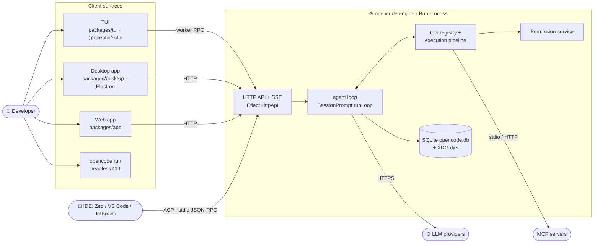

The four deep-dive topics for this research — the loop, subagent spawning, memory, and permissioning — each map onto one box above and each has its own module doc (next section).

---

## 2. Module Index

- [agents-architecture](./agents-architecture.md) — `Agent.Info` config model, the shared Effect prompt loop, provider seam, tool pipeline, message schema.
- [subagents-architecture](./subagents-architecture.md) — `task` tool spawns child sessions; permission derivation, background jobs, result routing.
- [memory-system](./memory-system.md) — SQLite event-sourced store, compaction/pruning, `AGENTS.md` project memory, disk caches; no vector store.
- [agent-permission-flow](./agent-permission-flow.md) — rule model, `ctx.ask` → `Deferred` handshake, UI reply path, coexisting V1/V2 engines.

Other notable areas covered below but without dedicated docs: entry/CLI dispatch, client/server event plumbing, provider/model layer, plugins/skills/commands, ACP/MCP/SDK bridges, and the v1→v2 engine rewrite.

---

## 3. Monorepo layout

A Bun workspace monorepo (`bun@1.3.14`, turborepo) of ~25 packages. Three matter most for this research: `packages/opencode` (the live v1 engine and CLI), `packages/core` (shared schemas + the in-progress v2 event-sourced engine), and `packages/tui` (the SolidJS terminal renderer). Everything else is a client, a bridge, or cloud infrastructure.

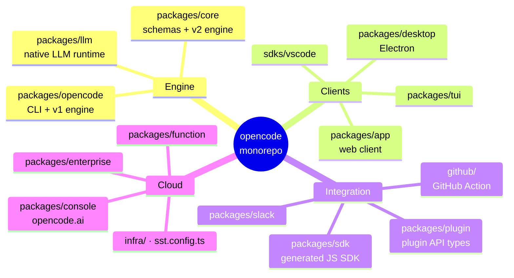

- Top runtime deps (from [`package.json`](https://github.com/anomalyco/opencode/blob/4ddfa7c6fa4cd5f9daab04f2800bc42b07378a33/package.json)): `effect` 4.x (the spine of everything), Vercel `ai` SDK, `hono`/`hono-openapi`, `drizzle-orm` (SQLite), `@opentui/solid` + `solid-js` (TUI), `zod`, `yargs`.
- `specs/v2/` holds the team's own design docs for the v2 engine (`session.md`, `tools.md`, `instructions.md`, `provider-model.md`) — useful primary sources for the rewrite covered in §14.

---

## 4. Process startup & entry flow

The binary is yargs-based: [`packages/opencode/src/index.ts`](https://github.com/anomalyco/opencode/blob/4ddfa7c6fa4cd5f9daab04f2800bc42b07378a33/packages/opencode/src/index.ts) registers ~22 commands, sets env flags in middleware (`AGENT=1`, `OPENCODE=1`, `OPENCODE_PURE` to disable external plugins), and dispatches. The default command (`$0`) is the TUI — and its startup is the architectural tell: the **server is booted inside a Bun worker thread**, the main thread renders the TUI, and the two talk over an in-process RPC bridge that imitates `fetch` + an event subscription.

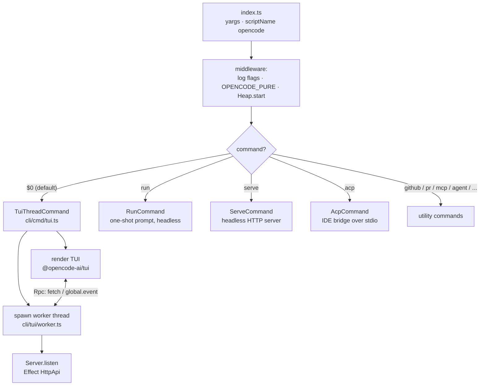

- Worker side: [`cli/tui/worker.ts`](https://github.com/anomalyco/opencode/blob/4ddfa7c6fa4cd5f9daab04f2800bc42b07378a33/packages/opencode/src/cli/tui/worker.ts) exposes `rpc.fetch` (routes a serialized `Request` into `Server.Default().app.fetch`, injecting auth headers) and forwards every `GlobalBus` event to the main thread as `global.event`.
- Main-thread side: [`cli/cmd/tui.ts`](https://github.com/anomalyco/opencode/blob/4ddfa7c6fa4cd5f9daab04f2800bc42b07378a33/packages/opencode/src/cli/cmd/tui.ts) wraps that RPC in `createWorkerFetch`/`createEventSource`, so the TUI consumes the exact same SDK interface a remote client would — the worker boundary is invisible to UI code.
- `opencode attach` connects a TUI to an already-running server; `opencode serve` runs the engine headless for remote/desktop/web clients.

---

## 5. Client/server split & the event bus

All state changes flow one way: clients issue HTTP requests; the engine mutates state and publishes events; clients re-render from the event stream. The HTTP surface is defined as Effect `HttpApi` groups under [`server/routes/instance/httpapi/groups/`](https://github.com/anomalyco/opencode/blob/4ddfa7c6fa4cd5f9daab04f2800bc42b07378a33/packages/opencode/src/server/routes/instance/httpapi/groups) — `session`, `permission`, `event`, `config`, `provider`, `mcp`, `pty`, `tui`, `project`, `question`, etc. — and an OpenAPI document is generated from it ([`server.ts` `openapi()`](https://github.com/anomalyco/opencode/blob/4ddfa7c6fa4cd5f9daab04f2800bc42b07378a33/packages/opencode/src/server/server.ts)), from which the JS SDK is generated in turn.

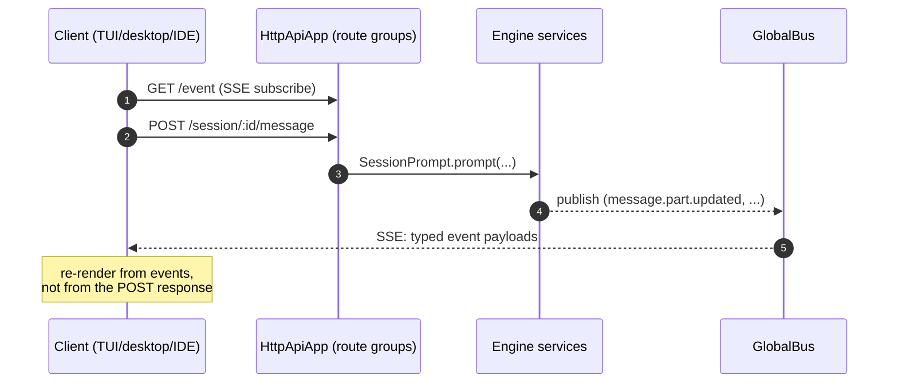

- The bus itself is tiny: [`bus/global.ts`](https://github.com/anomalyco/opencode/blob/4ddfa7c6fa4cd5f9daab04f2800bc42b07378a33/packages/opencode/src/bus/global.ts) is a Node `EventEmitter` carrying `{directory, project, workspace, payload}` envelopes, with ULID event ids stamped on emit.
- This event-first design is what makes the [agent-permission-flow](./agent-permission-flow.md) work: a `permission.asked` event reaches *whatever* UI is attached, and any of them can answer via `POST /permission/:requestID/reply`.
- The server also does mDNS advertisement (`server/mdns.ts`) and WebSocket tracking for PTY streams — the desktop/web clients ride the same API.

---

## 6. The agent loop

The heart of the harness, fully mapped in [agents-architecture](./agents-architecture.md). One loop implementation serves every agent: `SessionPrompt.prompt` persists the user message, then `runLoop` iterates LLM steps until the model stops calling tools, a step cap is hit, or compaction is required. Streaming is normalized to a provider-agnostic `LLMEvent` stream; a processor materializes events into persisted message `Part`s as they arrive, so UIs render token-by-token from the bus.

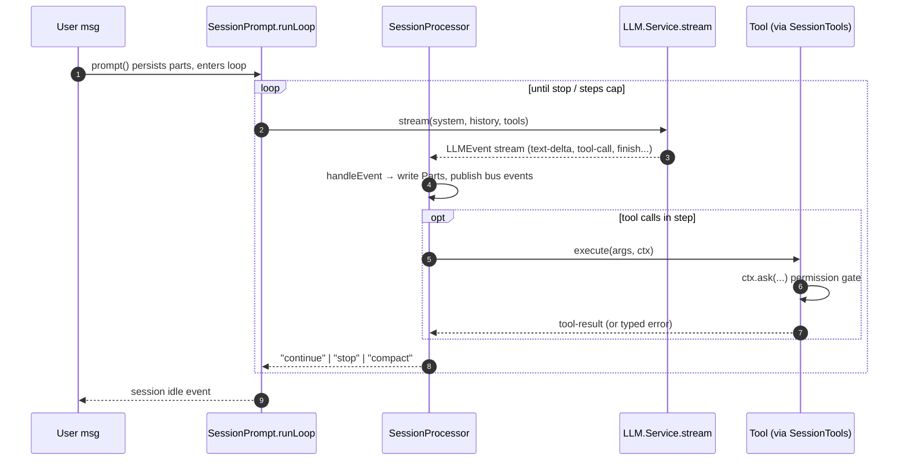

- Key entry points: `SessionPrompt.prompt` ([prompt.ts#L1105-L1124](https://github.com/anomalyco/opencode/blob/4ddfa7c6fa4cd5f9daab04f2800bc42b07378a33/packages/opencode/src/session/prompt.ts#L1105-L1124)), `runLoop` ([#L1134-L1402](https://github.com/anomalyco/opencode/blob/4ddfa7c6fa4cd5f9daab04f2800bc42b07378a33/packages/opencode/src/session/prompt.ts#L1134-L1402)), `SessionProcessor.Handle.process` ([processor.ts#L960-L1034](https://github.com/anomalyco/opencode/blob/4ddfa7c6fa4cd5f9daab04f2800bc42b07378a33/packages/opencode/src/session/processor.ts#L960-L1034)) and its giant `handleEvent` switch ([#L371](https://github.com/anomalyco/opencode/blob/4ddfa7c6fa4cd5f9daab04f2800bc42b07378a33/packages/opencode/src/session/processor.ts#L371)).
- Cross-cutting concerns folded into the loop: token-overflow detection → compaction handoff (see [memory-system](./memory-system.md)), retry/abort, usage accounting, doom-loop detection (a `doom_loop` permission fires when the model spins), and queued follow-up prompts.
- The loop's tool-call branch is where [subagents](./subagents-architecture.md) and [permissions](./agent-permission-flow.md) plug in — both are "just tools" from the loop's perspective.

---

## 7. Agents & subagents

An agent is data, not code: `Agent.Info` bundles a name, a `mode` (`primary` | `subagent` | `all`), a **permission ruleset**, and optional model/prompt/sampling overrides ([agent/agent.ts#L35-L56](https://github.com/anomalyco/opencode/blob/4ddfa7c6fa4cd5f9daab04f2800bc42b07378a33/packages/opencode/src/agent/agent.ts#L35-L56)). Native agents `build` and `plan` are user-switchable (Tab key); `general` and `explore` are subagents reachable only through the `task` tool, which creates a **child session** linked by `parentID` and runs the same loop inside it. Full details: [agents-architecture](./agents-architecture.md) for the catalog, [subagents-architecture](./subagents-architecture.md) for spawning.

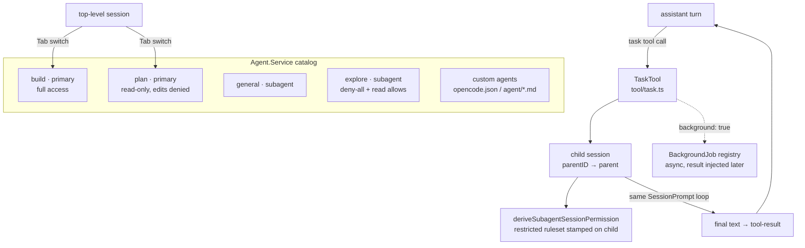

- Custom agents are markdown files (`agent/**/*.md`: frontmatter = config, body = system prompt) or `opencode.json` entries ([config/agent.ts#L11-L32](https://github.com/anomalyco/opencode/blob/4ddfa7c6fa4cd5f9daab04f2800bc42b07378a33/packages/opencode/src/config/agent.ts#L11-L32)) — the same mechanism Claude Code uses for subagent definitions, a key comparison point.
- Subagent isolation is **permission-based, not process-based**: the child runs in-process, in a new session whose frozen ruleset is derived from the parent's ([subagent-permissions.ts#L14-L27](https://github.com/anomalyco/opencode/blob/4ddfa7c6fa4cd5f9daab04f2800bc42b07378a33/packages/opencode/src/agent/subagent-permissions.ts#L14-L27)).
- Slash commands can also target a subagent, compiling to a `subtask` part dispatched by `handleSubtask` — spawning without any model involvement.

---

## 8. Tool surface

Tools come from three families, all flattened into one per-request list by `ToolRegistry.tools` ([registry.ts#L267-L307](https://github.com/anomalyco/opencode/blob/4ddfa7c6fa4cd5f9daab04f2800bc42b07378a33/packages/opencode/src/tool/registry.ts#L267-L307)) and adapted to AI SDK `tool()` objects by `SessionTools.resolve` — the seam where permission context (`ctx.ask`) is injected. The contract is `Tool.define` ([tool/tool.ts#L151-L169](https://github.com/anomalyco/opencode/blob/4ddfa7c6fa4cd5f9daab04f2800bc42b07378a33/packages/opencode/src/tool/tool.ts#L151-L169)); prompts live as sibling `.txt` files next to each tool's `.ts`.

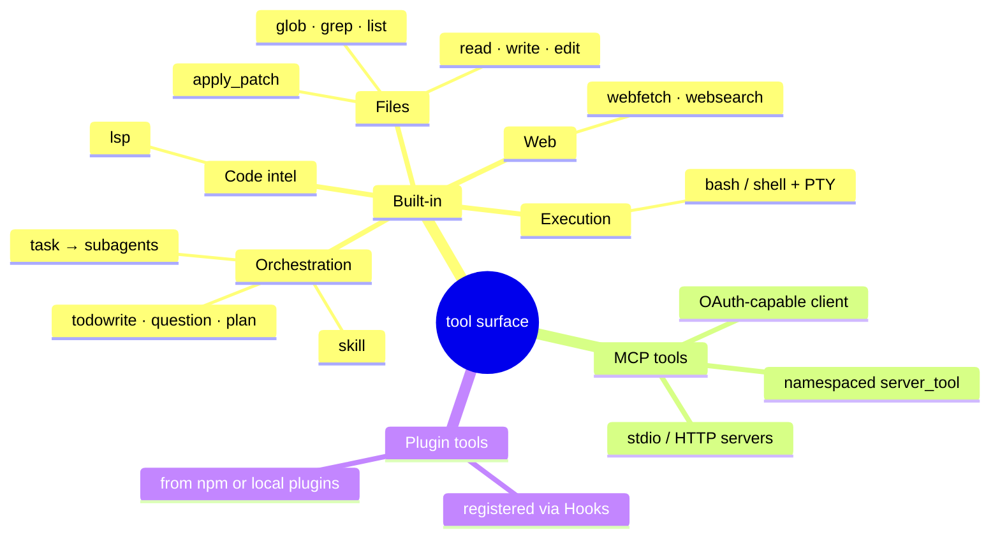

- The full built-in set lives flat in [`src/tool/`](https://github.com/anomalyco/opencode/blob/4ddfa7c6fa4cd5f9daab04f2800bc42b07378a33/packages/opencode/src/tool) — note `task.ts` (subagents), `skill.ts` (loads SKILL.md packs on demand), and `plan.ts` (mode switching).
- MCP integration ([`src/mcp/`](https://github.com/anomalyco/opencode/blob/4ddfa7c6fa4cd5f9daab04f2800bc42b07378a33/packages/opencode/src/mcp)) includes a catalog, OAuth provider/callback flow for remote servers, and wraps each remote tool so it passes through the same permission gate as built-ins.
- Tool availability is filtered per agent and per model (some models get `apply_patch` instead of `edit`, etc.) — the registry, not the loop, owns this policy. See [agents-architecture](./agents-architecture.md) §tool pipeline.

---

## 9. Permission system

Every irreversible action funnels through one API — `ctx.ask` on the tool context — evaluated against an **ordered, last-match-wins ruleset** of `{permission, pattern, action}` triples with `ask` as the implicit default. Merge order is precedence: built-in defaults → agent overrides → user config → session rules → in-session "always" approvals. The async approval handshake is the signature design: the tool's Effect fiber parks on a `Deferred` while a `permission.asked` event fans out to every attached UI. End-to-end trace: [agent-permission-flow](./agent-permission-flow.md).

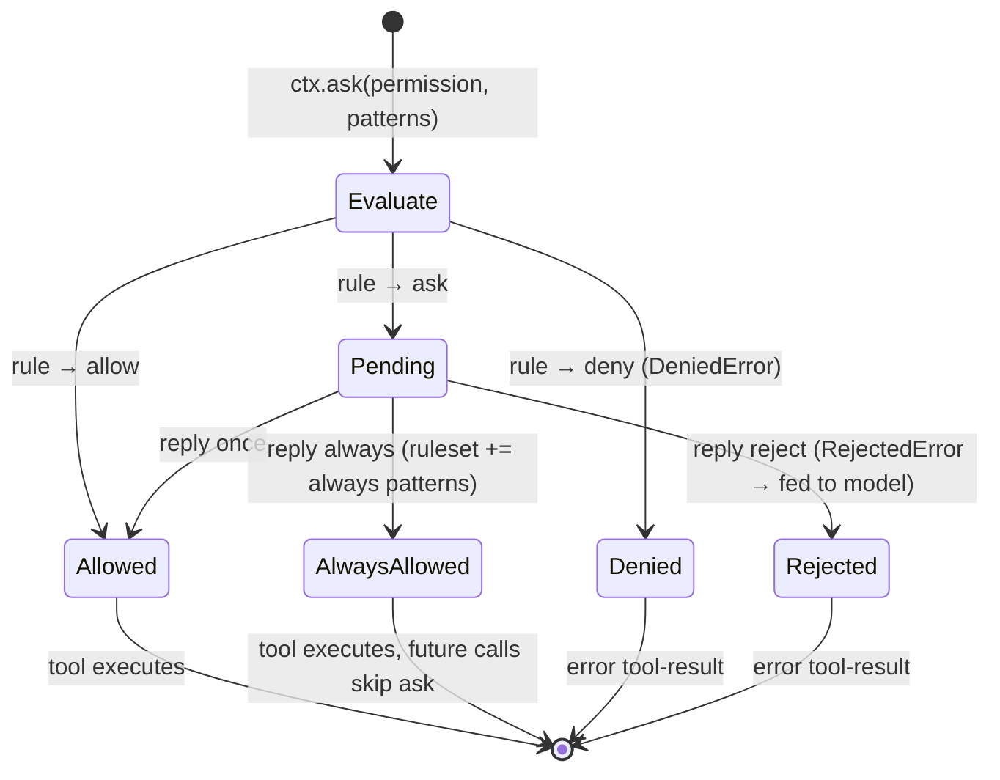

- Core evaluator: `Permission.evaluate` ([permission/index.ts#L39-L49](https://github.com/anomalyco/opencode/blob/4ddfa7c6fa4cd5f9daab04f2800bc42b07378a33/packages/opencode/src/permission/index.ts#L39-L49)); pending-request broker: `Permission.Service` ([#L51-L187](https://github.com/anomalyco/opencode/blob/4ddfa7c6fa4cd5f9daab04f2800bc42b07378a33/packages/opencode/src/permission/index.ts#L51-L187)).
- Bash commands get smart allowlisting: `BashArity.prefix` generalizes `git push origin main` to the pattern `git push *` before storing an "always" rule ([permission/arity.ts](https://github.com/anomalyco/opencode/blob/4ddfa7c6fa4cd5f9daab04f2800bc42b07378a33/packages/opencode/src/permission/arity.ts)).
- Agent personality *is* its ruleset — `plan` is "read-only" purely because its ruleset denies edits; `explore` is deny-all-plus-read-allows. There are two coexisting engines (V1 in-memory, V2 with SQLite-persisted approvals in `packages/core`); V1 carries production traffic at this commit.

---

## 10. Memory & persistence

opencode's memory is explicit and database-shaped — **no vector store, no embeddings, no model-written memory file**. Four layers: a SQLite database (`opencode.db`, WAL mode) holding sessions/messages/parts plus an append-only event log; a context-window manager that compacts overflowing history into an LLM-written anchored summary with a preserved recent tail; project memory from user-maintained `AGENTS.md`/`CLAUDE.md` files (global → project → per-directory, lazily attached as files are read); and disk caches (model catalog, skills, tool-output spill files, git snapshot stores for revert). Full topology: [memory-system](./memory-system.md).

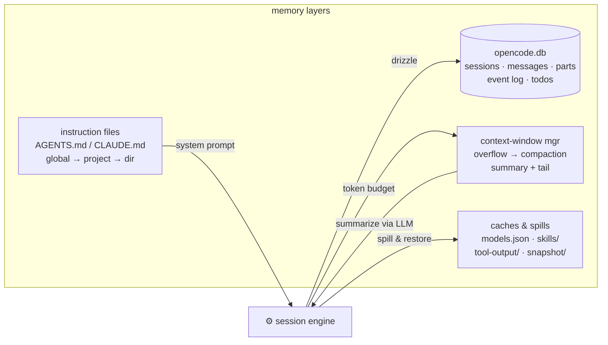

- Compaction contract: `SessionCompaction.Service` ([compaction.ts#L140-L162](https://github.com/anomalyco/opencode/blob/4ddfa7c6fa4cd5f9daab04f2800bc42b07378a33/packages/opencode/src/session/compaction.ts#L140-L162)) with a structured `SUMMARY_TEMPLATE` shared between v1 and v2 engines.
- Instruction discovery: `Instruction.Service` ([instruction.ts#L34-L46](https://github.com/anomalyco/opencode/blob/4ddfa7c6fa4cd5f9daab04f2800bc42b07378a33/packages/opencode/src/session/instruction.ts#L34-L46)); v2 versions instructions as "context epochs" with drift detection.
- Oversized tool outputs spill to disk with head/tail previews kept in context (`ToolOutputStore`) — a pragmatic context-budget trick worth comparing against pi/hermes-agent.

---

## 11. Provider & model layer

The engine is provider-agnostic at a single seam: `LLM.Service.stream` ([session/llm.ts#L54-L58](https://github.com/anomalyco/opencode/blob/4ddfa7c6fa4cd5f9daab04f2800bc42b07378a33/packages/opencode/src/session/llm.ts#L54-L58)) emits one normalized `LLMEvent` stream regardless of backend. Two interchangeable runtimes sit behind it: the **Vercel AI SDK** (`streamText` over `LanguageModelV3`) and an opt-in **native runtime**, [`packages/llm`](https://github.com/anomalyco/opencode/blob/4ddfa7c6fa4cd5f9daab04f2800bc42b07378a33/packages/llm/README.md) — a schema-first LLM core where "provider quirks live in adapters, not in calling code" (OpenAI Chat/Responses, Anthropic, Gemini, Bedrock, OpenAI-compatible).

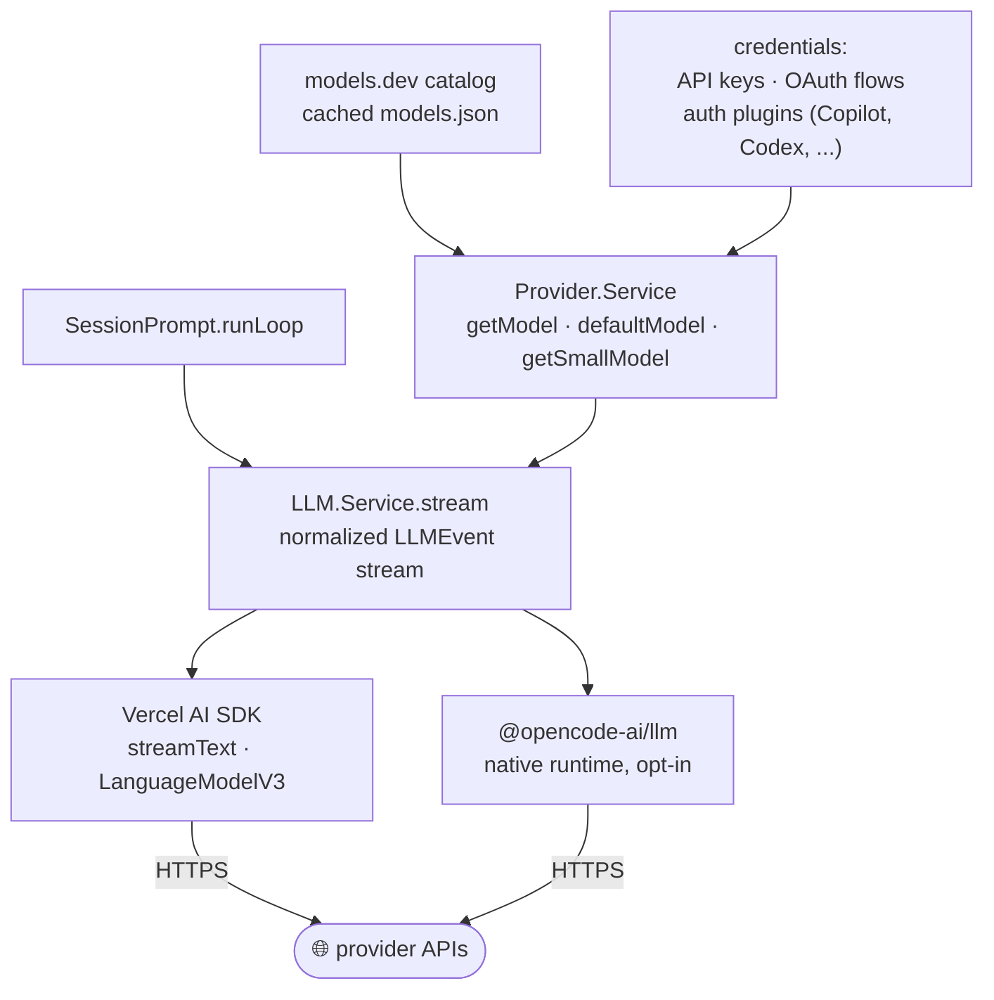

- `Provider.Service` ([provider/provider.ts#L1099-L1121](https://github.com/anomalyco/opencode/blob/4ddfa7c6fa4cd5f9daab04f2800bc42b07378a33/packages/opencode/src/provider/provider.ts#L1099-L1121)) resolves model metadata (context limits, costs) from the models.dev catalog; a "small model" is selected separately for utility calls like title generation.
- Provider auth is plugin-shaped even for first-party integrations: GitHub Copilot, OpenAI Codex, Azure, Cloudflare, xAI, GitLab, Poe auth all register as bundled plugins ([plugin/index.ts](https://github.com/anomalyco/opencode/blob/4ddfa7c6fa4cd5f9daab04f2800bc42b07378a33/packages/opencode/src/plugin/index.ts)).
- Per-agent model overrides (`Agent.Info.model`) mean a subagent can run on a cheaper/faster model than its parent — see [agents-architecture](./agents-architecture.md).

---

## 12. Extensibility: plugins, skills, commands

Three user-facing extension mechanisms, all file/config-driven and all funneling into engine services. Plugins are npm packages or local files exporting `Hooks` (lifecycle callbacks, custom tools, auth providers) loaded by `PluginLoader`; skills are `SKILL.md` packs discovered on disk and surfaced through the `skill` tool (progressive disclosure — the model loads instructions on demand); commands and agents are markdown files with frontmatter.

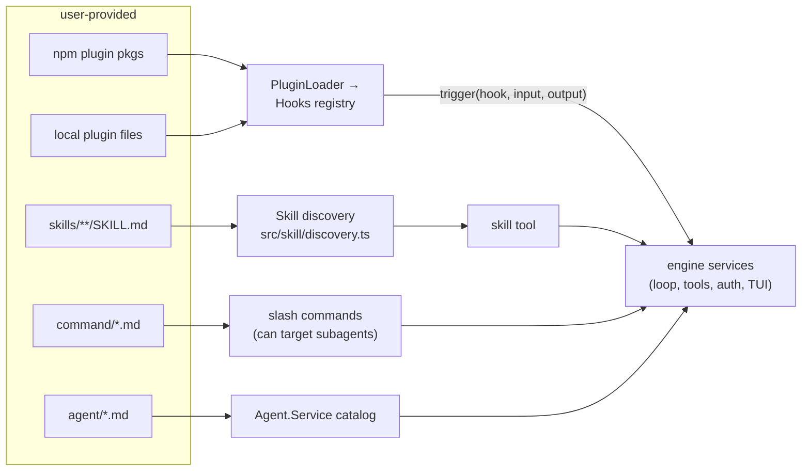

- The plugin API surface is typed in [`packages/plugin`](https://github.com/anomalyco/opencode/blob/4ddfa7c6fa4cd5f9daab04f2800bc42b07378a33/packages/plugin); hooks are triggered via a generic `(input, output) => Promise<void>` pattern from [`plugin/index.ts`](https://github.com/anomalyco/opencode/blob/4ddfa7c6fa4cd5f9daab04f2800bc42b07378a33/packages/opencode/src/plugin/index.ts).
- `--pure` / `OPENCODE_PURE=1` disables external plugins — a clean kill switch for debugging.
- Skills and custom agents are the comparison-relevant pair: both are markdown-defined capabilities, but skills extend *one turn's context* while agents define *a whole loop persona* with its own ruleset ([subagents-architecture](./subagents-architecture.md)).

---

## 13. External protocol bridges: ACP, MCP, SDK

opencode speaks three protocol families. As an **MCP client**, it consumes external tool servers (§8). As an **ACP server** (Agent Client Protocol, `@agentclientprotocol/sdk`), it exposes the whole agent to IDEs like Zed over stdio JSON-RPC — [`src/acp/agent.ts`](https://github.com/anomalyco/opencode/blob/4ddfa7c6fa4cd5f9daab04f2800bc42b07378a33/packages/opencode/src/acp/agent.ts) implements `newSession`/`prompt`/`setSessionMode`/permission passthrough by delegating to the same SDK client any UI uses. And its own HTTP API is OpenAPI-described, generating the typed JS SDK (`@opencode-ai/sdk`) that the TUI, desktop, ACP bridge, and third-party automations all share.

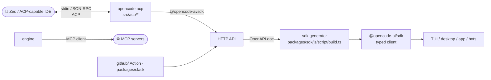

- The ACP layer translates opencode's session/permission events into ACP's protocol shapes (`acp/permission.ts`, `acp/tool.ts`, `acp/event.ts`) — permission prompts surface natively in the IDE.
- The `sdks/vscode` extension and the GitHub Action (`opencode github`) are thin shells over the same server — there is exactly one agent implementation in the codebase.

---

## 14. The v1 → v2 engine rewrite

At this commit the repo is mid-refactor, and reading it requires knowing which engine you're in. The live path is **v1**: `packages/opencode/src/session/*` with shared schemas in `packages/core/src/v1/`. The destination is **v2**: an Effect-native, **event-sourced** engine in `packages/core/src/session/` where every mutation is an appended event, projectors build SQL read-models, and a new `runner/` drives the loop. Design docs live in [`specs/v2/`](https://github.com/anomalyco/opencode/blob/4ddfa7c6fa4cd5f9daab04f2800bc42b07378a33/specs/v2).

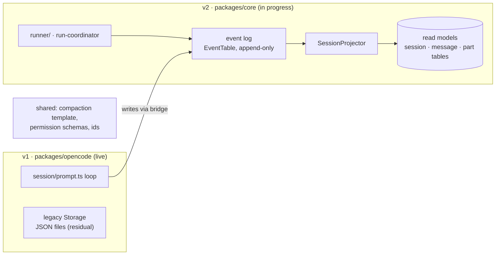

- Both engines share the SQLite database and the compaction summary contract — see [memory-system](./memory-system.md) for the full schema walk ([core/src/session/sql.ts](https://github.com/anomalyco/opencode/blob/4ddfa7c6fa4cd5f9daab04f2800bc42b07378a33/packages/core/src/session/sql.ts)).
- The permission V2 model (action/resource/effect with persisted approvals, [core/src/permission.ts](https://github.com/anomalyco/opencode/blob/4ddfa7c6fa4cd5f9daab04f2800bc42b07378a33/packages/core/src/permission.ts)) ships with the rewritten core tools — covered in [agent-permission-flow](./agent-permission-flow.md).
- For the comparative study: opencode is converging on event-sourcing as its durability story, which contrasts sharply with file-append or in-memory histories in lighter harnesses.

---

## 15. Communication / edge cheat-sheet

| Edge | Mechanism | Transport |
| --- | --- | --- |
| TUI ↔ engine | `Rpc.client` worker bridge (`createWorkerFetch`, `global.event`) | in-process worker thread messages |
| Desktop / web / bots ↔ engine | `@opencode-ai/sdk` → `HttpApiApp` route groups | HTTP + SSE (`GET /event`) |
| IDE ↔ engine | ACP `Agent` impl (`src/acp/agent.ts`) | stdio JSON-RPC |
| Engine → LLM providers | `LLM.Service.stream` via AI SDK `streamText` or native `@opencode-ai/llm` | HTTPS |
| Engine → MCP servers | MCP client (`src/mcp/`) with OAuth support | stdio / HTTP+SSE |
| Tool → permission gate | `ctx.ask` → `Permission.ask` → Effect `Deferred` | in-process |
| Permission UI round-trip | `permission.asked` bus event → `POST /permission/:requestID/reply` | SSE out, HTTP in |
| Parent agent → subagent | `TaskTool` → child session → same loop | in-process (optional background job) |
| State changes → all clients | `GlobalBus` → SSE event route | in-process → SSE |
| Engine → disk | drizzle-orm → `opencode.db`; spill/snapshot/caches under XDG dirs | filesystem |

---

## 16. Recommended reading order

To grok the codebase, walk it in this order (then go deep via the module docs):

1. `packages/opencode/src/index.ts` — CLI dispatch, the 22-command surface.
2. `packages/opencode/src/cli/cmd/tui.ts` + `cli/tui/worker.ts` — the server-in-a-worker trick; how clients see the engine.
3. `packages/opencode/src/server/routes/instance/httpapi/groups/session.ts` — the HTTP surface for prompting.
4. `packages/opencode/src/session/prompt.ts` — focus on `runLoop` (the core agent loop) → [agents-architecture](./agents-architecture.md).
5. `packages/opencode/src/session/processor.ts` — `handleEvent`, where streams become persisted parts.
6. `packages/opencode/src/tool/tool.ts` + `tool/registry.ts` + `session/tools.ts` — the tool contract and wrapping pipeline.
7. `packages/opencode/src/permission/index.ts` — `evaluate` and the `Deferred` broker → [agent-permission-flow](./agent-permission-flow.md).
8. `packages/opencode/src/agent/agent.ts` + `tool/task.ts` — agent catalog and subagent spawning → [subagents-architecture](./subagents-architecture.md).
9. `packages/opencode/src/session/compaction.ts` + `session/instruction.ts` — context-window management and project memory → [memory-system](./memory-system.md).
10. `packages/core/src/session/` + `specs/v2/` — the event-sourced v2 engine and the team's own design intent.
