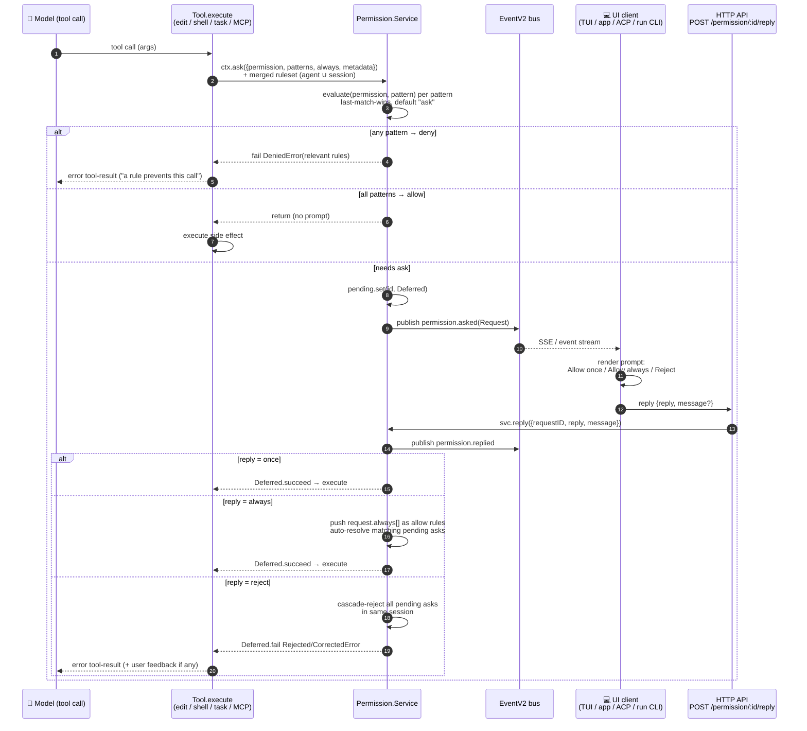
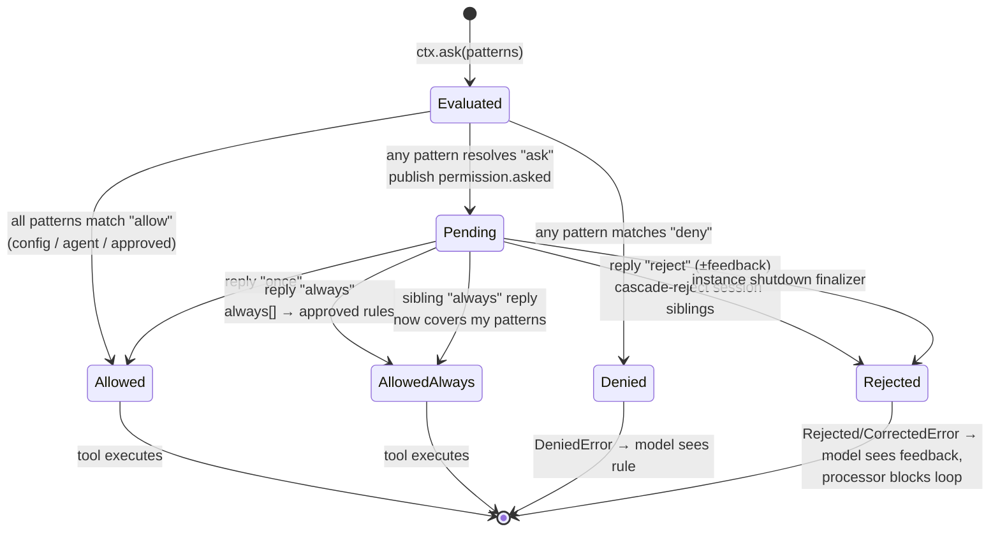

# opencode — Agent permission flow

> Part of [opencode](./ARCHITECTURE.md) @ 4ddfa7c

## Module purpose

This doc traces how opencode gates dangerous actions end-to-end: the rule model (`permission` / `pattern` / `action`), how user config and per-agent defaults compile into rulesets, the exact code path from an LLM tool call through `ctx.ask(...)` into the `Permission` service, the async approval handshake (event bus → UI prompt → HTTP reply → `Deferred` resolution), and what happens on rejection. opencode has **two coexisting permission systems**: the production **V1** system in `packages/opencode/src/permission/` (used by the live agent loop) and a newer **V2** system in `packages/core/src/permission.ts` (action/resource/effect model with SQLite-persisted "always" approvals) that the rewritten `packages/core` tools call. Both are covered; V1 carries the bulk of today's traffic.

## Role in the system

Upstream callers are the built-in tools (`edit`, `write`, `shell`, `task`, `read`, `webfetch`, …) and the MCP tool wrapper — each calls `ctx.ask(...)` on the per-call `Tool.Context` before doing anything irreversible. The `Permission.Service` evaluates the merged ruleset (agent defaults + user config + session overrides + in-session "always" approvals) and either returns immediately, fails with `DeniedError`, or parks the tool's fiber on an Effect `Deferred` while publishing a `permission.asked` event. Downstream consumers of that event are the UI surfaces — TUI prompt, `opencode run` CLI footer, desktop/web app, and the ACP bridge for IDEs — which reply via `POST /permission/:requestID/reply`. The reply resolves the `Deferred`; rejection becomes a typed error that the [session processor](./ARCHITECTURE.md) turns into an error tool-result for the model.

## Key types & entry points

- `PermissionV1.Rule` ([core/src/v1/permission.ts:18](https://github.com/anomalyco/opencode/blob/4ddfa7c6fa4cd5f9daab04f2800bc42b07378a33/packages/core/src/v1/permission.ts#L18-L23)) — `{ permission, pattern, action }` where `action ∈ {allow, deny, ask}`.
- `PermissionV1.Request` ([core/src/v1/permission.ts:28](https://github.com/anomalyco/opencode/blob/4ddfa7c6fa4cd5f9daab04f2800bc42b07378a33/packages/core/src/v1/permission.ts#L28-L40)) — a pending ask: `sessionID`, `permission`, `patterns[]`, `always[]` (patterns to whitelist if user picks "always"), `metadata`, and the originating `tool {messageID, callID}`.
- `PermissionV1.RejectedError` / `CorrectedError` / `DeniedError` ([core/src/v1/permission.ts:70](https://github.com/anomalyco/opencode/blob/4ddfa7c6fa4cd5f9daab04f2800bc42b07378a33/packages/core/src/v1/permission.ts#L70-L90)) — typed errors whose `message` getters are the exact prose fed back to the model.
- `Permission.evaluate` ([opencode/src/permission/index.ts:39](https://github.com/anomalyco/opencode/blob/4ddfa7c6fa4cd5f9daab04f2800bc42b07378a33/packages/opencode/src/permission/index.ts#L39-L49)) — last-match-wins wildcard rule resolution; default is `ask`.
- `Permission.Service` (`ask`/`reply`/`list`) ([opencode/src/permission/index.ts:51](https://github.com/anomalyco/opencode/blob/4ddfa7c6fa4cd5f9daab04f2800bc42b07378a33/packages/opencode/src/permission/index.ts#L51-L187)) — the in-memory pending-request broker.
- `Permission.fromConfig` ([opencode/src/permission/index.ts:197](https://github.com/anomalyco/opencode/blob/4ddfa7c6fa4cd5f9daab04f2800bc42b07378a33/packages/opencode/src/permission/index.ts#L197-L209)) — compiles JSON config (`"bash": {"git push": "ask"}`) into ordered `Rule[]`.
- `Tool.Context.ask` ([opencode/src/tool/tool.ts:45](https://github.com/anomalyco/opencode/blob/4ddfa7c6fa4cd5f9daab04f2800bc42b07378a33/packages/opencode/src/tool/tool.ts#L45)) — the only permission API a tool sees.
- `SessionTools.resolve` ([opencode/src/session/tools.ts:63](https://github.com/anomalyco/opencode/blob/4ddfa7c6fa4cd5f9daab04f2800bc42b07378a33/packages/opencode/src/session/tools.ts#L63-L72)) — wires `ctx.ask` to the service with the merged agent + session ruleset.
- `deriveSubagentSessionPermission` ([opencode/src/agent/subagent-permissions.ts:14](https://github.com/anomalyco/opencode/blob/4ddfa7c6fa4cd5f9daab04f2800bc42b07378a33/packages/opencode/src/agent/subagent-permissions.ts#L14-L27)) — what a spawned subagent inherits.
- `BashArity.prefix` ([opencode/src/permission/arity.ts:1](https://github.com/anomalyco/opencode/blob/4ddfa7c6fa4cd5f9daab04f2800bc42b07378a33/packages/opencode/src/permission/arity.ts#L1-L9)) — token-arity dictionary that turns `git push origin main` into the allowlist pattern `git push *`.
- V2: `PermissionV2.Service` (`assert`/`ask`/`reply`) ([core/src/permission.ts:118](https://github.com/anomalyco/opencode/blob/4ddfa7c6fa4cd5f9daab04f2800bc42b07378a33/packages/core/src/permission.ts#L118-L127)) and `PermissionSaved` SQLite store ([core/src/permission/saved.ts:1](https://github.com/anomalyco/opencode/blob/4ddfa7c6fa4cd5f9daab04f2800bc42b07378a33/packages/core/src/permission/saved.ts)).

## The rule model and evaluation

A ruleset is an **ordered list** of `{permission, pattern, action}` rules. Evaluation is wildcard-matched, **last match wins**, and the implicit default is `ask`:

```ts title="packages/opencode/src/permission/index.ts (L39-L49)"
export function evaluate(permission: string, pattern: string, ...rulesets: PermissionV1.Ruleset[]): PermissionV1.Rule {
  return (
    rulesets
      .flat()
      .findLast((rule) => Wildcard.match(permission, rule.permission) && Wildcard.match(pattern, rule.pattern)) ?? {
      action: "ask",
      permission,
      pattern: "*",
    }
  )
}
```

[L39-L49](https://github.com/anomalyco/opencode/blob/4ddfa7c6fa4cd5f9daab04f2800bc42b07378a33/packages/opencode/src/permission/index.ts#L39-L49)

`permission` names the capability (`edit`, `bash`, `task`, `external_directory`, `webfetch`, an MCP tool key, …); `pattern` is capability-specific (a relative file path for `edit`, a command string for `bash`, a subagent name for `task`). Because later rules win, merge order *is* the precedence order: `Permission.merge(defaults, agentOverrides, userConfig, sessionRules, inSessionApprovals)`. User JSON key order is preserved at parse time precisely so this holds ([core/src/v1/config/permission.ts:14-16](https://github.com/anomalyco/opencode/blob/4ddfa7c6fa4cd5f9daab04f2800bc42b07378a33/packages/core/src/v1/config/permission.ts#L14-L16)).

## Config → ruleset compilation

User config (`opencode.json` → `permission` key) supports a bare action (`"permission": "allow"`), per-capability actions (`"bash": "ask"`), or per-pattern objects (`"bash": {"*": "allow", "git push": "ask"}`). Known keys are typed in `ConfigPermissionV1.Info` ([core/src/v1/config/permission.ts:17-36](https://github.com/anomalyco/opencode/blob/4ddfa7c6fa4cd5f9daab04f2800bc42b07378a33/packages/core/src/v1/config/permission.ts#L17-L36)): `read, edit, glob, grep, list, bash, task, external_directory, todowrite, question, webfetch, websearch, lsp, doom_loop, skill` plus a rest-record for MCP tool names. `fromConfig` flattens this into rules, expanding `~/` and `$HOME` in patterns ([opencode/src/permission/index.ts:189-209](https://github.com/anomalyco/opencode/blob/4ddfa7c6fa4cd5f9daab04f2800bc42b07378a33/packages/opencode/src/permission/index.ts#L189-L209)).

Every agent then gets `Permission.merge(defaults, <agent-specific>, user)`. The baseline defaults ([opencode/src/agent/agent.ts:117-134](https://github.com/anomalyco/opencode/blob/4ddfa7c6fa4cd5f9daab04f2800bc42b07378a33/packages/opencode/src/agent/agent.ts#L117-L134)):

```ts title="packages/opencode/src/agent/agent.ts (L117-L134)"
const defaults = Permission.fromConfig({
  "*": "allow",
  doom_loop: "ask",
  external_directory: {
    "*": "ask",
    ...Object.fromEntries(whitelistedDirs.map((dir) => [dir, "allow"])),
  },
  question: "deny",
  plan_enter: "deny",
  plan_exit: "deny",
  // mirrors github.com/github/gitignore Node.gitignore pattern for .env files
  read: {
    "*": "allow",
    "*.env": "ask",
    "*.env.*": "ask",
    "*.env.example": "allow",
  },
})
```

Agent personalities are pure ruleset deltas — this is also how opencode implements **permission modes**:

| Agent | Delta over defaults | Effect |
| --- | --- | --- |
| `build` (default) | `question: allow, plan_enter: allow` ([agent.ts:139-153](https://github.com/anomalyco/opencode/blob/4ddfa7c6fa4cd5f9daab04f2800bc42b07378a33/packages/opencode/src/agent/agent.ts#L139-L153)) | everything allowed except `.env` reads, external dirs, doom-loop |
| `plan` | `edit: {"*": "deny", ".opencode/plans/*.md": "allow"}`, `task.general: deny` ([agent.ts:154-179](https://github.com/anomalyco/opencode/blob/4ddfa7c6fa4cd5f9daab04f2800bc42b07378a33/packages/opencode/src/agent/agent.ts#L154-L179)) | read-only mode, can only write plan files |
| `explore` | `"*": "deny"` then re-allow `grep/glob/list/bash/read/webfetch/websearch` ([agent.ts:194-216](https://github.com/anomalyco/opencode/blob/4ddfa7c6fa4cd5f9daab04f2800bc42b07378a33/packages/opencode/src/agent/agent.ts#L194-L216)) | read-only search subagent |
| `compaction`/`title`/`summary` | `"*": "deny"` ([agent.ts:217-262](https://github.com/anomalyco/opencode/blob/4ddfa7c6fa4cd5f9daab04f2800bc42b07378a33/packages/opencode/src/agent/agent.ts#L217-L262)) | no tools at all |

User-defined agents append `Permission.fromConfig(value.permission)` on top ([agent.ts:291](https://github.com/anomalyco/opencode/blob/4ddfa7c6fa4cd5f9daab04f2800bc42b07378a33/packages/opencode/src/agent/agent.ts#L291)). Tools whose permission resolves to a blanket `deny` are stripped from the model's tool list entirely via `Permission.disabled` ([opencode/src/permission/index.ts:215-224](https://github.com/anomalyco/opencode/blob/4ddfa7c6fa4cd5f9daab04f2800bc42b07378a33/packages/opencode/src/permission/index.ts#L215-L224), called from [session/llm/request.ts:198-204](https://github.com/anomalyco/opencode/blob/4ddfa7c6fa4cd5f9daab04f2800bc42b07378a33/packages/opencode/src/session/llm/request.ts#L198-L204)) — deny is enforced both at advertisement time and at call time.

## End-to-end flow: tool call → decision → execution



Step-by-step with the load-bearing code:

1. **Context wiring** — when `SessionTools.resolve` builds the AI-SDK tool table, each tool's `ctx.ask` closes over the session and merges the agent ruleset with session-level overrides ([session/tools.ts:63-71](https://github.com/anomalyco/opencode/blob/4ddfa7c6fa4cd5f9daab04f2800bc42b07378a33/packages/opencode/src/session/tools.ts#L63-L71)):

```ts title="packages/opencode/src/session/tools.ts (L63-L71)"
ask: (req) =>
  permission
    .ask({
      ...req,
      sessionID: input.session.id,
      tool: { messageID: input.processor.message.id, callID: options.toolCallId },
      ruleset: Permission.merge(input.agent.permission, input.session.permission ?? []),
    })
    .pipe(Effect.orDie),
```

2. **Evaluation + parking** — `Permission.ask` evaluates every requested pattern against `[ruleset, approved]` (where `approved` is the in-memory list of "always" grants for this instance). One `deny` short-circuits to `DeniedError`; all-`allow` returns silently; otherwise it creates a `Deferred`, registers the request in `pending`, publishes `permission.asked`, and **blocks the tool fiber** on `Deferred.await` ([permission/index.ts:78-118](https://github.com/anomalyco/opencode/blob/4ddfa7c6fa4cd5f9daab04f2800bc42b07378a33/packages/opencode/src/permission/index.ts#L78-L118)):

```ts title="packages/opencode/src/permission/index.ts (L83-L95, L109-L117)"
for (const pattern of request.patterns) {
  const rule = evaluate(request.permission, pattern, ruleset, approved)
  if (rule.action === "deny") {
    return yield* new PermissionV1.DeniedError({
      ruleset: ruleset.filter((rule) => Wildcard.match(request.permission, rule.permission)),
    })
  }
  if (rule.action === "allow") continue
  needsAsk = true
}
if (!needsAsk) return
[...]
const deferred = yield* Deferred.make<void, PermissionV1.RejectedError | PermissionV1.CorrectedError>()
pending.set(id, { info, deferred })
yield* events.publish(Event.Asked, info)
return yield* Effect.ensuring(
  Deferred.await(deferred),
  Effect.sync(() => { pending.delete(id) }),
)
```

3. **User decision** — any client replies through `POST /permission/:requestID/reply` with `{reply: "once" | "always" | "reject", message?}` ([httpapi/groups/permission.ts:31-43](https://github.com/anomalyco/opencode/blob/4ddfa7c6fa4cd5f9daab04f2800bc42b07378a33/packages/opencode/src/server/routes/instance/httpapi/groups/permission.ts#L31-L43) → [handlers/permission.ts:16-37](https://github.com/anomalyco/opencode/blob/4ddfa7c6fa4cd5f9daab04f2800bc42b07378a33/packages/opencode/src/server/routes/instance/httpapi/handlers/permission.ts#L16-L37)).

4. **Resolution semantics** — `Permission.reply` ([permission/index.ts:120-178](https://github.com/anomalyco/opencode/blob/4ddfa7c6fa4cd5f9daab04f2800bc42b07378a33/packages/opencode/src/permission/index.ts#L120-L178)) implements three behaviors:
   - `reject` fails the `Deferred` with `RejectedError`, or `CorrectedError({feedback})` if the user typed a message — and then **cascade-rejects every other pending request in the same session** (L140-L149), so a queued-up burst of tool calls dies together.
   - `once` succeeds the `Deferred` and stops.
   - `always` succeeds it, then appends the request's `always[]` patterns as `allow` rules to the instance-scoped `approved` list (L156-L162), and sweeps remaining pending requests in the session, auto-approving any whose patterns now all evaluate to `allow` (L164-L177). V1's "always" grants live **in memory per instance**; V2 persists them (below).

5. **Rejection → model feedback** — the typed error's `message` getter is the model-facing text (e.g. `RejectedError`: "The user rejected permission to use this specific tool call.", [core/src/v1/permission.ts:70-90](https://github.com/anomalyco/opencode/blob/4ddfa7c6fa4cd5f9daab04f2800bc42b07378a33/packages/core/src/v1/permission.ts#L70-L90)). The session processor marks the tool part as errored, and on `RejectedError` sets `ctx.blocked` so the agent loop stops driving further turns ([session/processor.ts:229-246](https://github.com/anomalyco/opencode/blob/4ddfa7c6fa4cd5f9daab04f2800bc42b07378a33/packages/opencode/src/session/processor.ts#L229-L246)):

```ts title="packages/opencode/src/session/processor.ts (L241-L243)"
if (error instanceof PermissionV1.RejectedError || error instanceof Question.RejectedError) {
  ctx.blocked = ctx.shouldBreak
}
```

If the session was teardown-finalized with asks still pending, every parked `Deferred` is failed with `RejectedError` ([permission/index.ts:65-72](https://github.com/anomalyco/opencode/blob/4ddfa7c6fa4cd5f9daab04f2800bc42b07378a33/packages/opencode/src/permission/index.ts#L65-L72)) — no fiber leaks.

## Request lifecycle (state view)



## Per-tool gating: what `patterns` and `always` mean

Each tool decides what string becomes the permission pattern and what gets whitelisted on "always" — this is where the security granularity lives.

### `shell` — AST scan + command-prefix arity

The bash tool parses the command with tree-sitter, walks every command node, and builds a `Scan {dirs, patterns, always}` ([tool/shell.ts:384-420](https://github.com/anomalyco/opencode/blob/4ddfa7c6fa4cd5f9daab04f2800bc42b07378a33/packages/opencode/src/tool/shell.ts#L384-L420)). `patterns` are full command sources (what is evaluated); `always` are arity-trimmed prefixes (what gets whitelisted):

```ts title="packages/opencode/src/tool/shell.ts (L412-L415)"
if (tokens.length && (!cmd || !CWD.has(cmd))) {
  scan.patterns.add(source(node))
  scan.always.add(BashArity.prefix(tokens).join(" ") + " *")
}
```

`BashArity.prefix` consults an LLM-generated dictionary of command arities ([permission/arity.ts:1-9](https://github.com/anomalyco/opencode/blob/4ddfa7c6fa4cd5f9daab04f2800bc42b07378a33/packages/opencode/src/permission/arity.ts#L1-L9)): `git checkout main` → `git checkout *`, `npm run dev` → `npm run dev *`, so "always allow" approves the human-meaningful command family, not the literal string and not all of bash. Path arguments are resolved; any path escaping the project worktree triggers a **separate** `external_directory` ask with directory globs ([tool/shell.ts:263-297](https://github.com/anomalyco/opencode/blob/4ddfa7c6fa4cd5f9daab04f2800bc42b07378a33/packages/opencode/src/tool/shell.ts#L263-L297)), and the asks happen strictly **before** the process is spawned ([tool/shell.ts:631-640](https://github.com/anomalyco/opencode/blob/4ddfa7c6fa4cd5f9daab04f2800bc42b07378a33/packages/opencode/src/tool/shell.ts#L631-L640)).

### `edit` / `write` / `apply_patch` — diff-in-metadata, ask-before-write

The edit tool computes the unified diff first, then asks with the worktree-relative path as the pattern and the diff in `metadata` (so the UI can render it), and `always: ["*"]` — "always" for edits means *all future edits*, not just this file ([tool/edit.ts:145-152](https://github.com/anomalyco/opencode/blob/4ddfa7c6fa4cd5f9daab04f2800bc42b07378a33/packages/opencode/src/tool/edit.ts#L145-L152)):

```ts title="packages/opencode/src/tool/edit.ts (L145-L152)"
yield* ctx.ask({
  permission: "edit",
  patterns: [path.relative(instance.worktree, filePath)],
  always: ["*"],
  metadata: { filepath: filePath, diff, ... },
})
```

The write happens only after `ask` returns. Same shape in `write.ts:54` and `apply_patch.ts:206`.

### `task` — gating subagent spawning

Spawning a subagent asks with the subagent type as the pattern ([tool/task.ts:104-114](https://github.com/anomalyco/opencode/blob/4ddfa7c6fa4cd5f9daab04f2800bc42b07378a33/packages/opencode/src/tool/task.ts#L104-L114)), so config like `"task": {"general": "deny"}` (plan mode does exactly this) blocks specific agent types. The same evaluation also filters which subagents are even advertised in the task tool description ([tool/registry.ts:253-256](https://github.com/anomalyco/opencode/blob/4ddfa7c6fa4cd5f9daab04f2800bc42b07378a33/packages/opencode/src/tool/registry.ts#L253-L256)).

### MCP tools — coarse-grained per-tool key

Every MCP tool invocation is wrapped with `ctx.ask({ permission: key, patterns: ["*"], always: ["*"] })` ([session/tools.ts:134](https://github.com/anomalyco/opencode/blob/4ddfa7c6fa4cd5f9daab04f2800bc42b07378a33/packages/opencode/src/session/tools.ts#L134)) — the MCP tool name is the permission key (configurable in the user's `permission` rest-record), with no argument-level granularity.

### Others

`read` asks only for `.env`-like files (via the default ruleset), `webfetch`/`websearch` ask per URL/query, `skill` per skill name, and `doom_loop` (repeated identical tool calls) defaults to `ask`.

## Subagent permission flow

Subagents do **not** inherit the parent agent's full restrictions; each agent's own ruleset governs it. What crosses the boundary is deliberate ([agent/subagent-permissions.ts:14-27](https://github.com/anomalyco/opencode/blob/4ddfa7c6fa4cd5f9daab04f2800bc42b07378a33/packages/opencode/src/agent/subagent-permissions.ts#L14-L27)):

```ts title="packages/opencode/src/agent/subagent-permissions.ts (L14-L27)"
export function deriveSubagentSessionPermission(input: {
  parentSessionPermission: PermissionV1.Ruleset
  subagent: Agent.Info
}): PermissionV1.Ruleset {
  const canTask = input.subagent.permission.some((rule) => rule.permission === "task")
  const canTodo = input.subagent.permission.some((rule) => rule.permission === "todowrite")
  return [
    ...input.parentSessionPermission.filter(
      (rule) => rule.permission === "external_directory" || rule.action === "deny",
    ),
    ...(canTodo ? [] : [{ permission: "todowrite", pattern: "*", action: "deny" }]),
    ...(canTask ? [] : [{ permission: "task", pattern: "*", action: "deny" }]),
  ]
}
```

Parent **deny rules and external-directory grants propagate** (a child can't do what the parent session forbade, and doesn't re-prompt for directories the user already opened); `task`/`todowrite` are denied by default to prevent recursive spawning. The child session's ruleset is attached at spawn time in `task.ts` ([L125-L128](https://github.com/anomalyco/opencode/blob/4ddfa7c6fa4cd5f9daab04f2800bc42b07378a33/packages/opencode/src/tool/task.ts#L125-L128)). Note: because asks bubble up as ordinary `permission.asked` events keyed by the child `sessionID`, subagent asks reach the same UI. Session-level rule injection also serves API callers: a prompt's `tools: {bash: false}` map becomes session `deny` rules ([session/prompt.ts:1113-1121](https://github.com/anomalyco/opencode/blob/4ddfa7c6fa4cd5f9daab04f2800bc42b07378a33/packages/opencode/src/session/prompt.ts#L1113-L1121)).

## Approval UI surfaces

All four frontends consume the same `permission.asked` event and the same reply endpoint:

| Surface | File | Behavior |
| --- | --- | --- |
| TUI | [tui/src/routes/session/permission.tsx:402-435](https://github.com/anomalyco/opencode/blob/4ddfa7c6fa4cd5f9daab04f2800bc42b07378a33/packages/tui/src/routes/session/permission.tsx#L402-L435) | Fullscreen prompt: *Allow once / Allow always / Reject*; "always" goes to a confirmation stage listing the `always[]` patterns; "reject" on a subagent session opens a feedback text input (→ `CorrectedError`); `Esc` = reject |
| `opencode run` CLI | [cli/cmd/run/permission.shared.ts:1-44](https://github.com/anomalyco/opencode/blob/4ddfa7c6fa4cd5f9daab04f2800bc42b07378a33/packages/opencode/src/cli/cmd/run/permission.shared.ts#L1-L44) | Same three-stage state machine (`permission → always → reject`) as a pure, testable transition function rendered in the footer |
| Desktop/web app | [app/src/context/permission.tsx](https://github.com/anomalyco/opencode/blob/4ddfa7c6fa4cd5f9daab04f2800bc42b07378a33/packages/app/src/context/permission.tsx) + auto-respond ([permission-auto-respond.ts](https://github.com/anomalyco/opencode/blob/4ddfa7c6fa4cd5f9daab04f2800bc42b07378a33/packages/app/src/context/permission-auto-respond.ts)) | Permission dock in the composer; optional auto-respond rules |
| ACP (IDE bridge) | [opencode/src/acp/permission.ts:13-70](https://github.com/anomalyco/opencode/blob/4ddfa7c6fa4cd5f9daab04f2800bc42b07378a33/packages/opencode/src/acp/permission.ts#L13-L70) | Maps the request to ACP `requestPermission` with `allow_once / allow_always / reject_once` options; per-session FIFO queue; **rejects by default** if the client doesn't implement `requestPermission` |

The TUI's reject-vs-feedback fork (only subagent sessions get the feedback stage) is at [permission.tsx:415-426](https://github.com/anomalyco/opencode/blob/4ddfa7c6fa4cd5f9daab04f2800bc42b07378a33/packages/tui/src/routes/session/permission.tsx#L415-L426).

A separate niche path: "workflow models" (server-side agentic models needing tool approval mid-stream) reuse the same service with permission key `workflow_tool_approval` and an in-session approved-tools cache ([session/llm.ts:149-205](https://github.com/anomalyco/opencode/blob/4ddfa7c6fa4cd5f9daab04f2800bc42b07378a33/packages/opencode/src/session/llm.ts#L149-L205)).

## The V2 system (`packages/core`) — where this is heading

The rewritten core (used by the new server/app stack) generalizes the model to `{action, resource, effect}` ([core/src/permission/schema.ts:8-16](https://github.com/anomalyco/opencode/blob/4ddfa7c6fa4cd5f9daab04f2800bc42b07378a33/packages/core/src/permission/schema.ts#L8-L16)) with the same last-match-wins `evaluate` ([core/src/permission.ts:102-112](https://github.com/anomalyco/opencode/blob/4ddfa7c6fa4cd5f9daab04f2800bc42b07378a33/packages/core/src/permission.ts#L102-L112)). Differences that matter:

- **Two APIs**: blocking `assert` (used by core tools, e.g. [core/src/tool/bash.ts:133-150](https://github.com/anomalyco/opencode/blob/4ddfa7c6fa4cd5f9daab04f2800bc42b07378a33/packages/core/src/tool/bash.ts#L133-L150) asserts `external_directory` then `{action: "bash", resources: [command], save: [command]}`) and non-blocking `ask` that just returns `{id, effect}` ([core/src/permission.ts:216-221](https://github.com/anomalyco/opencode/blob/4ddfa7c6fa4cd5f9daab04f2800bc42b07378a33/packages/core/src/permission.ts#L216-L221)).
- **Rules come from the agent record**: `configured()` resolves the session's agent and uses `agent.permissions`; an unresolvable agent gets `[{action: "*", resource: "*", effect: "deny"}]` — **deny-by-default** rather than V1's ask-by-default ([core/src/permission.ts:19](https://github.com/anomalyco/opencode/blob/4ddfa7c6fa4cd5f9daab04f2800bc42b07378a33/packages/core/src/permission.ts#L19), [L163-L171](https://github.com/anomalyco/opencode/blob/4ddfa7c6fa4cd5f9daab04f2800bc42b07378a33/packages/core/src/permission.ts#L163-L171)).
- **Configured denies are absolute**: the deny check runs against agent rules *before* saved approvals are merged, so a remembered "always" can never override a configured `deny` ([core/src/permission.ts:181-188](https://github.com/anomalyco/opencode/blob/4ddfa7c6fa4cd5f9daab04f2800bc42b07378a33/packages/core/src/permission.ts#L181-L188)).
- **"Always" persists**: `reply("always")` writes `{projectID, action, resource}` rows through `PermissionSaved` into SQLite ([core/src/permission.ts:275-281](https://github.com/anomalyco/opencode/blob/4ddfa7c6fa4cd5f9daab04f2800bc42b07378a33/packages/core/src/permission.ts#L275-L281); store: [core/src/permission/saved.ts:43-87](https://github.com/anomalyco/opencode/blob/4ddfa7c6fa4cd5f9daab04f2800bc42b07378a33/packages/core/src/permission/saved.ts#L43-L87)) — approvals survive restarts, scoped per project, unlike V1's in-memory `approved` list.
- Same cascade semantics (reject kills session siblings; always sweeps newly-allowed pending requests) with explicit `uninterruptible` masking around the deferred bookkeeping ([core/src/permission.ts:245-311](https://github.com/anomalyco/opencode/blob/4ddfa7c6fa4cd5f9daab04f2800bc42b07378a33/packages/core/src/permission.ts#L245-L311)).

## Comparative takeaways (for the research topic)

- Permission identity is a **(capability, pattern) pair evaluated against an ordered wildcard ruleset**, not a boolean per tool — granularity is delegated to each tool's choice of pattern (command prefix, file path, subagent name, URL).
- **Modes are just rulesets**: plan/build/explore are the same engine with different rule deltas; there is no separate "mode" enum in the gate itself.
- The ask path is **fully async and multi-client**: the tool fiber parks on a `Deferred`, the question travels over an event bus, and any attached client can answer over HTTP — which is what lets the TUI, web app, and IDEs share one permission queue.
- **"Always" scoping is the design tension**: V1 keeps it in-memory per instance with tool-chosen `always[]` patterns (arity-trimmed for bash, `*` for edits); V2 persists per-project rows and lets the tool pick the `save` resource — but never lets saved grants beat configured denies.
- **Rejection is conversational**: a reject can carry user feedback that becomes the tool-error text the model reads (`CorrectedError`), turning the permission gate into a steering channel, and a reject cascades to all queued asks in the session.

## Source files

| File | Ranges | GitHub |
| --- | --- | --- |
| `packages/opencode/src/permission/index.ts` | L11-L21, L39-L49, L53-L187, L189-L224 | [link](https://github.com/anomalyco/opencode/blob/4ddfa7c6fa4cd5f9daab04f2800bc42b07378a33/packages/opencode/src/permission/index.ts) |
| `packages/core/src/v1/permission.ts` | L9-L96 | [link](https://github.com/anomalyco/opencode/blob/4ddfa7c6fa4cd5f9daab04f2800bc42b07378a33/packages/core/src/v1/permission.ts) |
| `packages/core/src/v1/config/permission.ts` | L5-L50 | [link](https://github.com/anomalyco/opencode/blob/4ddfa7c6fa4cd5f9daab04f2800bc42b07378a33/packages/core/src/v1/config/permission.ts) |
| `packages/opencode/src/permission/arity.ts` | L1-L60 | [link](https://github.com/anomalyco/opencode/blob/4ddfa7c6fa4cd5f9daab04f2800bc42b07378a33/packages/opencode/src/permission/arity.ts) |
| `packages/opencode/src/tool/tool.ts` | L36-L46 | [link](https://github.com/anomalyco/opencode/blob/4ddfa7c6fa4cd5f9daab04f2800bc42b07378a33/packages/opencode/src/tool/tool.ts) |
| `packages/opencode/src/session/tools.ts` | L41-L72, L117-L145 | [link](https://github.com/anomalyco/opencode/blob/4ddfa7c6fa4cd5f9daab04f2800bc42b07378a33/packages/opencode/src/session/tools.ts) |
| `packages/opencode/src/agent/agent.ts` | L110-L263, L291 | [link](https://github.com/anomalyco/opencode/blob/4ddfa7c6fa4cd5f9daab04f2800bc42b07378a33/packages/opencode/src/agent/agent.ts) |
| `packages/opencode/src/agent/subagent-permissions.ts` | L14-L27 | [link](https://github.com/anomalyco/opencode/blob/4ddfa7c6fa4cd5f9daab04f2800bc42b07378a33/packages/opencode/src/agent/subagent-permissions.ts) |
| `packages/opencode/src/tool/shell.ts` | L263-L297, L384-L420, L631-L640 | [link](https://github.com/anomalyco/opencode/blob/4ddfa7c6fa4cd5f9daab04f2800bc42b07378a33/packages/opencode/src/tool/shell.ts) |
| `packages/opencode/src/tool/edit.ts` | L102-L152 | [link](https://github.com/anomalyco/opencode/blob/4ddfa7c6fa4cd5f9daab04f2800bc42b07378a33/packages/opencode/src/tool/edit.ts) |
| `packages/opencode/src/tool/task.ts` | L104-L130 | [link](https://github.com/anomalyco/opencode/blob/4ddfa7c6fa4cd5f9daab04f2800bc42b07378a33/packages/opencode/src/tool/task.ts) |
| `packages/opencode/src/tool/registry.ts` | L253-L256 | [link](https://github.com/anomalyco/opencode/blob/4ddfa7c6fa4cd5f9daab04f2800bc42b07378a33/packages/opencode/src/tool/registry.ts) |
| `packages/opencode/src/session/processor.ts` | L229-L246 | [link](https://github.com/anomalyco/opencode/blob/4ddfa7c6fa4cd5f9daab04f2800bc42b07378a33/packages/opencode/src/session/processor.ts) |
| `packages/opencode/src/session/prompt.ts` | L956-L975, L1113-L1121 | [link](https://github.com/anomalyco/opencode/blob/4ddfa7c6fa4cd5f9daab04f2800bc42b07378a33/packages/opencode/src/session/prompt.ts) |
| `packages/opencode/src/session/llm.ts` | L149-L205 | [link](https://github.com/anomalyco/opencode/blob/4ddfa7c6fa4cd5f9daab04f2800bc42b07378a33/packages/opencode/src/session/llm.ts) |
| `packages/opencode/src/session/llm/request.ts` | L198-L204 | [link](https://github.com/anomalyco/opencode/blob/4ddfa7c6fa4cd5f9daab04f2800bc42b07378a33/packages/opencode/src/session/llm/request.ts) |
| `packages/opencode/src/server/routes/instance/httpapi/groups/permission.ts` | L11-L60 | [link](https://github.com/anomalyco/opencode/blob/4ddfa7c6fa4cd5f9daab04f2800bc42b07378a33/packages/opencode/src/server/routes/instance/httpapi/groups/permission.ts) |
| `packages/opencode/src/server/routes/instance/httpapi/handlers/permission.ts` | L8-L41 | [link](https://github.com/anomalyco/opencode/blob/4ddfa7c6fa4cd5f9daab04f2800bc42b07378a33/packages/opencode/src/server/routes/instance/httpapi/handlers/permission.ts) |
| `packages/tui/src/routes/session/permission.tsx` | L402-L439 | [link](https://github.com/anomalyco/opencode/blob/4ddfa7c6fa4cd5f9daab04f2800bc42b07378a33/packages/tui/src/routes/session/permission.tsx) |
| `packages/opencode/src/cli/cmd/run/permission.shared.ts` | L1-L44 | [link](https://github.com/anomalyco/opencode/blob/4ddfa7c6fa4cd5f9daab04f2800bc42b07378a33/packages/opencode/src/cli/cmd/run/permission.shared.ts) |
| `packages/opencode/src/acp/permission.ts` | L13-L70 | [link](https://github.com/anomalyco/opencode/blob/4ddfa7c6fa4cd5f9daab04f2800bc42b07378a33/packages/opencode/src/acp/permission.ts) |
| `packages/core/src/permission.ts` | L19, L102-L127, L157-L243, L245-L311 | [link](https://github.com/anomalyco/opencode/blob/4ddfa7c6fa4cd5f9daab04f2800bc42b07378a33/packages/core/src/permission.ts) |
| `packages/core/src/permission/schema.ts` | L5-L16 | [link](https://github.com/anomalyco/opencode/blob/4ddfa7c6fa4cd5f9daab04f2800bc42b07378a33/packages/core/src/permission/schema.ts) |
| `packages/core/src/permission/saved.ts` | L11-L60 | [link](https://github.com/anomalyco/opencode/blob/4ddfa7c6fa4cd5f9daab04f2800bc42b07378a33/packages/core/src/permission/saved.ts) |
| `packages/core/src/tool/bash.ts` | L110-L160 | [link](https://github.com/anomalyco/opencode/blob/4ddfa7c6fa4cd5f9daab04f2800bc42b07378a33/packages/core/src/tool/bash.ts) |
| `packages/web/src/content/docs/permissions.mdx` | L1-L55 (user-facing config docs) | [link](https://github.com/anomalyco/opencode/blob/4ddfa7c6fa4cd5f9daab04f2800bc42b07378a33/packages/web/src/content/docs/permissions.mdx) |
