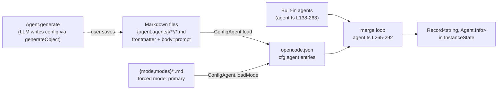
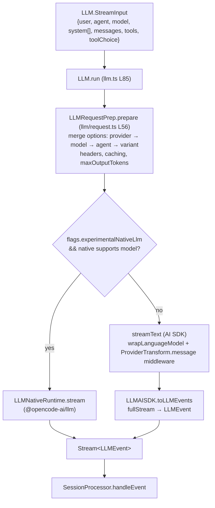
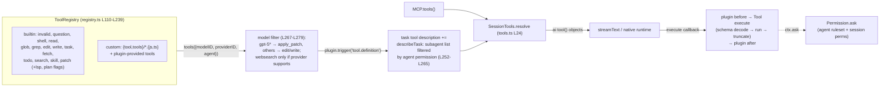
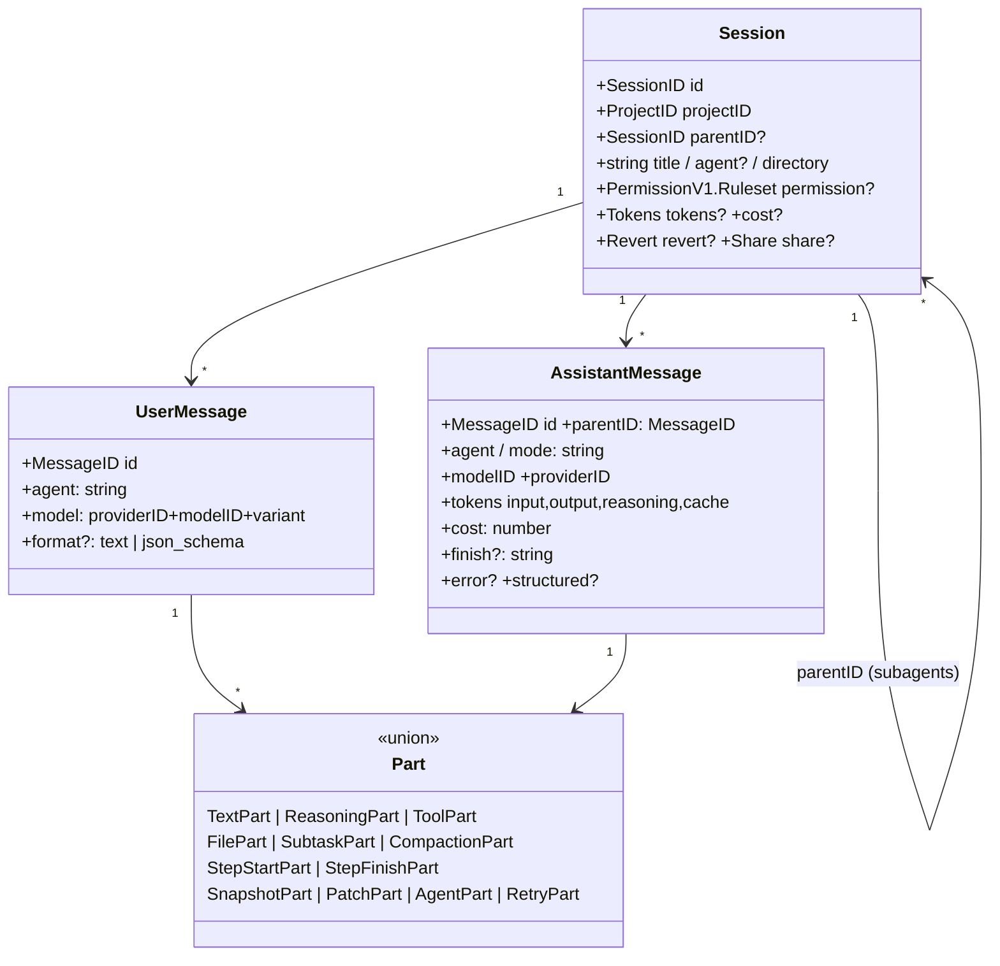

# opencode — Agents architecture

> Part of [opencode](./ARCHITECTURE.md) @ 4ddfa7c
> Source: https://github.com/anomalyco/opencode @ `4ddfa7c6fa4cd5f9daab04f2800bc42b07378a33` (branch `dev`)

## Topic purpose

This doc maps opencode's core agent abstraction for the comparative study of coding-agent harnesses (opencode vs pi vs hermes-agent): how an **agent** is defined and instantiated, how the **main agent loop** runs (user prompt → LLM call → streamed events → tool calls → termination), how the **provider/model layer** abstracts LLM backends, how the **tool registry and execution pipeline** work, and what the **session/message data model** looks like. Everything described here lives in `packages/opencode/src/` (the engine package) plus shared schemas in `packages/core/src/v1/`.

The single most important architectural fact: opencode is built on **Effect** (the TypeScript effect system). Every subsystem is an Effect `Layer` exposing a `Context.Service` (e.g. `@opencode/Agent`, `@opencode/SessionPrompt`, `@opencode/LLM`), wired together via dependency-injection (`LayerNode.make(layer, [deps...])`). The agent loop is therefore not a class with methods but a composition of Effect services, and "an agent" is **pure configuration data** (`Agent.Info`) interpreted by a shared loop — there is one loop implementation, parameterized by agent config.

## Role in the system

Upstream, clients (TUI, desktop app, CLI, SDK) talk to a local HTTP server. `POST /session/:sessionID/message` ([groups/session.ts#L95](https://github.com/anomalyco/opencode/blob/4ddfa7c6fa4cd5f9daab04f2800bc42b07378a33/packages/opencode/src/server/routes/instance/httpapi/groups/session.ts#L95), endpoint registered at [L316](https://github.com/anomalyco/opencode/blob/4ddfa7c6fa4cd5f9daab04f2800bc42b07378a33/packages/opencode/src/server/routes/instance/httpapi/groups/session.ts#L316)) is handled by `SessionHttpApi.prompt` ([handlers/session.ts#L293-L307](https://github.com/anomalyco/opencode/blob/4ddfa7c6fa4cd5f9daab04f2800bc42b07378a33/packages/opencode/src/server/routes/instance/httpapi/handlers/session.ts#L293-L307)), which calls `SessionPrompt.prompt`. Downstream, the loop reaches LLM providers through two interchangeable runtimes: the **Vercel AI SDK** (`streamText`) or an opt-in **native runtime** (`@opencode-ai/llm`), both normalized to a single `LLMEvent` stream.

Sibling topics covered in their own docs: the `task` tool / subagent spawning (`handleSubtask`, `subagent-permissions.ts`), compaction & memory (`session/compaction.ts`, `session/summary.ts`), and the permission flow (`permission/`, `Permission.ask`). They are mentioned here only where they intersect the loop.

## Key types & entry points

- `Agent.Info` ([agent/agent.ts#L35-L56](https://github.com/anomalyco/opencode/blob/4ddfa7c6fa4cd5f9daab04f2800bc42b07378a33/packages/opencode/src/agent/agent.ts#L35-L56)) — an agent definition: name, mode (`primary | subagent | all`), permission ruleset, optional model/prompt/temperature/steps.
- `Agent.Service` / `layer` ([agent/agent.ts#L84-L88](https://github.com/anomalyco/opencode/blob/4ddfa7c6fa4cd5f9daab04f2800bc42b07378a33/packages/opencode/src/agent/agent.ts#L84-L88)) — registry of agents; `get`, `list`, `defaultInfo`, `generate` (LLM-generates new agent configs).
- `SessionPrompt.prompt` ([session/prompt.ts#L1105-L1124](https://github.com/anomalyco/opencode/blob/4ddfa7c6fa4cd5f9daab04f2800bc42b07378a33/packages/opencode/src/session/prompt.ts#L1105-L1124)) — entry: persists the user message, then enters the loop.
- `SessionPrompt.runLoop` ([session/prompt.ts#L1134-L1402](https://github.com/anomalyco/opencode/blob/4ddfa7c6fa4cd5f9daab04f2800bc42b07378a33/packages/opencode/src/session/prompt.ts#L1134-L1402)) — **the main agent loop** (`while (true)` over steps).
- `SessionProcessor.Handle.process` ([session/processor.ts#L960-L1034](https://github.com/anomalyco/opencode/blob/4ddfa7c6fa4cd5f9daab04f2800bc42b07378a33/packages/opencode/src/session/processor.ts#L960-L1034)) — drives one LLM stream, returning `"continue" | "stop" | "compact"`.
- `handleEvent` ([session/processor.ts#L371-L845](https://github.com/anomalyco/opencode/blob/4ddfa7c6fa4cd5f9daab04f2800bc42b07378a33/packages/opencode/src/session/processor.ts#L371)) — giant switch over `LLMEvent` types (`text-delta`, `reasoning-*`, `tool-call`, `tool-result`, `step-finish`, `finish`, …) that materializes streamed events into persisted message `Part`s.
- `LLM.Service.stream` ([session/llm.ts#L54-L58](https://github.com/anomalyco/opencode/blob/4ddfa7c6fa4cd5f9daab04f2800bc42b07378a33/packages/opencode/src/session/llm.ts#L54-L58), impl [L357-L381](https://github.com/anomalyco/opencode/blob/4ddfa7c6fa4cd5f9daab04f2800bc42b07378a33/packages/opencode/src/session/llm.ts#L357-L381)) — provider-agnostic streaming seam.
- `Provider.Service` ([provider/provider.ts#L1099-L1121](https://github.com/anomalyco/opencode/blob/4ddfa7c6fa4cd5f9daab04f2800bc42b07378a33/packages/opencode/src/provider/provider.ts#L1099-L1121)) — `getModel`, `getLanguage` (→ AI SDK `LanguageModelV3`), `defaultModel`, `getSmallModel`.
- `Tool.Def` / `Tool.define` ([tool/tool.ts#L55-L65](https://github.com/anomalyco/opencode/blob/4ddfa7c6fa4cd5f9daab04f2800bc42b07378a33/packages/opencode/src/tool/tool.ts#L55-L65), [L151-L169](https://github.com/anomalyco/opencode/blob/4ddfa7c6fa4cd5f9daab04f2800bc42b07378a33/packages/opencode/src/tool/tool.ts#L151-L169)) — the tool contract and its wrapping pipeline.
- `ToolRegistry.tools` ([tool/registry.ts#L267-L307](https://github.com/anomalyco/opencode/blob/4ddfa7c6fa4cd5f9daab04f2800bc42b07378a33/packages/opencode/src/tool/registry.ts#L267-L307)) — per-request tool list, filtered by model/agent.
- `SessionTools.resolve` ([session/tools.ts#L24-L205](https://github.com/anomalyco/opencode/blob/4ddfa7c6fa4cd5f9daab04f2800bc42b07378a33/packages/opencode/src/session/tools.ts#L24-L205)) — converts `Tool.Def`s + MCP tools into AI SDK `tool()` objects with execution context.
- `SessionV1.User` / `SessionV1.Assistant` / `SessionV1.Part` ([core/src/v1/session.ts#L334](https://github.com/anomalyco/opencode/blob/4ddfa7c6fa4cd5f9daab04f2800bc42b07378a33/packages/core/src/v1/session.ts#L334), [#L455](https://github.com/anomalyco/opencode/blob/4ddfa7c6fa4cd5f9daab04f2800bc42b07378a33/packages/core/src/v1/session.ts#L455), [#L359](https://github.com/anomalyco/opencode/blob/4ddfa7c6fa4cd5f9daab04f2800bc42b07378a33/packages/core/src/v1/session.ts#L359)) — the message data model.

---

## 1. The agent abstraction — `Agent.Info`

An agent in opencode is a named bundle of: a mode (`primary` agents are user-selectable top-level modes; `subagent`s are only reachable via the `task` tool), a **permission ruleset**, and optional overrides for model, system prompt, sampling params, and a max step count. Crucially there is no per-agent code — the same loop interprets every agent.

```ts title="packages/opencode/src/agent/agent.ts (L35-L56)"
export const Info = Schema.Struct({
  name: Schema.String,
  description: Schema.optional(Schema.String),
  mode: Schema.Literals(["subagent", "primary", "all"]),
  native: Schema.optional(Schema.Boolean),
  hidden: Schema.optional(Schema.Boolean),
  topP: Schema.optional(Schema.Finite),
  temperature: Schema.optional(Schema.Finite),
  color: Schema.optional(Schema.String),
  permission: PermissionV1.Ruleset,
  model: Schema.optional(
    Schema.Struct({
      modelID: ModelV2.ID,
      providerID: ProviderV2.ID,
    }),
  ),
  variant: Schema.optional(Schema.String),
  prompt: Schema.optional(Schema.String),
  options: Schema.Record(Schema.String, Schema.Unknown),
  steps: Schema.optional(Schema.Finite),
}).annotate({ identifier: "Agent" })
```

[Full file](https://github.com/anomalyco/opencode/blob/4ddfa7c6fa4cd5f9daab04f2800bc42b07378a33/packages/opencode/src/agent/agent.ts) · [L35-L56](https://github.com/anomalyco/opencode/blob/4ddfa7c6fa4cd5f9daab04f2800bc42b07378a33/packages/opencode/src/agent/agent.ts#L35-L56)

### Built-in agents

Seven agents ship hard-coded in the `Agent` layer ([agent.ts#L138-L263](https://github.com/anomalyco/opencode/blob/4ddfa7c6fa4cd5f9daab04f2800bc42b07378a33/packages/opencode/src/agent/agent.ts#L138-L263)). They differ **only in permissions and prompt** — the differentiation mechanism is the permission ruleset, not subclassing:

| Agent | Mode | Hidden | Distinguishing config |
| --- | --- | --- | --- |
| `build` | primary | no | default agent; `question`/`plan_enter` allowed |
| `plan` | primary | no | `edit: {"*": "deny"}` except plan files; `task.general: deny` |
| `general` | subagent | no | full tools minus `todowrite` |
| `explore` | subagent | no | `"*": "deny"` then allow-list of read-only tools (`grep`, `glob`, `read`, `bash`, `webfetch`, …); custom prompt `PROMPT_EXPLORE` |
| `compaction` | primary | yes | `"*": "deny"`, prompt `PROMPT_COMPACTION` — used to summarize history |
| `title` | primary | yes | `"*": "deny"`, `temperature: 0.5`, prompt `PROMPT_TITLE` |
| `summary` | primary | yes | `"*": "deny"`, prompt `PROMPT_SUMMARY` |

Note the pattern: internal LLM utilities (titling, summarizing, compaction) are themselves modeled as hidden agents, so they flow through the same provider/permission machinery as user-facing modes.

### Where agent definitions come from



- Markdown agent files are parsed by `ConfigAgent.load` ([config/agent.ts#L11-L32](https://github.com/anomalyco/opencode/blob/4ddfa7c6fa4cd5f9daab04f2800bc42b07378a33/packages/opencode/src/config/agent.ts#L11-L32)): YAML frontmatter becomes config fields, the markdown body becomes `prompt`. This is the user-facing "custom agent" format (same shape as Claude Code's `.claude/agents/*.md`).
- Config entries merge field-by-field onto built-ins or create new agents with `mode: "all"` ([agent.ts#L265-L292](https://github.com/anomalyco/opencode/blob/4ddfa7c6fa4cd5f9daab04f2800bc42b07378a33/packages/opencode/src/agent/agent.ts#L265-L292)); permissions merge as `defaults → built-in specific → user config` via `Permission.merge`.
- `Agent.generate` ([agent.ts#L366-L434](https://github.com/anomalyco/opencode/blob/4ddfa7c6fa4cd5f9daab04f2800bc42b07378a33/packages/opencode/src/agent/agent.ts#L366-L434)) is a meta-feature: it calls `generateObject` with `PROMPT_GENERATE` to have an LLM draft `{identifier, whenToUse, systemPrompt}` for a new agent.
- Baseline permission defaults ([agent.ts#L117-L134](https://github.com/anomalyco/opencode/blob/4ddfa7c6fa4cd5f9daab04f2800bc42b07378a33/packages/opencode/src/agent/agent.ts#L117-L134)): everything `allow` except `doom_loop: ask`, `external_directory: ask` (with whitelisted temp/skill dirs), `.env` reads `ask` — the permission doc covers evaluation semantics.

---

## 2. The main agent loop — `SessionPrompt.runLoop`

The loop is **message-history-driven and stateless between iterations**: each iteration re-derives what to do next by inspecting the persisted message list (last user message, last assistant message, pending `subtask`/`compaction` parts). This makes the loop resumable — `loop()` is also invoked standalone (`POST /session/:id/loop`) to continue an interrupted session, and `state.ensureRunning` ([prompt.ts#L1404-L1408](https://github.com/anomalyco/opencode/blob/4ddfa7c6fa4cd5f9daab04f2800bc42b07378a33/packages/opencode/src/session/prompt.ts#L1404-L1408)) guarantees a single loop per session.

```mermaid
sequenceDiagram
    autonumber
    participant C as 👤 Client (TUI/CLI/SDK)
    participant SP as SessionPrompt
    participant RL as runLoop
    participant AG as Agent.Service
    participant ST as SessionTools.resolve
    participant PR as SessionProcessor.Handle
    participant LLM as LLM.stream
    participant API as 🌐 Provider (AI SDK / native)
    participant T as Tool.execute

    C->>SP: POST /session/:id/message (PromptInput)
    SP->>SP: createUserMessage + persist session permissions
    SP->>RL: loop({sessionID})
    loop while(true) — one step per LLM round-trip
        RL->>RL: filterCompacted(msgs); find lastUser / lastAssistant / tasks
        alt finish set, no pending tool calls
            RL-->>C: break → return last assistant msg
        else pending subtask part
            RL->>RL: handleSubtask (child session, see subagents doc)
        else pending compaction / token overflow
            RL->>RL: compaction.create / process (see memory doc)
        else normal step
            RL->>AG: get(lastUser.agent) → Agent.Info
            RL->>RL: create SessionV1.Assistant msg (step N)
            RL->>ST: resolve(agent, model, processor, ...) → tools
            RL->>RL: system = env + instructions + skills
            RL->>PR: handle.process({user, agent, system, messages, tools, model})
            PR->>LLM: llm.stream(StreamInput)
            LLM->>API: streamText(...) or native request
            API-->>LLM: provider stream
            LLM-->>PR: normalized LLMEvent stream
            loop per event
                PR->>PR: handleEvent: persist text/reasoning/tool parts
                opt tool-call (AI SDK executes inside streamText)
                    API->>T: execute(args, ctx) [permission.ask inside tool]
                    T-->>API: ExecuteResult → fed back as tool result
                end
            end
            PR-->>RL: "continue" | "stop" | "compact"
        end
    end
```

### Loop termination

The exit condition reads the persisted history, not in-memory flags — the model is done when its last message has a finish reason that isn't `tool-calls` and no unresolved tool parts remain:

```ts title="packages/opencode/src/session/prompt.ts (L1159-L1183, trimmed)"
const hasToolCalls =
  lastAssistantMsg?.parts.some(
    (part) => part.type === "tool" && !part.metadata?.providerExecuted && !isOrphanedInterruptedTool(part),
  ) ?? false

if (
  lastAssistant?.finish &&
  !["tool-calls"].includes(lastAssistant.finish) &&
  !hasToolCalls &&
  lastUser.id < lastAssistant.id
) {
  [...]
  yield* Effect.logInfo("exiting loop", { "session.id": sessionID })
  break
}
```

[L1141-L1183](https://github.com/anomalyco/opencode/blob/4ddfa7c6fa4cd5f9daab04f2800bc42b07378a33/packages/opencode/src/session/prompt.ts#L1141-L1183)

Other break paths inside a step ([L1274-L1396](https://github.com/anomalyco/opencode/blob/4ddfa7c6fa4cd5f9daab04f2800bc42b07378a33/packages/opencode/src/session/prompt.ts#L1274-L1396)): structured output produced (the `StructuredOutput` synthetic tool fired), `content-filter` finish (surfaced as `ContentFilterError`), processor returned `"stop"` (permission denied / error / abort), or `agent.steps` exceeded — at `isLastStep` a `MAX_STEPS` assistant message is appended telling the model to wrap up ([L1231-L1232](https://github.com/anomalyco/opencode/blob/4ddfa7c6fa4cd5f9daab04f2800bc42b07378a33/packages/opencode/src/session/prompt.ts#L1231-L1232), [L1343](https://github.com/anomalyco/opencode/blob/4ddfa7c6fa4cd5f9daab04f2800bc42b07378a33/packages/opencode/src/session/prompt.ts#L1343)).

### Per-step assembly

Each iteration builds the request from scratch ([L1327-L1347](https://github.com/anomalyco/opencode/blob/4ddfa7c6fa4cd5f9daab04f2800bc42b07378a33/packages/opencode/src/session/prompt.ts#L1327-L1347)):

```ts title="packages/opencode/src/session/prompt.ts (L1327-L1347, trimmed)"
const [skills, env, instructions, modelMsgs] = yield* Effect.all([
  sys.skills(agent),
  sys.environment(model),
  instruction.system().pipe(Effect.orDie),
  MessageV2.toModelMessagesEffect(msgs, model),
])
const system = [...env, ...instructions, ...(skills ? [skills] : [])]
[...]
const result = yield* handle.process({
  user: lastUser,
  agent,
  permission: session.permission,
  sessionID,
  parentSessionID: session.parentID,
  system,
  messages: [...modelMsgs, ...(isLastStep ? [{ role: "assistant" as const, content: MAX_STEPS }] : [])],
  tools,
  model,
  toolChoice: format.type === "json_schema" ? "required" : undefined,
})
```

The base system prompt is **model-family-specific**: `SessionSystem.provider` picks `anthropic.txt` / `gpt.txt` / `gemini.txt` / `codex.txt` / etc. by matching the model API id ([session/system.ts#L25-L38](https://github.com/anomalyco/opencode/blob/4ddfa7c6fa4cd5f9daab04f2800bc42b07378a33/packages/opencode/src/session/system.ts#L25-L38)). Mid-loop user interjections are wrapped in `<system-reminder>` tags ([prompt.ts#L1307-L1323](https://github.com/anomalyco/opencode/blob/4ddfa7c6fa4cd5f9daab04f2800bc42b07378a33/packages/opencode/src/session/prompt.ts#L1307-L1323)). Title and summary generation are forked as background fibers on step 1 ([L1186-L1192](https://github.com/anomalyco/opencode/blob/4ddfa7c6fa4cd5f9daab04f2800bc42b07378a33/packages/opencode/src/session/prompt.ts#L1186-L1192), [L1304-L1305](https://github.com/anomalyco/opencode/blob/4ddfa7c6fa4cd5f9daab04f2800bc42b07378a33/packages/opencode/src/session/prompt.ts#L1304-L1305)).

---

## 3. Stream processing — `SessionProcessor`

`SessionProcessor.create` returns a `Handle` per assistant message; `handle.process` drives exactly one LLM stream and folds every event into persisted message parts. The separation matters: `runLoop` owns *step orchestration*, the processor owns *event materialization* (and the tools get a back-channel to the processor via `updateToolCall`/`completeToolCall`).

```ts title="packages/opencode/src/session/processor.ts (L36-L54)"
export type Result = "compact" | "stop" | "continue"

export interface Handle {
  readonly message: SessionV1.Assistant
  readonly updateToolCall: (
    toolCallID: string,
    update: (part: SessionV1.ToolPart) => SessionV1.ToolPart,
  ) => Effect.Effect<SessionV1.ToolPart | undefined>
  readonly completeToolCall: (
    toolCallID: string,
    output: { title: string; metadata: Record<string, any>; output: string; attachments?: SessionV1.FilePart[] },
  ) => Effect.Effect<void>
  readonly process: (streamInput: LLM.StreamInput) => Effect.Effect<Result>
}
```

[L36-L54](https://github.com/anomalyco/opencode/blob/4ddfa7c6fa4cd5f9daab04f2800bc42b07378a33/packages/opencode/src/session/processor.ts#L36-L54)

The drive loop pipes the event stream through `handleEvent`, cuts it short when compaction is needed, retries transient provider failures with `SessionRetry.policy`, and finalizes on interrupt:

```ts title="packages/opencode/src/session/processor.ts (L974-L1032, trimmed)"
const stream = llm.stream(streamInput)
yield* stream.pipe(
  Stream.tap((event) => handleEvent(event)),
  Stream.takeUntil(() => ctx.needsCompaction),
  Stream.runDrain,
).pipe(
  Effect.onInterrupt(() => /* halt(AbortError) */ [...]),
  Effect.retry(SessionRetry.policy({ provider: input.model.providerID, parse, set: [...] })),
  Effect.catch(halt),
  Effect.ensuring(cleanup()),
)

if (ctx.needsCompaction) return "compact"
if (ctx.blocked || ctx.assistantMessage.error) return "stop"
return "continue"
```

[L960-L1034](https://github.com/anomalyco/opencode/blob/4ddfa7c6fa4cd5f9daab04f2800bc42b07378a33/packages/opencode/src/session/processor.ts#L960-L1034)

`handleEvent` ([L371-L845](https://github.com/anomalyco/opencode/blob/4ddfa7c6fa4cd5f9daab04f2800bc42b07378a33/packages/opencode/src/session/processor.ts#L371)) switches over event types — `reasoning-start/delta/end`, `tool-input-start/delta/end`, `tool-call`, `tool-result`, `tool-error`, `step-start`, `step-finish` (token/cost accounting), `text-start/delta/end`, `finish` — each case both mutating the in-memory `ProcessorContext` and persisting parts (plus dual-writing v2 events behind the `experimentalEventSystem` flag).

One notable loop-safety mechanism lives in the `tool-call` case — **doom-loop detection**: if the last `DOOM_LOOP_THRESHOLD` (3) parts are identical tool calls with identical input, the processor escalates to a `doom_loop` permission ask before continuing:

```ts title="packages/opencode/src/session/processor.ts (L522-L545, trimmed)"
const recentParts = parts.slice(-DOOM_LOOP_THRESHOLD)
if (
  recentParts.length !== DOOM_LOOP_THRESHOLD ||
  !recentParts.every(
    (part) => part.type === "tool" && part.tool === value.name &&
      JSON.stringify(part.state.input) === JSON.stringify(input),
  )
) { return }
const agent = yield* agents.get(ctx.assistantMessage.agent)
yield* permission.ask({
  permission: "doom_loop",
  patterns: [value.name],
  [...]
  ruleset: agent.permission,
})
```

[L519-L546](https://github.com/anomalyco/opencode/blob/4ddfa7c6fa4cd5f9daab04f2800bc42b07378a33/packages/opencode/src/session/processor.ts#L519-L546)

---

## 4. Provider / model layer

Two services split the concern. `Provider` resolves *which model* and constructs SDK instances; `LLM` resolves *how to stream against it*.

`Provider.Model` is a rich, serializable model descriptor (sourced from the models.dev catalog plus config):

```ts title="packages/opencode/src/provider/provider.ts (L1005-L1020)"
export const Model = Schema.Struct({
  id: ModelV2.ID,
  providerID: ProviderV2.ID,
  api: ProviderApiInfo,
  name: Schema.String,
  family: optionalOmitUndefined(Schema.String),
  capabilities: ProviderCapabilities,
  cost: ProviderCost,
  limit: ProviderLimit,
  status: ModelStatus,
  options: Schema.Record(Schema.String, Schema.Any),
  headers: Schema.Record(Schema.String, Schema.String),
  release_date: Schema.String,
  variants: optionalOmitUndefined(Schema.Record(Schema.String, Schema.Record(Schema.String, Schema.Any))),
}).annotate({ identifier: "Model" })
```

[L1005-L1020](https://github.com/anomalyco/opencode/blob/4ddfa7c6fa4cd5f9daab04f2800bc42b07378a33/packages/opencode/src/provider/provider.ts#L1005-L1020) · Interface: [L1099-L1110](https://github.com/anomalyco/opencode/blob/4ddfa7c6fa4cd5f9daab04f2800bc42b07378a33/packages/opencode/src/provider/provider.ts#L1099-L1110)

`provider.getLanguage(model)` returns an AI SDK `LanguageModelV3`, built from per-provider bundled SDKs and `getModel` loaders (dozens of provider-specific shims live in [provider.ts L205-L900](https://github.com/anomalyco/opencode/blob/4ddfa7c6fa4cd5f9daab04f2800bc42b07378a33/packages/opencode/src/provider/provider.ts#L205)). Hidden utility agents use `getSmallModel` for cheap calls; `defaultModel` picks the user's configured or first available model.

### `LLM.stream` — dual runtime behind one event vocabulary



```ts title="packages/opencode/src/session/llm.ts (L357-L381, trimmed)"
const stream: Interface["stream"] = (input) =>
  Stream.scoped(
    Stream.unwrap(
      Effect.gen(function* () {
        const ctrl = yield* Effect.acquireRelease(
          Effect.sync(() => new AbortController()),
          (ctrl) => Effect.sync(() => ctrl.abort()),
        )
        const result = yield* run({ ...input, abort: ctrl.signal })
        if (result.type === "native") return result.stream
        // Adapter seam: both runtimes expose the same LLMEvent stream.
        const state = LLMAISDK.adapterState()
        return Stream.fromAsyncIterable(result.result.fullStream, [...]).pipe(
          Stream.mapEffect((event) => LLMAISDK.toLLMEvents(state, event)),
          Stream.flatMap((events) => Stream.fromIterable(events)),
        )
      }),
    ),
  )
```

[L357-L381](https://github.com/anomalyco/opencode/blob/4ddfa7c6fa4cd5f9daab04f2800bc42b07378a33/packages/opencode/src/session/llm.ts#L357-L381)

Notable details in the AI SDK path ([L278-L353](https://github.com/anomalyco/opencode/blob/4ddfa7c6fa4cd5f9daab04f2800bc42b07378a33/packages/opencode/src/session/llm.ts#L278-L353)): `experimental_repairToolCall` remaps wrongly-cased tool names and routes unparseable calls to an `invalid` tool (the model gets a structured error back instead of a hard failure); a `wrapLanguageModel` middleware applies `ProviderTransform.message` for provider-specific prompt mutations (e.g. cache-control breakpoints); `maxRetries: 0` because retry is owned by `SessionRetry.policy` at the processor level. A third path wires GitLab "Duo Workflow" models, where tool execution happens server-side and is bridged back through `workflowModel.toolExecutor` + a permission `approvalHandler` ([L119-L206](https://github.com/anomalyco/opencode/blob/4ddfa7c6fa4cd5f9daab04f2800bc42b07378a33/packages/opencode/src/session/llm.ts#L119-L206)).

**Key consequence for the loop architecture**: in the default AI SDK runtime, *tool execution happens inside `streamText`* — the SDK invokes the `execute` callbacks that `SessionTools.resolve` built. The processor doesn't dispatch tools; it merely *observes* `tool-call`/`tool-result` events and persists their state transitions.

---

## 5. Tool registry & execution pipeline

The tool contract is `Tool.Def`: an id, description, an Effect `Schema` for parameters, and an Effect-returning `execute`. Tools receive a `Tool.Context` that carries the session/agent identity and two capabilities: `metadata()` (live-update the running tool part in the UI) and `ask()` (raise a permission request).

```ts title="packages/opencode/src/tool/tool.ts (L36-L65, trimmed)"
export type Context<M extends Metadata = Metadata> = {
  sessionID: SessionID
  messageID: MessageID
  agent: string
  abort: AbortSignal
  callID?: string
  extra?: { [key: string]: unknown }
  messages: SessionV1.WithParts[]
  metadata(input: { title?: string; metadata?: M }): Effect.Effect<void>
  ask(input: Omit<PermissionV1.Request, "id" | "sessionID" | "tool">): Effect.Effect<void>
}
[...]
export interface Def<Parameters extends Schema.Decoder<unknown> = ..., M extends Metadata = Metadata> {
  id: string
  description: string
  parameters: Parameters
  jsonSchema?: JSONSchema7
  execute(args: Schema.Schema.Type<Parameters>, ctx: Context): Effect.Effect<ExecuteResult<M>>
  formatValidationError?(error: unknown): string
}
```

[L36-L65](https://github.com/anomalyco/opencode/blob/4ddfa7c6fa4cd5f9daab04f2800bc42b07378a33/packages/opencode/src/tool/tool.ts#L36-L65)

`Tool.define` wraps every tool with a uniform pipeline ([tool.ts#L99-L148](https://github.com/anomalyco/opencode/blob/4ddfa7c6fa4cd5f9daab04f2800bc42b07378a33/packages/opencode/src/tool/tool.ts#L99-L148)): schema-decode args (failure → typed `InvalidArgumentsError` whose `message` is model-facing "rewrite the input" prose) → run `execute` → **truncate output** via `Truncate.output` (oversized output is written to a temp file whose path is whitelisted for `read` — that's the `Truncate.GLOB` permission carve-out seen in the Agent layer).



`SessionTools.resolve` is the binding point between the static registry and a live step — it closes over the agent, model, session, and processor handle:

```ts title="packages/opencode/src/session/tools.ts (L74-L114, trimmed)"
for (const item of yield* registry.tools({ modelID: ..., providerID: ..., agent: input.agent })) {
  const schema = ProviderTransform.schema(input.model, ToolJsonSchema.fromTool(item))
  tools[item.id] = tool({
    description: item.description,
    inputSchema: jsonSchema(schema),
    execute(args, options) {
      return run.promise(
        Effect.gen(function* () {
          const ctx = context(args, options)
          yield* plugin.trigger("tool.execute.before", { tool: item.id, ... }, { args })
          const result = yield* item.execute(args, ctx)
          [...]
          yield* plugin.trigger("tool.execute.after", { ... }, output)
          return output
        }),
      )
    },
  })
}
```

[L24-L205](https://github.com/anomalyco/opencode/blob/4ddfa7c6fa4cd5f9daab04f2800bc42b07378a33/packages/opencode/src/session/tools.ts#L24-L205)

MCP tools join the same map ([tools.ts#L117-L202](https://github.com/anomalyco/opencode/blob/4ddfa7c6fa4cd5f9daab04f2800bc42b07378a33/packages/opencode/src/session/tools.ts#L117-L202)) but with a mandatory `ctx.ask` before every execution and content normalization (text/image/resource → output + attachments). Agent-conditional surface: the `task` tool's description is generated per-agent from the subagent list the agent is *permitted* to spawn ([registry.ts#L252-L265](https://github.com/anomalyco/opencode/blob/4ddfa7c6fa4cd5f9daab04f2800bc42b07378a33/packages/opencode/src/tool/registry.ts#L252-L265)) — permissioning shapes the prompt itself.

---

## 6. Session / message data model

State is a three-level tree persisted per project: **Session → Message (user|assistant) → Part[]**. Sessions nest via `parentID` (subagent sessions are child sessions). IDs are k-sortable strings (`msg_*`, `prt_*`) so "latest" queries are ID comparisons ([core/src/v1/session.ts#L18-L28](https://github.com/anomalyco/opencode/blob/4ddfa7c6fa4cd5f9daab04f2800bc42b07378a33/packages/core/src/v1/session.ts#L18-L28)).



- `Session.Info` ([session/session.ts#L213-L234](https://github.com/anomalyco/opencode/blob/4ddfa7c6fa4cd5f9daab04f2800bc42b07378a33/packages/opencode/src/session/session.ts#L213-L234)) — note `permission` lives on the session too; `SessionPrompt.prompt` merges per-request tool toggles into it, and tool `ctx.ask` evaluates `Permission.merge(agent.permission, session.permission)`.
- `SessionV1.User` ([core/v1/session.ts#L334-L357](https://github.com/anomalyco/opencode/blob/4ddfa7c6fa4cd5f9daab04f2800bc42b07378a33/packages/core/src/v1/session.ts#L334-L357)) — pins `agent` and `model` per user message: the loop reads `lastUser.agent` each iteration, so switching agents mid-session just means sending the next message with a different agent.
- `SessionV1.Assistant` ([core/v1/session.ts#L455-L488](https://github.com/anomalyco/opencode/blob/4ddfa7c6fa4cd5f9daab04f2800bc42b07378a33/packages/core/src/v1/session.ts#L455-L488)) — one per loop step; carries token/cost accounting and `finish`, which drives loop termination.
- The 12-variant `Part` union ([core/v1/session.ts#L359-L372](https://github.com/anomalyco/opencode/blob/4ddfa7c6fa4cd5f9daab04f2800bc42b07378a33/packages/core/src/v1/session.ts#L359-L372)) is the loop's working memory: `ToolPart` carries a `pending → running → completed/error` state machine; `SubtaskPart`/`CompactionPart` act as **queued work items** that `runLoop` pops via `MessageV2.latest(msgs).tasks` — control flow is encoded in the data model.
- `MessageV2.toModelMessagesEffect` ([session/message-v2.ts#L142](https://github.com/anomalyco/opencode/blob/4ddfa7c6fa4cd5f9daab04f2800bc42b07378a33/packages/opencode/src/session/message-v2.ts#L142)) converts persisted parts back into AI SDK `ModelMessage`s each step; `MessageV2.filterCompactedEffect` ([L585](https://github.com/anomalyco/opencode/blob/4ddfa7c6fa4cd5f9daab04f2800bc42b07378a33/packages/opencode/src/session/message-v2.ts#L585)) hides pre-compaction history (see the memory doc).
- `PromptInput` ([session/prompt.ts#L1594-L1617](https://github.com/anomalyco/opencode/blob/4ddfa7c6fa4cd5f9daab04f2800bc42b07378a33/packages/opencode/src/session/prompt.ts#L1594-L1617)) is the public API surface: sessionID + parts (text/file/agent/subtask) + optional model/agent/format overrides.

---

## Comparative takeaways (for the cross-repo study)

1. **Agents are data, not code.** One loop (`runLoop`) interprets `Agent.Info` records; built-ins, markdown files, JSON config, and LLM-generated configs all produce the same shape. Differentiation = permission ruleset + prompt + model override.
2. **The loop is history-driven and resumable.** Each iteration re-derives intent from persisted messages (including queued `subtask`/`compaction` parts), so crash/interrupt recovery and "continue loop" are the same code path.
3. **Three-layer split**: `SessionPrompt` (step orchestration) / `SessionProcessor` (stream-event materialization, retry, doom-loop) / `LLM` (runtime selection + provider transforms). Tools execute *inside* the provider stream (AI SDK) rather than in a harness-side dispatch loop.
4. **Effect everywhere**: services as layers, fibers for background work (title/summary), `Stream` for token events, typed errors (`ModelNotFoundError`, `InvalidArgumentsError`) as part of the contract.
5. **Permissioning is woven through the agent abstraction** rather than bolted on: agent identity *is* largely its ruleset, and even loop-safety (doom-loop) and output-truncation file access are expressed as permissions.

## Source files

| File | Ranges | GitHub |
| --- | --- | --- |
| `packages/opencode/src/agent/agent.ts` | L35-56, L64-86, L117-134, L138-263, L265-292, L366-434 | [link](https://github.com/anomalyco/opencode/blob/4ddfa7c6fa4cd5f9daab04f2800bc42b07378a33/packages/opencode/src/agent/agent.ts) |
| `packages/opencode/src/config/agent.ts` | L11-59 | [link](https://github.com/anomalyco/opencode/blob/4ddfa7c6fa4cd5f9daab04f2800bc42b07378a33/packages/opencode/src/config/agent.ts) |
| `packages/opencode/src/session/prompt.ts` | L1105-1124, L1134-1402, L1404-1408, L1594-1617 | [link](https://github.com/anomalyco/opencode/blob/4ddfa7c6fa4cd5f9daab04f2800bc42b07378a33/packages/opencode/src/session/prompt.ts) |
| `packages/opencode/src/session/processor.ts` | L35-128, L371-545, L960-1044 | [link](https://github.com/anomalyco/opencode/blob/4ddfa7c6fa4cd5f9daab04f2800bc42b07378a33/packages/opencode/src/session/processor.ts) |
| `packages/opencode/src/session/llm.ts` | L35-58, L85-206, L226-353, L357-381 | [link](https://github.com/anomalyco/opencode/blob/4ddfa7c6fa4cd5f9daab04f2800bc42b07378a33/packages/opencode/src/session/llm.ts) |
| `packages/opencode/src/session/llm/request.ts` | L38-91 | [link](https://github.com/anomalyco/opencode/blob/4ddfa7c6fa4cd5f9daab04f2800bc42b07378a33/packages/opencode/src/session/llm/request.ts) |
| `packages/opencode/src/session/system.ts` | L25-38 | [link](https://github.com/anomalyco/opencode/blob/4ddfa7c6fa4cd5f9daab04f2800bc42b07378a33/packages/opencode/src/session/system.ts) |
| `packages/opencode/src/session/tools.ts` | L24-205 | [link](https://github.com/anomalyco/opencode/blob/4ddfa7c6fa4cd5f9daab04f2800bc42b07378a33/packages/opencode/src/session/tools.ts) |
| `packages/opencode/src/tool/tool.ts` | L36-77, L99-169 | [link](https://github.com/anomalyco/opencode/blob/4ddfa7c6fa4cd5f9daab04f2800bc42b07378a33/packages/opencode/src/tool/tool.ts) |
| `packages/opencode/src/tool/registry.ts` | L110-239, L243-307 | [link](https://github.com/anomalyco/opencode/blob/4ddfa7c6fa4cd5f9daab04f2800bc42b07378a33/packages/opencode/src/tool/registry.ts) |
| `packages/opencode/src/provider/provider.ts` | L1005-1031, L1099-1121 | [link](https://github.com/anomalyco/opencode/blob/4ddfa7c6fa4cd5f9daab04f2800bc42b07378a33/packages/opencode/src/provider/provider.ts) |
| `packages/opencode/src/session/session.ts` | L213-234 | [link](https://github.com/anomalyco/opencode/blob/4ddfa7c6fa4cd5f9daab04f2800bc42b07378a33/packages/opencode/src/session/session.ts) |
| `packages/opencode/src/session/message-v2.ts` | L142, L585 (entry points only) | [link](https://github.com/anomalyco/opencode/blob/4ddfa7c6fa4cd5f9daab04f2800bc42b07378a33/packages/opencode/src/session/message-v2.ts) |
| `packages/core/src/v1/session.ts` | L18-28, L334-380, L455-499 | [link](https://github.com/anomalyco/opencode/blob/4ddfa7c6fa4cd5f9daab04f2800bc42b07378a33/packages/core/src/v1/session.ts) |
| `packages/opencode/src/server/routes/instance/httpapi/groups/session.ts` | L85-96, L316 | [link](https://github.com/anomalyco/opencode/blob/4ddfa7c6fa4cd5f9daab04f2800bc42b07378a33/packages/opencode/src/server/routes/instance/httpapi/groups/session.ts) |
| `packages/opencode/src/server/routes/instance/httpapi/handlers/session.ts` | L293-307 | [link](https://github.com/anomalyco/opencode/blob/4ddfa7c6fa4cd5f9daab04f2800bc42b07378a33/packages/opencode/src/server/routes/instance/httpapi/handlers/session.ts) |
