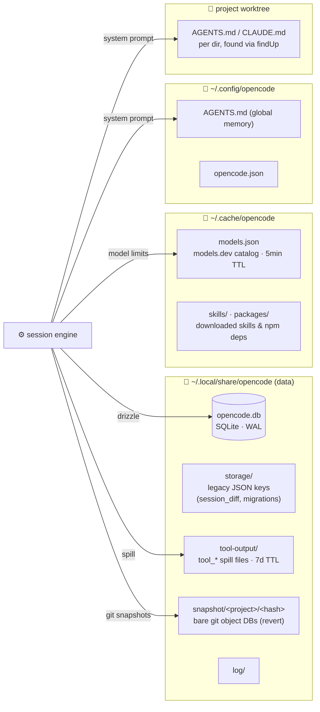
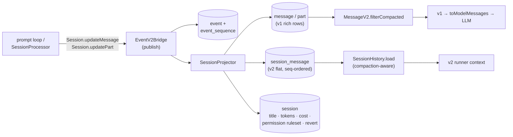
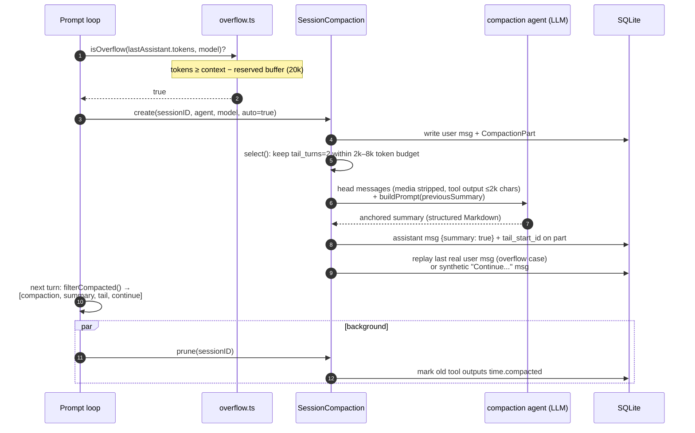
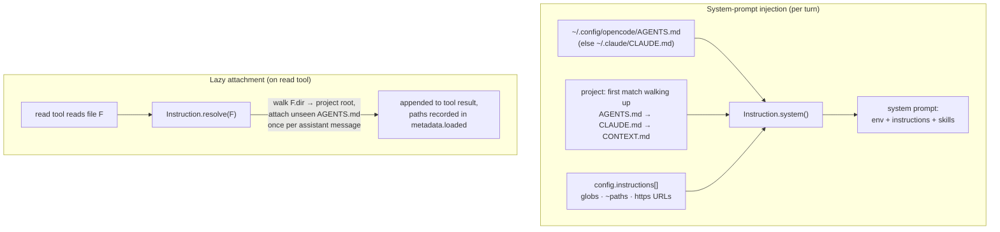

# opencode — Memory system

> Part of [opencode](./ARCHITECTURE.md) @ 4ddfa7c

> Scope: how opencode persists state and "remembers" — on-disk storage topology, the SQLite event-sourced session store, the conversation-history model, context-window management (compaction, pruning, tool-output spilling), project memory via `AGENTS.md`/instruction files, and the caches that survive across sessions. Framed for a comparative study of coding-agent harnesses (opencode vs pi vs hermes-agent).

## Module purpose

opencode has no vector store, no embedding memory, and no model-written "memory file". Its memory system is composed of four explicit layers: (1) a **SQLite database** (`opencode.db`) holding sessions, messages, parts, todos and an event log — every conversation is durable and resumable; (2) a **context-window manager** that detects token overflow and compacts history into an LLM-written "anchored summary" while preserving a recent tail; (3) **project memory** loaded from user-maintained `AGENTS.md` / `CLAUDE.md` files (global → project → subdirectory), injected into the system prompt and lazily attached as the agent reads files; and (4) **disk caches** (model catalog, skills, npm packages, tool-output spill files, git snapshot object stores). The repo is mid-refactor: a legacy JSON-file `Storage` service and a v1 message model live in `packages/opencode`, while a new Effect-based, event-sourced v2 engine lives in `packages/core` — both are analyzed here because both are live at this commit.

## Role in the system

Upstream, the session prompt loop (`packages/opencode/src/session/prompt.ts`) and the v2 runner (`packages/core/src/session/runner/`) read history through `Session`/`SessionStore` and write through event publication. Downstream, everything lands in SQLite via drizzle-orm or in flat files under the XDG data/cache dirs resolved by `Global.Path`. The permission ruleset is also persisted per-session on the session row (`permission` JSON column), which is where this doc touches the permission-flow topic; agent identity per-session is pinned in the `session_context_epoch` table, which touches the agents topic.

## Key types & entry points

- `Storage.Service` ([storage/storage.ts:53](https://github.com/anomalyco/opencode/blob/4ddfa7c6fa4cd5f9daab04f2800bc42b07378a33/packages/opencode/src/storage/storage.ts#L53-L61)) — legacy key→JSON-file store with per-file reentrant locks and startup migrations; now used only for residual keys (e.g. `session_diff`).
- `Database.Service` ([core/src/database/database.ts:20](https://github.com/anomalyco/opencode/blob/4ddfa7c6fa4cd5f9daab04f2800bc42b07378a33/packages/core/src/database/database.ts#L20-L37)) — the SQLite handle (WAL mode, FK on) + migrations.
- `SessionTable` / `MessageTable` / `PartTable` / `TodoTable` / `SessionMessageTable` / `SessionInputTable` / `SessionContextEpochTable` ([core/src/session/sql.ts:21](https://github.com/anomalyco/opencode/blob/4ddfa7c6fa4cd5f9daab04f2800bc42b07378a33/packages/core/src/session/sql.ts#L21-L178)) — the full conversation schema.
- `EventTable` / `EventSequenceTable` ([core/src/event/sql.ts:4](https://github.com/anomalyco/opencode/blob/4ddfa7c6fa4cd5f9daab04f2800bc42b07378a33/packages/core/src/event/sql.ts#L4-L25)) — append-only event log; persistence is event-sourced.
- `SessionProjector` ([core/src/session/projector.ts:1](https://github.com/anomalyco/opencode/blob/4ddfa7c6fa4cd5f9daab04f2800bc42b07378a33/packages/core/src/session/projector.ts#L1-L60)) — projects session events into the read-model tables.
- `SessionHistory.load` ([core/src/session/history.ts:66](https://github.com/anomalyco/opencode/blob/4ddfa7c6fa4cd5f9daab04f2800bc42b07378a33/packages/core/src/session/history.ts#L66-L80)) — compaction-aware history loader (v2).
- `MessageV2.filterCompacted` ([session/message-v2.ts:532](https://github.com/anomalyco/opencode/blob/4ddfa7c6fa4cd5f9daab04f2800bc42b07378a33/packages/opencode/src/session/message-v2.ts#L532-L583)) — compaction-aware history slicing/reordering (v1, live CLI path).
- `usable` / `isOverflow` ([session/overflow.ts:10](https://github.com/anomalyco/opencode/blob/4ddfa7c6fa4cd5f9daab04f2800bc42b07378a33/packages/opencode/src/session/overflow.ts#L10-L34)) — context-budget math.
- `SessionCompaction.Service` ([session/compaction.ts:140](https://github.com/anomalyco/opencode/blob/4ddfa7c6fa4cd5f9daab04f2800bc42b07378a33/packages/opencode/src/session/compaction.ts#L140-L162)) — summarization, tail selection, pruning, auto-continue.
- `buildPrompt` + `SUMMARY_TEMPLATE` ([core/src/session/compaction.ts:16](https://github.com/anomalyco/opencode/blob/4ddfa7c6fa4cd5f9daab04f2800bc42b07378a33/packages/core/src/session/compaction.ts#L16-L51)) — the structured summary contract shared by v1 and v2.
- `Instruction.Service` ([session/instruction.ts:34](https://github.com/anomalyco/opencode/blob/4ddfa7c6fa4cd5f9daab04f2800bc42b07378a33/packages/opencode/src/session/instruction.ts#L34-L46)) — AGENTS.md discovery, system-prompt injection, lazy per-directory resolution.
- `InstructionContext` ([core/src/instruction-context.ts:21](https://github.com/anomalyco/opencode/blob/4ddfa7c6fa4cd5f9daab04f2800bc42b07378a33/packages/core/src/instruction-context.ts#L21-L88)) + `SessionContextEpoch` ([core/src/session/context-epoch.ts:42](https://github.com/anomalyco/opencode/blob/4ddfa7c6fa4cd5f9daab04f2800bc42b07378a33/packages/core/src/session/context-epoch.ts#L42-L66)) — v2: instructions as versioned "system context" with drift detection.
- `ToolOutputStore` ([core/src/tool-output-store.ts:36](https://github.com/anomalyco/opencode/blob/4ddfa7c6fa4cd5f9daab04f2800bc42b07378a33/packages/core/src/tool-output-store.ts#L36-L42)) — spills oversized tool outputs to disk, keeps head/tail preview in context.

## Storage topology — where bytes live

All persistent state hangs off XDG base dirs computed once in [`core/src/global.ts:10-29`](https://github.com/anomalyco/opencode/blob/4ddfa7c6fa4cd5f9daab04f2800bc42b07378a33/packages/core/src/global.ts#L10-L29) (`~/.local/share/opencode`, `~/.cache/opencode`, `~/.config/opencode`, `~/.local/state/opencode`).



| Location | Contents | Written by |
| --- | --- | --- |
| `<data>/opencode.db` (or `opencode-<channel>.db`) | sessions, messages, parts, todos, events, permissions, projects, accounts | [`Database.path()`](https://github.com/anomalyco/opencode/blob/4ddfa7c6fa4cd5f9daab04f2800bc42b07378a33/packages/core/src/database/database.ts#L43-L55) |
| `<data>/storage/**/*.json` | legacy JSON store + 2 startup migrations (old per-project layout → flat) | [`storage.ts:81-211`](https://github.com/anomalyco/opencode/blob/4ddfa7c6fa4cd5f9daab04f2800bc42b07378a33/packages/opencode/src/storage/storage.ts#L81-L211) |
| `<data>/tool-output/tool_*` | full text of oversized tool results | [`tool-output-store.ts:123-130`](https://github.com/anomalyco/opencode/blob/4ddfa7c6fa4cd5f9daab04f2800bc42b07378a33/packages/core/src/tool-output-store.ts#L123-L130) |
| `<data>/snapshot/<projectID>/<hash(worktree)>` | bare git dir tracking file states for undo/revert | [`snapshot/index.ts:79`](https://github.com/anomalyco/opencode/blob/4ddfa7c6fa4cd5f9daab04f2800bc42b07378a33/packages/opencode/src/snapshot/index.ts#L79) |
| `<cache>/models.json` | models.dev catalog (context limits per model — feeds overflow math) | [`models-dev.ts:142-148`](https://github.com/anomalyco/opencode/blob/4ddfa7c6fa4cd5f9daab04f2800bc42b07378a33/packages/core/src/models-dev.ts#L142-L148) |

The JSON→SQLite migration history is documented in-repo: [`specs/storage/remove-opencode-db.md`](https://github.com/anomalyco/opencode/blob/4ddfa7c6fa4cd5f9daab04f2800bc42b07378a33/specs/storage/remove-opencode-db.md) records the completed removal of the legacy `storage/db.ts` wrapper, with the invariant *"Existing schema ownership remains in `packages/core/src/**/*.sql.ts`"*.

## Session persistence — event-sourced SQLite

Writes are not direct row updates. The v1 session service **publishes events**; core projectors **materialize** them into read-model tables, and the raw events are themselves appended to an `event` table with per-aggregate sequence numbers. This gives opencode a durable, ordered transcript that the share/sync subsystems can replay to remote consumers.



- `Session.updateMessage` / `updatePart` are pure event publications — [`session/session.ts:671-685`](https://github.com/anomalyco/opencode/blob/4ddfa7c6fa4cd5f9daab04f2800bc42b07378a33/packages/opencode/src/session/session.ts#L671-L685); reads go straight to drizzle ([`session.ts:583-614`](https://github.com/anomalyco/opencode/blob/4ddfa7c6fa4cd5f9daab04f2800bc42b07378a33/packages/opencode/src/session/session.ts#L583-L614) for `get`/`list` with cursor pagination, archive filter, title search).
- The DB opens with `PRAGMA journal_mode = WAL`, `synchronous = NORMAL`, `foreign_keys = ON` and runs migrations at layer init — [`database.ts:22-37`](https://github.com/anomalyco/opencode/blob/4ddfa7c6fa4cd5f9daab04f2800bc42b07378a33/packages/core/src/database/database.ts#L22-L37).
- The session row aggregates everything needed to resume: token/cost accounting, `revert` checkpoint, pinned `agent`+`model`, and the session-scoped `permission` ruleset (`PermissionV1.Ruleset` JSON column) — [`sql.ts:42-58`](https://github.com/anomalyco/opencode/blob/4ddfa7c6fa4cd5f9daab04f2800bc42b07378a33/packages/core/src/session/sql.ts#L42-L58).
- Todos persist per session (`todo` table, delete+insert replace) — [`session/todo.ts:47-72`](https://github.com/anomalyco/opencode/blob/4ddfa7c6fa4cd5f9daab04f2800bc42b07378a33/packages/opencode/src/session/todo.ts#L47-L72).

### `packages/core/src/session/sql.ts` — the two history tables

The schema keeps **two parallel histories**: `message`+`part` (v1, rich UI-facing tree of typed parts) and `session_message` (v2, flat, strictly `seq`-ordered — what the runner feeds the model). Both are JSON-in-a-column with typed accessors:

```ts title="packages/core/src/session/sql.ts (L118-L137)"
export const SessionMessageTable = sqliteTable(
  "session_message",
  {
    id: text().$type<SessionMessage.ID>().primaryKey(),
    session_id: text()
      .$type<SessionSchema.ID>()
      .notNull()
      .references(() => SessionTable.id, { onDelete: "cascade" }),
    type: text().$type<SessionMessage.Type>().notNull(),
    seq: integer().notNull(),
    ...Timestamps,
    data: text({ mode: "json" }).notNull().$type<SessionMessageData>(),
  },
  (table) => [
    uniqueIndex("session_message_session_seq_idx").on(table.session_id, table.seq),
    index("session_message_session_type_seq_idx").on(table.session_id, table.type, table.seq),
    [...]
  ],
)
```

[Full file on GitHub](https://github.com/anomalyco/opencode/blob/4ddfa7c6fa4cd5f9daab04f2800bc42b07378a33/packages/core/src/session/sql.ts) · [L118-L137](https://github.com/anomalyco/opencode/blob/4ddfa7c6fa4cd5f9daab04f2800bc42b07378a33/packages/core/src/session/sql.ts#L118-L137)

### `packages/core/src/session/history.ts` — compaction is a query, not a delete

Loading history never destroys anything: the loader finds the latest `compaction`-type message and selects only rows at-or-after its `seq`, plus any `system` updates newer than the context-epoch baseline. Old messages stay in the DB forever; the context window is a *view*.

```ts title="packages/core/src/session/history.ts (L24-L49, trimmed)"
const rows = yield* db
  .select()
  .from(SessionMessageTable)
  .where(
    and(
      eq(SessionMessageTable.session_id, sessionID),
      compaction
        ? or(
            gte(SessionMessageTable.seq, compaction.seq),
            [...] // system messages newer than the epoch baseline
          )
        : undefined,
      [...]
    ),
  )
  .orderBy(asc(SessionMessageTable.seq))
```

[L24-L53](https://github.com/anomalyco/opencode/blob/4ddfa7c6fa4cd5f9daab04f2800bc42b07378a33/packages/core/src/session/history.ts#L24-L53) · `SessionStore.context` / `runnerContext` wrap this for callers ([store.ts:38-43](https://github.com/anomalyco/opencode/blob/4ddfa7c6fa4cd5f9daab04f2800bc42b07378a33/packages/core/src/session/store.ts#L38-L43)).

In the live v1 path the same idea is implemented in-memory: `MessageV2.filterCompacted` walks messages backwards to the last completed compaction, then **reorders** to `[compaction-user, summary, ...retained tail..., continue-user]` so the model sees the summary first and the preserved recent turns after it — [`message-v2.ts:556-582`](https://github.com/anomalyco/opencode/blob/4ddfa7c6fa4cd5f9daab04f2800bc42b07378a33/packages/opencode/src/session/message-v2.ts#L556-L582); the comment at [L589-L595](https://github.com/anomalyco/opencode/blob/4ddfa7c6fa4cd5f9daab04f2800bc42b07378a33/packages/opencode/src/session/message-v2.ts#L589-L595) explains why ordering is no longer chronological.

## Context-window management — overflow, compaction, prune

This is the heart of opencode's "working memory". Three cooperating mechanisms keep the context under the model limit: **overflow detection** (token accounting vs budget), **compaction** (LLM-written anchored summary + preserved tail), and **pruning** (erasing stale tool outputs). All are triggered from the prompt loop ([`prompt.ts:1202-1219`](https://github.com/anomalyco/opencode/blob/4ddfa7c6fa4cd5f9daab04f2800bc42b07378a33/packages/opencode/src/session/prompt.ts#L1202-L1219) and [L1399](https://github.com/anomalyco/opencode/blob/4ddfa7c6fa4cd5f9daab04f2800bc42b07378a33/packages/opencode/src/session/prompt.ts#L1399)).



- **Budget math** — `usable()` = `model.limit.input − reserved` (reserved = `compaction.reserved` config or min(20 000, maxOutputTokens)); overflow when total tokens (input+output+cache) reach it; disabled via `compaction.auto: false` — [`overflow.ts:8-34`](https://github.com/anomalyco/opencode/blob/4ddfa7c6fa4cd5f9daab04f2800bc42b07378a33/packages/opencode/src/session/overflow.ts#L8-L34).
- **Tail preservation** — `select()` keeps the last `tail_turns` (default 2) user-turns whole if they fit `preserve_recent_tokens` (default: 25% of usable, clamped 2k–8k); an oversized turn is split mid-turn via `splitTurn` binary walk — [`compaction.ts:198-249`](https://github.com/anomalyco/opencode/blob/4ddfa7c6fa4cd5f9daab04f2800bc42b07378a33/packages/opencode/src/session/compaction.ts#L198-L249), [L115-L137](https://github.com/anomalyco/opencode/blob/4ddfa7c6fa4cd5f9daab04f2800bc42b07378a33/packages/opencode/src/session/compaction.ts#L115-L137).
- **Incremental summaries** — each compaction passes the previous summary back to the model ("Update the anchored summary… preserve still-true details, remove stale details") instead of re-summarizing from scratch — `buildPrompt`, [`core/compaction.ts:166-173`](https://github.com/anomalyco/opencode/blob/4ddfa7c6fa4cd5f9daab04f2800bc42b07378a33/packages/core/src/session/compaction.ts#L166-L173). Plugins can inject context or replace the prompt entirely (`experimental.session.compacting`) — [`compaction.ts:352-358`](https://github.com/anomalyco/opencode/blob/4ddfa7c6fa4cd5f9daab04f2800bc42b07378a33/packages/opencode/src/session/compaction.ts#L352-L358).
- **Overflow replay** — if compaction was forced by overflow mid-task, the last real user message is excluded from the summary and *replayed verbatim* afterwards (media downgraded to text stubs), so the user's pending request survives compaction — [`compaction.ts:320-336`](https://github.com/anomalyco/opencode/blob/4ddfa7c6fa4cd5f9daab04f2800bc42b07378a33/packages/opencode/src/session/compaction.ts#L320-L336) and [L444-L471](https://github.com/anomalyco/opencode/blob/4ddfa7c6fa4cd5f9daab04f2800bc42b07378a33/packages/opencode/src/session/compaction.ts#L444-L471).
- **Compaction runs as an agent** — the summary is produced by a dedicated `compaction` agent (own model selection possible), recorded as a normal assistant message with `summary: true`, `mode: "compaction"` — [`compaction.ts:338-424`](https://github.com/anomalyco/opencode/blob/4ddfa7c6fa4cd5f9daab04f2800bc42b07378a33/packages/opencode/src/session/compaction.ts#L338-L424). Failure to fit even the compaction request raises `ContextOverflowError` and stops the loop ([L426-L435](https://github.com/anomalyco/opencode/blob/4ddfa7c6fa4cd5f9daab04f2800bc42b07378a33/packages/opencode/src/session/compaction.ts#L426-L435)).

### The anchored-summary template

Both generations share one structured contract for what compacted memory must retain — goal, constraints, progress, decisions, next steps, critical context, file paths:

```ts title="packages/core/src/session/compaction.ts (L16-L51, trimmed)"
const SUMMARY_TEMPLATE = `Output exactly the Markdown structure shown inside <template> [...]
<template>
## Goal
## Constraints & Preferences
## Progress
### Done / ### In Progress / ### Blocked
## Key Decisions
## Next Steps
## Critical Context
## Relevant Files
</template>
Rules:
- Keep every section, even when empty.
- Preserve exact file paths, commands, error strings, and identifiers when known.
- Do not mention the summary process or that context was compacted.`
```

[L16-L51](https://github.com/anomalyco/opencode/blob/4ddfa7c6fa4cd5f9daab04f2800bc42b07378a33/packages/core/src/session/compaction.ts#L16-L51)

The v2 engine differs in mechanics: `compactIfNeeded` **estimates the request size before sending** (vs v1 reacting to the previous response's usage), serializes history to a plain-text transcript ([`serialize`, L91-L117](https://github.com/anomalyco/opencode/blob/4ddfa7c6fa4cd5f9daab04f2800bc42b07378a33/packages/core/src/session/compaction.ts#L91-L117)), and stores the result as a first-class `Compaction` message carrying both `summary` and the preserved `recent` text — [`message.ts:170-177`](https://github.com/anomalyco/opencode/blob/4ddfa7c6fa4cd5f9daab04f2800bc42b07378a33/packages/core/src/session/message.ts#L170-L177), [`compaction.ts:230-241`](https://github.com/anomalyco/opencode/blob/4ddfa7c6fa4cd5f9daab04f2800bc42b07378a33/packages/core/src/session/compaction.ts#L230-L241).

### Pruning — cheap reclamation before summarizing

`prune` walks parts backwards, protects the most recent 2 turns and the newest 40k tokens of tool output (`PRUNE_PROTECT`), then marks older completed tool calls `time.compacted` — their output is dropped from future model messages but kept in the DB for the UI. Only fires if ≥20k tokens would be reclaimed; the `skill` tool is exempt.

```ts title="packages/opencode/src/session/compaction.ts (L268-L296, trimmed)"
loop: for (let msgIndex = msgs.length - 1; msgIndex >= 0; msgIndex--) {
  const msg = msgs[msgIndex]
  if (msg.info.role === "user") turns++
  if (turns < 2) continue
  if (msg.info.role === "assistant" && msg.info.summary) break loop
  for (let partIndex = msg.parts.length - 1; partIndex >= 0; partIndex--) {
    const part = msg.parts[partIndex]
    if (part.type !== "tool") continue
    [...]
    if (part.state.time.compacted) break loop
    const estimate = Token.estimate(part.state.output)
    total += estimate
    if (total <= PRUNE_PROTECT) continue
    pruned += estimate
    toPrune.push(part)
  }
}
[...]
if (pruned > PRUNE_MINIMUM) {
  for (const part of toPrune) {
    part.state.time.compacted = Date.now()
    yield* session.updatePart(part)
  }
}
```

[L253-L297](https://github.com/anomalyco/opencode/blob/4ddfa7c6fa4cd5f9daab04f2800bc42b07378a33/packages/opencode/src/session/compaction.ts#L253-L297)

A complementary v2 mechanism avoids overflow at the source: `ToolOutputStore.bound` truncates any tool result over 2 000 lines / 50 KB to a head+tail preview and writes the full text to `<data>/tool-output/tool_<id>` so the agent can `read` it back on demand; spill files are garbage-collected after 7 days — [`tool-output-store.ts:12-16`](https://github.com/anomalyco/opencode/blob/4ddfa7c6fa4cd5f9daab04f2800bc42b07378a33/packages/core/src/tool-output-store.ts#L12-L16), [L123-L130](https://github.com/anomalyco/opencode/blob/4ddfa7c6fa4cd5f9daab04f2800bc42b07378a33/packages/core/src/tool-output-store.ts#L123-L130), [L171-L175](https://github.com/anomalyco/opencode/blob/4ddfa7c6fa4cd5f9daab04f2800bc42b07378a33/packages/core/src/tool-output-store.ts#L171-L175).

## Project memory — AGENTS.md and instruction files

opencode's durable cross-session knowledge is **user-curated files**, not model-written state. `Instruction.Service` assembles them into the system prompt in a fixed precedence order, and lazily attaches deeper ones as the agent explores.



- **Discovery order** — global file first (one of `<config>/AGENTS.md`, `~/.claude/CLAUDE.md`); then the *first* project-level match walking up from cwd to worktree root ("so we don't stack AGENTS.md/CLAUDE.md from every ancestor"); then `config.instructions` globs and remote URLs (5 s timeout) — [`instruction.ts:60-68`](https://github.com/anomalyco/opencode/blob/4ddfa7c6fa4cd5f9daab04f2800bc42b07378a33/packages/opencode/src/session/instruction.ts#L60-L68), [L110-L153](https://github.com/anomalyco/opencode/blob/4ddfa7c6fa4cd5f9daab04f2800bc42b07378a33/packages/opencode/src/session/instruction.ts#L110-L153), [L155-L169](https://github.com/anomalyco/opencode/blob/4ddfa7c6fa4cd5f9daab04f2800bc42b07378a33/packages/opencode/src/session/instruction.ts#L155-L169). Each block is prefixed `Instructions from: <path>`.
- **Lazy, deduplicated attachment** — when the `read` tool touches a file, `Instruction.resolve` walks from that file's directory up to the project root and attaches any not-yet-seen instruction file to the tool result ([`tool/read.ts:300-315`](https://github.com/anomalyco/opencode/blob/4ddfa7c6fa4cd5f9daab04f2800bc42b07378a33/packages/opencode/src/tool/read.ts#L300-L315)). Dedup is two-level: `extract()` scans prior messages' `metadata.loaded` so files already in context are never re-attached (and survives across turns), while an in-memory `claims` map dedupes within the current assistant message — [`instruction.ts:17-32`](https://github.com/anomalyco/opencode/blob/4ddfa7c6fa4cd5f9daab04f2800bc42b07378a33/packages/opencode/src/session/instruction.ts#L17-L32), [L179-L221](https://github.com/anomalyco/opencode/blob/4ddfa7c6fa4cd5f9daab04f2800bc42b07378a33/packages/opencode/src/session/instruction.ts#L179-L221).
- **Final assembly** — system = `[...env, ...instructions, ...skills]`, where env includes model id, cwd, worktree, VCS, date ([`system.ts:55-92`](https://github.com/anomalyco/opencode/blob/4ddfa7c6fa4cd5f9daab04f2800bc42b07378a33/packages/opencode/src/session/system.ts#L55-L92)) and the provider-specific base prompt is chosen by model family ([`system.ts:25-39`](https://github.com/anomalyco/opencode/blob/4ddfa7c6fa4cd5f9daab04f2800bc42b07378a33/packages/opencode/src/session/system.ts#L25-L39)); wiring at [`prompt.ts:1327-1333`](https://github.com/anomalyco/opencode/blob/4ddfa7c6fa4cd5f9daab04f2800bc42b07378a33/packages/opencode/src/session/prompt.ts#L1327-L1333).

### v2: instructions as versioned "system context" with drift detection

The v2 engine treats ambient instructions as a **snapshotted, diffable context source**. `InstructionContext` registers a `core/instructions` source in the `SystemContextRegistry`; per session, `SessionContextEpoch` persists the rendered baseline + snapshot in the `session_context_epoch` table ([`sql.ts:167-178`](https://github.com/anomalyco/opencode/blob/4ddfa7c6fa4cd5f9daab04f2800bc42b07378a33/packages/core/src/session/sql.ts#L167-L178)) with optimistic-concurrency `revision` retry ([`context-epoch.ts:28-66`](https://github.com/anomalyco/opencode/blob/4ddfa7c6fa4cd5f9daab04f2800bc42b07378a33/packages/core/src/session/context-epoch.ts#L28-L66)). If `AGENTS.md` changes mid-session, the engine doesn't silently rewrite the system prompt (which would invalidate provider prompt caches and confuse the model) — it emits a `system` message into history:

```ts title="packages/core/src/instruction-context.ts (L28-L37)"
const source = (value: ReadonlyArray<File> | SystemContext.Unavailable) =>
  SystemContext.make({
    key,
    codec: Schema.toCodecJson(Files),
    load: Effect.succeed(value),
    baseline: render,
    update: (_previous, current) =>
      `These instructions replace all previously loaded ambient instructions.\n\n${render(current)}`,
    removed: () => "Previously loaded instructions no longer apply.",
  })
```

[L28-L37](https://github.com/anomalyco/opencode/blob/4ddfa7c6fa4cd5f9daab04f2800bc42b07378a33/packages/core/src/instruction-context.ts#L28-L37) — and `SessionHistory.load` includes exactly those `system` updates newer than the epoch baseline ([history.ts:37-46](https://github.com/anomalyco/opencode/blob/4ddfa7c6fa4cd5f9daab04f2800bc42b07378a33/packages/core/src/session/history.ts#L37-L46)). The epoch row also pins the session's `agent` and blocks silent agent replacement (`AgentReplacementBlocked`, [context-epoch.ts:22-25](https://github.com/anomalyco/opencode/blob/4ddfa7c6fa4cd5f9daab04f2800bc42b07378a33/packages/core/src/session/context-epoch.ts#L22-L25)).

## Other persistence touching memory

- **Revert/undo snapshots** — file states are committed into a hidden bare git dir per project+worktree (`<data>/snapshot/...`), letting sessions roll back filesystem changes; session diffs are stored via the legacy JSON store under `session_diff/<sessionID>` — [`snapshot/index.ts:79`](https://github.com/anomalyco/opencode/blob/4ddfa7c6fa4cd5f9daab04f2800bc42b07378a33/packages/opencode/src/snapshot/index.ts#L79), [`revert.ts:76`](https://github.com/anomalyco/opencode/blob/4ddfa7c6fa4cd5f9daab04f2800bc42b07378a33/packages/opencode/src/session/revert.ts#L76).
- **Session title/diff summaries** — `SessionSummary.summarize` computes per-message file diffs from snapshots and stores them on the message `summary` field, aggregated onto the session row (`summary_additions/_deletions/_diffs`) — [`summary.ts:102-129`](https://github.com/anomalyco/opencode/blob/4ddfa7c6fa4cd5f9daab04f2800bc42b07378a33/packages/opencode/src/session/summary.ts#L102-L129).
- **Skills as on-demand memory** — skill descriptions are listed in the system prompt and full instructions loaded only when the `skill` tool fires ([`system.ts:94-106`](https://github.com/anomalyco/opencode/blob/4ddfa7c6fa4cd5f9daab04f2800bc42b07378a33/packages/opencode/src/session/system.ts#L94-L106)); downloaded skills are cached under `<cache>/skills` ([`skill/discovery.ts:34`](https://github.com/anomalyco/opencode/blob/4ddfa7c6fa4cd5f9daab04f2800bc42b07378a33/packages/opencode/src/skill/discovery.ts#L34)). Skill tool outputs are prune-protected (`PRUNE_PROTECTED_TOOLS`, [compaction.ts:41](https://github.com/anomalyco/opencode/blob/4ddfa7c6fa4cd5f9daab04f2800bc42b07378a33/packages/opencode/src/session/compaction.ts#L41)).
- **What opencode does *not* have** — no auto-written memory file (the model never persists its own notes across sessions), no embedding/semantic recall, no per-user preference learning. Cross-session memory = SQLite transcripts (resumable sessions) + human-curated `AGENTS.md` + caches. For the comparative study this places opencode at the "explicit, deterministic memory" end of the spectrum.

## Source files

| File | Ranges | GitHub |
| --- | --- | --- |
| `packages/opencode/src/storage/storage.ts` | L11-L61, L81-L243 | [link](https://github.com/anomalyco/opencode/blob/4ddfa7c6fa4cd5f9daab04f2800bc42b07378a33/packages/opencode/src/storage/storage.ts) |
| `packages/core/src/global.ts` | L10-L43 | [link](https://github.com/anomalyco/opencode/blob/4ddfa7c6fa4cd5f9daab04f2800bc42b07378a33/packages/core/src/global.ts) |
| `packages/core/src/database/database.ts` | L13-L63 | [link](https://github.com/anomalyco/opencode/blob/4ddfa7c6fa4cd5f9daab04f2800bc42b07378a33/packages/core/src/database/database.ts) |
| `packages/core/src/session/sql.ts` | L21-L178 | [link](https://github.com/anomalyco/opencode/blob/4ddfa7c6fa4cd5f9daab04f2800bc42b07378a33/packages/core/src/session/sql.ts) |
| `packages/core/src/event/sql.ts` | L4-L25 | [link](https://github.com/anomalyco/opencode/blob/4ddfa7c6fa4cd5f9daab04f2800bc42b07378a33/packages/core/src/event/sql.ts) |
| `packages/core/src/session/store.ts` | L13-L62 | [link](https://github.com/anomalyco/opencode/blob/4ddfa7c6fa4cd5f9daab04f2800bc42b07378a33/packages/core/src/session/store.ts) |
| `packages/core/src/session/history.ts` | L13-L101 | [link](https://github.com/anomalyco/opencode/blob/4ddfa7c6fa4cd5f9daab04f2800bc42b07378a33/packages/core/src/session/history.ts) |
| `packages/core/src/session/projector.ts` | L1-L60 | [link](https://github.com/anomalyco/opencode/blob/4ddfa7c6fa4cd5f9daab04f2800bc42b07378a33/packages/core/src/session/projector.ts) |
| `packages/opencode/src/session/session.ts` | L583-L614, L671-L685 | [link](https://github.com/anomalyco/opencode/blob/4ddfa7c6fa4cd5f9daab04f2800bc42b07378a33/packages/opencode/src/session/session.ts) |
| `packages/opencode/src/session/message-v2.ts` | L532-L604 | [link](https://github.com/anomalyco/opencode/blob/4ddfa7c6fa4cd5f9daab04f2800bc42b07378a33/packages/opencode/src/session/message-v2.ts) |
| `packages/opencode/src/session/overflow.ts` | L8-L34 | [link](https://github.com/anomalyco/opencode/blob/4ddfa7c6fa4cd5f9daab04f2800bc42b07378a33/packages/opencode/src/session/overflow.ts) |
| `packages/opencode/src/session/compaction.ts` | L29-L62, L90-L137, L140-L499 | [link](https://github.com/anomalyco/opencode/blob/4ddfa7c6fa4cd5f9daab04f2800bc42b07378a33/packages/opencode/src/session/compaction.ts) |
| `packages/core/src/session/compaction.ts` | L12-L51, L91-L245 | [link](https://github.com/anomalyco/opencode/blob/4ddfa7c6fa4cd5f9daab04f2800bc42b07378a33/packages/core/src/session/compaction.ts) |
| `packages/core/src/session/message.ts` | L170-L189 | [link](https://github.com/anomalyco/opencode/blob/4ddfa7c6fa4cd5f9daab04f2800bc42b07378a33/packages/core/src/session/message.ts) |
| `packages/opencode/src/session/instruction.ts` | L17-L68, L105-L221 | [link](https://github.com/anomalyco/opencode/blob/4ddfa7c6fa4cd5f9daab04f2800bc42b07378a33/packages/opencode/src/session/instruction.ts) |
| `packages/core/src/instruction-context.ts` | L13-L92 | [link](https://github.com/anomalyco/opencode/blob/4ddfa7c6fa4cd5f9daab04f2800bc42b07378a33/packages/core/src/instruction-context.ts) |
| `packages/core/src/session/context-epoch.ts` | L1-L90 | [link](https://github.com/anomalyco/opencode/blob/4ddfa7c6fa4cd5f9daab04f2800bc42b07378a33/packages/core/src/session/context-epoch.ts) |
| `packages/opencode/src/session/system.ts` | L25-L106 | [link](https://github.com/anomalyco/opencode/blob/4ddfa7c6fa4cd5f9daab04f2800bc42b07378a33/packages/opencode/src/session/system.ts) |
| `packages/opencode/src/session/prompt.ts` | L1202-L1219, L1315-L1345, L1399 | [link](https://github.com/anomalyco/opencode/blob/4ddfa7c6fa4cd5f9daab04f2800bc42b07378a33/packages/opencode/src/session/prompt.ts) |
| `packages/core/src/tool-output-store.ts` | L12-L42, L107-L175 | [link](https://github.com/anomalyco/opencode/blob/4ddfa7c6fa4cd5f9daab04f2800bc42b07378a33/packages/core/src/tool-output-store.ts) |
| `packages/opencode/src/snapshot/index.ts` | L79 | [link](https://github.com/anomalyco/opencode/blob/4ddfa7c6fa4cd5f9daab04f2800bc42b07378a33/packages/opencode/src/snapshot/index.ts) |
| `packages/core/src/models-dev.ts` | L142-L148 | [link](https://github.com/anomalyco/opencode/blob/4ddfa7c6fa4cd5f9daab04f2800bc42b07378a33/packages/core/src/models-dev.ts) |
| `packages/opencode/src/session/revert.ts` | L33, L76 | [link](https://github.com/anomalyco/opencode/blob/4ddfa7c6fa4cd5f9daab04f2800bc42b07378a33/packages/opencode/src/session/revert.ts) |
| `packages/opencode/src/session/summary.ts` | L67-L144 | [link](https://github.com/anomalyco/opencode/blob/4ddfa7c6fa4cd5f9daab04f2800bc42b07378a33/packages/opencode/src/session/summary.ts) |
| `packages/opencode/src/session/todo.ts` | L47-L72 | [link](https://github.com/anomalyco/opencode/blob/4ddfa7c6fa4cd5f9daab04f2800bc42b07378a33/packages/opencode/src/session/todo.ts) |
| `packages/opencode/src/tool/read.ts` | L287-L355 | [link](https://github.com/anomalyco/opencode/blob/4ddfa7c6fa4cd5f9daab04f2800bc42b07378a33/packages/opencode/src/tool/read.ts) |
| `specs/storage/remove-opencode-db.md` | full | [link](https://github.com/anomalyco/opencode/blob/4ddfa7c6fa4cd5f9daab04f2800bc42b07378a33/specs/storage/remove-opencode-db.md) |
