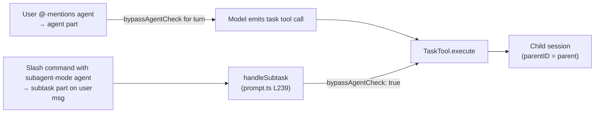
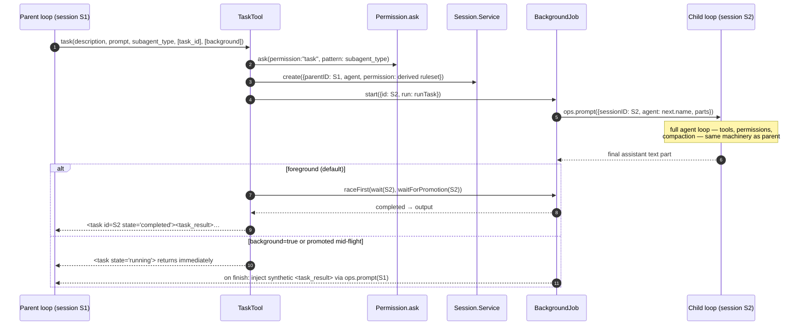

# opencode — Subagents architecture

> Part of [opencode](./ARCHITECTURE.md) @ 4ddfa7c
> Source: https://github.com/anomalyco/opencode @ `4ddfa7c6fa4cd5f9daab04f2800bc42b07378a33` (branch `dev`)

## Module purpose

opencode spawns nested agents through a single built-in tool — `task` — that creates a **child session** linked to the parent via `parentID`, runs the named subagent's full prompt loop inside it, and returns the child's final text back to the parent as a tool result. Subagents are not a separate runtime: they reuse the exact same `SessionPrompt` loop, `SessionProcessor`, tool registry, and permission engine as the top-level agent. What distinguishes a subagent is (a) an `Agent.Info` definition with `mode: "subagent"`, (b) a derived, more restrictive permission ruleset stamped onto its session at creation, and (c) the parent/child session link that scopes its lifecycle, cancellation, and result routing. An experimental background mode additionally lets subagents run asynchronously, with results injected back into the parent conversation as synthetic messages.

## Role in the system

Upstream, three paths can spawn a subagent: (1) the model calls the `task` tool during a normal assistant turn (`packages/opencode/src/tool/task.ts`); (2) a slash command whose agent has `mode: "subagent"` is compiled into a `subtask` part on the user message, which the prompt loop dispatches via `handleSubtask` (`packages/opencode/src/session/prompt.ts`); (3) clients hit the server/SDK and the same loop machinery applies. Downstream, `TaskTool` consumes `Agent.Service` (agent catalog), `Session.Service` (child session creation), `BackgroundJob.Service` (job registry that both foreground and background tasks run through), `Permission` (the ask-gate), and `SessionPrompt.ops` (the callback bundle that lets a tool re-enter the prompt loop without a circular import). The permission engine details live in the permission-flows doc; the host loop in the agents-architecture doc.

## Key types & entry points

- `TaskTool` ([tool/task.ts:81](https://github.com/anomalyco/opencode/blob/4ddfa7c6fa4cd5f9daab04f2800bc42b07378a33/packages/opencode/src/tool/task.ts#L81)) — the only spawn primitive; params `description`, `prompt`, `subagent_type`, optional `task_id` (resume) and `background`.
- `TaskPromptOps` ([tool/task.ts:18-22](https://github.com/anomalyco/opencode/blob/4ddfa7c6fa4cd5f9daab04f2800bc42b07378a33/packages/opencode/src/tool/task.ts#L18-L22)) — `{cancel, resolvePromptParts, prompt}` injected through `ctx.extra.promptOps`; how the tool re-enters the session loop.
- `Agent.Info` ([agent/agent.ts:35-56](https://github.com/anomalyco/opencode/blob/4ddfa7c6fa4cd5f9daab04f2800bc42b07378a33/packages/opencode/src/agent/agent.ts#L35-L56)) — agent definition schema; `mode: "subagent" | "primary" | "all"` is the role switch.
- `deriveSubagentSessionPermission` ([agent/subagent-permissions.ts:14-27](https://github.com/anomalyco/opencode/blob/4ddfa7c6fa4cd5f9daab04f2800bc42b07378a33/packages/opencode/src/agent/subagent-permissions.ts#L14-L27)) — computes the child session's permission ruleset from the parent's.
- `Session.createNext` ([session/session.ts:541-580](https://github.com/anomalyco/opencode/blob/4ddfa7c6fa4cd5f9daab04f2800bc42b07378a33/packages/opencode/src/session/session.ts#L541-L580)) — sessions carry `parentID`, `agent`, and a frozen `permission` ruleset; `Session.children` ([L638-646](https://github.com/anomalyco/opencode/blob/4ddfa7c6fa4cd5f9daab04f2800bc42b07378a33/packages/opencode/src/session/session.ts#L638-L646)) queries by `parent_id`.
- `BackgroundJob.Interface` ([core/src/background-job.ts:87-96](https://github.com/anomalyco/opencode/blob/4ddfa7c6fa4cd5f9daab04f2800bc42b07378a33/packages/core/src/background-job.ts#L87-L96)) — `start/extend/wait/waitForPromotion/promote/cancel`; process-local, intentionally non-durable registry keyed by child session ID.
- `ToolRegistry.describeTask` ([tool/registry.ts:252-265](https://github.com/anomalyco/opencode/blob/4ddfa7c6fa4cd5f9daab04f2800bc42b07378a33/packages/opencode/src/tool/registry.ts#L252-L265)) — dynamically appends the available-subagents catalog to the `task` tool description.
- `SessionPrompt.handleSubtask` ([session/prompt.ts:239](https://github.com/anomalyco/opencode/blob/4ddfa7c6fa4cd5f9daab04f2800bc42b07378a33/packages/opencode/src/session/prompt.ts#L239)) — spawns a subagent from a `subtask` part (slash commands), bypassing the model.
- `ConfigAgent.load` ([config/agent.ts:11-32](https://github.com/anomalyco/opencode/blob/4ddfa7c6fa4cd5f9daab04f2800bc42b07378a33/packages/opencode/src/config/agent.ts#L11-L32)) — loads user-defined agents from `{agent,agents}/**/*.md` markdown files (frontmatter = config, body = system prompt).

## Agent roles: primary vs subagent

`Agent.Service` builds a static catalog of native agents and merges user config over it ([agent/agent.ts:138-292](https://github.com/anomalyco/opencode/blob/4ddfa7c6fa4cd5f9daab04f2800bc42b07378a33/packages/opencode/src/agent/agent.ts#L138-L292)). `mode` controls where an agent can run: `primary` agents drive top-level sessions, `subagent` agents are only reachable through `task` (or subagent-mode commands), `all` works in both positions. `defaultInfo` refuses to make a subagent the session default ([agent/agent.ts:326-338](https://github.com/anomalyco/opencode/blob/4ddfa7c6fa4cd5f9daab04f2800bc42b07378a33/packages/opencode/src/agent/agent.ts#L326-L338)).

| Agent | mode | hidden | Purpose |
| --- | --- | --- | --- |
| `build` | primary | no | Default coding agent, full tool surface |
| `plan` | primary | no | Read-only planning; denies edits, denies `task: {general: deny}` |
| `general` | subagent | no | General research/multi-step parallel work; `todowrite` denied |
| `explore` | subagent | no | Fast read-only codebase exploration (`grep/glob/read/bash/webfetch` only) |
| `compaction` / `title` / `summary` | primary | yes | Internal utility LLM calls — run in-session, not spawned as child sessions |

The `explore` subagent's allowlist-style ruleset shows the pattern — deny everything, re-allow read paths ([agent/agent.ts:194-216](https://github.com/anomalyco/opencode/blob/4ddfa7c6fa4cd5f9daab04f2800bc42b07378a33/packages/opencode/src/agent/agent.ts#L194-L216)):

```ts title="packages/opencode/src/agent/agent.ts (L194-L210, trimmed)"
explore: {
  name: "explore",
  permission: Permission.merge(
    defaults,
    Permission.fromConfig({
      "*": "deny",
      grep: "allow", glob: "allow", list: "allow",
      bash: "allow", webfetch: "allow", websearch: "allow",
      read: "allow",
      external_directory: readonlyExternalDirectory,
    }),
    user,
  ),
  [...]
  mode: "subagent",
  native: true,
},
```

Custom agents come from `opencode.json` (`cfg.agent`) or markdown files; either can create brand-new named agents (default `mode: "all"`) or override native ones, including per-agent `model`, `variant`, `steps` cap, and permission overlays ([agent/agent.ts:265-292](https://github.com/anomalyco/opencode/blob/4ddfa7c6fa4cd5f9daab04f2800bc42b07378a33/packages/opencode/src/agent/agent.ts#L265-L292)).

### How the model learns what it can spawn

The `task` tool's description is assembled per-agent at tool-resolution time: `describeTask` lists every non-primary agent the current agent's ruleset doesn't deny via `task: {<name>: deny}` ([tool/registry.ts:252-265](https://github.com/anomalyco/opencode/blob/4ddfa7c6fa4cd5f9daab04f2800bc42b07378a33/packages/opencode/src/tool/registry.ts#L252-L265), appended at [L296](https://github.com/anomalyco/opencode/blob/4ddfa7c6fa4cd5f9daab04f2800bc42b07378a33/packages/opencode/src/tool/registry.ts#L296)). The static half of the description ([tool/task.txt](https://github.com/anomalyco/opencode/blob/4ddfa7c6fa4cd5f9daab04f2800bc42b07378a33/packages/opencode/src/tool/task.txt)) instructs the model to launch independent agents concurrently in a single message, to treat results as not user-visible (summarize back), and that each invocation starts with a **fresh context** unless `task_id` resumes a prior child session.

## Spawn / return flow

The three spawn paths converge on `TaskTool.execute`:



The core lifecycle, foreground and background:



Key mechanics, in order:

- **Permission gate** — unless `ctx.extra.bypassAgentCheck` is set (subtask parts and @-mentioned agents set it), the spawn itself is a permission ask with `permission: "task"`, `pattern: subagent_type` ([tool/task.ts:104-114](https://github.com/anomalyco/opencode/blob/4ddfa7c6fa4cd5f9daab04f2800bc42b07378a33/packages/opencode/src/tool/task.ts#L104-L114)). This is what `plan`'s `task: {general: "deny"}` rule hooks into.
- **Agent resolution** — `agent.get(params.subagent_type)`; unknown names fail the tool call ([tool/task.ts:116-119](https://github.com/anomalyco/opencode/blob/4ddfa7c6fa4cd5f9daab04f2800bc42b07378a33/packages/opencode/src/tool/task.ts#L116-L119)).
- **Session creation or resume** — if `task_id` names an existing session it is reused (continuing the child's prior messages); otherwise a child session is created with `parentID: ctx.sessionID`, a title suffixed `(@<agent> subagent)`, and the derived permission ruleset ([tool/task.ts:121-158](https://github.com/anomalyco/opencode/blob/4ddfa7c6fa4cd5f9daab04f2800bc42b07378a33/packages/opencode/src/tool/task.ts#L121-L158)).
- **Model inheritance** — the child uses the subagent's configured model if set, else the parent assistant message's `providerID/modelID` (and the parent's `variant`) ([tool/task.ts:167-170](https://github.com/anomalyco/opencode/blob/4ddfa7c6fa4cd5f9daab04f2800bc42b07378a33/packages/opencode/src/tool/task.ts#L167-L170), [L195](https://github.com/anomalyco/opencode/blob/4ddfa7c6fa4cd5f9daab04f2800bc42b07378a33/packages/opencode/src/tool/task.ts#L195)).
- **Execution** — `runTask` resolves `@file` references in the prompt, then calls `ops.prompt` against the child session and takes the **last text part** of the final assistant message as the result ([tool/task.ts:186-200](https://github.com/anomalyco/opencode/blob/4ddfa7c6fa4cd5f9daab04f2800bc42b07378a33/packages/opencode/src/tool/task.ts#L186-L200)).
- **Cancellation** — parent abort signals fork `ops.cancel(childSessionID)`; interrupt cleanup also cancels the background job ([tool/task.ts:296-333](https://github.com/anomalyco/opencode/blob/4ddfa7c6fa4cd5f9daab04f2800bc42b07378a33/packages/opencode/src/tool/task.ts#L296-L333)).

## Child permission derivation

The child session's `permission` ruleset is stamped at creation and merged with the subagent's own ruleset on every tool ask inside the child (`Permission.merge(input.agent.permission, input.session.permission ?? [])` in [session/tools.ts:63-71](https://github.com/anomalyco/opencode/blob/4ddfa7c6fa4cd5f9daab04f2800bc42b07378a33/packages/opencode/src/session/tools.ts#L63-L71)). Derivation is deliberately asymmetric: only the parent's **deny** rules and `external_directory` rules propagate — the subagent's own definition determines its capabilities otherwise.

```ts title="packages/opencode/src/agent/subagent-permissions.ts (L14-L27)"
export function deriveSubagentSessionPermission(input: {
  parentSessionPermission: PermissionV1.Ruleset
  subagent: Agent.Info
}): PermissionV1.Ruleset {
  const canTask = input.subagent.permission.some((rule) => rule.permission === "task")
  const canTodo = input.subagent.permission.some((rule) => rule.permission === "todowrite")
  return [
    ...input.parentSessionPermission.filter(
      (rule) => rule.permission === "external_directory" || rule.action === "deny",
    ),
    ...(canTodo ? [] : [{ permission: "todowrite" as const, pattern: "*" as const, action: "deny" as const }]),
    ...(canTask ? [] : [{ permission: "task" as const, pattern: "*" as const, action: "deny" as const }]),
  ]
}
```

On top of that, `TaskTool` adds `childToolDenies`: `todowrite` and `task` are denied unless the subagent's ruleset explicitly grants them — i.e. **recursive spawning is off by default** — plus any `experimental.primary_tools` config entries are denied in children ([tool/task.ts:129-141](https://github.com/anomalyco/opencode/blob/4ddfa7c6fa4cd5f9daab04f2800bc42b07378a33/packages/opencode/src/tool/task.ts#L129-L141)). When a child's tool does hit an `ask` outcome, the `permission.asked` event carries the child `sessionID`; since the session record has `parentID`, clients can surface the prompt on the parent conversation ([permission/index.ts:107-126](https://github.com/anomalyco/opencode/blob/4ddfa7c6fa4cd5f9daab04f2800bc42b07378a33/packages/opencode/src/permission/index.ts#L107-L126)).

## Result return: foreground, background, and promotion

Every task — foreground or background — runs as a `BackgroundJob` keyed by the child session ID ([tool/task.ts:259-272](https://github.com/anomalyco/opencode/blob/4ddfa7c6fa4cd5f9daab04f2800bc42b07378a33/packages/opencode/src/tool/task.ts#L259-L272)). The difference is only in who waits:

- **Foreground (default)** — the tool call blocks on `Effect.raceFirst(background.wait(id), background.waitForPromotion(id))` and returns the child's output wrapped in `<task id=… state="completed"><task_result>…` XML ([tool/task.ts:303-333](https://github.com/anomalyco/opencode/blob/4ddfa7c6fa4cd5f9daab04f2800bc42b07378a33/packages/opencode/src/tool/task.ts#L303-L333), `renderOutput` at [L64-79](https://github.com/anomalyco/opencode/blob/4ddfa7c6fa4cd5f9daab04f2800bc42b07378a33/packages/opencode/src/tool/task.ts#L64-L79)). The result re-enters the parent's context as an ordinary tool result part.
- **Background** (`background: true`, gated by `OPENCODE_EXPERIMENTAL_BACKGROUND_SUBAGENTS`, [effect/runtime-flags.ts:43](https://github.com/anomalyco/opencode/blob/4ddfa7c6fa4cd5f9daab04f2800bc42b07378a33/packages/opencode/src/effect/runtime-flags.ts#L43)) — the tool returns `state="running"` immediately with instructions not to poll. On completion, `notify` → `inject` sends a **synthetic user-side text part** containing the `<task_result>` into the parent session via `ops.prompt(parentSessionID)`, waking the parent loop ([tool/task.ts:202-240](https://github.com/anomalyco/opencode/blob/4ddfa7c6fa4cd5f9daab04f2800bc42b07378a33/packages/opencode/src/tool/task.ts#L202-L240)).
- **Promotion** — a foreground task can be promoted to background mid-flight (e.g. by the user via the experimental HTTP route, [server/routes/instance/httpapi/handlers/experimental.ts:157](https://github.com/anomalyco/opencode/blob/4ddfa7c6fa4cd5f9daab04f2800bc42b07378a33/packages/opencode/src/server/routes/instance/httpapi/handlers/experimental.ts#L157)); `waitForPromotion` wins the race, the tool returns `state="running"`, and `onPromote` arms the same notify-on-finish path ([tool/task.ts:264-270](https://github.com/anomalyco/opencode/blob/4ddfa7c6fa4cd5f9daab04f2800bc42b07378a33/packages/opencode/src/tool/task.ts#L264-L270)).
- **Resume / steer** — passing `task_id` for a *running* background job goes through `background.extend`, queueing additional prompt work onto the same child session ("Additional context sent to the running background task", [tool/task.ts:242-257](https://github.com/anomalyco/opencode/blob/4ddfa7c6fa4cd5f9daab04f2800bc42b07378a33/packages/opencode/src/tool/task.ts#L242-L257)); for a finished one it simply reuses the session, preserving the child's full message history.

```ts title="packages/opencode/src/tool/task.ts (L186-L229, trimmed)"
const runTask = Effect.fn("TaskTool.runTask")(function* () {
  const parts = yield* ops.resolvePromptParts(params.prompt)
  const result = yield* ops.prompt({
    messageID: MessageID.ascending(),
    sessionID: nextSession.id,
    model: { modelID: model.modelID, providerID: model.providerID },
    variant: next.model ? undefined : variant,
    agent: next.name,
    parts,
  })
  return result.parts.findLast((item) => item.type === "text")?.text ?? ""
})

const inject = Effect.fn("TaskTool.injectBackgroundResult")(function* (state, text) {
  const currentParent = yield* sessions.get(ctx.sessionID)
  yield* ops.prompt({
    sessionID: ctx.sessionID,
    agent: currentParent.agent ?? ctx.agent,
    variant,
    parts: [{ type: "text", synthetic: true,
      text: renderOutput({ sessionID: nextSession.id, state, [...] text }) }],
  }).pipe(Effect.ignore, Effect.forkIn(scope, { startImmediately: true }))
})
```

## How `ops` breaks the tool→loop cycle

`TaskTool` must call back into the prompt loop, but tools are constructed below it. `SessionPrompt` packages `{cancel, resolvePromptParts, prompt}` as `TaskPromptOps` ([session/prompt.ts:128-134](https://github.com/anomalyco/opencode/blob/4ddfa7c6fa4cd5f9daab04f2800bc42b07378a33/packages/opencode/src/session/prompt.ts#L128-L134)) and `SessionTools.resolve` threads it into every tool's `ctx.extra` ([session/tools.ts:41-46](https://github.com/anomalyco/opencode/blob/4ddfa7c6fa4cd5f9daab04f2800bc42b07378a33/packages/opencode/src/session/tools.ts#L41-L46)). The child run is therefore a plain recursive `prompt()` — child sessions get the same compaction, retries, reminders, and status events. The only parent/child special-casing inside the loop: child sessions skip auto-titling ([session/prompt.ts:183](https://github.com/anomalyco/opencode/blob/4ddfa7c6fa4cd5f9daab04f2800bc42b07378a33/packages/opencode/src/session/prompt.ts#L183)), and `session.parentID` is forwarded to providers as an `x-parent-session-id` header for attribution ([session/llm/request.ts:189](https://github.com/anomalyco/opencode/blob/4ddfa7c6fa4cd5f9daab04f2800bc42b07378a33/packages/opencode/src/session/llm/request.ts#L189)).

## Subtask parts: user-triggered spawning without the model

Slash commands map to agents; when the command's agent has `mode: "subagent"` (or `subtask: true`), the command is compiled into a `subtask` **part** on the user message instead of plain text ([session/prompt.ts:1500-1512](https://github.com/anomalyco/opencode/blob/4ddfa7c6fa4cd5f9daab04f2800bc42b07378a33/packages/opencode/src/session/prompt.ts#L1500-L1512)). The main loop pops pending subtask parts before doing any LLM work ([session/prompt.ts:1195-1200](https://github.com/anomalyco/opencode/blob/4ddfa7c6fa4cd5f9daab04f2800bc42b07378a33/packages/opencode/src/session/prompt.ts#L1195-L1200)) and `handleSubtask` fabricates the assistant message + running tool part itself, then calls `taskTool.execute` directly with `extra: { bypassAgentCheck: true, promptOps }` — no model turn, no spawn-permission ask ([session/prompt.ts:308-333](https://github.com/anomalyco/opencode/blob/4ddfa7c6fa4cd5f9daab04f2800bc42b07378a33/packages/opencode/src/session/prompt.ts#L308-L333)). Similarly, when the user `@`-mentions an agent, an `agent` part is attached and `bypassAgentCheck` is set for that turn's tool resolution ([session/prompt.ts:1276](https://github.com/anomalyco/opencode/blob/4ddfa7c6fa4cd5f9daab04f2800bc42b07378a33/packages/opencode/src/session/prompt.ts#L1276)).

## Parallelism

Fan-out is model-driven: the `task` description tells the model to "Launch multiple agents concurrently whenever possible … use a single message with multiple tool uses" ([tool/task.txt:13](https://github.com/anomalyco/opencode/blob/4ddfa7c6fa4cd5f9daab04f2800bc42b07378a33/packages/opencode/src/tool/task.txt#L13)); each tool call's `execute` is bridged to an independent Effect fiber ([session/tools.ts:83-113](https://github.com/anomalyco/opencode/blob/4ddfa7c6fa4cd5f9daab04f2800bc42b07378a33/packages/opencode/src/session/tools.ts#L83-L113)), so N parallel `task` calls run N child sessions concurrently while the parent turn stays open. Background mode adds parent/child concurrency: the parent keeps reasoning while the child works, with the result injected later. Each child is an independent DB-persisted session, so the TUI/web clients can list and open them live via `GET /session/:sessionID/children` ([server/routes/instance/httpapi/groups/session.ts:144-152](https://github.com/anomalyco/opencode/blob/4ddfa7c6fa4cd5f9daab04f2800bc42b07378a33/packages/opencode/src/server/routes/instance/httpapi/groups/session.ts#L144-L152)).

## Annotated code

### `packages/opencode/src/tool/task.ts` — child session creation with derived permissions

L121-158: resume-or-create; the child session is born with the merged deny-set.

```ts title="packages/opencode/src/tool/task.ts (L121-L158, trimmed)"
const session = params.task_id
  ? yield* sessions.get(SessionID.make(params.task_id)).pipe(Effect.catchCause(() => Effect.succeed(undefined)))
  : undefined
const parent = yield* sessions.get(ctx.sessionID)
const childPermission = deriveSubagentSessionPermission({
  parentSessionPermission: parent.permission ?? [],
  subagent: next,
})
const childToolDenies = [
  ...(next.permission.some((rule) => rule.permission === "todowrite")
    ? [] : [{ permission: "todowrite" as const, pattern: "*" as const, action: "deny" as const }]),
  ...(next.permission.some((rule) => rule.permission === id)
    ? [] : [{ permission: id, pattern: "*" as const, action: "deny" as const }]),
  ...(cfg.experimental?.primary_tools?.map((permission) => ({
    permission, pattern: "*" as const, action: "deny" as const,
  })) ?? []),
]
const nextSession =
  session ??
  (yield* sessions.create({
    parentID: ctx.sessionID,
    title: params.description + ` (@${next.name} subagent)`,
    agent: next.name,
    permission: [
      ...childPermission,
      ...childToolDenies.filter([...deduplicated against childPermission...]),
    ],
  }))
```

[Full file on GitHub](https://github.com/anomalyco/opencode/blob/4ddfa7c6fa4cd5f9daab04f2800bc42b07378a33/packages/opencode/src/tool/task.ts) · [L121-L158](https://github.com/anomalyco/opencode/blob/4ddfa7c6fa4cd5f9daab04f2800bc42b07378a33/packages/opencode/src/tool/task.ts#L121-L158)

### `packages/opencode/src/session/prompt.ts` — `handleSubtask` invoking TaskTool directly

L308-333: the loop acts as the caller the model would normally be; note `bypassAgentCheck: true` and the per-task abort controller.

```ts title="packages/opencode/src/session/prompt.ts (L308-L333, trimmed)"
const result = yield* taskTool
  .execute(taskArgs, {
    agent: task.agent,
    messageID: assistantMessage.id,
    sessionID,
    abort: taskAbort.signal,
    callID: part.callID,
    extra: { bypassAgentCheck: true, promptOps },
    messages: msgs,
    metadata: (val) => [...update the running tool part...],
    ask: (req: any) =>
      permission.ask({
        ...req,
        sessionID,
        ruleset: Permission.merge(taskAgent.permission, session.permission ?? []),
      }).pipe(Effect.orDie),
  })
```

[Full file on GitHub](https://github.com/anomalyco/opencode/blob/4ddfa7c6fa4cd5f9daab04f2800bc42b07378a33/packages/opencode/src/session/prompt.ts) · [L308-L333](https://github.com/anomalyco/opencode/blob/4ddfa7c6fa4cd5f9daab04f2800bc42b07378a33/packages/opencode/src/session/prompt.ts#L308-L333)

### `packages/opencode/src/config/agent.ts` — markdown-defined custom agents

L11-32: any `{agent,agents}/**/*.md` under a config dir becomes a named agent; frontmatter sets `mode`/`model`/`permission`, body becomes the system prompt.

```ts title="packages/opencode/src/config/agent.ts (L11-L29, trimmed)"
export async function load(dir: string) {
  const result: Record<string, ConfigAgentV1.Info> = {}
  for (const item of await Glob.scan("{agent,agents}/**/*.md", { cwd: dir, [...] })) {
    const md = await ConfigMarkdown.parse(item).catch(() => undefined)
    if (!md) continue
    const name = configEntryNameFromPath(path.relative(dir, item), ["agent/", "agents/"])
    const config = { name, ...md.data, prompt: md.content.trim() }
    result[config.name] = ConfigParse.schema(ConfigAgentV1.Info, config, item)
  }
  return result
}
```

[Full file on GitHub](https://github.com/anomalyco/opencode/blob/4ddfa7c6fa4cd5f9daab04f2800bc42b07378a33/packages/opencode/src/config/agent.ts) · [L11-L32](https://github.com/anomalyco/opencode/blob/4ddfa7c6fa4cd5f9daab04f2800bc42b07378a33/packages/opencode/src/config/agent.ts#L11-L32)

## Comparative notes (for the cross-repo study)

- **Subagent = session, not thread-in-context.** Unlike harnesses that inline child transcripts, opencode gives each subagent a first-class persisted session (`parentID` link, own permission ruleset, own compaction). Only the final text crosses back; the child transcript stays inspectable but out of the parent's context window.
- **Resumable children.** `task_id` resume is a distinguishing feature — the parent can re-enter a child session with full history, and even steer a *running* background child via `background.extend`.
- **Permission asymmetry by design.** Children inherit parent denies + `external_directory` rules only; capabilities come from the subagent definition. Recursive `task` and `todowrite` are deny-by-default in children.
- **One spawn primitive, three triggers.** Model tool call, subagent-mode slash command (`subtask` parts), and the catalog itself is permission-filtered per calling agent — so "which agents can spawn which" is config, not code.

## Source files

| File | Ranges | GitHub |
| --- | --- | --- |
| `packages/opencode/src/tool/task.ts` | L18-22, L43-79, L92-158, L167-200, L202-272, L291-345 | [link](https://github.com/anomalyco/opencode/blob/4ddfa7c6fa4cd5f9daab04f2800bc42b07378a33/packages/opencode/src/tool/task.ts) |
| `packages/opencode/src/tool/task.txt` | L1-19 | [link](https://github.com/anomalyco/opencode/blob/4ddfa7c6fa4cd5f9daab04f2800bc42b07378a33/packages/opencode/src/tool/task.txt) |
| `packages/opencode/src/agent/agent.ts` | L35-56, L138-263, L265-292, L310-338 | [link](https://github.com/anomalyco/opencode/blob/4ddfa7c6fa4cd5f9daab04f2800bc42b07378a33/packages/opencode/src/agent/agent.ts) |
| `packages/opencode/src/agent/subagent-permissions.ts` | L14-27 | [link](https://github.com/anomalyco/opencode/blob/4ddfa7c6fa4cd5f9daab04f2800bc42b07378a33/packages/opencode/src/agent/subagent-permissions.ts) |
| `packages/opencode/src/session/prompt.ts` | L128-134, L177-198, L239-333, L1105-1124, L1141-1200, L1274-1293, L1336-1347, L1480-1534 | [link](https://github.com/anomalyco/opencode/blob/4ddfa7c6fa4cd5f9daab04f2800bc42b07378a33/packages/opencode/src/session/prompt.ts) |
| `packages/opencode/src/session/tools.ts` | L24-115 | [link](https://github.com/anomalyco/opencode/blob/4ddfa7c6fa4cd5f9daab04f2800bc42b07378a33/packages/opencode/src/session/tools.ts) |
| `packages/opencode/src/session/session.ts` | L541-580, L597-604, L638-646 | [link](https://github.com/anomalyco/opencode/blob/4ddfa7c6fa4cd5f9daab04f2800bc42b07378a33/packages/opencode/src/session/session.ts) |
| `packages/opencode/src/tool/registry.ts` | L252-307 | [link](https://github.com/anomalyco/opencode/blob/4ddfa7c6fa4cd5f9daab04f2800bc42b07378a33/packages/opencode/src/tool/registry.ts) |
| `packages/core/src/background-job.ts` | L6-30, L63-119 | [link](https://github.com/anomalyco/opencode/blob/4ddfa7c6fa4cd5f9daab04f2800bc42b07378a33/packages/core/src/background-job.ts) |
| `packages/opencode/src/background/job.ts` | L1-39 | [link](https://github.com/anomalyco/opencode/blob/4ddfa7c6fa4cd5f9daab04f2800bc42b07378a33/packages/opencode/src/background/job.ts) |
| `packages/opencode/src/config/agent.ts` | L11-59 | [link](https://github.com/anomalyco/opencode/blob/4ddfa7c6fa4cd5f9daab04f2800bc42b07378a33/packages/opencode/src/config/agent.ts) |
| `packages/opencode/src/permission/index.ts` | L78-126 | [link](https://github.com/anomalyco/opencode/blob/4ddfa7c6fa4cd5f9daab04f2800bc42b07378a33/packages/opencode/src/permission/index.ts) |
| `packages/opencode/src/effect/runtime-flags.ts` | L43 | [link](https://github.com/anomalyco/opencode/blob/4ddfa7c6fa4cd5f9daab04f2800bc42b07378a33/packages/opencode/src/effect/runtime-flags.ts) |
| `packages/opencode/src/session/llm/request.ts` | L23, L189 | [link](https://github.com/anomalyco/opencode/blob/4ddfa7c6fa4cd5f9daab04f2800bc42b07378a33/packages/opencode/src/session/llm/request.ts) |
| `packages/opencode/src/server/routes/instance/httpapi/groups/session.ts` | L82, L144-152 | [link](https://github.com/anomalyco/opencode/blob/4ddfa7c6fa4cd5f9daab04f2800bc42b07378a33/packages/opencode/src/server/routes/instance/httpapi/groups/session.ts) |
