# pi — High-Level Architecture

> Source: https://github.com/earendil-works/pi @ a455f62
> A visual tour of the codebase. Diagrams are written in Mermaid so they render inline on GitHub / most Markdown viewers.

> Scope: the pi agent harness monorepo (`@earendil-works/pi-coding-agent` v0.79.1 and its three library packages), framed for a comparative study of coding-agent harnesses (vs. opencode and hermes-agent) — general architecture, agent/subagent design, memory, and permission flows. The TUI widget internals and provider wire formats are summarized but not exhaustively covered.

---

## 1. Bird's-eye view

pi (by Mario Zechner / earendil-works) is a TypeScript/Node coding agent published as **four composable npm packages**, not a monolithic CLI: a terminal-UI library, a unified multi-provider LLM API, a pure agent runtime, and the coding-agent CLI that assembles them. The single most important thing to internalise is pi's *subtractive* philosophy — **no MCP, no built-in subagents, no permission popups, no plan mode, no to-dos, no background bash** ([README Philosophy](https://github.com/earendil-works/pi/blob/a455f62f72359f5f2260c16ee3ed653ce968de3d/packages/coding-agent/README.md#L489-L505)). Every one of those features is expected to be built in user space via a TypeScript **extension system**, which is correspondingly the richest subsystem in the codebase. The agent loop itself is a pure ~740-line function with zero I/O (see [agents-architecture](./agents-architecture.md)); everything stateful — sessions, tools, auth, gating — is layered on top.

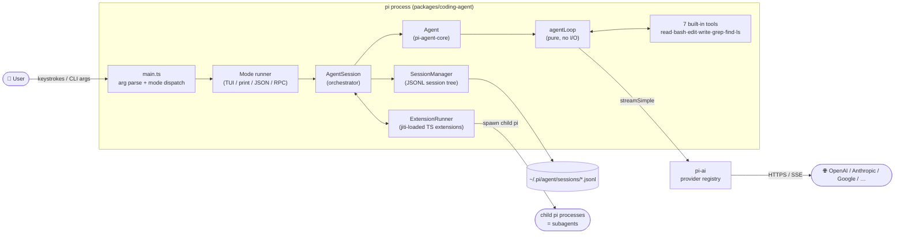

Tool gating, memory, and orchestration all hang off this spine: the only enforcement point for "permissions" is an extension hook on the tool-call edge ([agent-permission-flow](./agent-permission-flow.md)), memory is the JSONL session tree plus `AGENTS.md` instruction files ([memory-system](./memory-system.md)), and multi-agent work happens by spawning whole child `pi` processes ([subagents-architecture](./subagents-architecture.md)).

---

## 2. Module Index

Deep-dive docs staged alongside this file:

- [agents-architecture](./agents-architecture.md) — pure `agentLoop`, `Agent`/`AgentHarness` wrappers, tool pipeline, provider layer, session data model.
- [subagents-architecture](./subagents-architecture.md) — no built-in subagents by design; reference extension spawns child pi processes in JSON mode.
- [memory-system](./memory-system.md) — append-only JSONL session trees, context rebuild, compaction, `AGENTS.md` instruction files, settings/trust/auth stores.
- [agent-permission-flow](./agent-permission-flow.md) — no built-in permission system; `tool_call` extension hook, project trust, OS-level containment.

Monorepo packages (covered in this doc):

- `packages/ai` — `@earendil-works/pi-ai`: unified streaming LLM API + model catalog + OAuth.
- `packages/agent` — `@earendil-works/pi-agent-core`: the agent loop, `Agent`, and the newer `AgentHarness`.
- `packages/coding-agent` — `@earendil-works/pi-coding-agent`: the `pi` CLI, tools, extensions, sessions, modes.
- `packages/tui` — `@earendil-works/pi-tui`: differential-rendering terminal UI library.

---

## 3. Monorepo & package stack

The repo is an npm-workspaces monorepo with a strict, acyclic four-package stack — each layer is independently published and usable without the ones above it. This is the architectural identity that distinguishes pi from opencode (client/server split) and from monolithic CLIs: the *agent runtime is a library*, and the CLI is just one consumer. Notably, the repo dogfoods itself: a `.pi/` directory at the root carries project-local extensions, skills, and prompts used while developing pi with pi.

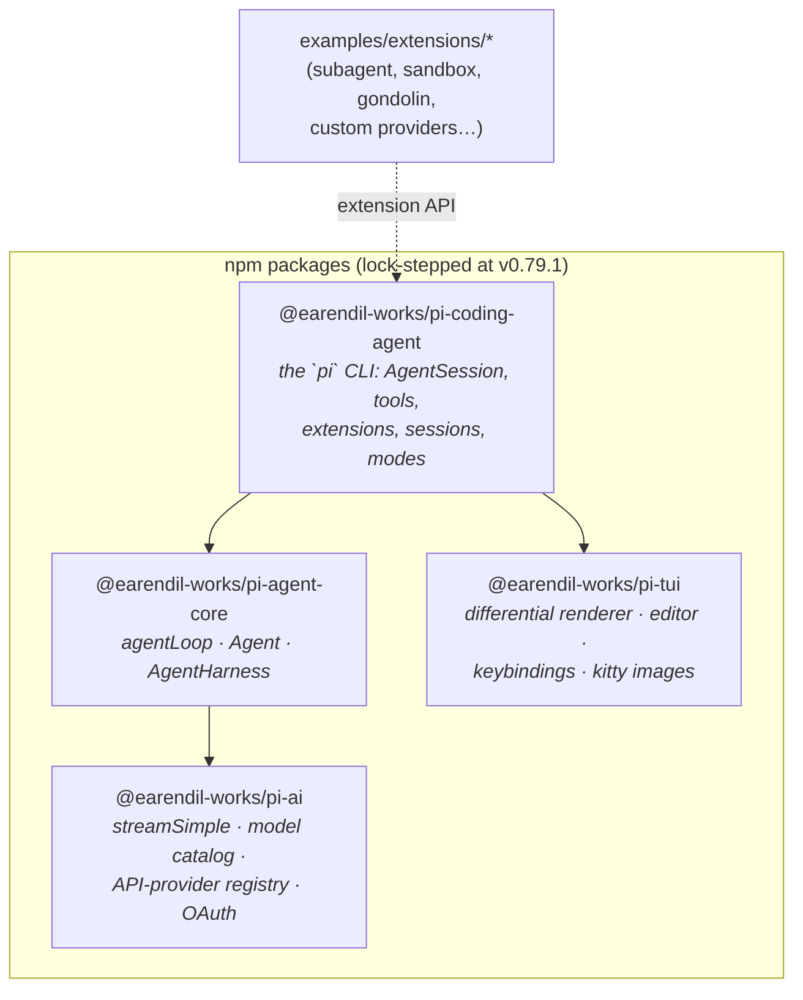

- Root [`package.json`](https://github.com/earendil-works/pi/blob/a455f62f72359f5f2260c16ee3ed653ce968de3d/package.json) — workspaces, Biome lint, `tsgo` typecheck, esbuild builds; Node ≥ 22.19; notable deps: `typebox` (tool schemas), `jiti` (runtime TS loading), `@anthropic-ai/sandbox-runtime` (dev-only, example sandbox extension).
- Supply-chain hardening is a stated concern: exact-pinned deps, `min-release-age=2` in `.npmrc`, generated shrinkwrap for the published CLI, lifecycle-script allowlist ([README](https://github.com/earendil-works/pi/blob/a455f62f72359f5f2260c16ee3ed653ce968de3d/README.md#L93-L105)).
- `packages/coding-agent/examples/extensions/` is where "missing" features live as reference implementations — including the canonical [subagents-architecture](./subagents-architecture.md) extension.

---

## 4. Process startup / entry flow

`main(args)` in [`packages/coding-agent/src/main.ts#L457`](https://github.com/earendil-works/pi/blob/a455f62f72359f5f2260c16ee3ed653ce968de3d/packages/coding-agent/src/main.ts#L457) is a long but linear bootstrap: package-manager commands short-circuit first, then args resolve an `AppMode`, then session + trust + runtime services are constructed, and finally one of four mode runners takes over the process. The `AppMode` decision ([`resolveAppMode`, main.ts#L98](https://github.com/earendil-works/pi/blob/a455f62f72359f5f2260c16ee3ed653ce968de3d/packages/coding-agent/src/main.ts#L98-L110)) is TTY-aware: piped stdin/stdout silently degrades interactive → print mode.

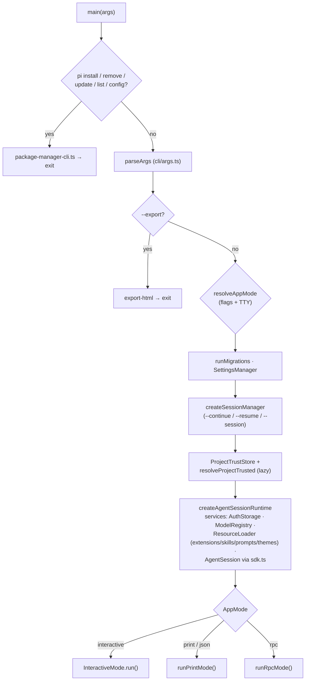

Key tricks worth noting:

- The runtime is built by a **factory closure** (`createRuntime`, [main.ts#L584](https://github.com/earendil-works/pi/blob/a455f62f72359f5f2260c16ee3ed653ce968de3d/packages/coding-agent/src/main.ts#L584-L706)) so the whole service graph can be rebuilt when a session switch changes `cwd` — project settings, extensions, and models are cwd-scoped.
- Project trust is resolved *inside* resource loading, **before** project-local extensions are loaded — an untrusted repo can't inject the extension code that would later sit on the gate ([agent-permission-flow](./agent-permission-flow.md)).
- The SDK facade [`createAgentSession` (sdk.ts#L166)](https://github.com/earendil-works/pi/blob/a455f62f72359f5f2260c16ee3ed653ce968de3d/packages/coding-agent/src/core/sdk.ts#L166) wires the same graph for embedders; `main.ts` is documented as "translates CLI args into createAgentSession() options. The SDK does the heavy lifting."

---

## 5. The agent loop (`pi-agent-core`)

The runtime core is `runLoop` ([`agent-loop.ts#L155`](https://github.com/earendil-works/pi/blob/a455f62f72359f5f2260c16ee3ed653ce968de3d/packages/agent/src/agent-loop.ts#L155-L269)) — a *pure orchestration function* (742 lines in the whole file) with all side-effects injected through `AgentLoopConfig`: `getApiKey`, `convertToLlm`, `transformContext`, `getSteeringMessages`, `getFollowUpMessages`, `beforeToolCall`/`afterToolCall`. Two nested loops: the inner loop runs turns while tool calls or steering messages remain; the outer loop restarts when follow-up messages arrive. Full walkthrough in [agents-architecture](./agents-architecture.md).

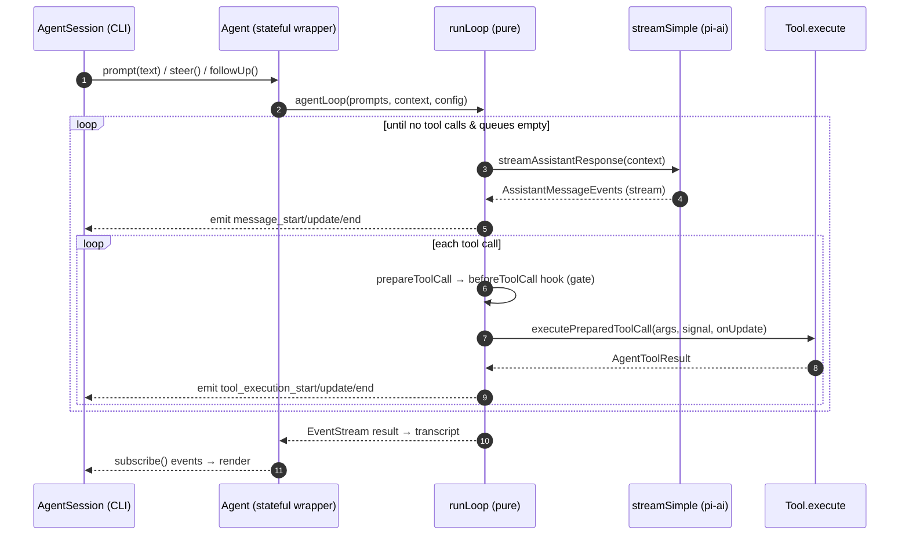

- Two stateful wrappers exist over the same loop: `class Agent` ([agent.ts#L166](https://github.com/earendil-works/pi/blob/a455f62f72359f5f2260c16ee3ed653ce968de3d/packages/agent/src/agent.ts#L166)) used by the CLI today, and the newer batteries-included `AgentHarness` ([harness/agent-harness.ts#L174](https://github.com/earendil-works/pi/blob/a455f62f72359f5f2260c16ee3ed653ce968de3d/packages/agent/src/harness/agent-harness.ts#L174)) with built-in session trees and compaction — an in-progress extraction of `AgentSession` machinery downward into the library (see [memory-system](./memory-system.md) §harness).
- Steering (interrupt mid-run) and follow-up (queue next prompt) are first-class queue concepts on `Agent`, not UI hacks.
- `AgentSession` ([agent-session.ts](https://github.com/earendil-works/pi/blob/a455f62f72359f5f2260c16ee3ed653ce968de3d/packages/coding-agent/src/core/agent-session.ts), ~3,100 lines) is the CLI-side orchestrator that owns retry, compaction triggers, extension event emission, and UI state on top of `Agent`.

---

## 6. Provider layer (`pi-ai`)

pi talks to every LLM through one function: `streamSimple(model, context, options)` ([stream.ts#L58](https://github.com/earendil-works/pi/blob/a455f62f72359f5f2260c16ee3ed653ce968de3d/packages/ai/src/stream.ts#L58)). Providers are registered by **API shape** (e.g. `anthropic-messages`, `openai-responses`), not by vendor, in a pluggable registry — so extensions can add whole new providers without forking ([custom-provider examples](https://github.com/earendil-works/pi/tree/a455f62f72359f5f2260c16ee3ed653ce968de3d/packages/coding-agent/examples/extensions)). A generated model catalog (`models.generated.ts`, ~17k lines) ships pricing/limits/capabilities for the known-model registry.

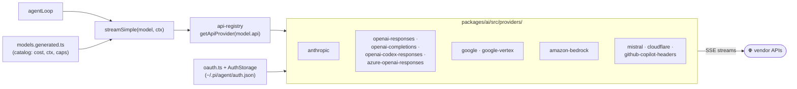

- `registerApiProvider` / `getApiProvider` ([api-registry.ts#L66](https://github.com/earendil-works/pi/blob/a455f62f72359f5f2260c16ee3ed653ce968de3d/packages/ai/src/api-registry.ts#L66-L85)) — the extension point; built-ins registered via `providers/register-builtins.ts`.
- Everything streams: the provider returns an `EventStream<AssistantMessageEvent>` which the loop re-emits as agent events — there is no non-streaming path.
- OAuth flows (Anthropic/OpenAI subscriptions, GitHub Copilot) live in `oauth.ts`; credentials persist in `~/.pi/agent/auth.json` ([memory-system](./memory-system.md) §state-on-disk).

---

## 7. Built-in tool surface

pi ships exactly **seven** coding tools — `read | bash | edit | write | grep | find | ls` ([tools/index.ts#L83-L84](https://github.com/earendil-works/pi/blob/a455f62f72359f5f2260c16ee3ed653ce968de3d/packages/coding-agent/src/core/tools/index.ts#L83-L84)) — and deliberately nothing else (no task tool, no web tool, no todo tool). Tools are TypeBox-schema'd `AgentTool`s wrapped into richer CLI-side `ToolDefinition`s that add rendering and extension hooks; custom tools enter through the same wrapper via `ExtensionAPI.registerTool`.

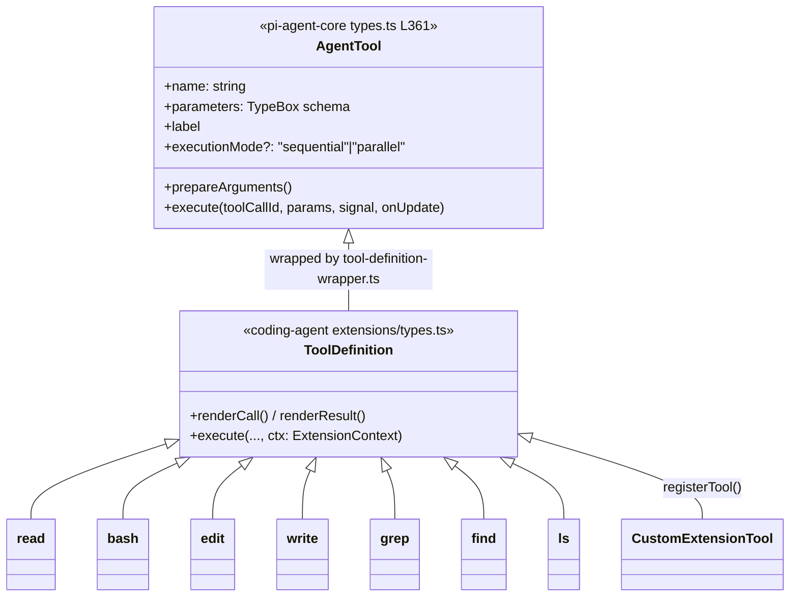

- The pipeline per call is `prepareToolCall → executePreparedToolCall → finalizeExecutedToolCall` in the loop ([agents-architecture](./agents-architecture.md) §tool-pipeline); the `beforeToolCall` seam in `prepareToolCall` is the *entire* permission substrate ([agent-permission-flow](./agent-permission-flow.md)).
- `bash` runs through `bash-executor.ts` / `exec.ts` with output accumulation + truncation (`output-accumulator.ts`, `truncate.ts`); file mutations serialize through `file-mutation-queue.ts` to keep `edit`/`write` races out.
- `--tools`, `--exclude-tools`, and read-only presets are CLI-level filters over the same seven names ([README CLI reference](https://github.com/earendil-works/pi/blob/a455f62f72359f5f2260c16ee3ed653ce968de3d/packages/coding-agent/README.md#L571)).

---

## 8. Extension system

Extensions are pi's answer to *everything* other harnesses bake in — MCP, subagents, permissions, plan mode. They are TypeScript modules loaded at startup by `jiti` (no build step) from `~/.pi/agent/extensions/`, `<project>/.pi/extensions/`, CLI `-e` paths, or installed packages; each exports a function receiving an `ExtensionAPI`. The `ExtensionRunner` ([runner.ts#L262](https://github.com/earendil-works/pi/blob/a455f62f72359f5f2260c16ee3ed653ce968de3d/packages/coding-agent/src/core/extensions/runner.ts#L262)) then fans ~30 typed lifecycle events out to every handler.

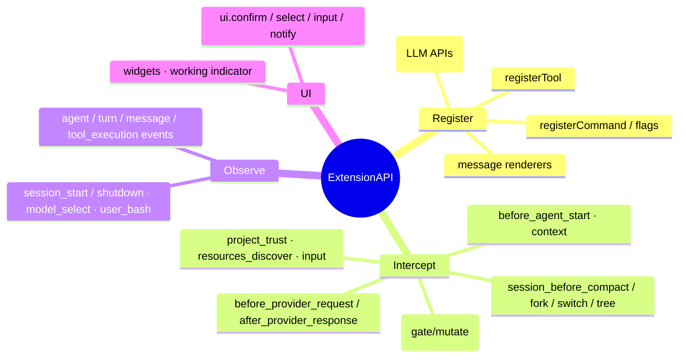

- Loader: [`loadExtensions` (loader.ts#L413)](https://github.com/earendil-works/pi/blob/a455f62f72359f5f2260c16ee3ed653ce968de3d/packages/coding-agent/src/core/extensions/loader.ts#L413) uses `createJiti` with **virtual modules** so extensions import `@earendil-works/pi-*` and `typebox` from the host binary — even inside the compiled Bun executable.
- Event taxonomy lives in [`extensions/types.ts`](https://github.com/earendil-works/pi/blob/a455f62f72359f5f2260c16ee3ed653ce968de3d/packages/coding-agent/src/core/extensions/types.ts) — per-tool typed `tool_call`/`tool_result` events with **mutable `event.input`**, which is what makes user-space permission gates and arg-rewriting possible ([agent-permission-flow](./agent-permission-flow.md)).
- Distribution: `pi install <source>` (npm/git/local) manages packages that can carry extensions + skills + prompts + themes (§13).

---

## 9. Permission & trust model

pi's headline divergence from opencode/hermes-agent: **no built-in ask/allow/deny system at all**. Gating decomposes into (1) a synchronous `tool_call` hook chain where the first extension returning `{ block: true }` wins, (2) a startup-time **project trust** gate deciding whether project-local config/extensions load at all, and (3) OS containment (containers/VMs) as the only real security boundary. Full trace with sequence diagrams in [agent-permission-flow](./agent-permission-flow.md).

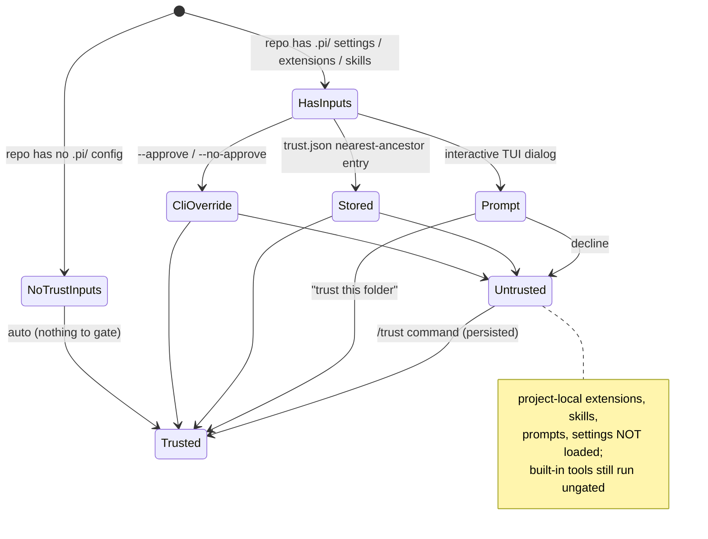

- Decision waterfall: [`resolveProjectTrusted` (project-trust.ts#L45)](https://github.com/earendil-works/pi/blob/a455f62f72359f5f2260c16ee3ed653ce968de3d/packages/coding-agent/src/core/project-trust.ts#L45-L95); persistence in file-locked `~/.pi/agent/trust.json` ([trust-manager.ts#L193](https://github.com/earendil-works/pi/blob/a455f62f72359f5f2260c16ee3ed653ce968de3d/packages/coding-agent/src/core/trust-manager.ts#L193-L229)).
- Runtime gate: `Agent.beforeToolCall` → `AgentSession._installAgentToolHooks` → `ExtensionRunner.emitToolCall` ([runner.ts#L862](https://github.com/earendil-works/pi/blob/a455f62f72359f5f2260c16ee3ed653ce968de3d/packages/coding-agent/src/core/extensions/runner.ts#L862-L883)); blocks become error tool results fed back to the model, never exceptions.
- Reference gates ship as examples (`permission-gate.ts`, `protected-paths.ts`); recommended hard boundaries are documented in [`docs/containerization.md`](https://github.com/earendil-works/pi/blob/a455f62f72359f5f2260c16ee3ed653ce968de3d/packages/coding-agent/docs/containerization.md) (OpenShell sandbox, Gondolin micro-VM, plain Docker).

---

## 10. Sessions, memory & compaction

pi's memory is **a per-session append-only JSONL *tree* plus prompt-time instruction files** — no vector store, no cross-session knowledge carryover. Each entry has an `id` + `parentId`, so one file holds every alternative branch and "where you are" is a leaf pointer; `/tree` time-travel and in-place branching are pointer moves, not file copies. Deep dive (incl. compaction internals and the settings/trust/auth stores): [memory-system](./memory-system.md).

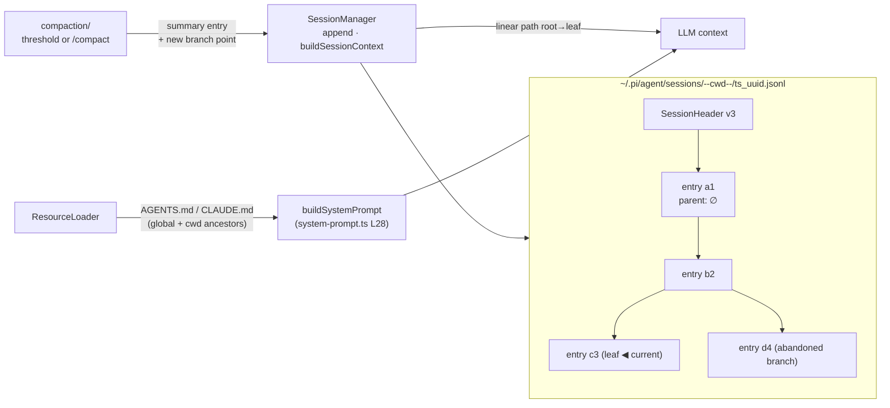

- `SessionManager` ([session-manager.ts](https://github.com/earendil-works/pi/blob/a455f62f72359f5f2260c16ee3ed653ce968de3d/packages/coding-agent/src/core/session-manager.ts)) appends every message/event; sessions are grouped per project by an encoded-cwd directory name.
- Compaction (`core/compaction/`: `compaction.ts`, `branch-summarization.ts`) summarizes old turns into the tree rather than rewriting history; extensions can intercept via `session_before_compact`.
- Instruction files (`AGENTS.md`/`CLAUDE.md`, global + project ancestors) are pi's only "long-term memory", injected at prompt time by `resource-loader.ts` → [`buildSystemPrompt` (system-prompt.ts#L28)](https://github.com/earendil-works/pi/blob/a455f62f72359f5f2260c16ee3ed653ce968de3d/packages/coding-agent/src/core/system-prompt.ts#L28).
- A second, newer copy of session+compaction machinery lives in `packages/agent/src/harness/` — the durable-harness extraction also noted in §5.

---

## 11. Subagents & multi-agent

There is **zero subagent machinery in core** — an explicit philosophy bullet, not a gap. The canonical pattern (shipped as the ~1,000-line `examples/extensions/subagent/` reference) registers a `subagent` tool that `spawn()`s **separate child `pi` OS processes** in headless JSON mode (`pi --mode json -p --no-session`), parses their JSONL event stream from stdout, and returns the last assistant message as the tool result. Context isolation = process isolation. Full flow, named-agent discovery (`~/.pi/agent/agents/*.md` frontmatter), parallel/chained orchestration, and the comparison framing live in [subagents-architecture](./subagents-architecture.md).

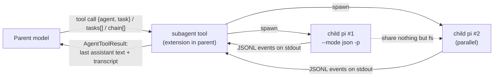

- The child boots the **exact same** runtime as a top-level run via [`runPrintMode` (print-mode.ts#L32)](https://github.com/earendil-works/pi/blob/a455f62f72359f5f2260c16ee3ed653ce968de3d/packages/coding-agent/src/modes/print-mode.ts#L32-L159) — no special "subagent" code path exists in core.
- Alternative sanctioned pattern: drive pi instances in tmux panes; the `--mode rpc` protocol (§12) exists for tighter programmatic embedding.

---

## 12. Operating modes & the TUI

One binary, four faces. `InteractiveMode` ([interactive-mode.ts#L265](https://github.com/earendil-works/pi/blob/a455f62f72359f5f2260c16ee3ed653ce968de3d/packages/coding-agent/src/modes/interactive/interactive-mode.ts#L265)) renders via `pi-tui`; print/JSON modes are single-shot; RPC mode turns the process into an embeddable JSON-RPC-ish server. JSON and RPC modes are load-bearing for the multi-agent story (§11) and for external frontends.

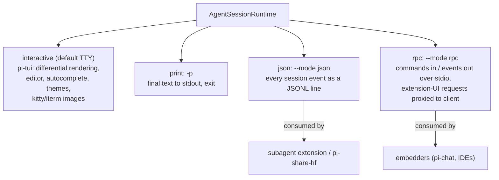

- `pi-tui` is its own published package: a minimal retained-mode component tree with **differential rendering** ([tui.ts#L283](https://github.com/earendil-works/pi/blob/a455f62f72359f5f2260c16ee3ed653ce968de3d/packages/tui/src/tui.ts#L283)), kill-ring/undo editing, fuzzy autocomplete, and terminal-image support.
- RPC protocol: typed commands/responses/events plus `extension_ui_response`, so even extension dialogs (e.g. a permission gate's confirm) round-trip to the embedding client ([rpc-mode.ts#L53](https://github.com/earendil-works/pi/blob/a455f62f72359f5f2260c16ee3ed653ce968de3d/packages/coding-agent/src/modes/rpc/rpc-mode.ts#L53)).
- HTML export (`--export`) renders a session JSONL to a shareable page (`core/export-html/`).

---

## 13. Resource loading: skills, prompts, themes, packages

The `ResourceLoader` ([resource-loader.ts](https://github.com/earendil-works/pi/blob/a455f62f72359f5f2260c16ee3ed653ce968de3d/packages/coding-agent/src/core/resource-loader.ts)) aggregates every user-space artifact from four sources — user dir, project dir (trust-gated), CLI flags, installed packages — and feeds them to the system prompt, slash-command registry, and extension runner. Skills are pi's no-MCP alternative: markdown files with name/description frontmatter, surfaced to the model as on-demand instructions (Anthropic-style agent skills).

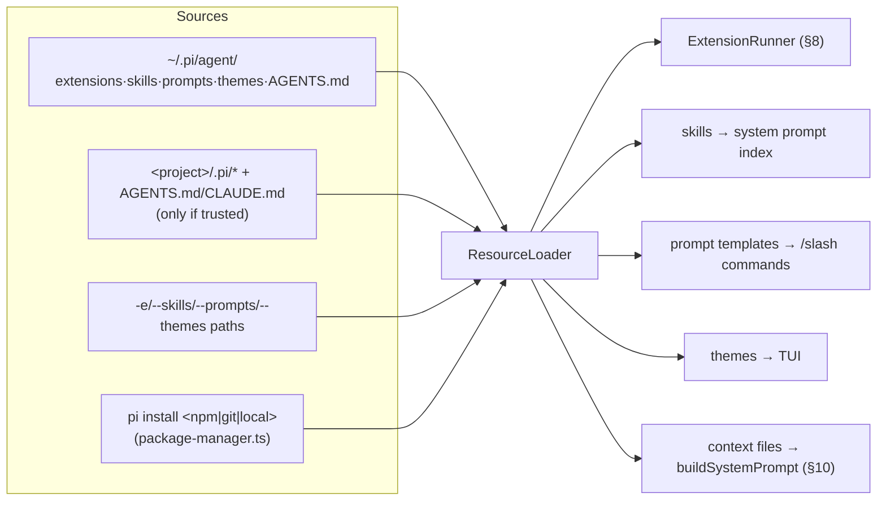

- Skills loader: [`skills.ts`](https://github.com/earendil-works/pi/blob/a455f62f72359f5f2260c16ee3ed653ce968de3d/packages/coding-agent/src/core/skills.ts) — frontmatter-validated, gitignore-aware directory scan; same format Claude Code uses, so skills are portable across harnesses.
- Prompt templates (`prompt-templates.ts`) become user-defined slash commands; built-ins live in [`slash-commands.ts`](https://github.com/earendil-works/pi/blob/a455f62f72359f5f2260c16ee3ed653ce968de3d/packages/coding-agent/src/core/slash-commands.ts) (`/compact`, `/tree`, `/trust`, `/model`, …).
- Everything reloads on session switch because resources are cwd-scoped (§4's factory closure).

---

## 14. Communication / edge cheat-sheet

| Edge | Mechanism | Transport |
| --- | --- | --- |
| User → pi (interactive) | `pi-tui` editor + keybindings → `InteractiveMode` | TTY (raw mode) |
| User/script → pi (headless) | `runPrintMode` / piped stdin merge | stdio, JSONL in `--mode json` |
| Embedder → pi | `runRpcMode` commands/responses/events | stdio JSON lines |
| Mode runner → agent | `AgentSession.prompt/steer/followUp`, `subscribe()` events | in-process |
| AgentSession → loop | `Agent` → `agentLoop` with injected `AgentLoopConfig` | in-process |
| Loop → LLM | `streamSimple` → API-shape provider | HTTPS + SSE |
| Loop → tools | `prepareToolCall` → `ToolDefinition.execute` | in-process (gated by `tool_call` hook) |
| AgentSession → extensions | `ExtensionRunner.emit*` (~30 typed events) | in-process, sequential fan-out |
| Parent → subagent | extension `spawn()`s `pi --mode json -p` | child process stdout JSONL |
| Session persistence | `SessionManager` append | JSONL files under `~/.pi/agent/sessions/` |

---

## 15. Recommended reading order

1. [`packages/coding-agent/README.md`](https://github.com/earendil-works/pi/blob/a455f62f72359f5f2260c16ee3ed653ce968de3d/packages/coding-agent/README.md) — Philosophy section first; it explains every absence you'll notice later.
2. `packages/agent/src/agent-loop.ts` — focus on `runLoop` (L155) and `prepareToolCall` (L562); the whole runtime in one file ([agents-architecture](./agents-architecture.md)).
3. `packages/agent/src/types.ts` — `AgentLoopConfig`, `AgentTool`, `AgentEvent`: the dependency-injection contract.
4. `packages/coding-agent/src/main.ts` — `main()` (L457): startup, trust, runtime factory, mode dispatch.
5. `packages/coding-agent/src/core/agent-session.ts` — the orchestrator that glues loop, tools, extensions, sessions.
6. `packages/coding-agent/src/core/extensions/types.ts` + `runner.ts` — the event taxonomy and fan-out; then `examples/extensions/permission-gate.ts` ([agent-permission-flow](./agent-permission-flow.md)).
7. `packages/coding-agent/src/core/session-manager.ts` + `core/compaction/` — the JSONL tree and compaction ([memory-system](./memory-system.md)).
8. `packages/coding-agent/examples/extensions/subagent/index.ts` — the reference multi-agent pattern ([subagents-architecture](./subagents-architecture.md)).
9. `packages/ai/src/stream.ts` + `api-registry.ts` — the provider boundary.
10. `packages/agent/src/harness/agent-harness.ts` — where the architecture is heading: the embeddable durable harness.
