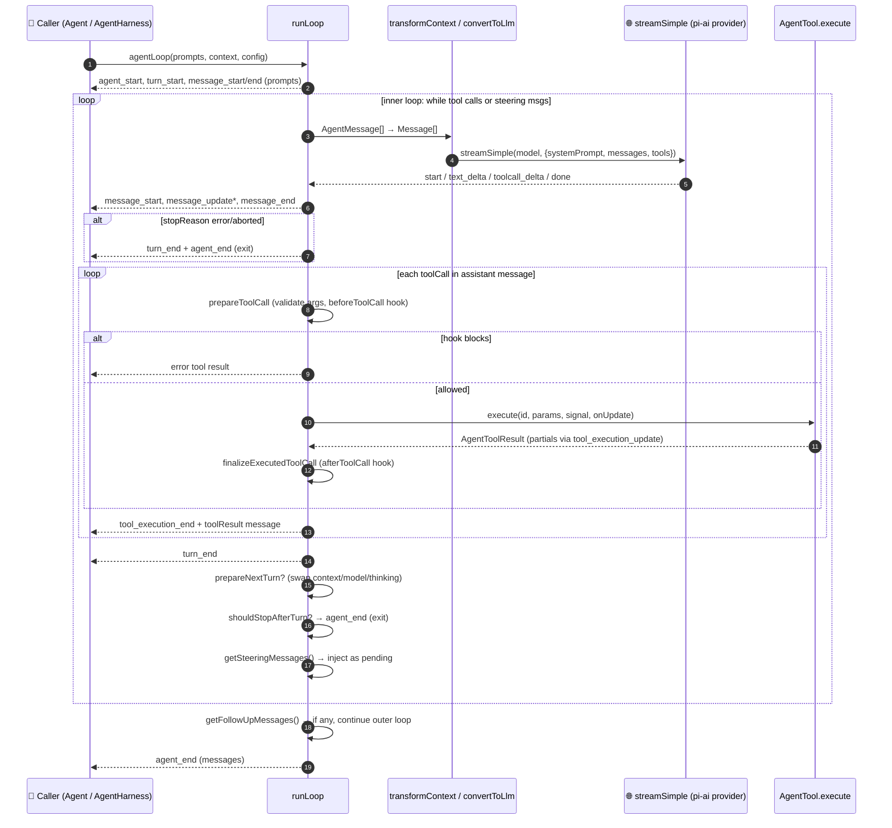
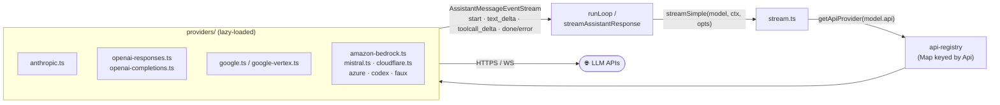
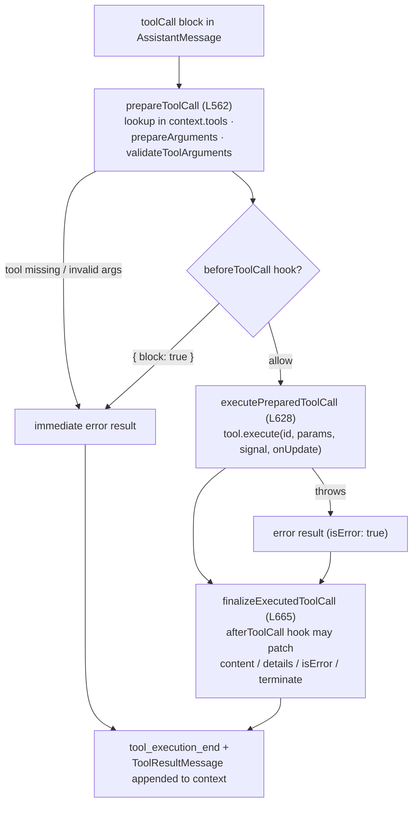
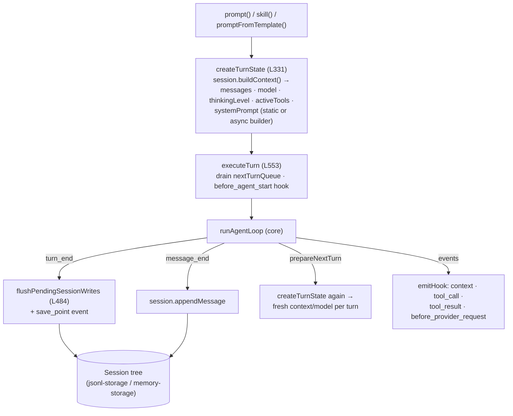

# pi — Agents architecture

> Part of [pi](./ARCHITECTURE.md) @ a455f62

## Topic purpose

This doc explains pi's core agent abstraction: how an agent is defined and instantiated, the main agent loop (prompt → LLM stream → tool calls → loop), the provider/model layer, the tool registry and tool-execution pipeline, and the session/message data model. pi is unusual among coding-agent harnesses in that the agent runtime is published as three composable npm packages rather than a monolithic CLI — the loop itself is a pure ~740-line function with zero I/O of its own, and everything stateful (transcript, sessions, tools, auth) is layered on top.

## Role in the system

pi is a monorepo with a strict three-layer stack:

| Layer | Package | What it owns |
| --- | --- | --- |
| Provider/model | `@earendil-works/pi-ai` (`packages/ai`) | Unified streaming LLM API across OpenAI/Anthropic/Google/Bedrock/etc., model catalog, API-provider registry |
| Agent runtime | `@earendil-works/pi-agent-core` (`packages/agent`) | The pure `agentLoop`, the stateful `Agent` class, and the session-tree-aware `AgentHarness` |
| Coding agent | `@earendil-works/pi-coding-agent` (`packages/coding-agent`) | `AgentSession` (CLI orchestrator), built-in coding tools, extensions, JSONL session persistence, compaction |

Upstream → downstream: the CLI's `AgentSession` wraps an `Agent`, which drives `runAgentLoop`, which calls `streamSimple` from `pi-ai` at the LLM boundary. Notably there are **two stateful wrappers** over the same low-level loop: the `Agent` class (used by the coding-agent CLI today via `sdk.ts`) and the newer `AgentHarness` (a batteries-included embeddable harness with session trees, compaction, and hook events — exported from `pi-agent-core` but not yet consumed by the CLI inside this repo). Permissions are deliberately out of scope: the README states pi "does not include a built-in permission system" and points to containerization patterns instead; gating exists only as `beforeToolCall` block hooks (see [tool pipeline](#tool-registry--execution-pipeline)).

## Key types & entry points

Core loop (`packages/agent/src/`):

- `agentLoop(prompts, context, config, signal?, streamFn?)` ([agent-loop.ts:L31](https://github.com/earendil-works/pi/blob/a455f62f72359f5f2260c16ee3ed653ce968de3d/packages/agent/src/agent-loop.ts#L31-L54)) — start a run; returns `EventStream<AgentEvent, AgentMessage[]>`.
- `agentLoopContinue(context, config, ...)` ([agent-loop.ts:L64](https://github.com/earendil-works/pi/blob/a455f62f72359f5f2260c16ee3ed653ce968de3d/packages/agent/src/agent-loop.ts#L64-L93)) — resume from an existing transcript (retries); last message must be `user`/`toolResult`.
- `runLoop` ([agent-loop.ts:L155](https://github.com/earendil-works/pi/blob/a455f62f72359f5f2260c16ee3ed653ce968de3d/packages/agent/src/agent-loop.ts#L155-L269)) — **the actual main loop** shared by both entry points (outer follow-up loop + inner turn loop).
- `streamAssistantResponse` ([agent-loop.ts:L275](https://github.com/earendil-works/pi/blob/a455f62f72359f5f2260c16ee3ed653ce968de3d/packages/agent/src/agent-loop.ts#L275-L368)) — the LLM-call boundary; converts `AgentMessage[] → Message[]` and consumes the provider event stream.
- `executeToolCalls` ([agent-loop.ts:L373](https://github.com/earendil-works/pi/blob/a455f62f72359f5f2260c16ee3ed653ce968de3d/packages/agent/src/agent-loop.ts#L373-L388)) → `prepareToolCall` (L562) → `executePreparedToolCall` (L628) → `finalizeExecutedToolCall` (L665) — the tool pipeline.

Contracts (`packages/agent/src/types.ts`):

- `AgentLoopConfig` ([types.ts:L135](https://github.com/earendil-works/pi/blob/a455f62f72359f5f2260c16ee3ed653ce968de3d/packages/agent/src/types.ts#L135-L277)) — the loop's dependency-injection surface: `model`, `convertToLlm`, `transformContext`, `getApiKey`, `shouldStopAfterTurn`, `prepareNextTurn`, `getSteeringMessages`, `getFollowUpMessages`, `beforeToolCall`, `afterToolCall`, `toolExecution`.
- `AgentTool` ([types.ts:L361](https://github.com/earendil-works/pi/blob/a455f62f72359f5f2260c16ee3ed653ce968de3d/packages/agent/src/types.ts#L361-L384)) — tool definition: TypeBox-schema `Tool` + `label`, `prepareArguments`, `execute(toolCallId, params, signal, onUpdate)`, per-tool `executionMode`.
- `AgentContext` ([types.ts:L387](https://github.com/earendil-works/pi/blob/a455f62f72359f5f2260c16ee3ed653ce968de3d/packages/agent/src/types.ts#L387-L394)) — `{ systemPrompt, messages, tools }` snapshot passed into a run.
- `AgentMessage` ([types.ts:L309](https://github.com/earendil-works/pi/blob/a455f62f72359f5f2260c16ee3ed653ce968de3d/packages/agent/src/types.ts#L304-L309)) — `Message | CustomAgentMessages[...]`, extensible via declaration merging.
- `AgentEvent` ([types.ts:L403](https://github.com/earendil-works/pi/blob/a455f62f72359f5f2260c16ee3ed653ce968de3d/packages/agent/src/types.ts#L403-L418)) — lifecycle events: `agent_start/end`, `turn_start/end`, `message_start/update/end`, `tool_execution_start/update/end`.

Stateful wrappers:

- `class Agent` ([agent.ts:L166](https://github.com/earendil-works/pi/blob/a455f62f72359f5f2260c16ee3ed653ce968de3d/packages/agent/src/agent.ts#L166-L219)) — owns transcript + queues; `prompt()` L325, `continue()` L338, `steer()` L264, `followUp()` L269, `abort()` L300, `subscribe()` L231.
- `class AgentHarness` ([harness/agent-harness.ts:L174](https://github.com/earendil-works/pi/blob/a455f62f72359f5f2260c16ee3ed653ce968de3d/packages/agent/src/harness/agent-harness.ts#L174-L220)) — session-tree-backed harness; `prompt()` L630, `skill()` L645, `promptFromTemplate()` L662, `compact()` L708, `navigateTree()` L764.
- `class Session` ([harness/session/session.ts:L82](https://github.com/earendil-works/pi/blob/a455f62f72359f5f2260c16ee3ed653ce968de3d/packages/agent/src/harness/session/session.ts#L82-L140)) + `buildSessionContext` (L22) — branching session tree → linear LLM context.

Provider layer (`packages/ai/src/`):

- `streamSimple(model, context, options)` ([stream.ts:L58](https://github.com/earendil-works/pi/blob/a455f62f72359f5f2260c16ee3ed653ce968de3d/packages/ai/src/stream.ts#L58-L65)) — the function the loop calls; resolves a provider from the API registry.
- `registerApiProvider` / `getApiProvider` ([api-registry.ts:L66](https://github.com/earendil-works/pi/blob/a455f62f72359f5f2260c16ee3ed653ce968de3d/packages/ai/src/api-registry.ts#L66-L85)) — pluggable registry keyed by API shape (e.g. `anthropic-messages`).
- `Model<TApi>` ([types.ts:L568](https://github.com/earendil-works/pi/blob/a455f62f72359f5f2260c16ee3ed653ce968de3d/packages/ai/src/types.ts#L568)), `Context` (L344), `Message` (L313), `AssistantMessageEvent` (L358), `EventStream` ([utils/event-stream.ts:L4](https://github.com/earendil-works/pi/blob/a455f62f72359f5f2260c16ee3ed653ce968de3d/packages/ai/src/utils/event-stream.ts#L4)).

CLI layer (`packages/coding-agent/src/core/`):

- `createAgentSession` ([sdk.ts:L166](https://github.com/earendil-works/pi/blob/a455f62f72359f5f2260c16ee3ed653ce968de3d/packages/coding-agent/src/core/sdk.ts#L166)) — SDK factory that wires `Agent` + `SessionManager` + `ModelRegistry` + tools.
- `class AgentSession` ([agent-session.ts:L256](https://github.com/earendil-works/pi/blob/a455f62f72359f5f2260c16ee3ed653ce968de3d/packages/coding-agent/src/core/agent-session.ts#L256-L350)) — 3,100-line orchestrator: tool registry, extensions, compaction, retry, steering UI state.
- Built-in tools: `read | bash | edit | write | grep | find | ls` ([tools/index.ts:L83](https://github.com/earendil-works/pi/blob/a455f62f72359f5f2260c16ee3ed653ce968de3d/packages/coding-agent/src/core/tools/index.ts#L83-L136)).

## The agent loop

The whole runtime hinges on `runLoop` ([agent-loop.ts:L155-L269](https://github.com/earendil-works/pi/blob/a455f62f72359f5f2260c16ee3ed653ce968de3d/packages/agent/src/agent-loop.ts#L155-L269)). It is a *pure orchestration function*: it does no I/O itself, holds no global state, and reports everything through an `emit` sink and the returned `EventStream`. Two nested loops: the **inner loop** runs turns while there are tool calls or steering messages; the **outer loop** restarts the inner loop when follow-up messages arrive after the agent would otherwise stop.



Key mechanics, all visible in the loop body:

- **Termination** happens four ways: assistant `stopReason` is `error`/`aborted` (L196-200); `shouldStopAfterTurn` returns true (L241-251); every tool result in a batch sets `terminate: true` (`shouldTerminateToolBatch`, L544-546); or there are no more tool calls, steering, or follow-up messages (L264-265).
- **Steering vs follow-up**: steering messages (`getSteeringMessages`, polled at L167 and L253) are injected *between turns mid-run*; follow-up messages (`getFollowUpMessages`, L257) only run *after* the agent would stop — this is pi's signature "queue while streaming" UX.
- **Mid-run mutation**: `prepareNextTurn` (L226-239) can swap the context, model, and thinking level between turns — this is how the harness applies compaction or model switches without restarting the run.
- **The streaming boundary** (`streamAssistantResponse`, L275-368): the partial `AssistantMessage` is pushed into `context.messages` on the provider `start` event and *replaced in place* on every delta, so consumers always see a coherent transcript; on `done`/`error` it is swapped for the final message.

```ts title="packages/agent/src/agent-loop.ts (L282-L308, trimmed)"
// Apply context transform if configured (AgentMessage[] → AgentMessage[])
let messages = context.messages;
if (config.transformContext) {
    messages = await config.transformContext(messages, signal);
}
// Convert to LLM-compatible messages (AgentMessage[] → Message[])
const llmMessages = await config.convertToLlm(messages);
const llmContext: Context = {
    systemPrompt: context.systemPrompt,
    messages: llmMessages,
    tools: context.tools,
};
const streamFunction = streamFn || streamSimple;
// Resolve API key (important for expiring tokens)
const resolvedApiKey =
    (config.getApiKey ? await config.getApiKey(config.model.provider) : undefined) || config.apiKey;
const response = await streamFunction(config.model, llmContext, { ...config, apiKey: resolvedApiKey, signal });
```

[Full file](https://github.com/earendil-works/pi/blob/a455f62f72359f5f2260c16ee3ed653ce968de3d/packages/agent/src/agent-loop.ts) · [L275-L368](https://github.com/earendil-works/pi/blob/a455f62f72359f5f2260c16ee3ed653ce968de3d/packages/agent/src/agent-loop.ts#L275-L368)

The `AgentMessage`/`Message` split is the central data-model trick: the loop carries app-defined message types (notifications, bash executions, compaction summaries) end-to-end, and only `convertToLlm` decides what the model actually sees — per its contract it "must not throw" and should filter out UI-only messages ([types.ts:L139-L164](https://github.com/earendil-works/pi/blob/a455f62f72359f5f2260c16ee3ed653ce968de3d/packages/agent/src/types.ts#L139-L164)).

## Provider/model layer (pi-ai)

The loop never talks to a vendor SDK. It calls `streamSimple(model, context, options)`, which looks up an `ApiProvider` by the model's `api` field (the wire-protocol shape, e.g. `anthropic-messages`, `openai-responses`, `openai-completions`, `google-generative-ai`) in a global registry. Builtin providers self-register lazily via the side-effect import at the top of `stream.ts` (`import "./providers/register-builtins.ts"`).



- The provider contract is `ApiProvider.stream/streamSimple: (model, context, options) → AssistantMessageEventStream` ([api-registry.ts:L11-L64](https://github.com/earendil-works/pi/blob/a455f62f72359f5f2260c16ee3ed653ce968de3d/packages/ai/src/api-registry.ts#L11-L64)); third parties can `registerApiProvider()` new API shapes at runtime, and `unregisterApiProviders(sourceId)` supports hot-reloadable extensions.
- Every provider normalizes to the same event grammar (`AssistantMessageEvent`: `start`, `text_*`, `thinking_*`, `toolcall_*`, `done`, `error` — [types.ts:L358](https://github.com/earendil-works/pi/blob/a455f62f72359f5f2260c16ee3ed653ce968de3d/packages/ai/src/types.ts#L358)) and the same final `AssistantMessage` with unified `usage`/cost accounting and `stopReason` (`"stop" | "toolUse" | "error" | "aborted" | ...`). Per the `StreamFn` contract, **failures are encoded in the stream, never thrown** ([types.ts:L15-L26](https://github.com/earendil-works/pi/blob/a455f62f72359f5f2260c16ee3ed653ce968de3d/packages/agent/src/types.ts#L15-L26)).
- `Model<TApi>` is data, not code: id, provider, `api`, baseUrl, context window, cost table, reasoning support ([types.ts:L568](https://github.com/earendil-works/pi/blob/a455f62f72359f5f2260c16ee3ed653ce968de3d/packages/ai/src/types.ts#L568)). A generated catalog (`models.generated.ts`, ~1MB) ships with the package; API keys fall back to env vars via `getEnvApiKey` ([stream.ts:L22-L30](https://github.com/earendil-works/pi/blob/a455f62f72359f5f2260c16ee3ed653ce968de3d/packages/ai/src/stream.ts#L22-L30)).

## Tool registry & execution pipeline

A tool is an `AgentTool`: a TypeBox-schema'd `Tool` definition plus an `execute` function that streams partial results via `onUpdate` and throws on failure. There is no central registry in `pi-agent-core` — the tool list rides along in `AgentContext.tools` per run. The pipeline per tool call is **prepare → (hook) → execute → (hook) → finalize**:



- **Execution modes**: default is `"parallel"` — all calls in an assistant message are *prepared sequentially* (so `beforeToolCall` hooks run in order), then allowed tools execute concurrently; results are emitted in completion order but tool-result *messages* in assistant source order (`executeToolCallsParallel`, [agent-loop.ts:L451-L516](https://github.com/earendil-works/pi/blob/a455f62f72359f5f2260c16ee3ed653ce968de3d/packages/agent/src/agent-loop.ts#L451-L516)). Any tool can force `executionMode: "sequential"` for the whole batch (L380-387) — the coding agent uses a file-mutation queue (`withFileMutationQueue`, [tools/file-mutation-queue.ts](https://github.com/earendil-works/pi/blob/a455f62f72359f5f2260c16ee3ed653ce968de3d/packages/coding-agent/src/core/tools/file-mutation-queue.ts)) to serialize edits.
- **The permission story lives here**: `beforeToolCall → { block: true, reason }` is the only gate. In the CLI, `AgentSession._installAgentToolHooks()` ([agent-session.ts:L403](https://github.com/earendil-works/pi/blob/a455f62f72359f5f2260c16ee3ed653ce968de3d/packages/coding-agent/src/core/agent-session.ts#L403-L440)) forwards both hooks to extension `tool_call`/`tool_result` handlers, so blocking/asking is an *extension concern*, not core.
- **CLI tool registry**: the coding agent keeps a definition-first registry (`_toolRegistry` / `_toolDefinitions` maps in `AgentSession`, [agent-session.ts:L316-L319](https://github.com/earendil-works/pi/blob/a455f62f72359f5f2260c16ee3ed653ce968de3d/packages/coding-agent/src/core/agent-session.ts#L316-L319)) merging seven factory-built builtins (`createTool(toolName, cwd, options)`, [tools/index.ts:L117-L136](https://github.com/earendil-works/pi/blob/a455f62f72359f5f2260c16ee3ed653ce968de3d/packages/coding-agent/src/core/tools/index.ts#L117-L136)) with SDK `customTools` and extension-registered tools, filtered by allow/deny lists; the default active set is `[read, bash, edit, write]`.

```ts title="packages/agent/src/types.ts (L361-L384, trimmed)"
export interface AgentTool<TParameters extends TSchema = TSchema, TDetails = any> extends Tool<TParameters> {
    label: string;
    /** Optional compatibility shim for raw tool-call arguments before schema validation. */
    prepareArguments?: (args: unknown) => Static<TParameters>;
    /** Execute the tool call. Throw on failure instead of encoding errors in `content`. */
    execute: (
        toolCallId: string,
        params: Static<TParameters>,
        signal?: AbortSignal,
        onUpdate?: AgentToolUpdateCallback<TDetails>,
    ) => Promise<AgentToolResult<TDetails>>;
    /** Per-tool execution mode override ("sequential" | "parallel"). */
    executionMode?: ToolExecutionMode;
}
```

[L361-L384](https://github.com/earendil-works/pi/blob/a455f62f72359f5f2260c16ee3ed653ce968de3d/packages/agent/src/types.ts#L361-L384)

## The `Agent` class — stateful wrapper

`Agent` ([agent.ts:L166](https://github.com/earendil-works/pi/blob/a455f62f72359f5f2260c16ee3ed653ce968de3d/packages/agent/src/agent.ts#L166-L219)) is the unit the coding-agent CLI instantiates. It owns an `AgentState` (`systemPrompt`, `model`, `thinkingLevel`, `tools`, `messages`, `isStreaming`, `streamingMessage`, `pendingToolCalls` — [types.ts:L317-L342](https://github.com/earendil-works/pi/blob/a455f62f72359f5f2260c16ee3ed653ce968de3d/packages/agent/src/types.ts#L317-L342)), two `PendingMessageQueue`s (steering + follow-up, each draining `"all"` or `"one-at-a-time"`), and a single `activeRun` with its `AbortController`.

The translation from object state to loop config is mechanical: `prompt()` snapshots state into an `AgentContext` (`createContextSnapshot`, L414) and binds its queues and hooks into an `AgentLoopConfig` (`createLoopConfig`, [agent.ts:L422-L449](https://github.com/earendil-works/pi/blob/a455f62f72359f5f2260c16ee3ed653ce968de3d/packages/agent/src/agent.ts#L422-L449)); `processEvents` (L509-L556) then reduces loop events back into state (push on `message_end`, track `pendingToolCalls`, capture `errorMessage`) before awaiting subscribers in order — a run is only "idle" after all `agent_end` listeners settle. One agent, one run at a time: a second `prompt()` while streaming throws and tells you to `steer()`/`followUp()` instead (L327-L334).

How the CLI builds it ([sdk.ts:L293-L359](https://github.com/earendil-works/pi/blob/a455f62f72359f5f2260c16ee3ed653ce968de3d/packages/coding-agent/src/core/sdk.ts#L293-L359), trimmed):

```ts title="packages/coding-agent/src/core/sdk.ts (L293-L359, trimmed)"
agent = new Agent({
    initialState: { systemPrompt: "", model, thinkingLevel, tools: [] },
    convertToLlm: convertToLlmWithBlockImages,
    streamFn: async (model, context, options) => {
        const auth = await modelRegistry.getApiKeyAndHeaders(model);   // OAuth / env / auth.json
        if (!auth.ok) throw new Error(auth.error);
        const providerRetrySettings = settingsManager.getProviderRetrySettings();
        [...]
        return streamSimple(model, context, {
            ...options, apiKey: auth.apiKey, timeoutMs,
            maxRetries: options?.maxRetries ?? providerRetrySettings.maxRetries,
            headers: mergeProviderAttributionHeaders(model, settingsManager, options?.sessionId, auth.headers, options?.headers),
        });
    },
    onPayload: async (payload) => extensionRunnerRef.current?.emitBeforeProviderRequest(payload) ?? payload,
    sessionId: sessionManager.getSessionId(),
    transformContext: async (messages) => extensionRunnerRef.current?.emitContext(messages) ?? messages,
    steeringMode: settingsManager.getSteeringMode(),
    followUpMode: settingsManager.getFollowUpMode(),
    [...]
});
```

[Full file](https://github.com/earendil-works/pi/blob/a455f62f72359f5f2260c16ee3ed653ce968de3d/packages/coding-agent/src/core/sdk.ts) — note every injection point (`streamFn` for auth/retry, `transformContext` for extension context rewriting, `onPayload` for raw request interception) is just a closure over CLI services; the core packages stay vendor- and policy-free.

## `AgentHarness` — session-tree-aware runtime

`AgentHarness` ([harness/agent-harness.ts:L174](https://github.com/earendil-works/pi/blob/a455f62f72359f5f2260c16ee3ed653ce968de3d/packages/agent/src/harness/agent-harness.ts#L174)) is the newer, higher-level embeddable runtime in `pi-agent-core` (exported via [index.ts:L5](https://github.com/earendil-works/pi/blob/a455f62f72359f5f2260c16ee3ed653ce968de3d/packages/agent/src/index.ts#L1-L44); consumed by external projects like pi-chat rather than this repo's CLI). Where `Agent` holds the transcript in memory, the harness treats the **`Session` tree as the source of truth** and rebuilds its working state from it before every turn:



- `createLoopConfig` ([L421-L470](https://github.com/earendil-works/pi/blob/a455f62f72359f5f2260c16ee3ed653ce968de3d/packages/agent/src/harness/agent-harness.ts#L421-L470)) maps every core-loop hook onto a typed harness event (`context`, `tool_call`, `tool_result`), so embedders subscribe to events instead of passing callbacks; `createStreamFn` (L376-L407) resolves auth per request via `getApiKeyAndHeaders` and exposes `before_provider_request`/`after_provider_response` interception.
- Lifecycle is a phase machine (`idle | turn | compaction | branch_summary`): `prompt()` throws `"busy"` unless idle (L630-L643). `compact()` (L708) and `navigateTree()` (L764) are first-class idle-only operations that write `compaction`/`branch_summary` entries back into the session tree.
- All session mutations during a run are buffered as `PendingSessionWrite`s and flushed at `turn_end`/`agent_end` (`flushPendingSessionWrites`, L484-L508; `handleAgentEvent`, L510-L537), giving crash-consistent save points.
- The harness also abstracts the host: `ExecutionEnv = FileSystem + Shell` ([harness/types.ts:L268-L332](https://github.com/earendil-works/pi/blob/a455f62f72359f5f2260c16ee3ed653ce968de3d/packages/agent/src/harness/types.ts#L268-L332)) with a Node implementation in `harness/env/nodejs.ts`, plus first-class `Skill` (L46) and `PromptTemplate` (L60) resources invoked by formatting them into user prompts (`formatSkillInvocation`).

## Session & message data model

Two parallel persistence stacks exist (CLI-side `SessionManager` predates the harness `Session`; both share the same conceptual model — version 3 of the CLI format, `CURRENT_SESSION_VERSION` at [session-manager.ts:L30](https://github.com/earendil-works/pi/blob/a455f62f72359f5f2260c16ee3ed653ce968de3d/packages/coding-agent/src/core/session-manager.ts#L30)). The shared idea: a session is an **append-only tree of entries**, not a linear log. Each entry has `{ id, parentId, timestamp }`; a *leaf pointer* selects the active branch, which makes branching, "rewind to here", and branch summaries cheap.

Entry taxonomy (`SessionTreeEntry`, [harness/types.ts:L334-L420](https://github.com/earendil-works/pi/blob/a455f62f72359f5f2260c16ee3ed653ce968de3d/packages/agent/src/harness/types.ts#L334-L420)): `message`, `thinking_level_change`, `model_change`, `active_tools_change`, `compaction`, `branch_summary`, `custom`, `custom_message`, `label`, `session_info`, `leaf`. Storage is behind a `SessionStorage` interface (L440) with JSONL (`jsonl-storage.ts`) and in-memory (`memory-storage.ts`) implementations.

`buildSessionContext` ([session/session.ts:L22-L80](https://github.com/earendil-works/pi/blob/a455f62f72359f5f2260c16ee3ed653ce968de3d/packages/agent/src/harness/session/session.ts#L22-L80)) is the read path — it folds the root-to-leaf entry path into the live context, which is exactly how memory/compaction takes effect:

```ts title="packages/agent/src/harness/session/session.ts (L28-L69, trimmed)"
for (const entry of pathEntries) {
    if (entry.type === "thinking_level_change") thinkingLevel = entry.thinkingLevel;
    else if (entry.type === "model_change") model = { provider: entry.provider, modelId: entry.modelId };
    else if (entry.type === "message" && entry.message.role === "assistant")
        model = { provider: entry.message.provider, modelId: entry.message.model };
    else if (entry.type === "active_tools_change") activeToolNames = [...entry.activeToolNames];
    else if (entry.type === "compaction") compaction = entry;
}
[...]
if (compaction) {
    // Inject the summary as a message, then keep only entries from firstKeptEntryId onward
    messages.push(createCompactionSummaryMessage(compaction.summary, compaction.tokensBefore, ...));
    [...]
}
```

[L22-L80](https://github.com/earendil-works/pi/blob/a455f62f72359f5f2260c16ee3ed653ce968de3d/packages/agent/src/harness/session/session.ts#L22-L80)

Message model in one line each:

- `Message = UserMessage | AssistantMessage | ToolResultMessage` ([ai/types.ts:L313](https://github.com/earendil-works/pi/blob/a455f62f72359f5f2260c16ee3ed653ce968de3d/packages/ai/src/types.ts#L282-L313)); `AssistantMessage` carries `content[]` (text/thinking/toolCall blocks), `usage` with cost, `stopReason`, and the `provider/model` that produced it.
- `AgentMessage = Message | CustomAgentMessages[...]` — apps add roles (e.g. the CLI's `BashExecutionMessage`, compaction summaries in `core/messages.ts`) via declaration merging; `convertToLlm` strips/converts them at the provider boundary.
- The CLI persists one JSONL file per session under the project sessions dir, header `{ type: "session", version, id, cwd, parentSession }` ([session-manager.ts:L32-L44](https://github.com/earendil-works/pi/blob/a455f62f72359f5f2260c16ee3ed653ce968de3d/packages/coding-agent/src/core/session-manager.ts#L32-L44)), with the same tree-entry shape (`SessionMessageEntry` et al., L46-L60).

## Comparative notes (for the cross-repo study)

- **Loop purity**: pi pushes further than most harnesses in separating the loop (pure function, DI'd `streamFn`/hooks) from state (`Agent`/`AgentHarness`) and from policy (CLI extensions). The loop is reusable headless, in tests (`faux` provider), via RPC, or in pi-chat.
- **Permissions**: intentionally absent from core; the only enforcement point is the `beforeToolCall` block hook + external sandboxing (containerization docs). Contrast with harnesses that ship permission state machines.
- **Memory**: no vector/semantic memory; "memory" = the session tree + compaction entries + branch summaries folded into context at read time, plus skills/context files injected by the system-prompt builder.
- **Multi-agent**: nothing subagent-shaped in `pi-agent-core`; concurrency exists only at the tool-batch level. Subagent behavior, if any, is an extension/CLI concern (see [ARCHITECTURE.md](./ARCHITECTURE.md)).

## Source files

| File | Ranges | GitHub |
| --- | --- | --- |
| `packages/agent/src/agent-loop.ts` | L31-L93, L155-L269, L275-L368, L373-L516, L544-L742 | [link](https://github.com/earendil-works/pi/blob/a455f62f72359f5f2260c16ee3ed653ce968de3d/packages/agent/src/agent-loop.ts) |
| `packages/agent/src/types.ts` | L15-L26, L135-L277, L284-L342, L361-L418 | [link](https://github.com/earendil-works/pi/blob/a455f62f72359f5f2260c16ee3ed653ce968de3d/packages/agent/src/types.ts) |
| `packages/agent/src/agent.ts` | L96-L152, L166-L219, L264-L271, L325-L365, L414-L449, L451-L556 | [link](https://github.com/earendil-works/pi/blob/a455f62f72359f5f2260c16ee3ed653ce968de3d/packages/agent/src/agent.ts) |
| `packages/agent/src/harness/agent-harness.ts` | L174-L220, L300-L407, L421-L537, L553-L660, L708-L716, L764-L768 | [link](https://github.com/earendil-works/pi/blob/a455f62f72359f5f2260c16ee3ed653ce968de3d/packages/agent/src/harness/agent-harness.ts) |
| `packages/agent/src/harness/session/session.ts` | L22-L140 | [link](https://github.com/earendil-works/pi/blob/a455f62f72359f5f2260c16ee3ed653ce968de3d/packages/agent/src/harness/session/session.ts) |
| `packages/agent/src/harness/types.ts` | L46-L70, L268-L332, L334-L458 (symbol scan) | [link](https://github.com/earendil-works/pi/blob/a455f62f72359f5f2260c16ee3ed653ce968de3d/packages/agent/src/harness/types.ts) |
| `packages/agent/src/index.ts` | L1-L44 | [link](https://github.com/earendil-works/pi/blob/a455f62f72359f5f2260c16ee3ed653ce968de3d/packages/agent/src/index.ts) |
| `packages/ai/src/stream.ts` | L1-L75 | [link](https://github.com/earendil-works/pi/blob/a455f62f72359f5f2260c16ee3ed653ce968de3d/packages/ai/src/stream.ts) |
| `packages/ai/src/api-registry.ts` | L11-L96 (symbol scan) | [link](https://github.com/earendil-works/pi/blob/a455f62f72359f5f2260c16ee3ed653ce968de3d/packages/ai/src/api-registry.ts) |
| `packages/ai/src/types.ts` | L17, L282-L358, L568 (symbol scan) | [link](https://github.com/earendil-works/pi/blob/a455f62f72359f5f2260c16ee3ed653ce968de3d/packages/ai/src/types.ts) |
| `packages/ai/src/providers/register-builtins.ts` | L1-L40 | [link](https://github.com/earendil-works/pi/blob/a455f62f72359f5f2260c16ee3ed653ce968de3d/packages/ai/src/providers/register-builtins.ts) |
| `packages/coding-agent/src/core/agent-session.ts` | L150-L409 | [link](https://github.com/earendil-works/pi/blob/a455f62f72359f5f2260c16ee3ed653ce968de3d/packages/coding-agent/src/core/agent-session.ts) |
| `packages/coding-agent/src/core/sdk.ts` | L166-L178, L254-L369 | [link](https://github.com/earendil-works/pi/blob/a455f62f72359f5f2260c16ee3ed653ce968de3d/packages/coding-agent/src/core/sdk.ts) |
| `packages/coding-agent/src/core/tools/index.ts` | L1-L196 | [link](https://github.com/earendil-works/pi/blob/a455f62f72359f5f2260c16ee3ed653ce968de3d/packages/coding-agent/src/core/tools/index.ts) |
| `packages/coding-agent/src/core/session-manager.ts` | L1-L60 | [link](https://github.com/earendil-works/pi/blob/a455f62f72359f5f2260c16ee3ed653ce968de3d/packages/coding-agent/src/core/session-manager.ts) |
| `packages/agent/README.md` | L1-L40 (orientation) | [link](https://github.com/earendil-works/pi/blob/a455f62f72359f5f2260c16ee3ed653ce968de3d/packages/agent/README.md) |
| `README.md` | L1-L120 (orientation) | [link](https://github.com/earendil-works/pi/blob/a455f62f72359f5f2260c16ee3ed653ce968de3d/README.md) |
