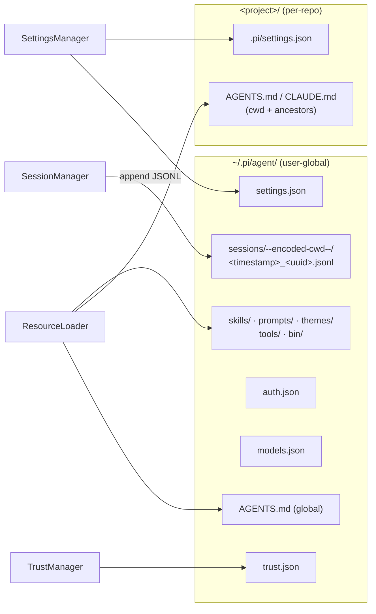
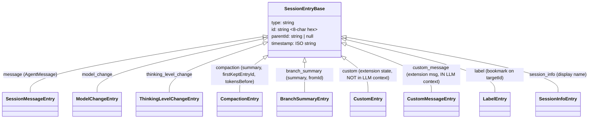
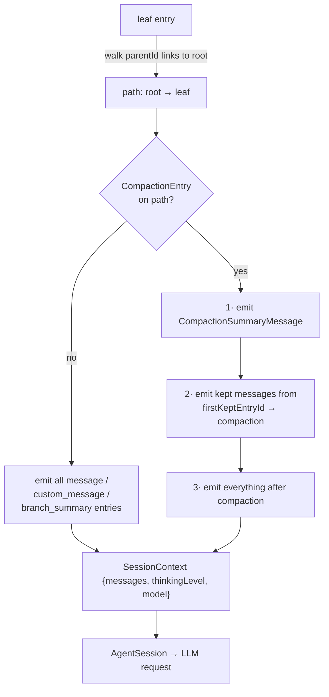
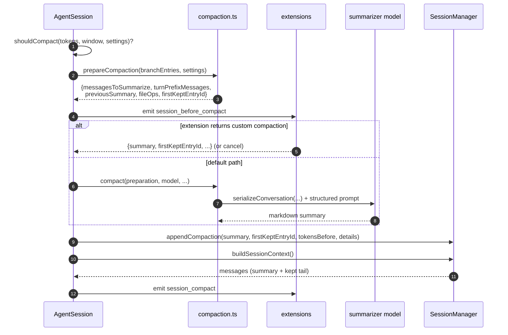

# pi — Memory system

> Part of [pi](./ARCHITECTURE.md) @ a455f62

## Module purpose

This doc covers how pi persists state and "remembers" things: where sessions live on disk, the tree-shaped conversation history model, how context is rebuilt for each LLM turn, automatic compaction and branch summarization, project instruction files (`AGENTS.md`/`CLAUDE.md`), and the remaining persistent stores (settings, trust, auth). For the comparative study, the load-bearing fact is that **pi's memory is a per-session append-only JSONL tree plus prompt-time instruction files — there is no semantic/vector memory store and no automatic cross-session knowledge carryover** beyond resuming or forking session files.

## Role in the system

The session layer is owned by `SessionManager` in `packages/coding-agent/src/core/session-manager.ts`, which `AgentSession` (the orchestrator in `agent-session.ts`) uses to append every message and to rebuild LLM context. Compaction lives in `packages/coding-agent/src/core/compaction/` and is driven by `AgentSession` on threshold or `/compact`. Instruction files are discovered by `resource-loader.ts` and injected by `system-prompt.ts`. A parallel, newer copy of the session + compaction machinery exists in `packages/agent/src/harness/` (the in-progress "durable harness" extraction — see the last section).

---

## 1. Where pi keeps state on disk

Everything user-global lives under `~/.pi/agent/` (the dir name comes from `CONFIG_DIR_NAME` at [config.ts:467](https://github.com/earendil-works/pi/blob/a455f62f72359f5f2260c16ee3ed653ce968de3d/packages/coding-agent/src/config.ts#L467), overridable via the `PI_CODING_AGENT_DIR` env var, [config.ts:471-472](https://github.com/earendil-works/pi/blob/a455f62f72359f5f2260c16ee3ed653ce968de3d/packages/coding-agent/src/config.ts#L471-L472)). Project-local state lives in `<project>/.pi/`.



| Path | What persists | Defined at |
| --- | --- | --- |
| `~/.pi/agent/sessions/--<cwd>--/<ts>_<uuid>.jsonl` | full conversation trees | [session-manager.ts:438-443](https://github.com/earendil-works/pi/blob/a455f62f72359f5f2260c16ee3ed653ce968de3d/packages/coding-agent/src/core/session-manager.ts#L438-L443), [config.ts:536](https://github.com/earendil-works/pi/blob/a455f62f72359f5f2260c16ee3ed653ce968de3d/packages/coding-agent/src/config.ts#L536) |
| `~/.pi/agent/settings.json` + `<project>/.pi/settings.json` | settings cascade (incl. compaction tuning) | [settings-manager.ts:181-190](https://github.com/earendil-works/pi/blob/a455f62f72359f5f2260c16ee3ed653ce968de3d/packages/coding-agent/src/core/settings-manager.ts#L181-L190) |
| `~/.pi/agent/trust.json` | per-directory trust decisions (`true/false/null` keyed by path) | [trust-manager.ts:197](https://github.com/earendil-works/pi/blob/a455f62f72359f5f2260c16ee3ed653ce968de3d/packages/coding-agent/src/core/trust-manager.ts#L197) |
| `~/.pi/agent/auth.json` | provider credentials / OAuth tokens | [config.ts:511](https://github.com/earendil-works/pi/blob/a455f62f72359f5f2260c16ee3ed653ce968de3d/packages/coding-agent/src/config.ts#L511) |
| `~/.pi/agent/models.json` | user-defined model registry | [config.ts:506](https://github.com/earendil-works/pi/blob/a455f62f72359f5f2260c16ee3ed653ce968de3d/packages/coding-agent/src/config.ts#L506) |
| `~/.pi/agent/skills/`, `prompts/`, `themes/`, `tools/`, `bin/` | reusable prompt-time resources & managed binaries | [config.ts:501-536](https://github.com/earendil-works/pi/blob/a455f62f72359f5f2260c16ee3ed653ce968de3d/packages/coding-agent/src/config.ts#L501-L536) |

The session dir name encodes the working directory (`/` → `-`, wrapped in `--`), so sessions are grouped per project ([session-manager.ts:438-443](https://github.com/earendil-works/pi/blob/a455f62f72359f5f2260c16ee3ed653ce968de3d/packages/coding-agent/src/core/session-manager.ts#L438-L443)). Notably, pi marks paths as ignored for Dropbox/iCloud-style sync via xattrs (`markPathIgnoredByCloudSync`, [utils/paths.ts:103-118](https://github.com/earendil-works/pi/blob/a455f62f72359f5f2260c16ee3ed653ce968de3d/packages/coding-agent/src/utils/paths.ts#L103-L118)).

---

## 2. Session persistence — an append-only JSONL *tree*

pi's central memory structure is the session file: line 1 is a `SessionHeader` (`{type:"session", version:3, id, cwd, parentSession?}`, [session-manager.ts:32](https://github.com/earendil-works/pi/blob/a455f62f72359f5f2260c16ee3ed653ce968de3d/packages/coding-agent/src/core/session-manager.ts#L32)); every subsequent line is a `SessionEntry` with an 8-char hex `id` and a `parentId` ([session-manager.ts:46-51](https://github.com/earendil-works/pi/blob/a455f62f72359f5f2260c16ee3ed653ce968de3d/packages/coding-agent/src/core/session-manager.ts#L46-L51)). Because entries link to parents rather than simply following each other, **one file stores a whole tree of alternative conversation branches**, and "where you are" is just the current leaf pointer. This makes `/tree` time-travel, in-place branching, and branch summaries cheap — no file copying.

The entry-type union ([session-manager.ts:140-152](https://github.com/earendil-works/pi/blob/a455f62f72359f5f2260c16ee3ed653ce968de3d/packages/coding-agent/src/core/session-manager.ts#L140-L152)):



Key mechanics:

- **Durable state beyond messages**: model switches, thinking-level changes, compactions, labels, and extension state are all first-class entries — the session log *is* the agent's durable state, not just a transcript (this principle is spelled out in [durable-harness.md](https://github.com/earendil-works/pi/blob/a455f62f72359f5f2260c16ee3ed653ce968de3d/packages/agent/docs/durable-harness.md): "Treat session as all durable agent state, not just transcript history").
- **Extension memory**: `appendCustomEntry()` persists arbitrary JSON per extension *outside* LLM context; `appendCustomMessageEntry()` injects content *into* context ([session-manager.ts:1012](https://github.com/earendil-works/pi/blob/a455f62f72359f5f2260c16ee3ed653ce968de3d/packages/coding-agent/src/core/session-manager.ts#L1012), docs in [session-format.md](https://github.com/earendil-works/pi/blob/a455f62f72359f5f2260c16ee3ed653ce968de3d/packages/coding-agent/docs/session-format.md)).
- **Versioned migrations**: v1 (linear) → v2 (tree ids) → v3 (`hookMessage`→`custom` rename) run automatically on load and rewrite the file (`migrateV1ToV2` [L226](https://github.com/earendil-works/pi/blob/a455f62f72359f5f2260c16ee3ed653ce968de3d/packages/coding-agent/src/core/session-manager.ts#L226), `migrateV2ToV3` [L255](https://github.com/earendil-works/pi/blob/a455f62f72359f5f2260c16ee3ed653ce968de3d/packages/coding-agent/src/core/session-manager.ts#L255), applied in `setSessionFile` [L811-813](https://github.com/earendil-works/pi/blob/a455f62f72359f5f2260c16ee3ed653ce968de3d/packages/coding-agent/src/core/session-manager.ts#L811-L813)).
- **Lifecycle constructors**: `SessionManager.create()` [L1385](https://github.com/earendil-works/pi/blob/a455f62f72359f5f2260c16ee3ed653ce968de3d/packages/coding-agent/src/core/session-manager.ts#L1385), `.open()` [L1396](https://github.com/earendil-works/pi/blob/a455f62f72359f5f2260c16ee3ed653ce968de3d/packages/coding-agent/src/core/session-manager.ts#L1396), `.continueRecent()` [L1412](https://github.com/earendil-works/pi/blob/a455f62f72359f5f2260c16ee3ed653ce968de3d/packages/coding-agent/src/core/session-manager.ts#L1412) (powers `pi -c`), `.inMemory()` [L1423](https://github.com/earendil-works/pi/blob/a455f62f72359f5f2260c16ee3ed653ce968de3d/packages/coding-agent/src/core/session-manager.ts#L1423) (powers `--no-session` ephemeral mode), `.forkFrom()` [L1434](https://github.com/earendil-works/pi/blob/a455f62f72359f5f2260c16ee3ed653ce968de3d/packages/coding-agent/src/core/session-manager.ts#L1434) (`/fork`, `/clone` — writes a new header carrying `parentSession` provenance).

### Lazy first flush

A subtle persistence detail: `_persist()` does **not** write the file until the first assistant message exists, so abandoned prompts never litter the sessions dir. Once the first assistant message arrives, the whole buffered entry list is flushed with the exclusive `wx` flag, then subsequent entries are appended line-by-line.

```ts title="packages/coding-agent/src/core/session-manager.ts (L908-935)"
_persist(entry: SessionEntry): void {
    if (!this.persist || !this.sessionFile) return;

    const hasAssistant = this.fileEntries.some((e) => e.type === "message" && e.message.role === "assistant");
    if (!hasAssistant) {
        if (this.flushed) {
            appendFileSync(this.sessionFile, `${JSON.stringify(entry)}\n`);
        } else {
            // Mark as not flushed so when assistant arrives, all entries get written
            this.flushed = false;
        }
        return;
    }

    if (!this.flushed) {
        const fd = openSync(this.sessionFile, "wx");
        try {
            for (const e of this.fileEntries) {
                writeFileSync(fd, `${JSON.stringify(e)}\n`);
            }
        } finally {
            closeSync(fd);
        }
        this.flushed = true;
    } else {
        appendFileSync(this.sessionFile, `${JSON.stringify(entry)}\n`);
    }
}
```

[L908-935 on GitHub](https://github.com/earendil-works/pi/blob/a455f62f72359f5f2260c16ee3ed653ce968de3d/packages/coding-agent/src/core/session-manager.ts#L908-L935)

---

## 3. Conversation history model — rebuilding LLM context from the tree

Before every turn, the message list sent to the model is *derived*, never stored: the free function `buildSessionContext()` ([session-manager.ts:325-432](https://github.com/earendil-works/pi/blob/a455f62f72359f5f2260c16ee3ed653ce968de3d/packages/coding-agent/src/core/session-manager.ts#L325-L432)) walks from the current leaf up to the root, then replays the path forward. Along the way it extracts the latest model and thinking-level (from change entries), and rewrites history through the most recent `CompactionEntry` on the path.



The compaction-aware emission is the heart of pi's context-window memory:

```ts title="packages/coding-agent/src/core/session-manager.ts (L400-417)"
if (compaction) {
    // Emit summary first
    messages.push(createCompactionSummaryMessage(compaction.summary, compaction.tokensBefore, compaction.timestamp));

    // Find compaction index in path
    const compactionIdx = path.findIndex((e) => e.type === "compaction" && e.id === compaction.id);

    // Emit kept messages (before compaction, starting from firstKeptEntryId)
    let foundFirstKept = false;
    for (let i = 0; i < compactionIdx; i++) {
        const entry = path[i];
        if (entry.id === compaction.firstKeptEntryId) {
            foundFirstKept = true;
        }
        if (foundFirstKept) {
            appendMessage(entry);
        }
    }
    [...]
```

[L325-432 on GitHub](https://github.com/earendil-works/pi/blob/a455f62f72359f5f2260c16ee3ed653ce968de3d/packages/coding-agent/src/core/session-manager.ts#L325-L432)

So nothing is ever deleted: messages "forgotten" by compaction stay in the JSONL file and remain reachable via `/tree`; they're simply skipped when projecting the path into LLM messages.

---

## 4. Context-window management — auto-compaction

Compaction logic lives in `packages/coding-agent/src/core/compaction/compaction.ts`; `AgentSession` decides *when* and orchestrates extension overrides.

**Trigger.** After each turn, the latest context size is computed — preferring real provider usage (`calculateContextTokens`, [compaction.ts:135-137](https://github.com/earendil-works/pi/blob/a455f62f72359f5f2260c16ee3ed653ce968de3d/packages/coding-agent/src/core/compaction/compaction.ts#L135-L137)) and falling back to a chars/4 heuristic (`estimateTokens`, [L250](https://github.com/earendil-works/pi/blob/a455f62f72359f5f2260c16ee3ed653ce968de3d/packages/coding-agent/src/core/compaction/compaction.ts#L250)) for trailing messages without usage data (`estimateContextTokens`, [L186-214](https://github.com/earendil-works/pi/blob/a455f62f72359f5f2260c16ee3ed653ce968de3d/packages/coding-agent/src/core/compaction/compaction.ts#L186-L214)):

```ts title="packages/coding-agent/src/core/compaction/compaction.ts (L115-125, L219-222)"
export interface CompactionSettings {
    enabled: boolean;
    reserveTokens: number;
    keepRecentTokens: number;
}

export const DEFAULT_COMPACTION_SETTINGS: CompactionSettings = {
    enabled: true,
    reserveTokens: 16384,
    keepRecentTokens: 20000,
};
[...]
export function shouldCompact(contextTokens: number, contextWindow: number, settings: CompactionSettings): boolean {
    if (!settings.enabled) return false;
    return contextTokens > contextWindow - settings.reserveTokens;
}
```

[L115-125](https://github.com/earendil-works/pi/blob/a455f62f72359f5f2260c16ee3ed653ce968de3d/packages/coding-agent/src/core/compaction/compaction.ts#L115-L125) · [L219-222](https://github.com/earendil-works/pi/blob/a455f62f72359f5f2260c16ee3ed653ce968de3d/packages/coding-agent/src/core/compaction/compaction.ts#L219-L222)

**Flow.** `AgentSession` checks the threshold ([agent-session.ts:1855-1876](https://github.com/earendil-works/pi/blob/a455f62f72359f5f2260c16ee3ed653ce968de3d/packages/coding-agent/src/core/agent-session.ts#L1855-L1876) — with a guard against stale pre-compaction usage falsely re-triggering) and runs `_runAutoCompaction()` ([L1881-2057](https://github.com/earendil-works/pi/blob/a455f62f72359f5f2260c16ee3ed653ce968de3d/packages/coding-agent/src/core/agent-session.ts#L1881-L2057)):



**Cut-point selection** (`findCutPoint`, [L386](https://github.com/earendil-works/pi/blob/a455f62f72359f5f2260c16ee3ed653ce968de3d/packages/coding-agent/src/core/compaction/compaction.ts#L386)): walk backwards accumulating estimated tokens until `keepRecentTokens` is reached, preferring turn boundaries (a turn = user message + everything until the next user message). Valid cut points are user/assistant/bashExecution/custom messages — **never tool results**, which must stay adjacent to their tool call ([docs/compaction.md L109-117](https://github.com/earendil-works/pi/blob/a455f62f72359f5f2260c16ee3ed653ce968de3d/packages/coding-agent/docs/compaction.md)). If a *single turn* exceeds the budget, the cut lands mid-turn ("split turn") and pi generates **two** summaries — history + turn-prefix — and merges them.

**Iterative re-summarization.** `prepareCompaction()` ([L644-700](https://github.com/earendil-works/pi/blob/a455f62f72359f5f2260c16ee3ed653ce968de3d/packages/coding-agent/src/core/compaction/compaction.ts#L644-L700)) finds the previous `CompactionEntry` on the path and starts the new summarized span at the *previous* `firstKeptEntryId`, passing the previous summary into an UPDATE prompt (`UPDATE_SUMMARIZATION_PROMPT`, [L487](https://github.com/earendil-works/pi/blob/a455f62f72359f5f2260c16ee3ed653ce968de3d/packages/coding-agent/src/core/compaction/compaction.ts#L487)) whose rules are explicitly memory-preserving: "PRESERVE all existing information from the previous summary … PRESERVE exact file paths, function names, and error messages". Summaries follow a fixed structured format (Goal / Constraints / Progress / Key Decisions / Next Steps / Critical Context plus `<read-files>` / `<modified-files>` blocks).

**Cumulative file tracking.** Each compaction's `details` records `{readFiles, modifiedFiles}` extracted from tool calls *plus* the previous summary's lists (`FileOperations` in [compaction/utils.ts:12-72](https://github.com/earendil-works/pi/blob/a455f62f72359f5f2260c16ee3ed653ce968de3d/packages/coding-agent/src/core/compaction/utils.ts#L12-L72)), so the set of touched files survives any number of compactions — a small, durable "working set memory".

**Serialization for the summarizer.** `serializeConversation()` ([utils.ts:109](https://github.com/earendil-works/pi/blob/a455f62f72359f5f2260c16ee3ed653ce968de3d/packages/coding-agent/src/core/compaction/utils.ts#L109)) renders messages as `[User]: …` / `[Assistant tool calls]: …` text so the model summarizes rather than continues the conversation; tool results are truncated to `TOOL_RESULT_MAX_CHARS = 2000` ([utils.ts:89](https://github.com/earendil-works/pi/blob/a455f62f72359f5f2260c16ee3ed653ce968de3d/packages/coding-agent/src/core/compaction/utils.ts#L89)).

**Extension override.** The `session_before_compact` hook can cancel compaction or supply a fully custom `CompactionResult` (e.g. summarize with a cheaper model) — handled at [agent-session.ts:1936-1960](https://github.com/earendil-works/pi/blob/a455f62f72359f5f2260c16ee3ed653ce968de3d/packages/coding-agent/src/core/agent-session.ts#L1936-L1960); the result is persisted with `fromHook: true`.

---

## 5. Branch summarization — memory across tree navigation

When `/tree` moves the leaf to another branch, the abandoned branch's work would silently vanish from context. pi optionally summarizes it: `collectEntriesForBranchSummary()` walks from the old leaf back to the common ancestor, `generateBranchSummary()` produces the same structured summary, and a `BranchSummaryEntry {summary, fromId}` is appended at the new position ([core/compaction/branch-summarization.ts](https://github.com/earendil-works/pi/blob/a455f62f72359f5f2260c16ee3ed653ce968de3d/packages/coding-agent/src/core/compaction/branch-summarization.ts); entry type at [session-manager.ts:80](https://github.com/earendil-works/pi/blob/a455f62f72359f5f2260c16ee3ed653ce968de3d/packages/coding-agent/src/core/session-manager.ts#L80)). `buildSessionContext()` converts it into a user-visible `BranchSummaryMessage` ([session-manager.ts:395-397](https://github.com/earendil-works/pi/blob/a455f62f72359f5f2260c16ee3ed653ce968de3d/packages/coding-agent/src/core/session-manager.ts#L395-L397)), so abandoned-path knowledge re-enters LLM context on the new branch. The `session_before_tree` extension hook can cancel navigation or substitute a custom summary.

---

## 6. Project memory — `AGENTS.md` / `CLAUDE.md` instruction files

pi's cross-session "knowledge" mechanism is plain instruction files, discovered at startup by `loadProjectContextFiles()` and inlined into the system prompt. Discovery order: **global first** (`~/.pi/agent/AGENTS.md`), then ancestor directories **root-most first** down to the cwd — so more specific files appear later (and effectively win):

```ts title="packages/coding-agent/src/core/resource-loader.ts (L61-77, L79-116, trimmed)"
function loadContextFileFromDir(dir: string): { path: string; content: string } | null {
    const candidates = ["AGENTS.md", "AGENTS.MD", "CLAUDE.md", "CLAUDE.MD"];
    for (const filename of candidates) {
        const filePath = join(dir, filename);
        if (existsSync(filePath)) { [...] }
    }
    return null;
}

export function loadProjectContextFiles(options: { cwd: string; agentDir: string }) {
    [...]
    const globalContext = loadContextFileFromDir(resolvedAgentDir);   // ~/.pi/agent/
    if (globalContext) contextFiles.push(globalContext);

    let currentDir = resolvedCwd;
    while (true) {                                                    // cwd → filesystem root
        const contextFile = loadContextFileFromDir(currentDir);
        if (contextFile && !seenPaths.has(contextFile.path)) {
            ancestorContextFiles.unshift(contextFile);                // root-most first
            [...]
        }
        [...]
    }
    contextFiles.push(...ancestorContextFiles);
    return contextFiles;
}
```

[L61-116 on GitHub](https://github.com/earendil-works/pi/blob/a455f62f72359f5f2260c16ee3ed653ce968de3d/packages/coding-agent/src/core/resource-loader.ts#L61-L116)

Injection happens in `buildSystemPrompt()` — each file is wrapped in a path-attributed tag inside a `<project_context>` block ([system-prompt.ts:154-161](https://github.com/earendil-works/pi/blob/a455f62f72359f5f2260c16ee3ed653ce968de3d/packages/coding-agent/src/core/system-prompt.ts#L154-L161)):

```ts title="packages/coding-agent/src/core/system-prompt.ts (L154-161)"
if (contextFiles.length > 0) {
    prompt += "\n\n<project_context>\n\n";
    prompt += "Project-specific instructions and guidelines:\n\n";
    for (const { path: filePath, content } of contextFiles) {
        prompt += `<project_instructions path="${filePath}">\n${content}\n</project_instructions>\n\n`;
    }
    prompt += "</project_context>\n";
}
```

Related details:

- `--no-context-files` / `-nc` disables discovery entirely ([cli/args.ts:270](https://github.com/earendil-works/pi/blob/a455f62f72359f5f2260c16ee3ed653ce968de3d/packages/coding-agent/src/cli/args.ts#L270); `noContextFiles` option threaded through `DefaultResourceLoaderOptions`, [resource-loader.ts:455](https://github.com/earendil-works/pi/blob/a455f62f72359f5f2260c16ee3ed653ce968de3d/packages/coding-agent/src/core/resource-loader.ts#L455)).
- The `read` tool special-cases these filenames (`COMPACT_RESOURCE_FILE_NAMES`, [tools/read.ts:37](https://github.com/earendil-works/pi/blob/a455f62f72359f5f2260c16ee3ed653ce968de3d/packages/coding-agent/src/core/tools/read.ts#L37)) for compact rendering since their content is already in the prompt.
- **Skills** are the second prompt-time knowledge channel: markdown skill files from `~/.pi/agent/skills/` and project dirs ([skills.ts:431-435](https://github.com/earendil-works/pi/blob/a455f62f72359f5f2260c16ee3ed653ce968de3d/packages/coding-agent/src/core/skills.ts#L431-L435)) are listed name+description in the prompt via `formatSkillsForPrompt()` ([skills.ts:335](https://github.com/earendil-works/pi/blob/a455f62f72359f5f2260c16ee3ed653ce968de3d/packages/coding-agent/src/core/skills.ts#L335)) and lazily `read` on demand — progressive disclosure rather than upfront context spend.
- System prompt is rebuilt (and context files reloaded) when active tools change — `_rebuildSystemPrompt()` at [agent-session.ts:896-929](https://github.com/earendil-works/pi/blob/a455f62f72359f5f2260c16ee3ed653ce968de3d/packages/coding-agent/src/core/agent-session.ts#L896-L929).

There is **no agent-writable memory file** (no equivalent of an auto-updated MEMORY.md): pi never writes back to `AGENTS.md`; the user curates it.

---

## 7. Other persistent stores

- **Settings cascade** — `FileSettingsStorage` merges `~/.pi/agent/settings.json` (global) with `<project>/.pi/settings.json`, using `proper-lockfile`-style sync locks with retry for concurrent pi instances ([settings-manager.ts:181-230](https://github.com/earendil-works/pi/blob/a455f62f72359f5f2260c16ee3ed653ce968de3d/packages/coding-agent/src/core/settings-manager.ts#L181-L230)). Compaction tuning (`enabled`, `reserveTokens`, `keepRecentTokens`) lives here.
- **Project trust** — `~/.pi/agent/trust.json` maps canonicalized directory paths to `true/false/null`; lookups walk up from cwd to the nearest decision (`findNearestTrustEntry`, [trust-manager.ts:32](https://github.com/earendil-works/pi/blob/a455f62f72359f5f2260c16ee3ed653ce968de3d/packages/coding-agent/src/core/trust-manager.ts#L32); file I/O with lock at [L90-170](https://github.com/earendil-works/pi/blob/a455f62f72359f5f2260c16ee3ed653ce968de3d/packages/coding-agent/src/core/trust-manager.ts#L90-L170)). This is the one place where pi's *permission* memory persists across sessions (see the permission-flows doc).
- **Auth** — `AuthStorage` over `~/.pi/agent/auth.json` ([auth-storage.ts:58](https://github.com/earendil-works/pi/blob/a455f62f72359f5f2260c16ee3ed653ce968de3d/packages/coding-agent/src/core/auth-storage.ts#L58)).
- **No prompt-cache or response cache on disk** — `cacheRead`/`cacheWrite` in `Usage` track *provider-side* prompt caching tokens only; pi keeps no local LLM cache.

---

## 8. The parallel "durable harness" session layer (`packages/agent`)

The repo is mid-extraction of a reusable harness: `packages/agent/src/harness/` contains a second, storage-abstracted copy of the session + compaction machinery. `buildSessionContext()` there ([harness/session/session.ts:22](https://github.com/earendil-works/pi/blob/a455f62f72359f5f2260c16ee3ed653ce968de3d/packages/agent/src/harness/session/session.ts#L22)) mirrors the coding-agent version but adds `active_tools_change` entries to the durable state, and persistence goes through a `SessionStorage` interface with two backends — `JsonlSessionStorage` ([jsonl-storage.ts:161](https://github.com/earendil-works/pi/blob/a455f62f72359f5f2260c16ee3ed653ce968de3d/packages/agent/src/harness/session/jsonl-storage.ts#L161)) and `InMemorySessionStorage` ([memory-storage.ts:40](https://github.com/earendil-works/pi/blob/a455f62f72359f5f2260c16ee3ed653ce968de3d/packages/agent/src/harness/session/memory-storage.ts#L40)) — plus `SessionRepo` listing/lookup counterparts (`JsonlSessionRepo`, [jsonl-repo.ts:38](https://github.com/earendil-works/pi/blob/a455f62f72359f5f2260c16ee3ed653ce968de3d/packages/agent/src/harness/session/jsonl-repo.ts#L38)). The design notes ([durable-harness.md](https://github.com/earendil-works/pi/blob/a455f62f72359f5f2260c16ee3ed653ce968de3d/packages/agent/docs/durable-harness.md)) frame the target as a *semi-durable* harness: the session tree is the single durable log; runtime dependencies (tools, models, hooks) must be re-supplied by the host on resume. For comparative purposes: pi is converging on "session log = the only memory", deliberately rejecting sidecar state files.

---

## Source files

| File | Ranges cited | GitHub |
| --- | --- | --- |
| `packages/coding-agent/src/core/session-manager.ts` | L32-152, L226-290, L325-443, L754-849, L850-935, L990-1010, L1385-1480 | [link](https://github.com/earendil-works/pi/blob/a455f62f72359f5f2260c16ee3ed653ce968de3d/packages/coding-agent/src/core/session-manager.ts) |
| `packages/coding-agent/src/core/compaction/compaction.ts` | L103-250, L344-386, L470-500, L626-700, L747 | [link](https://github.com/earendil-works/pi/blob/a455f62f72359f5f2260c16ee3ed653ce968de3d/packages/coding-agent/src/core/compaction/compaction.ts) |
| `packages/coding-agent/src/core/compaction/utils.ts` | L12-72, L89-156 | [link](https://github.com/earendil-works/pi/blob/a455f62f72359f5f2260c16ee3ed653ce968de3d/packages/coding-agent/src/core/compaction/utils.ts) |
| `packages/coding-agent/src/core/agent-session.ts` | L814, L896-929, L1855-2068 | [link](https://github.com/earendil-works/pi/blob/a455f62f72359f5f2260c16ee3ed653ce968de3d/packages/coding-agent/src/core/agent-session.ts) |
| `packages/coding-agent/src/core/system-prompt.ts` | L1-173 | [link](https://github.com/earendil-works/pi/blob/a455f62f72359f5f2260c16ee3ed653ce968de3d/packages/coding-agent/src/core/system-prompt.ts) |
| `packages/coding-agent/src/core/resource-loader.ts` | L61-116, L455 | [link](https://github.com/earendil-works/pi/blob/a455f62f72359f5f2260c16ee3ed653ce968de3d/packages/coding-agent/src/core/resource-loader.ts) |
| `packages/coding-agent/src/config.ts` | L460-541 | [link](https://github.com/earendil-works/pi/blob/a455f62f72359f5f2260c16ee3ed653ce968de3d/packages/coding-agent/src/config.ts) |
| `packages/coding-agent/src/core/settings-manager.ts` | L181-230, L618 | [link](https://github.com/earendil-works/pi/blob/a455f62f72359f5f2260c16ee3ed653ce968de3d/packages/coding-agent/src/core/settings-manager.ts) |
| `packages/coding-agent/src/core/trust-manager.ts` | L32-58, L90-197 | [link](https://github.com/earendil-works/pi/blob/a455f62f72359f5f2260c16ee3ed653ce968de3d/packages/coding-agent/src/core/trust-manager.ts) |
| `packages/coding-agent/src/core/skills.ts` | L328-340, L431-435 | [link](https://github.com/earendil-works/pi/blob/a455f62f72359f5f2260c16ee3ed653ce968de3d/packages/coding-agent/src/core/skills.ts) |
| `packages/coding-agent/src/core/tools/read.ts` | L30-60 | [link](https://github.com/earendil-works/pi/blob/a455f62f72359f5f2260c16ee3ed653ce968de3d/packages/coding-agent/src/core/tools/read.ts) |
| `packages/coding-agent/src/utils/paths.ts` | L103-118 | [link](https://github.com/earendil-works/pi/blob/a455f62f72359f5f2260c16ee3ed653ce968de3d/packages/coding-agent/src/utils/paths.ts) |
| `packages/coding-agent/src/cli/args.ts` | L270 | [link](https://github.com/earendil-works/pi/blob/a455f62f72359f5f2260c16ee3ed653ce968de3d/packages/coding-agent/src/cli/args.ts) |
| `packages/agent/src/harness/session/session.ts` | L22-60 | [link](https://github.com/earendil-works/pi/blob/a455f62f72359f5f2260c16ee3ed653ce968de3d/packages/agent/src/harness/session/session.ts) |
| `packages/agent/src/harness/session/jsonl-storage.ts` | L161 | [link](https://github.com/earendil-works/pi/blob/a455f62f72359f5f2260c16ee3ed653ce968de3d/packages/agent/src/harness/session/jsonl-storage.ts) |
| `packages/agent/src/harness/session/memory-storage.ts` | L40 | [link](https://github.com/earendil-works/pi/blob/a455f62f72359f5f2260c16ee3ed653ce968de3d/packages/agent/src/harness/session/memory-storage.ts) |
| `packages/agent/src/harness/session/jsonl-repo.ts` | L38 | [link](https://github.com/earendil-works/pi/blob/a455f62f72359f5f2260c16ee3ed653ce968de3d/packages/agent/src/harness/session/jsonl-repo.ts) |
| `packages/coding-agent/docs/sessions.md` | whole file | [link](https://github.com/earendil-works/pi/blob/a455f62f72359f5f2260c16ee3ed653ce968de3d/packages/coding-agent/docs/sessions.md) |
| `packages/coding-agent/docs/session-format.md` | whole file | [link](https://github.com/earendil-works/pi/blob/a455f62f72359f5f2260c16ee3ed653ce968de3d/packages/coding-agent/docs/session-format.md) |
| `packages/coding-agent/docs/compaction.md` | whole file | [link](https://github.com/earendil-works/pi/blob/a455f62f72359f5f2260c16ee3ed653ce968de3d/packages/coding-agent/docs/compaction.md) |
| `packages/agent/docs/durable-harness.md` | L1-80 | [link](https://github.com/earendil-works/pi/blob/a455f62f72359f5f2260c16ee3ed653ce968de3d/packages/agent/docs/durable-harness.md) |
| `packages/agent/docs/agent-harness.md` | L1-60 | [link](https://github.com/earendil-works/pi/blob/a455f62f72359f5f2260c16ee3ed653ce968de3d/packages/agent/docs/agent-harness.md) |
