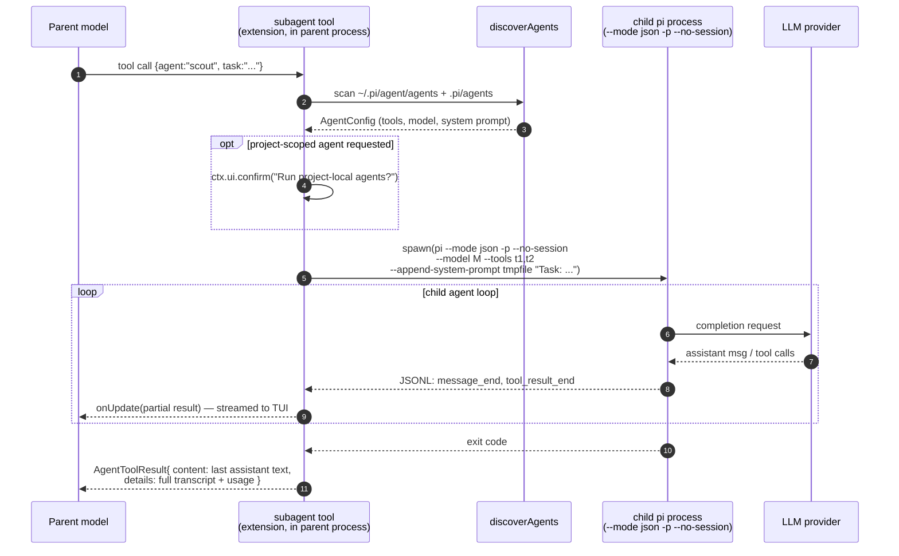
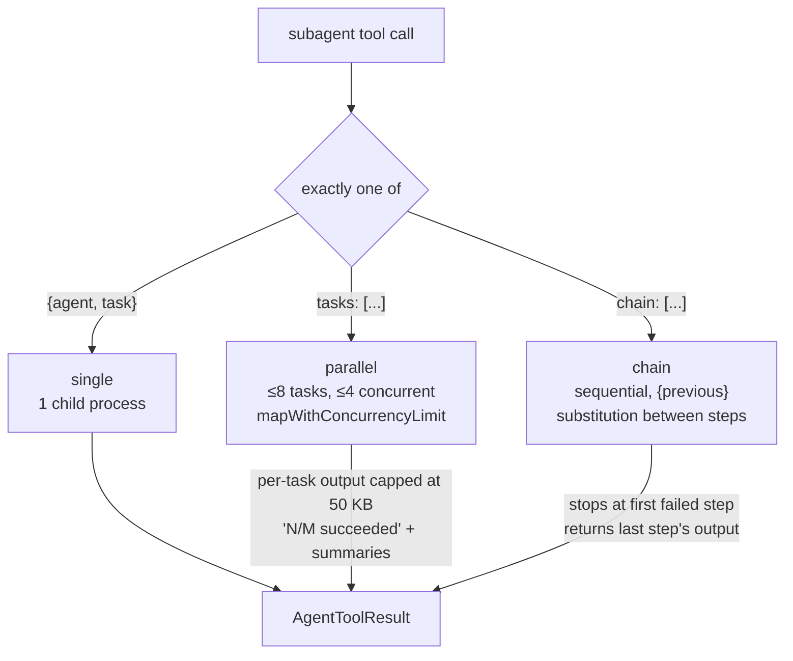

# pi — Subagents architecture

> Part of [pi](./ARCHITECTURE.md) @ a455f62
> Source: https://github.com/earendil-works/pi @ a455f62
> Topic: how pi spawns nested/child agents — subagent tool, named agent definitions, delegation, parallel execution, result/permission flow, and child-vs-parent session relationships.

## The headline: no built-in subagents — by deliberate design

Unlike opencode (built-in `task` tool + agent registry) or Claude Code (built-in `Agent` tool), **pi ships zero subagent machinery in its core**. This is an explicit philosophy statement, not an omission:

> **No sub-agents.** There's many ways to do this. Spawn pi instances via tmux, or build your own with [extensions], or install a package that does it your way.

— [`packages/coding-agent/README.md` L495](https://github.com/earendil-works/pi/blob/a455f62f72359f5f2260c16ee3ed653ce968de3d/packages/coding-agent/README.md#L495)

What pi ships instead is a **reference implementation as an example extension**: a ~1,000-line `subagent` tool at `packages/coding-agent/examples/extensions/subagent/` that users symlink into `~/.pi/agent/extensions/`. It demonstrates the canonical pi pattern: subagents are **separate `pi` OS processes** run in headless JSON mode, orchestrated by a custom tool registered through the extension API. Everything below describes that reference implementation plus the core primitives it leans on (print/JSON mode, CLI flags, `registerTool`).

For the comparative study this is the key architectural divergence: pi pushes multi-agent orchestration entirely to the extension layer and uses **process isolation** (not in-process session forks) as the context-isolation mechanism.

## Role in the system

Upstream: the parent model calls the `subagent` tool, which the extension registered via `ExtensionAPI.registerTool` ([`types.ts` L1170](https://github.com/earendil-works/pi/blob/a455f62f72359f5f2260c16ee3ed653ce968de3d/packages/coding-agent/src/core/extensions/types.ts#L1170)) — see the extensions/plugins doc for the general extension lifecycle. Downstream: the tool `spawn()`s child `pi` processes that boot the exact same `AgentSessionRuntime` as a top-level run, but in single-shot print mode (`runPrintMode`, [`print-mode.ts` L32](https://github.com/earendil-works/pi/blob/a455f62f72359f5f2260c16ee3ed653ce968de3d/packages/coding-agent/src/modes/print-mode.ts#L32)). The parent and child share nothing except the filesystem and the JSONL event stream over the child's stdout.

## Key types & entry points

- `default function (pi: ExtensionAPI)` ([index.ts:L454](https://github.com/earendil-works/pi/blob/a455f62f72359f5f2260c16ee3ed653ce968de3d/packages/coding-agent/examples/extensions/subagent/index.ts#L454)) — extension entry; registers the `subagent` tool.
- `SubagentParams` ([index.ts:L442-L452](https://github.com/earendil-works/pi/blob/a455f62f72359f5f2260c16ee3ed653ce968de3d/packages/coding-agent/examples/extensions/subagent/index.ts#L442-L452)) — TypeBox schema; exactly one of `{agent, task}` (single), `tasks[]` (parallel), `chain[]` (sequential).
- `runSingleAgent` ([index.ts:L261-L423](https://github.com/earendil-works/pi/blob/a455f62f72359f5f2260c16ee3ed653ce968de3d/packages/coding-agent/examples/extensions/subagent/index.ts#L261-L423)) — the spawn/stream/collect core for one child process.
- `getPiInvocation` ([index.ts:L243-L257](https://github.com/earendil-works/pi/blob/a455f62f72359f5f2260c16ee3ed653ce968de3d/packages/coding-agent/examples/extensions/subagent/index.ts#L243-L257)) — resolves how to re-invoke "the same pi" (script + runtime, compiled binary, or `pi` on PATH).
- `discoverAgents` ([agents.ts:L97-L116](https://github.com/earendil-works/pi/blob/a455f62f72359f5f2260c16ee3ed653ce968de3d/packages/coding-agent/examples/extensions/subagent/agents.ts#L97-L116)) — loads named agent definitions from user/project dirs.
- `AgentConfig` ([agents.ts:L11-L19](https://github.com/earendil-works/pi/blob/a455f62f72359f5f2260c16ee3ed653ce968de3d/packages/coding-agent/examples/extensions/subagent/agents.ts#L11-L19)) — `{name, description, tools?, model?, systemPrompt, source, filePath}` parsed from markdown frontmatter.
- `SingleResult` / `SubagentDetails` ([index.ts:L143-L162](https://github.com/earendil-works/pi/blob/a455f62f72359f5f2260c16ee3ed653ce968de3d/packages/coding-agent/examples/extensions/subagent/index.ts#L143-L162)) — per-child result record and the tool's `details` payload (drives TUI rendering and preserves full transcripts).
- `runPrintMode` ([print-mode.ts:L32-L159](https://github.com/earendil-works/pi/blob/a455f62f72359f5f2260c16ee3ed653ce968de3d/packages/coding-agent/src/modes/print-mode.ts#L32-L159)) — what the child executes; in `json` mode it serializes every session event as one JSONL line on stdout.
- `ToolDefinition.execute(toolCallId, params, signal, onUpdate, ctx)` ([types.ts:L463-L470](https://github.com/earendil-works/pi/blob/a455f62f72359f5f2260c16ee3ed653ce968de3d/packages/coding-agent/src/core/extensions/types.ts#L463-L470)) — the host contract that gives the extension its abort signal, streaming-update callback, and `ExtensionContext` (cwd, `ui.confirm`, `hasUI`).

## Spawn / return flow



The child is a full pi instance: it rebuilds its own system prompt, tool set, and agent loop, and talks to the provider itself. The parent never proxies model traffic for the child — it only parses the child's event stream.

### Child invocation, step by step

1. **Args assembly** ([index.ts:L288-L290](https://github.com/earendil-works/pi/blob/a455f62f72359f5f2260c16ee3ed653ce968de3d/packages/coding-agent/examples/extensions/subagent/index.ts#L288-L290)): base args are `["--mode", "json", "-p", "--no-session"]`; the agent definition adds `--model <model>` and `--tools <csv>`.
2. **System prompt delivery** ([index.ts:L317-L321](https://github.com/earendil-works/pi/blob/a455f62f72359f5f2260c16ee3ed653ce968de3d/packages/coding-agent/examples/extensions/subagent/index.ts#L317-L321)): the agent's markdown body is written to a `0o600` temp file and passed via `--append-system-prompt <path>` (the flag accepts text or a file path, parsed at [args.ts:L95-L97](https://github.com/earendil-works/pi/blob/a455f62f72359f5f2260c16ee3ed653ce968de3d/packages/coding-agent/src/cli/args.ts#L95-L97)). The task itself is appended as the positional prompt: `Task: <task>`.
3. **Self-invocation** (`getPiInvocation`): prefer `process.execPath + process.argv[1]` (re-runs the same script under the same runtime); detect Bun compiled binaries via the `/$bunfs/root/` virtual path and re-exec the binary directly; fall back to `pi` on `PATH`.
4. **Streaming parse** ([index.ts:L336-L371](https://github.com/earendil-works/pi/blob/a455f62f72359f5f2260c16ee3ed653ce968de3d/packages/coding-agent/examples/extensions/subagent/index.ts#L336-L371)): stdout is split on newlines; each line is `JSON.parse`d. `message_end` events append to `currentResult.messages` and accumulate usage (tokens, cache, cost, turns, context size) from each assistant message; `tool_result_end` events append the tool-result messages. Every event triggers `emitUpdate()` → `onUpdate` → live TUI rendering in the parent.
5. **Exit** : exit code captured on `close`; remaining buffer flushed through the same line parser.

The event names are the core agent's loop events — `{type: "message_end", message}` is emitted by `pi-agent`'s loop ([agent/src/types.ts:L414](https://github.com/earendil-works/pi/blob/a455f62f72359f5f2260c16ee3ed653ce968de3d/packages/agent/src/types.ts#L414)) and forwarded to stdout by `runPrintMode`'s subscription ([print-mode.ts:L104-L108](https://github.com/earendil-works/pi/blob/a455f62f72359f5f2260c16ee3ed653ce968de3d/packages/coding-agent/src/modes/print-mode.ts#L104-L108)). The parent extension is, in effect, a JSONL client of the same event bus the TUI consumes in interactive mode.

## Named agent definitions

Agents are markdown files with YAML frontmatter — same shape as opencode/Claude Code agent files, but loaded by the *extension*, not the core:

```markdown title="examples/extensions/subagent/agents/worker.md (L1-L5)"
---
name: worker
description: General-purpose subagent with full capabilities, isolated context
model: claude-sonnet-4-5
---
```

[Full file](https://github.com/earendil-works/pi/blob/a455f62f72359f5f2260c16ee3ed653ce968de3d/packages/coding-agent/examples/extensions/subagent/agents/worker.md)

Discovery (`discoverAgents`, [agents.ts:L97-L116](https://github.com/earendil-works/pi/blob/a455f62f72359f5f2260c16ee3ed653ce968de3d/packages/coding-agent/examples/extensions/subagent/agents.ts#L97-L116)):

- **User scope**: `~/.pi/agent/agents/*.md` (via the host's `getAgentDir()` helper).
- **Project scope**: nearest `.pi/agents/` found by walking up from cwd (`findNearestProjectAgentsDir`, [agents.ts:L85-L95](https://github.com/earendil-works/pi/blob/a455f62f72359f5f2260c16ee3ed653ce968de3d/packages/coding-agent/examples/extensions/subagent/agents.ts#L85-L95)).
- Frontmatter fields: `name`, `description` (required), `tools` (CSV allowlist → `--tools` flag), `model` (→ `--model` flag); the markdown body becomes the appended system prompt.
- With `agentScope: "both"`, project agents **override** user agents of the same name (insertion order into the `agentMap`, L106-L108).
- Agents are re-discovered on every tool invocation, so they can be edited mid-session.

Sample agents shipped: `scout` (Haiku, read-only-ish recon), `planner` (Sonnet, read-only), `reviewer` (Sonnet), `worker` (Sonnet, all default tools).

## Delegation modes: single, parallel, chain



- **Single** ([index.ts:L660-L685](https://github.com/earendil-works/pi/blob/a455f62f72359f5f2260c16ee3ed653ce968de3d/packages/coding-agent/examples/extensions/subagent/index.ts#L660-L685)): one child; the model-visible result is the child's final assistant text.
- **Parallel** ([index.ts:L577-L658](https://github.com/earendil-works/pi/blob/a455f62f72359f5f2260c16ee3ed653ce968de3d/packages/coding-agent/examples/extensions/subagent/index.ts#L577-L658)): bounded worker pool (`MAX_PARALLEL_TASKS = 8`, `MAX_CONCURRENCY = 4`, [L27-L28](https://github.com/earendil-works/pi/blob/a455f62f72359f5f2260c16ee3ed653ce968de3d/packages/coding-agent/examples/extensions/subagent/index.ts#L27-L28)) via `mapWithConcurrencyLimit` ([L213-L231](https://github.com/earendil-works/pi/blob/a455f62f72359f5f2260c16ee3ed653ce968de3d/packages/coding-agent/examples/extensions/subagent/index.ts#L213-L231)). All tasks stream simultaneously into one aggregated `onUpdate` ("2/3 done, 1 running"). Each task's model-visible output is capped at 50 KB (`truncateParallelOutput`, [L187-L196](https://github.com/earendil-works/pi/blob/a455f62f72359f5f2260c16ee3ed653ce968de3d/packages/coding-agent/examples/extensions/subagent/index.ts#L187-L196)) — the full transcript survives in `details`.
- **Chain** ([index.ts:L524-L575](https://github.com/earendil-works/pi/blob/a455f62f72359f5f2260c16ee3ed653ce968de3d/packages/coding-agent/examples/extensions/subagent/index.ts#L524-L575)): sequential steps; each step's task template has `{previous}` replaced by the prior step's final assistant text (L530). A failing step (`exitCode != 0`, `stopReason` of `error`/`aborted` — `isFailedResult`, [L176-L178](https://github.com/earendil-works/pi/blob/a455f62f72359f5f2260c16ee3ed653ce968de3d/packages/coding-agent/examples/extensions/subagent/index.ts#L176-L178)) aborts the chain with `isError: true` naming the step.

Chains are made user-invokable via **prompt templates**: e.g. `/implement <query>` expands to an instruction telling the model to run the chain scout → planner → worker with `{previous}` passing ([prompts/implement.md](https://github.com/earendil-works/pi/blob/a455f62f72359f5f2260c16ee3ed653ce968de3d/packages/coding-agent/examples/extensions/subagent/prompts/implement.md)). So workflow presets live in the prompt layer, agent capabilities in markdown definitions, and orchestration in the tool — three cleanly separated layers, all user-editable.

## How results flow back to the parent

Two channels, deliberately separated:

1. **Model-visible channel** — `AgentToolResult.content`: only the child's *final assistant text* (`getFinalOutput` scans messages backwards for the last assistant text part, [index.ts:L164-L174](https://github.com/earendil-works/pi/blob/a455f62f72359f5f2260c16ee3ed653ce968de3d/packages/coding-agent/examples/extensions/subagent/index.ts#L164-L174)). Intermediate tool calls and reasoning never enter the parent's context window — that's the entire point of the isolation.
2. **Human/UI channel** — `AgentToolResult.details: SubagentDetails`: the full per-child `messages[]`, stderr, usage stats, model, stop reason. Custom `renderCall`/`renderResult` implementations ([index.ts:L694-L1007](https://github.com/earendil-works/pi/blob/a455f62f72359f5f2260c16ee3ed653ce968de3d/packages/coding-agent/examples/extensions/subagent/index.ts#L694-L1007)) show collapsed last-N tool calls or a full expanded transcript with markdown rendering and per-agent cost lines (`3 turns ↑input ↓output $cost ctx:… model`).

During execution, partial results stream through the host's `onUpdate` callback (the `AgentToolUpdateCallback` in `ToolDefinition.execute`), so the parent TUI re-renders the child's progress live — including for all parallel children at once.

Failure semantics: on `exitCode != 0` / `stopReason: "error"` the tool returns `isError: true` with stderr or the child's `errorMessage` as content, so the parent model sees diagnostics rather than silence.

```ts title="examples/extensions/subagent/index.ts (L288, L317-L324) — child arg assembly"
const args: string[] = ["--mode", "json", "-p", "--no-session"];
if (agent.model) args.push("--model", agent.model);
if (agent.tools && agent.tools.length > 0) args.push("--tools", agent.tools.join(","));
[...]
if (agent.systemPrompt.trim()) {
    const tmp = await writePromptToTempFile(agent.name, agent.systemPrompt);
    [...]
    args.push("--append-system-prompt", tmpPromptPath);
}
args.push(`Task: ${task}`);
```

[L288-L324 on GitHub](https://github.com/earendil-works/pi/blob/a455f62f72359f5f2260c16ee3ed653ce968de3d/packages/coding-agent/examples/extensions/subagent/index.ts#L288-L324)

## Permission & trust flow

pi has **no permission-popup system** in core (README philosophy, [L497](https://github.com/earendil-works/pi/blob/a455f62f72359f5f2260c16ee3ed653ce968de3d/packages/coding-agent/README.md#L497) — "Run in a container, or build your own confirmation flow with extensions"). The subagent extension therefore implements its own narrow trust gate, focused on **prompt-injection via repo-controlled agent definitions**:

- Default `agentScope` is `"user"` — only `~/.pi/agent/agents` is loaded; a repository cannot inject agents.
- Project-local agents (`.pi/agents/*.md`) require the caller to pass `agentScope: "project" | "both"`, *and* (when `ctx.hasUI` and `confirmProjectAgents` isn't disabled) an interactive `ctx.ui.confirm("Run project-local agents?", …)` listing the agent names and source dir ([index.ts:L499-L521](https://github.com/earendil-works/pi/blob/a455f62f72359f5f2260c16ee3ed653ce968de3d/packages/coding-agent/examples/extensions/subagent/index.ts#L499-L521)). Declining returns "Canceled" to the model.
- **Capability narrowing** is the only sandbox: the agent's `tools` frontmatter becomes the child's `--tools` allowlist ([args.ts:L120-L124](https://github.com/earendil-works/pi/blob/a455f62f72359f5f2260c16ee3ed653ce968de3d/packages/coding-agent/src/cli/args.ts#L120-L124)), so a `scout` can be limited to `read, grep, find, ls, bash`. Otherwise the child runs with the parent's full OS-level privileges in `cwd` (overridable per task).
- **Abort propagation**: the host passes the tool's `AbortSignal`; on abort the extension sends `SIGTERM`, escalating to `SIGKILL` after 5 s ([index.ts:L393-L403](https://github.com/earendil-works/pi/blob/a455f62f72359f5f2260c16ee3ed653ce968de3d/packages/coding-agent/examples/extensions/subagent/index.ts#L393-L403)). The child's own `runPrintMode` also handles `SIGTERM`/`SIGHUP` to dispose its runtime and kill *its* tracked detached children ([print-mode.ts:L47-L63](https://github.com/earendil-works/pi/blob/a455f62f72359f5f2260c16ee3ed653ce968de3d/packages/coding-agent/src/modes/print-mode.ts#L47-L63)) — so Ctrl+C cascades down the whole process tree.

## Subagent sessions vs parent session

- Children run with `--no-session` ([args.ts:L104-L105](https://github.com/earendil-works/pi/blob/a455f62f72359f5f2260c16ee3ed653ce968de3d/packages/coding-agent/src/cli/args.ts#L104-L105)): **ephemeral, no session file written**. A subagent run is not resumable and has no entry in the session tree.
- The child's transcript is preserved only as a copy inside the **parent's** session, embedded in the subagent tool result's `details` — so replaying the parent session reproduces the rendered subagent output without re-running anything.
- There is no shared memory, no shared context, and no session forking between parent and child. Contrast with the parent-side session tree (`--fork`, `navigateTree`, `switchSession` in [print-mode.ts:L73-L97](https://github.com/earendil-works/pi/blob/a455f62f72359f5f2260c16ee3ed653ce968de3d/packages/coding-agent/src/modes/print-mode.ts#L73-L97)), which is an intra-session branching mechanism, not a multi-agent one — see the memory/sessions doc.
- **Other nesting substrates** pi offers for builders who want different trade-offs: the SDK (`createAgentSession()` with `SessionManager.inMemory()` — in-process child sessions, [README.md L458-L468](https://github.com/earendil-works/pi/blob/a455f62f72359f5f2260c16ee3ed653ce968de3d/packages/coding-agent/README.md#L458-L468)) and RPC mode (`pi --mode rpc`, LF-delimited JSONL over stdio, for non-Node parents, [README.md L475-L485](https://github.com/earendil-works/pi/blob/a455f62f72359f5f2260c16ee3ed653ce968de3d/packages/coding-agent/README.md#L475-L485)). The example extension chose the process-spawn route for maximal isolation with minimal coupling.

## Comparative takeaways (for the research topic)

- **Isolation primitive**: OS process + JSONL stdout, vs in-process session objects (opencode's `task` tool) — crash isolation and true context isolation for free; cost is process startup and no shared model-call batching.
- **Agent registry**: markdown frontmatter files in user/project dirs — convergent with the opencode/Claude Code convention, but implemented in ~130 lines of userland code ([agents.ts](https://github.com/earendil-works/pi/blob/a455f62f72359f5f2260c16ee3ed653ce968de3d/packages/coding-agent/examples/extensions/subagent/agents.ts)).
- **Orchestration vocabulary**: single/parallel/chain with `{previous}` piping is richer than the typical fire-one-task tool, and is driven by the *model* choosing the mode, optionally steered by prompt templates.
- **Trust model**: scoped to one concrete threat (repo-controlled agent prompts) rather than a general permission system — consistent with pi's "no permission popups" stance.

## Source files

| File | Ranges | GitHub |
| --- | --- | --- |
| `packages/coding-agent/examples/extensions/subagent/index.ts` | L27-L30, L143-L196, L213-L257, L261-L423, L425-L452, L454-L521, L524-L692, L694-L1007 | [link](https://github.com/earendil-works/pi/blob/a455f62f72359f5f2260c16ee3ed653ce968de3d/packages/coding-agent/examples/extensions/subagent/index.ts) |
| `packages/coding-agent/examples/extensions/subagent/agents.ts` | L9-L19, L85-L116 | [link](https://github.com/earendil-works/pi/blob/a455f62f72359f5f2260c16ee3ed653ce968de3d/packages/coding-agent/examples/extensions/subagent/agents.ts) |
| `packages/coding-agent/examples/extensions/subagent/README.md` | L1-L175 | [link](https://github.com/earendil-works/pi/blob/a455f62f72359f5f2260c16ee3ed653ce968de3d/packages/coding-agent/examples/extensions/subagent/README.md) |
| `packages/coding-agent/examples/extensions/subagent/agents/worker.md` | L1-L24 | [link](https://github.com/earendil-works/pi/blob/a455f62f72359f5f2260c16ee3ed653ce968de3d/packages/coding-agent/examples/extensions/subagent/agents/worker.md) |
| `packages/coding-agent/examples/extensions/subagent/prompts/implement.md` | L1-L10 | [link](https://github.com/earendil-works/pi/blob/a455f62f72359f5f2260c16ee3ed653ce968de3d/packages/coding-agent/examples/extensions/subagent/prompts/implement.md) |
| `packages/coding-agent/src/modes/print-mode.ts` | L32-L159 | [link](https://github.com/earendil-works/pi/blob/a455f62f72359f5f2260c16ee3ed653ce968de3d/packages/coding-agent/src/modes/print-mode.ts) |
| `packages/coding-agent/src/cli/args.ts` | L70-L134 | [link](https://github.com/earendil-works/pi/blob/a455f62f72359f5f2260c16ee3ed653ce968de3d/packages/coding-agent/src/cli/args.ts) |
| `packages/coding-agent/src/core/extensions/types.ts` | L295-L312, L432-L497, L1120, L1170 | [link](https://github.com/earendil-works/pi/blob/a455f62f72359f5f2260c16ee3ed653ce968de3d/packages/coding-agent/src/core/extensions/types.ts) |
| `packages/coding-agent/README.md` | L370-L504 | [link](https://github.com/earendil-works/pi/blob/a455f62f72359f5f2260c16ee3ed653ce968de3d/packages/coding-agent/README.md) |
| `packages/agent/src/types.ts` | L414 | [link](https://github.com/earendil-works/pi/blob/a455f62f72359f5f2260c16ee3ed653ce968de3d/packages/agent/src/types.ts#L414) |
