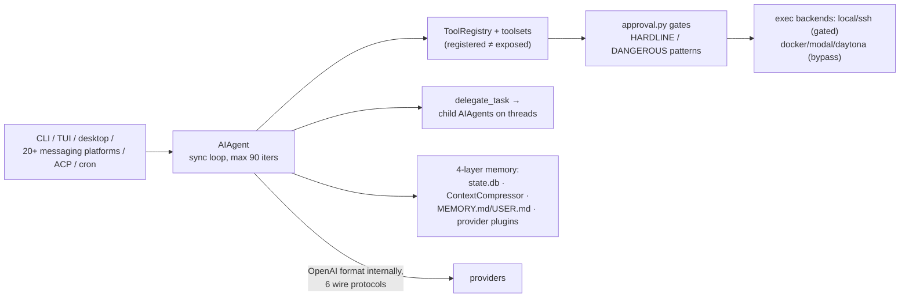

# hermes-agent

> [[wiki/repos/hermes-agent/ARCHITECTURE.md|Raw source]] · [Original](https://github.com/nousresearch/hermes-agent/tree/d62979a6f34f64f2ed840f159aac66e24d7cad78) · score 1.00 · github

## Summary

Hermes Agent (Nous Research) is a **Python monolith with many faces**: one synchronous agent core — the `AIAgent` class in `run_agent.py` — is driven by an interactive CLI, an Ink/React TUI, an Electron desktop app, a ~20-platform messaging gateway, an ACP server for IDEs, a cron scheduler, and a batch runner, all in one process family persisting to a shared SQLite `state.db`. There is no client/server split; the "narrow waist" is a Python object, not an RPC boundary [[wiki/repos/hermes-agent/ARCHITECTURE.md#1. Bird's-eye view|cite]]. Two invariants from the repo's own dev guide shape every layer: per-conversation **prompt caching is sacred** (the system prompt is byte-stable for a conversation's life), and **the core is a narrow waist** — new capability lands as skills, plugins, or MCP servers, almost never as new core tools (the "Footprint Ladder") [[wiki/repos/hermes-agent/ARCHITECTURE.md#6. Tool registry, toolsets & the footprint ladder|cite]].

The agent loop is fully synchronous: `run_conversation()` loops up to 90 API calls plus a shared `IterationBudget` with a one-turn grace call, dispatching tool batches through a thread pool between calls; messages stay in OpenAI chat-completions format end-to-end, with a `ProviderTransport` registry adapting that shape per provider at the API boundary [[wiki/repos/hermes-agent/agents-architecture.md#The agent loop|cite]]. Memory is the most layered of the three harnesses: SQLite transcripts with FTS5 search, a pluggable `ContextEngine` whose default compressor summarizes middle turns and **splits the session** at every compaction, bounded curated `MEMORY.md`/`USER.md` injected as a frozen snapshot, and one-at-a-time external provider plugins (Mem0, Honcho, …) [[wiki/repos/hermes-agent/memory-system.md#Module purpose|cite]]. Permissions are detection-based rather than declaration-based: regex pattern taxonomies gate command *content*, not tool identity, with an unconditional hardline floor that no mode — `--yolo` included — can bypass [[wiki/repos/hermes-agent/agent-permission-flow.md#Module purpose|cite]].

## Key claims

- Every surface funnels through one class: each frontend constructs an `AIAgent` and calls `run_conversation()`; subagents are more `AIAgent` instances on threads; cron jobs are `AIAgent` runs with memory disabled. [[wiki/repos/hermes-agent/ARCHITECTURE.md#1. Bird's-eye view|cite]]
- The loop is synchronous and resilience-dominated: ~80% of `conversation_loop.py`'s 4,245 lines is recovery machinery (retry/fallback chains, credential rotation, stale-stream watchdogs, steer draining); the happy path is ~30 lines. [[wiki/repos/hermes-agent/agents-architecture.md#Contrast hooks for the comparative study|cite]]
- Tools self-register at import time into a singleton `ToolRegistry`, but named **toolsets** decide what an agent actually sees — registration ≠ exposure, and mid-conversation toolset swaps are forbidden to protect the prompt cache. [[wiki/repos/hermes-agent/ARCHITECTURE.md#6. Tool registry, toolsets & the footprint ladder|cite]]
- Subagents are one tool, `delegate_task`: child `AIAgent`s on in-process worker threads (never subprocesses), blocking the parent, returning only a rich result envelope (summary + tokens + cost + files touched). Children are attenuation-only — parent's tools ∩ requested − `DELEGATE_BLOCKED_TOOLS` (`clarify`, `memory`, `send_message`, `execute_code`, recursion) — with no named-agent registry; an `orchestrator` role plus `max_spawn_depth ≥ 2` opt-in unlocks nesting. [[wiki/repos/hermes-agent/subagents-architecture.md#Module purpose|cite]] [[wiki/repos/hermes-agent/subagents-architecture.md#Nested orchestration|cite]]
- Subagent threads cannot escalate to the user: a non-interactive auto-deny callback is installed per worker thread (avoiding stdin deadlock against the parent TUI), flipped to auto-approve only by explicit `delegation.subagent_auto_approve: true`. [[wiki/repos/hermes-agent/subagents-architecture.md#Permission flow inside children|cite]]
- Compaction **splits the SQLite session** — ends the old row with `end_reason='compression'`, mints a child with `parent_session_id` — rather than rewriting history in place; it is the one sanctioned prompt-cache break, cross-process locked via a `compression_locks` table. [[wiki/repos/hermes-agent/memory-system.md#2. Context-window management & compaction|cite]]
- Curated memory uses a **frozen snapshot** pattern: `memory` tool writes hit disk immediately but never mutate the in-prompt snapshot mid-session; entries are threat-scanned at the snapshot boundary and writes pass the same staged-approval gate as file writes. [[wiki/repos/hermes-agent/memory-system.md#Module purpose|cite]]
- Permission gating is by risk pattern, not by tool: most shell commands run unprompted; `HARDLINE_PATTERNS` block unconditionally before any bypass, `DANGEROUS_PATTERNS` (~60) route to one of three approval surfaces (CLI modal, gateway `/approve` queue, auxiliary-LLM "smart" reviewer) with once/session/always scopes keyed by pattern, not literal command. [[wiki/repos/hermes-agent/agent-permission-flow.md#The layered gate stack|cite]] [[wiki/repos/hermes-agent/agent-permission-flow.md#Decision state machine|cite]]
- Sandboxing substitutes for permission: docker/singularity/modal/daytona terminal backends skip the entire approval stack — isolation *is* the permission model. [[wiki/repos/hermes-agent/ARCHITECTURE.md#7. Execution environments (terminal backends)|cite]]
- The agent is structurally barred from editing its own security policy: file tools hard-deny writes to `config.yaml` (where `approvals.mode` and the allowlist live), paired with terminal-side patterns against `sed -i`/`tee`/`>` on the same targets — an unpaired deny is called "theater". [[wiki/repos/hermes-agent/agent-permission-flow.md#Parallel file-tool gates (deny, not ask)|cite]]
- Project instruction files load with first-match-wins priority — `.hermes.md` → `AGENTS.md` → `CLAUDE.md` → `.cursorrules` — into the prompt's stable tier; Hermes reads competitors' instruction files but loads exactly one project-context source. [[wiki/repos/hermes-agent/memory-system.md#5. Project memory — instruction files in the system prompt|cite]]
- Hermes sits on both sides of MCP (client via `tools/mcp_tool.py`, server via `mcp_serve.py` exposing conversations and even `permissions_respond`) and speaks ACP to editors; `delegate_task` can even spawn a foreign harness as a child over ACP (`acp_command`). [[wiki/repos/hermes-agent/ARCHITECTURE.md#14. Protocol bridges — MCP & ACP|cite]] [[wiki/repos/hermes-agent/subagents-architecture.md#Named agents? No — roles and goals instead|cite]]

## Notable quotes

> "There is no daemon/server split — the 'narrow waist' is a Python object, not an RPC boundary."
> — [[wiki/repos/hermes-agent/ARCHITECTURE.md#1. Bird's-eye view|Bird's-eye view]]

> "Roughly 80% of `conversation_loop.py`'s 4,245 lines is recovery machinery: retry/fallback chains, credential rotation, truncated-tool-call repair, empty-response prefill recovery, steer draining, stale-stream watchdogs."
> — [[wiki/repos/hermes-agent/agents-architecture.md#Contrast hooks for the comparative study|Contrast hooks]]

> "Do NOT retry this command, do NOT rephrase it, and do NOT attempt the same outcome via a different command. … Silence is not consent."
> — deny message quoted at [[wiki/repos/hermes-agent/agent-permission-flow.md#Data flow — tool call to execution/rejection|Data flow]]

## What's distinctive here

Among the three harnesses, Hermes is the maximalist: a "expansive at the edges, conservative at the waist" design where two named invariants (byte-stable system prompt for cache warmth; narrow-waist core grown via skills/plugins/MCP) discipline an otherwise sprawling monolith [[wiki/repos/hermes-agent/ARCHITECTURE.md#1. Bird's-eye view|cite]]. Coined/distinctive machinery: the **Footprint Ladder** doctrine for where capability lands; **session-splitting compaction** as a lineage tree in SQLite; the **frozen-snapshot** curated memory; **pattern-keyed approval scopes** with an unbypassable hardline floor; the **chat-gateway approval queue** that blocks a synchronous agent thread on a `threading.Event` until a `/approve` arrives from Discord/Telegram [[wiki/repos/hermes-agent/agent-permission-flow.md#Comparative takeaways for the research topic|cite]]; and a self-improving skills loop with an agent-skill **curator** that archives stale agent-created skills [[wiki/repos/hermes-agent/ARCHITECTURE.md#13. Plugins & skills (the self-improving edge)|cite]]. The codebase also openly indexes its influences — OpenClaw's subagent prompt and MCP bridge surface, OpenAI Codex's smart approvals, Claude Code's `/compact` and deny rules [[wiki/repos/hermes-agent/agent-permission-flow.md#Comparative takeaways for the research topic|cite]].

## Connections

- **Entities**: none yet — init run; candidates submitted via ingest metadata.
- **Concepts**: none yet — candidates (agent-loop, permission-gating, context-compaction, subagent-delegation, …) submitted via ingest metadata.
- **Other sources**: the companion opencode and pi repo pages in this research cover the contrast points this source frames explicitly (TS client/server vs. minimal core vs. Python monolith).

> Synthesis: hermes-agent anchors the "monolith + layered safety" pole of this comparison — it trades opencode's process separation and pi's minimalism for one mutable agent object wrapped in the deepest memory and permission stacks of the three, making it the richest single source of cross-harness design vocabulary (footprint ladder, hardline floor, frozen snapshot, session splitting).
