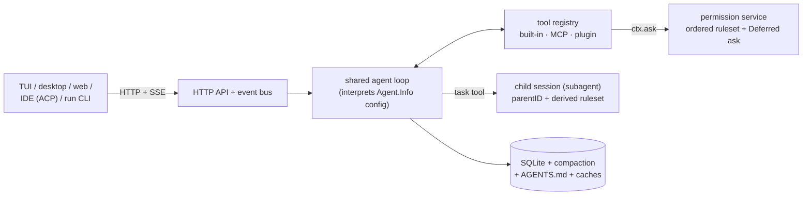

# opencode

> [[wiki/repos/opencode/ARCHITECTURE.md|Raw source]] · [Original](https://github.com/anomalyco/opencode/tree/4ddfa7c6fa4cd5f9daab04f2800bc42b07378a33) · score 1.00 · github

## Summary

opencode (by Anomaly, formerly SST) is "the open source AI coding agent": a Bun/TypeScript monorepo whose core is a local HTTP server wrapping an Effect-based session engine. Every user surface — TUI, desktop app, web app, IDE bridge (ACP), headless CLI — is just another client of that server, consuming an OpenAPI-described HTTP API plus an SSE event stream; the TUI even runs the server in a worker thread of its own process [[wiki/repos/opencode/ARCHITECTURE.md#1. Bird's-eye view|cite]] [[wiki/repos/opencode/ARCHITECTURE.md#4. Process startup & entry flow|cite]]. All state changes flow one way: clients POST, the engine mutates and publishes typed events on a global bus, clients re-render from the event stream [[wiki/repos/opencode/ARCHITECTURE.md#5. Client/server split & the event bus|cite]].

The second defining choice: an agent is **pure configuration data** (`Agent.Info` — name, mode, permission ruleset, optional model/prompt overrides) interpreted by one shared loop; built-ins, markdown files, JSON config, and even LLM-generated configs all produce the same shape [[wiki/repos/opencode/agents-architecture.md#Topic purpose|cite]]. The loop itself (`SessionPrompt.runLoop`) is history-driven and resumable — each iteration re-derives intent from persisted messages, so crash recovery and "continue" are the same code path [[wiki/repos/opencode/agents-architecture.md#Loop termination|cite]]. Subagents are child sessions linked by `parentID`, spawned by the `task` tool and isolated by permissions, not processes [[wiki/repos/opencode/subagents-architecture.md#Module purpose|cite]]. Memory is explicit and database-shaped — SQLite transcripts, LLM-written compaction summaries, user-curated AGENTS.md files, disk caches; no vector store, no embeddings [[wiki/repos/opencode/memory-system.md#Module purpose|cite]]. Permissions gate every irreversible action through one API (`ctx.ask`) evaluated against an ordered, last-match-wins ruleset, with an async Deferred-based approval handshake that any attached UI can answer [[wiki/repos/opencode/agent-permission-flow.md#The rule model and evaluation|cite]].

## Key claims

**General architecture**
- opencode is a client/server system, not a monolithic CLI: one engine, an OpenAPI HTTP surface + SSE events, and every UI (including the TUI, via an in-process worker-thread RPC) is an interchangeable client. [[wiki/repos/opencode/ARCHITECTURE.md#1. Bird's-eye view|cite]]
- The engine is built on Effect: every subsystem is a `Layer` exposing a `Context.Service`; fibers, streams, and typed errors are part of the architecture's contract. [[wiki/repos/opencode/agents-architecture.md#Topic purpose|cite]]

**Agents architecture**
- Agents are data, not code — one loop interprets `Agent.Info` records; differentiation = permission ruleset + prompt + model override. Even internal utilities (compaction, title, summary) are hidden agents flowing through the same machinery. [[wiki/repos/opencode/agents-architecture.md#Built-in agents|cite]]
- The loop has a three-layer split: `SessionPrompt` (step orchestration) / `SessionProcessor` (stream-event materialization, retry, doom-loop detection) / `LLM` (dual runtime — Vercel AI SDK or native — normalized to one `LLMEvent` stream). Tools execute *inside* the provider stream (`streamText`), not in a harness-side dispatch loop. [[wiki/repos/opencode/agents-architecture.md#4. Provider / model layer|cite]]
- The loop is stateless between iterations and resumable: control flow (queued subtask/compaction work) is encoded in the persisted message data model itself. [[wiki/repos/opencode/agents-architecture.md#6. Session / message data model|cite]]

**Subagents architecture**
- One spawn primitive (`task` tool) creates a child session running the same full loop; only the final text crosses back as a tool result, keeping the child transcript out of the parent's context window but inspectable and resumable via `task_id`. [[wiki/repos/opencode/subagents-architecture.md#Spawn / return flow|cite]]
- Subagent isolation is permission-based, not process-based: children inherit only the parent's deny rules + `external_directory` grants; recursive `task` spawning is deny-by-default. [[wiki/repos/opencode/subagents-architecture.md#Child permission derivation|cite]]
- An experimental background mode lets children run async, with results injected into the parent as synthetic messages, plus mid-flight promotion and steering of running children. [[wiki/repos/opencode/subagents-architecture.md#Result return: foreground, background, and promotion|cite]]

**Memory system**
- Memory has four explicit layers — SQLite event-sourced store, context-window manager (overflow → compaction), AGENTS.md/CLAUDE.md project memory (global → project → directory, lazily attached as files are read), disk caches — and deliberately no vector store or model-written memory file. [[wiki/repos/opencode/memory-system.md#Module purpose|cite]]
- Compaction is a query, not a delete: history is never destroyed; the context window is a *view* anchored at the latest LLM-written structured summary (goal/progress/decisions/files template), with a preserved recent tail and incremental re-summarization. [[wiki/repos/opencode/memory-system.md#Context-window management — overflow, compaction, prune|cite]]
- Cheaper reclamation runs first: pruning erases stale tool outputs (protecting the last 2 turns / 40k tokens), and oversized tool outputs spill to disk with head/tail previews kept in context, readable back on demand. [[wiki/repos/opencode/memory-system.md#Pruning — cheap reclamation before summarizing|cite]]

**Permission flow**
- Permission identity is a (capability, pattern) pair against an ordered wildcard ruleset (last match wins, default `ask`); merge order *is* precedence: defaults → agent → user config → session → in-session approvals. "Modes" like plan/build/explore are just ruleset deltas. [[wiki/repos/opencode/agent-permission-flow.md#The rule model and evaluation|cite]]
- The ask is fully async and multi-client: the tool's fiber parks on an Effect `Deferred` while a `permission.asked` event fans out; any UI replies over HTTP; "always" grants generalize bash commands by arity (`git push origin main` → `git push *`); rejection can carry user feedback that becomes the model-facing error text. [[wiki/repos/opencode/agent-permission-flow.md#End-to-end flow: tool call → decision → execution|cite]]
- Two engines coexist at this commit: production V1 (in-memory "always" grants, ask-by-default) and a V2 rewrite (action/resource/effect model, SQLite-persisted approvals, deny-by-default, saved grants never override configured denies) — part of a broader v1→v2 event-sourced engine rewrite. [[wiki/repos/opencode/ARCHITECTURE.md#14. The v1 → v2 engine rewrite|cite]] [[wiki/repos/opencode/agent-permission-flow.md|cite]]

## Notable quotes

> "The single most important thing to internalise: **opencode is a client/server system, not a monolithic CLI**."
> — [[wiki/repos/opencode/ARCHITECTURE.md#1. Bird's-eye view|§1 Bird's-eye view]]

> "opencode has no vector store, no embedding memory, and no model-written 'memory file'."
> — [[wiki/repos/opencode/memory-system.md#Module purpose|memory-system, Module purpose]]

> "Permission identity is a **(capability, pattern) pair evaluated against an ordered wildcard ruleset**, not a boolean per tool — granularity is delegated to each tool's choice of pattern (command prefix, file path, subagent name, URL)."
> — [[wiki/repos/opencode/agent-permission-flow.md#Comparative takeaways (for the research topic)|agent-permission-flow, Comparative takeaways]]

## What's distinctive here

- **Agents-as-data taken to its limit**: there is exactly one loop implementation in the codebase; everything from user-facing modes to internal summarizers is an `Agent.Info` record, and agent "personality" *is* its permission ruleset. [[wiki/repos/opencode/agents-architecture.md#Comparative takeaways (for the cross-repo study)|cite]]
- **Server-first harness**: the OpenAPI/SSE engine with the TUI as just-another-client (server-in-a-worker trick) is the heaviest-weight architecture among coding-agent harnesses — it buys multi-client permission answering, live subagent inspection, and IDE bridging for free. [[wiki/repos/opencode/ARCHITECTURE.md#4. Process startup & entry flow|cite]]
- **Permission system as the unifying abstraction**: loop safety (doom-loop), tool advertisement (denied tools stripped from the model's list), subagent catalogs, and even truncated-output file access are all expressed as permission rules. [[wiki/repos/opencode/agent-permission-flow.md#Config → ruleset compilation|cite]]
- **Deterministic, database-shaped memory** converging on event-sourcing (v2), contrasting with file-append or in-memory histories in lighter harnesses. [[wiki/repos/opencode/ARCHITECTURE.md#14. The v1 → v2 engine rewrite|cite]]
- Distinctive smaller mechanisms: anchored incremental compaction summaries with overflow replay of the pending user message, bash "always" arity-generalization, instruction "context epochs" with drift detection, and resumable/steerable background subagents.

## Connections

- **Entities**: none yet — init run; see suggestions.
- **Concepts**: none yet — init run; see suggestions.
- **Other sources**: pi and hermes-agent source pages (pending ingest) are the designated comparison counterparts across all five dimensions.

> Synthesis: opencode anchors the "maximalist" end of the harness spectrum for this study — client/server split, Effect service layers, SQLite event-sourcing, and a permission engine woven through every subsystem — making it the natural baseline against which pi's and hermes-agent's presumably lighter designs should be contrasted dimension-by-dimension.
