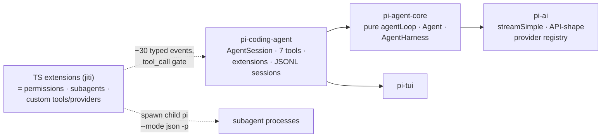

# pi

> [[wiki/repos/pi/ARCHITECTURE.md|Raw source]] · [Original](https://github.com/earendil-works/pi/tree/a455f62f72359f5f2260c16ee3ed653ce968de3d) · score 1.00 · github

## Summary

pi (Mario Zechner / earendil-works) is a TypeScript/Node coding agent shipped as **four composable npm packages** — a terminal-UI library (`pi-tui`), a unified multi-provider LLM API (`pi-ai`), a pure agent runtime (`pi-agent-core`), and the `pi` CLI that assembles them — rather than a monolithic tool. Its identity is a *subtractive* philosophy: no MCP, no built-in subagents, no permission popups, no plan mode, no to-dos, no background bash; every "missing" feature is expected to be rebuilt in user space via a TypeScript extension system, which is correspondingly the richest subsystem in the codebase [[wiki/repos/pi/ARCHITECTURE.md#1. Bird's-eye view|cite]]. The four-package stack is strict and acyclic, each layer independently publishable, which the docs frame as "the agent runtime is a library, and the CLI is just one consumer" [[wiki/repos/pi/ARCHITECTURE.md#3. Monorepo & package stack|cite]].

The runtime core is `runLoop`, a pure ~740-line orchestration function with zero I/O — all side effects (auth, context transforms, steering/follow-up queues, tool hooks) are injected through an `AgentLoopConfig`, and two stateful wrappers (`Agent`, used by the CLI, and the newer session-tree-aware `AgentHarness`) sit on top [[wiki/repos/pi/agents-architecture.md#The agent loop|cite]]. The loop talks to every LLM through one function, `streamSimple`, backed by a registry of providers keyed by **API shape** (e.g. `anthropic-messages`) rather than vendor, so extensions can register whole new providers at runtime [[wiki/repos/pi/ARCHITECTURE.md#6. Provider layer (pi-ai)|cite]]. The tool surface is exactly seven built-ins (`read | bash | edit | write | grep | find | ls`), each passing through a prepare → hook → execute → finalize pipeline [[wiki/repos/pi/ARCHITECTURE.md#7. Built-in tool surface|cite]].

Memory is a per-session **append-only JSONL tree** (entries carry `id` + `parentId`; the active branch is a leaf pointer) plus prompt-time `AGENTS.md`/`CLAUDE.md` instruction files — no vector store, no cross-session knowledge carryover [[wiki/repos/pi/memory-system.md#Module purpose|cite]]. Permissions are deliberately absent from core: gating decomposes into a synchronous `tool_call` extension hook chain (first block wins), a startup-time project-trust gate over config loading, and OS-level containment as the only real security boundary [[wiki/repos/pi/agent-permission-flow.md#Module purpose|cite]].

## Key claims

- **General architecture**: pi is four lock-stepped npm packages with a strict acyclic dependency stack; the repo dogfoods itself via a root `.pi/` directory, and "missing" features live as reference implementations in `examples/extensions/` [[wiki/repos/pi/ARCHITECTURE.md#3. Monorepo & package stack|cite]].
- **Agent loop**: `runLoop` is a pure function with two nested loops (inner: turns while tool calls/steering messages remain; outer: restart on follow-up messages); steering (mid-run injection) and follow-up (queue after stop) are first-class queue concepts, and `prepareNextTurn` can swap context/model mid-run — which is how compaction and model switches apply without restarting [[wiki/repos/pi/agents-architecture.md#The agent loop|cite]].
- **Tools and providers**: tool calls default to parallel execution but are *prepared sequentially* so gate hooks run in order; any tool can force a sequential batch, and file mutations serialize through a file-mutation queue. Providers are pluggable by API shape; failures are encoded in the stream, never thrown [[wiki/repos/pi/agents-architecture.md#Tool registry & execution pipeline|cite]].
- **Subagents**: zero subagent machinery in core, by explicit philosophy. The canonical ~1,000-line reference extension spawns separate child `pi` OS processes in headless JSON mode (`pi --mode json -p --no-session`), parses their JSONL stdout, and returns only the child's final assistant text to the parent model (full transcript kept in a UI-only `details` channel). Delegation modes: single, parallel (≤8 tasks, ≤4 concurrent, 50 KB output cap), and chain with `{previous}` substitution. Context isolation = process isolation [[wiki/repos/pi/subagents-architecture.md#Spawn / return flow|cite]].
- **Memory**: LLM context is *derived, never stored* — `buildSessionContext()` replays the root-to-leaf path through the latest compaction entry; compaction triggers on `contextTokens > window − reserveTokens`, prefers turn-boundary cut points (never severing tool results from calls), re-summarizes iteratively with a memory-preserving UPDATE prompt, and cumulatively tracks read/modified files across compactions. Nothing is deleted; abandoned branches can be re-injected as branch summaries [[wiki/repos/pi/memory-system.md#4. Context-window management — auto-compaction|cite]].
- **Permissions**: no ask/allow/deny config exists; the only runtime gate is `beforeToolCall` → `ExtensionRunner.emitToolCall` with first-block-wins semantics and mutable `event.input` (argument rewriting). Blocks become error tool results fed back to the model, never exceptions; gate failures and headless trust prompts default to deny. Project trust gates *input loading* (project-local extensions/settings), resolved before project extensions load so an untrusted repo cannot inject the gate code itself [[wiki/repos/pi/agent-permission-flow.md#Data flow 1: tool call → gate → execution/rejection|cite]].
- **Instruction files and skills**: `AGENTS.md`/`CLAUDE.md` are discovered global-first then root-most-first down to cwd and inlined into the system prompt; skills (Claude Code-compatible markdown + frontmatter) are listed name+description and lazily read on demand — progressive disclosure as the no-MCP alternative. pi never writes back to instruction files; there is no agent-writable memory file [[wiki/repos/pi/memory-system.md#6. Project memory — AGENTS.md / CLAUDE.md instruction files|cite]].

## Notable quotes

> "Pi does not include a built-in permission system for restricting filesystem, process, network, or credential access. By default, it runs with the permissions of the user and process that launched it."
> — pi README, quoted in [[wiki/repos/pi/agent-permission-flow.md#Module purpose|Module purpose]]

> "No sub-agents. There's many ways to do this. Spawn pi instances via tmux, or build your own with [extensions], or install a package that does it your way."
> — coding-agent README Philosophy, quoted in [[wiki/repos/pi/subagents-architecture.md#The headline: no built-in subagents — by deliberate design|The headline]]

> "Treat session as all durable agent state, not just transcript history."
> — durable-harness design notes, quoted in [[wiki/repos/pi/memory-system.md#2. Session persistence — an append-only JSONL tree|Session persistence]]

## What's distinctive here

pi is the *subtractive* pole of the three-harness comparison: it ships the chokepoints (the `tool_call` hook, JSON/RPC modes, `registerTool`/`registerProvider`) and deliberately not the policies. Distinctive artifacts: the pure zero-I/O agent loop with dependency-injected side effects; the tree-shaped (not linear) append-only session log where model switches, compactions, and labels are first-class entries and "where you are" is a leaf pointer; process-spawn subagents whose orchestration vocabulary (single/parallel/chain with `{previous}` piping) is richer than typical task tools while living entirely in ~1,000 lines of userland; provider registration by API shape rather than vendor; and an explicit security stance that in-process permission systems are theater — "real isolation needs to come from the operating system" [[wiki/repos/pi/agent-permission-flow.md#Design philosophy: why no built-in gate|cite]]. The lazy-first-flush session write (no file until the first assistant message) and cloud-sync-ignore xattrs are small but telling craftsmanship details [[wiki/repos/pi/memory-system.md#2. Session persistence — an append-only JSONL tree|cite]].

## Connections

- **Entities**: none yet (init run; see suggestions).
- **Concepts**: none yet (init run; see suggestions).
- **Other sources**: [[wiki/sources/opencode]] and [[wiki/sources/hermes-agent]] are the comparison counterparts; pi's docs explicitly contrast its extension-layer permissions and process-spawn subagents with opencode's built-in `task` tool and core ask/allow/deny config [[wiki/repos/pi/subagents-architecture.md#Comparative takeaways (for the research topic)|cite]].

> Synthesis: Within this study pi anchors the minimal-core/maximal-user-space end of the design spectrum — it answers every scoped dimension (permissions, subagents, memory) by exposing a seam instead of shipping a feature, which makes it the cleanest reference point for asking what the other two harnesses gain or lose by baking the same capabilities into core.
