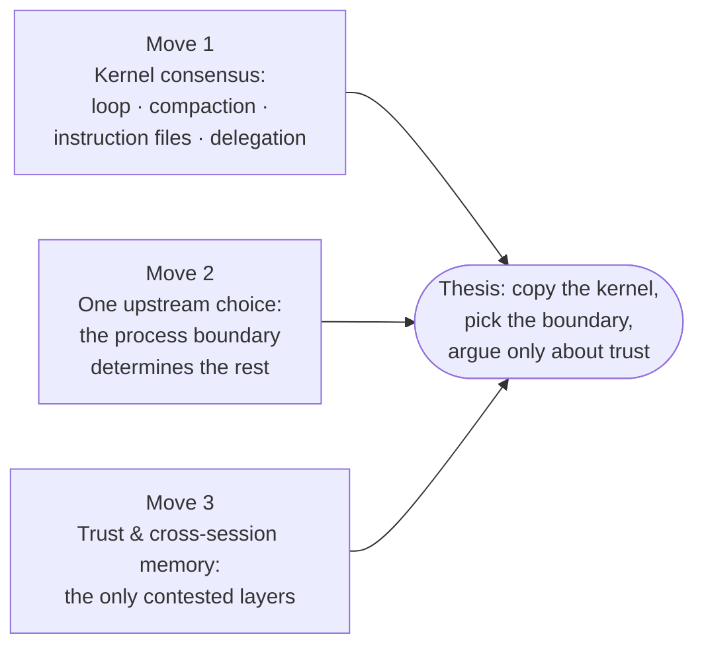

# AI coding agent architectures — opencode, pi, hermes-agent — Synthesis

> The thesis as of 2026-06-12T18:10:00. This is what the research currently argues, given everything ingested so far. It will evolve.

## Thesis

**The coding-agent kernel is settled; the harness around it is not.** Three codebases with no shared implementation lineage — a Bun/Effect client/server engine, a minimal-dependency TypeScript library stack, and a synchronous Python monolith [[wiki/comparisons/general-architecture-opencode-vs-pi-vs-hermes-agent]] — converge on the same kernel: a vendor-blind [[wiki/concepts/agent-loop]] over a normalized provider event grammar; the context window as a *derived view* over an append-only log where nothing is ever deleted [[wiki/concepts/session-persistence]]; threshold-triggered, tail-protecting, iterative LLM summarization [[wiki/concepts/context-compaction]]; human-curated [[wiki/concepts/instruction-files]] as project memory (none of the three uses a vector store); a delegation contract of one tool call in, final text out, no transcript leakage [[wiki/concepts/subagent-delegation]]; and rejection surfaced as a model-readable error result, never an exception [[wiki/concepts/permission-gating]]. Anyone building a harness today should copy this kernel, not redesign it.

Everything that still differs is downstream of a single upstream commitment: **where the process boundary sits**. opencode draws it at an RPC seam, pi at a package edge, hermes-agent nowhere [[wiki/comparisons/general-architecture-opencode-vs-pi-vs-hermes-agent]]. That one choice then *determines* the rest: persistence shape follows process shape (event-sourced SQLite vs. JSONL trees vs. one shared `state.db`), the subagent substrate is "the honest expression of its host architecture" (child sessions vs. child processes vs. worker threads) [[wiki/comparisons/subagents-architecture-opencode-vs-pi-vs-hermes-agent]], and the approval surface follows the boundary (any HTTP client can answer an ask vs. extension dialogs vs. chat-gateway `/approve` queues) [[wiki/comparisons/agent-permission-flow-opencode-vs-pi-vs-hermes-agent]]. The three are not rivals on one axis but coherent local optima — surfaces, composability, presence — each internally consistent once the boundary is fixed.

What remains genuinely contested is **trust and cross-session memory** — the only layers where the three take incompatible positions. Permission philosophy spans declare (config ruleset), delegate (no gate at all), and detect (regex taxonomy over command content); [[wiki/concepts/mcp]] is the sharpest adopt/reject/extend fault line in the corpus; and only hermes-agent lets the model write durable memory, while the other two abstain *by design* [[wiki/comparisons/memory-system-opencode-vs-pi-vs-hermes-agent]]. So the practical recipe this research supports: copy the kernel, pick the boundary for your scarce resource, and spend your actual design effort on trust and memory — the two questions with no consensus answer.

## Supporting moves

1. **Independent convergence on the kernel.** All five three-way comparisons end by isolating the same consensus core: every harness normalizes providers into one internal event/message grammar and keeps the loop vendor-blind — "that seam, not the loop itself, is where each codebase spent its abstraction budget" [[wiki/comparisons/agents-architecture-opencode-vs-pi-vs-hermes-agent]] — and all three "independently converged on the same compaction core … which suggests that pattern is settled practice" [[wiki/comparisons/memory-system-opencode-vs-pi-vs-hermes-agent]], [[wiki/concepts/context-compaction]], [[wiki/concepts/tool-registry]].

2. **Boundary placement explains the divergences.** The general-architecture comparison shows persistence shape following process shape; the subagents comparison shows the isolation primitive (session/process/thread) tracking the host architecture exactly; the permission comparison shows approval surfaces tracking the boundary. Divergence is structural, not philosophical disagreement about agents. [[wiki/comparisons/general-architecture-opencode-vs-pi-vs-hermes-agent]], [[wiki/comparisons/subagents-architecture-opencode-vs-pi-vs-hermes-agent]], [[wiki/sources/opencode]], [[wiki/sources/pi]], [[wiki/sources/hermes-agent]]

3. **Trust is contested even where rhetoric agrees.** All three explicitly reject conflating permission prompts with a security boundary, yet draw opposite conclusions: pi refuses to ship a gate, hermes ships the deepest stack plus an unbypassable hardline floor, opencode treats gating as multi-client consent UX. Agreement on the premise, divergence on the design — the signature of an unsettled layer. [[wiki/comparisons/agent-permission-flow-opencode-vs-pi-vs-hermes-agent]], [[wiki/concepts/permission-gating]], [[wiki/concepts/sandboxing]]

## What it depends on

- **Three CLI-shaped sources, all in [[8 - Projects/Building Your Own AI Research OS/example_2_github/research-coding-agent-architectures/wiki/entities/claude-code]]'s orbit.** The "settled kernel" claim rests on N=3 harnesses that all parse `CLAUDE.md`/`AGENTS.md` and cite Claude Code's conventions — convergence could be imitation of a common ancestor rather than independent discovery. [[wiki/sources/opencode]], [[wiki/sources/pi]], [[wiki/sources/hermes-agent]]
- **Single-commit snapshots.** Each repo was read at one pinned commit; opencode is mid v1→v2 rewrite, so its loop and permission semantics may shift under the thesis. [[wiki/sources/opencode]]

## Counter-evidence

No contradictions file exists yet, but the wiki holds real tensions:

- **The kernel may be less settled than claimed at the loop layer**: pi carries two competing stateful wrappers (`Agent` vs. `AgentHarness`) and opencode's v2 event-sourced engine is unfinished — the loop's *persistence coupling* is still in motion even if its semantics are stable. [[wiki/sources/pi]], [[wiki/sources/opencode]]
- **An unreconciled hermes-agent tension**: one claim says sandboxed backends "skip the entire approval stack," another says hardline patterns "block unconditionally before any bypass" — the sources don't reconcile them, which muddies move 3's tidy spectrum. [[wiki/sources/hermes-agent]] (logged in [[8 - Projects/Building Your Own AI Research OS/example_2_github/research-coding-agent-architectures/wiki/open-questions]])
- **"Agent" and "loop" sit at different altitudes** across the three (config record vs. function vs. class; steps-over-history vs. in-memory run vs. single turn), so the convergence claim holds at the contract level, not line-for-line. [[wiki/comparisons/agents-architecture-opencode-vs-pi-vs-hermes-agent]]

## What would change the thesis

A fourth harness from outside the Claude-Code orbit — IDE-native, RL-trained, or vector-memory-based — that *rejects* the compaction/instruction-file kernel would convert "settled practice" into "CLI monoculture." opencode's v2 landing with materially different loop semantics would weaken move 1 from inside the corpus.

> Synthesis: Medium confidence, honestly earned. The thesis stands on three deeply-read sources whose five pairwise-aligned comparisons all point the same way, with no logged contradictions — but N=3, a shared Claude-Code ancestry, and one in-flight rewrite cap it below high. The kernel-consensus claim (move 1) is the most solid: it is attested independently in four concept pages and every comparison's closing verdict. The boundary-determines-everything claim (move 2) is sturdy but partly definitional. The trust-is-the-frontier claim (move 3) is the most generative for writing and the most exposed: it leans on one unreconciled hermes-agent tension and on absence-of-consensus, which a single well-designed fourth harness could resolve either way.
