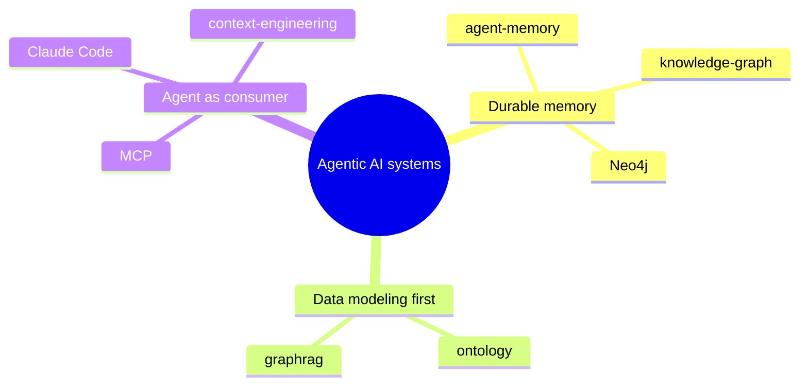

# Agentic AI systems: agent memory, agentic coding, and GraphRAG — Overview

> Three Decoding AI articles by Paul Iusztin on building agentic AI systems: agent memory backed by Neo4j knowledge graphs, a multi-agent Claude Code engineering setup, and agentic GraphRAG served through a unified MCP memory layer.

## Themes

The three sources co-cite a tight cluster of entities and concepts. Read together they describe one pipeline — model the data, store it as a graph, then let an agent reach it through tools — applied across memory, retrieval, and coding.

**Durable, identity-aware memory beats files and vectors.** [[8 - Projects/Building Your Own AI Research OS/example_3_ingest_links/research-custom-urls/wiki/concepts/agent-memory]] and [[8 - Projects/Building Your Own AI Research OS/example_3_ingest_links/research-custom-urls/wiki/concepts/knowledge-graph]] argue that file logs "fragment and rot context" and vector indexes give "no merge, no identity," so durable recall needs a typed graph that tracks whether today's entity is yesterday's. This is the spine of the strongest source, [[8 - Projects/Building Your Own AI Research OS/example_3_ingest_links/research-custom-urls/wiki/sources/web-inside-neo4js-agent-memory]].

**Data modeling comes before retrieval.** [[8 - Projects/Building Your Own AI Research OS/example_3_ingest_links/research-custom-urls/wiki/concepts/ontology]] and [[8 - Projects/Building Your Own AI Research OS/example_3_ingest_links/research-custom-urls/wiki/concepts/graphrag]] share the thesis that "GraphRAG isn't a retrieval algorithm, it's a data modeling problem" — skip the schema and you get label explosion (17 node types from five documents). Anchored in [[8 - Projects/Building Your Own AI Research OS/example_3_ingest_links/research-custom-urls/wiki/sources/web-building-agentic-graphrag-systems]].

**The agent is the consumer, reached through tools.** [[8 - Projects/Building Your Own AI Research OS/example_3_ingest_links/research-custom-urls/wiki/entities/mcp]], [[8 - Projects/Building Your Own AI Research OS/example_3_ingest_links/research-custom-urls/wiki/entities/claude-code]], and [[8 - Projects/Building Your Own AI Research OS/example_3_ingest_links/research-custom-urls/wiki/concepts/context-engineering]] frame memory and retrieval as something an agent autonomously reads and writes via `search_memory`/`write_memory` over a FastMCP server — while the coding piece pushes back, preferring direct CLIs over MCP wrappers. Strongest in [[8 - Projects/Building Your Own AI Research OS/example_3_ingest_links/research-custom-urls/wiki/sources/web-from-vibe-coding-to-real-engineering-team]] and [[8 - Projects/Building Your Own AI Research OS/example_3_ingest_links/research-custom-urls/wiki/sources/web-building-agentic-graphrag-systems]].

## Index

### Entities (3)
- [[8 - Projects/Building Your Own AI Research OS/example_3_ingest_links/research-custom-urls/wiki/entities/neo4j]] — Property-graph DB used as the single substrate for memory and GraphRAG, recommended only when deep traversal is core (2 sources).
- [[8 - Projects/Building Your Own AI Research OS/example_3_ingest_links/research-custom-urls/wiki/entities/claude-code]] — Anthropic's agentic coding harness; orchestration substrate and the consumer end of graph memory (3 sources).
- [[8 - Projects/Building Your Own AI Research OS/example_3_ingest_links/research-custom-urls/wiki/entities/mcp]] — Tool-exposure layer (via FastMCP) that wires memory and capabilities into harnesses (3 sources).

### Concepts (5)
- [[8 - Projects/Building Your Own AI Research OS/example_3_ingest_links/research-custom-urls/wiki/concepts/agent-memory]] — Durable structured store that compounds agent intelligence across conversations via entity identity and merging.
- [[8 - Projects/Building Your Own AI Research OS/example_3_ingest_links/research-custom-urls/wiki/concepts/graphrag]] — RAG over a knowledge graph, framed as a data-modeling problem; becomes agentic when the agent reads/writes the graph itself.
- [[8 - Projects/Building Your Own AI Research OS/example_3_ingest_links/research-custom-urls/wiki/concepts/knowledge-graph]] — Typed nodes and edges giving mergeable memory with stable identity over time.
- [[8 - Projects/Building Your Own AI Research OS/example_3_ingest_links/research-custom-urls/wiki/concepts/ontology]] — The must-come-first type system (POLE+O) constraining graph nodes and edges.
- [[8 - Projects/Building Your Own AI Research OS/example_3_ingest_links/research-custom-urls/wiki/concepts/context-engineering]] — Managing what enters the context window so agents act on canonical, non-rotting information.

### Notable sources (top 3 by score — all 1.00)
- [[8 - Projects/Building Your Own AI Research OS/example_3_ingest_links/research-custom-urls/wiki/sources/web-inside-neo4js-agent-memory]] — Paul Iusztin, score 1.00. The `neo4j-labs/agent-memory` reference architecture: three memory tiers on one graph under a closed POLE+O ontology.
- [[8 - Projects/Building Your Own AI Research OS/example_3_ingest_links/research-custom-urls/wiki/sources/web-building-agentic-graphrag-systems]] — Paul Iusztin, score 1.00. Agentic GraphRAG as a data-modeling problem; five-component pipeline ending in an MCP-served agent.
- [[8 - Projects/Building Your Own AI Research OS/example_3_ingest_links/research-custom-urls/wiki/sources/web-from-vibe-coding-to-real-engineering-team]] — Paul Iusztin, score 1.00. "Squid," a six-agent Claude Code setup that ships features like a real software team.

## Open threads

See [[8 - Projects/Building Your Own AI Research OS/example_3_ingest_links/research-custom-urls/wiki/open-questions]] for all 12. Top threads:

- At what concrete scale (node count, hop depth) does Neo4j become worth the cost over Postgres/MongoDB? [[8 - Projects/Building Your Own AI Research OS/example_3_ingest_links/research-custom-urls/wiki/sources/web-building-agentic-graphrag-systems]]
- Where does context compression of retrieved memory actually live? The retrieval layer defers it to the caller with no prescribed strategy. [[8 - Projects/Building Your Own AI Research OS/example_3_ingest_links/research-custom-urls/wiki/sources/web-inside-neo4js-agent-memory]]
- Is the MCP-wrapper-vs-CLI tension (Squid prefers CLIs) at odds with the GraphRAG MCP-into-Claude-Code design, or are they different layers? [[8 - Projects/Building Your Own AI Research OS/example_3_ingest_links/research-custom-urls/wiki/sources/web-from-vibe-coding-to-real-engineering-team]]
- How fixed should POLE+O be in practice — where is the boundary of "closed enough"? [[8 - Projects/Building Your Own AI Research OS/example_3_ingest_links/research-custom-urls/wiki/sources/web-inside-neo4js-agent-memory]]
- When can an unstructured discovery pass safely feed back into the curated ontology without reintroducing label explosion? [[8 - Projects/Building Your Own AI Research OS/example_3_ingest_links/research-custom-urls/wiki/sources/web-building-agentic-graphrag-systems]]

## Health
- Source pages: 3
- Entities: 3 (avg source_count across them: 2.67)
- Concepts: 5
- Comparisons: 0
- Contradictions logged: 0
- Open questions: 12
