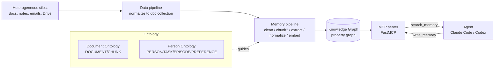

# Building Agentic GraphRAG Systems

> [[8 - Projects/Building Your Own AI Research OS/example_3_ingest_links/research-custom-urls/raw/web-building-agentic-graphrag-systems|Raw source]] · [Original](https://www.decodingai.com/p/agentic-graphrag) · score 1.00 · web

## Summary

The article reframes GraphRAG as a *data-modeling problem* rather than a retrieval algorithm, arguing that the hard part is defining an ontology before any extraction or retrieval is attempted [[8 - Projects/Building Your Own AI Research OS/example_3_ingest_links/research-custom-urls/raw/web-building-agentic-graphrag-systems#Why the Story Starts From the Ontology|ontology-first]]. Three problems motivate GraphRAG over plain RAG: context rot (degrading signal-to-noise as the context window fills), data fragmentation (data scattered across documents, notes, emails, drives), and the fact that an agent's unified memory naturally maps to a knowledge graph that must track people, places, tasks, and how those relate over time [[8 - Projects/Building Your Own AI Research OS/example_3_ingest_links/research-custom-urls/raw/web-building-agentic-graphrag-systems|cite]].

Built around a "digital twin" example, the piece defines a Global Ontology split into a deterministically-built Document Ontology (DOCUMENT/CHUNK nodes) and an LLM-extracted Person Ontology (PERSON/TASK/EPISODE/PREFERENCE nodes). It contrasts RDF with labeled property graphs (agents use property graphs in practice), and lays out three extraction modes — structured (schema-guided), semi-structured (lineage/metadata, no LLM), and unstructured (LLM invents labels, for discovery only) [[8 - Projects/Building Your Own AI Research OS/example_3_ingest_links/research-custom-urls/raw/web-building-agentic-graphrag-systems#RDF vs. Property Graphs, and the Three Extraction Modes|extraction modes]].

A five-component architecture (data pipeline → memory pipeline → KG → MCP server → agent) turns heterogeneous silos into a single queryable graph the agent reaches through `search_memory` and `write_memory` tools. The memory pipeline emphasizes optional chunking, Pydantic-style schema descriptors, and normalization (one canonical ID per entity over time) as the most important step [[8 - Projects/Building Your Own AI Research OS/example_3_ingest_links/research-custom-urls/raw/web-building-agentic-graphrag-systems#The Memory Pipeline|memory pipeline]]. It compares append-only-log versus single-mutable-collection data models (temporality vs. operational simplicity), and describes hybrid two-stage retrieval: text+semantic search merged by Reciprocal Rank Fusion, then 2–3 hop graph traversal, with bottom-up vs. top-down variants. The "cherry on top" is making this agentic — the agent autonomously decides when to read/write memory via a FastMCP-served MCP server wired into harnesses like Claude Code or Codex [[8 - Projects/Building Your Own AI Research OS/example_3_ingest_links/research-custom-urls/raw/web-building-agentic-graphrag-systems#The Cherry on Top: Agentic GraphRAG|agentic]].

## Key claims

- GraphRAG is a data-modeling problem, not a retrieval algorithm; it requires an ontology first. [[8 - Projects/Building Your Own AI Research OS/example_3_ingest_links/research-custom-urls/raw/web-building-agentic-graphrag-systems|cite]]
- GraphRAG is justified by three forces: context rot, data fragmentation, and an agent's unified memory mapping naturally to a knowledge graph. [[8 - Projects/Building Your Own AI Research OS/example_3_ingest_links/research-custom-urls/raw/web-building-agentic-graphrag-systems|cite]]
- Skipping the ontology is costly — LangChain's `MongoDBGraphStore` produced 17 node types and 34 relationship types from just five documents (including `part_of`, `Part Of`, `part of` as three types). [[8 - Projects/Building Your Own AI Research OS/example_3_ingest_links/research-custom-urls/raw/web-building-agentic-graphrag-systems|cite]]
- Agent stacks use labeled property graphs over RDF; there are three extraction modes (structured, semi-structured, unstructured). [[8 - Projects/Building Your Own AI Research OS/example_3_ingest_links/research-custom-urls/raw/web-building-agentic-graphrag-systems|cite]]
- Hybrid retrieval is two-stage: text + semantic search fused via RRF for entry points, then 2–3 hop traversal over typed edges. [[8 - Projects/Building Your Own AI Research OS/example_3_ingest_links/research-custom-urls/raw/web-building-agentic-graphrag-systems|cite]]
- Use Postgres/MongoDB for 2–3 hop traversals; reach for Neo4j only when deep traversals or graph algorithms are core. [[8 - Projects/Building Your Own AI Research OS/example_3_ingest_links/research-custom-urls/raw/web-building-agentic-graphrag-systems|cite]]
- GraphRAG becomes "agentic" when the agent autonomously searches and writes the KG via an MCP server (FastMCP). [[8 - Projects/Building Your Own AI Research OS/example_3_ingest_links/research-custom-urls/raw/web-building-agentic-graphrag-systems|cite]]

## Notable quotes

> "GraphRAG isn't a retrieval algorithm, it's a data modeling problem."
> — [[8 - Projects/Building Your Own AI Research OS/example_3_ingest_links/research-custom-urls/raw/web-building-agentic-graphrag-systems|intro]]

> "Five documents produced 17 node types and 34 relationship types. This included part_of, Part Of, and part of as three separate types."
> — [[8 - Projects/Building Your Own AI Research OS/example_3_ingest_links/research-custom-urls/raw/web-building-agentic-graphrag-systems#Why the Story Starts From the Ontology|ontology cost]]

> "GraphRAG becomes agentic when an agent gets to write to and search the knowledge graph autonomously."
> — [[8 - Projects/Building Your Own AI Research OS/example_3_ingest_links/research-custom-urls/raw/web-building-agentic-graphrag-systems#The Cherry on Top: Agentic GraphRAG|agentic GraphRAG]]

## What's distinctive here

- The ontology-first thesis with a concrete failure mode (uncontrolled label explosion) as the argument against schema-free extraction.
- A pragmatic database stance: single-store (Postgres/MongoDB) by default, Neo4j only when deep traversal is core — "do not design for Google scale."
- The append-only-log vs. single-mutable-collection framing for temporality/audit trails, including the insight that the single collection equals the append-only's materialized view.
- Closing the loop to "agentic" memory exposed as MCP tools (`search_memory`/`write_memory`) wired into Claude Code/Codex via assistant-memory/assistant-learn skills.

## Connections

- **Entities**: (none have pages yet) Neo4j, MongoDB, Postgres, MCP, FastMCP, Claude Code, Codex, LangChain, GLiNER, Gemini Flash Lite, Claude Haiku, Liquid, Palantir, Pydantic, Maxime Labonne, Decoding AI.
- **Concepts**: (none have pages yet) graphrag, knowledge-graph, ontology, unified-memory, agent-memory, context-rot, data-fragmentation, property-graph, rdf, extraction-modes, reciprocal-rank-fusion, hybrid-retrieval, append-only-log, normalization, mcp-server, agentic-graphrag, digital-twin.

> Synthesis: This is the GraphRAG/unified-memory pillar of the three-article set — it supplies the data-modeling and MCP-memory backbone that the agent-memory (Neo4j knowledge graphs) and agentic-coding (Claude Code multi-agent) articles plug into.
