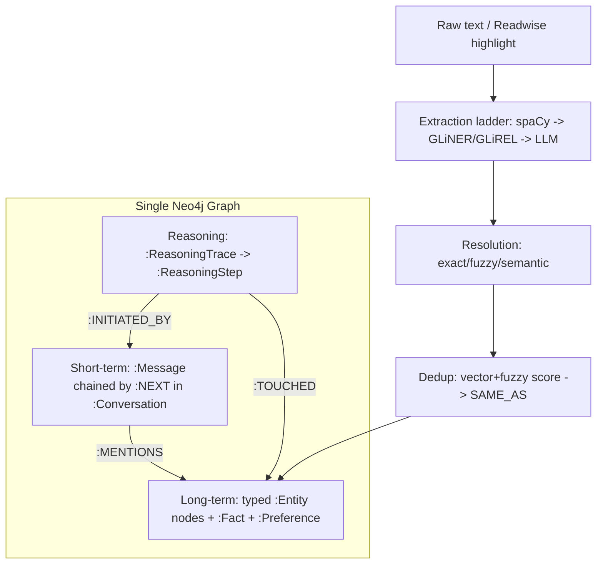

# Inside Neo4j's Agent Memory

> [[8 - Projects/Building Your Own AI Research OS/example_3_ingest_links/research-custom-urls/raw/web-inside-neo4js-agent-memory|Raw source]] · [Original](https://www.decodingai.com/p/understanding-neo4j-graph-agent-memory-system) · score 1.00 · web

## Summary

This article dissects `neo4j-labs/agent-memory` as a reference architecture for building agent memory on top of a knowledge graph. Paul frames the problem from his own second-brain setup (Obsidian, Readwise, NotebookLM, Claude Code): a pure file-based wiki cannot extract and maintain shared entities, preferences, and facts as the knowledge base scales, with performance degrading past ~50 documents ([[8 - Projects/Building Your Own AI Research OS/example_3_ingest_links/research-custom-urls/raw/web-inside-neo4js-agent-memory#Inside Neo4j's Agent Memory|intro]]). He positions knowledge-graph memory as the next step on the arc from RAG to agentic RAG to agent memory, arguing that file logs "fragment and rot context" while vector indexes give fuzzy recall with "no merge, no identity" ([[8 - Projects/Building Your Own AI Research OS/example_3_ingest_links/research-custom-urls/raw/web-inside-neo4js-agent-memory|memory approaches]]).

The core mental model is **1 graph, 3 memory tiers, POLE+O ontology, a 3-stage extraction pipeline, a composite resolver, and the SAME_AS pattern**, exposed through an SDK, a FastMCP server with 15 tools, and 9 framework adapters ([[8 - Projects/Building Your Own AI Research OS/example_3_ingest_links/research-custom-urls/raw/web-inside-neo4js-agent-memory#What's Inside neo4j-labs/agent-memory|architecture]]). All three tiers — short-term `:Message`/`:Conversation` chains, long-term typed `:Entity` nodes, and per-run `:ReasoningTrace` trees — live on a single Neo4j graph, stitched by `:MENTIONS`, `:INITIATED_BY`, and `:TOUCHED` edges so cross-tier provenance is a one-hop query ([[8 - Projects/Building Your Own AI Research OS/example_3_ingest_links/research-custom-urls/raw/web-inside-neo4js-agent-memory#Short-Term, Long-Term, Reasoning Memory|memory tiers]]).

Entity extraction runs as a speed-versus-accuracy ladder, then a two-step normalization separates **resolution** (canonical string on an existing node) from **deduplication** (whether a new node is created at all). Retrieval composes vector similarity, multi-hop traversal, time-ordered conversation walks, and reasoning lookups in one Cypher query — but the SDK leaves final context compression to the caller ([[8 - Projects/Building Your Own AI Research OS/example_3_ingest_links/research-custom-urls/raw/web-inside-neo4js-agent-memory#Zooming into the Retrieval Algorithm|retrieval]]).

## Key claims

- Durable AI memory requires a structured graph to track identity and relationships; file logs fragment context and vector indexes lack merge/identity. [[8 - Projects/Building Your Own AI Research OS/example_3_ingest_links/research-custom-urls/raw/web-inside-neo4js-agent-memory|cite]]
- The system uses a closed five-type ontology, **POLE+O** (Person, Object, Location, Event, Organization), borrowed from intelligence-analysis taxonomies; every entity is exactly one type, with open subtypes materialized as multi-tier Neo4j labels like `:Entity:Person:Individual`. [[8 - Projects/Building Your Own AI Research OS/example_3_ingest_links/research-custom-urls/raw/web-inside-neo4js-agent-memory#The Ontology|cite]]
- Beyond entities, `:Fact` nodes hold generic single-concept claims and `:Preference` nodes store user preferences via a `SUPERSEDED_BY` relationship. [[8 - Projects/Building Your Own AI Research OS/example_3_ingest_links/research-custom-urls/raw/web-inside-neo4js-agent-memory#The Ontology|cite]]
- Extraction is a cost-tiered ladder: spaCy for fast NER, GLiNER/GLiREL for zero-shot, and an LLM stage reserved for ambiguity and relationship extraction — avoiding routing every mention through an LLM. [[8 - Projects/Building Your Own AI Research OS/example_3_ingest_links/research-custom-urls/raw/web-inside-neo4js-agent-memory#Extraction: From Raw Text to Typed Entities|cite]]
- Deduplication scoring: ≥0.95 auto-merges, <0.85 creates a new node, and 0.85–0.95 creates a pending `:SAME_AS` edge for human/agent review — because "a false merge is silent and unrecoverable" while a false split is recoverable. [[8 - Projects/Building Your Own AI Research OS/example_3_ingest_links/research-custom-urls/raw/web-inside-neo4js-agent-memory#When Two Mentions Are the Same Entity|cite]]
- Reasoning memory (storing successful/failed thinking patterns) is the architecture's novelty — analogous to RL but at the database level rather than baked into weights. [[8 - Projects/Building Your Own AI Research OS/example_3_ingest_links/research-custom-urls/raw/web-inside-neo4js-agent-memory#Short-Term, Long-Term, Reasoning Memory|cite]]
- For small-to-medium scale (thousands of nodes, short hops), Paul would build on Postgres or MongoDB; Neo4j is reserved for large scale/complexity or internal data-mining tools. [[8 - Projects/Building Your Own AI Research OS/example_3_ingest_links/research-custom-urls/raw/web-inside-neo4js-agent-memory#What's Next|cite]]

## Notable quotes

> "A vector index gives you fuzzy semantic recall but no merge, no identity, and no way to know if this is the same Karpathy you knew yesterday."
> — [[8 - Projects/Building Your Own AI Research OS/example_3_ingest_links/research-custom-urls/raw/web-inside-neo4js-agent-memory|memory approaches]]

> "A false merge is silent and unrecoverable. A false split is noisy but recoverable. You can't undo a false merge without re-ingesting from the raw source data."
> — [[8 - Projects/Building Your Own AI Research OS/example_3_ingest_links/research-custom-urls/raw/web-inside-neo4js-agent-memory#When Two Mentions Are the Same Entity|dedup]]

> "Reasoning memory is the novelty from this architecture... it's similar to Reinforcement Learning (RL), but instead of baking the optimizations into the weights, you do it at the database level."
> — [[8 - Projects/Building Your Own AI Research OS/example_3_ingest_links/research-custom-urls/raw/web-inside-neo4js-agent-memory#Short-Term, Long-Term, Reasoning Memory|reasoning memory]]

## What's distinctive here

- A concrete, named blueprint (POLE+O, three tiers, three stitching edges, the 0.85/0.95 dedup bands) rather than a generic "use a graph" recommendation.
- The resolution-vs-deduplication distinction, and the asymmetry argument (false merge unrecoverable, false split recoverable) that justifies deferring uncertain merges to humans.
- The author repeatedly grounds the abstract architecture in his own scoped-wiki / second-brain use case (Claude Code as an `Object`, Anthropic as an `Organization`).

## Connections

- **Entities** (no pages yet): Neo4j / neo4j-labs/agent-memory, Claude Code, Anthropic, NotebookLM, Readwise, Obsidian, Model Context Protocol (MCP), spaCy, GLiNER, Andrej Karpathy, LangChain, LlamaIndex.
- **Concepts** (no pages yet): agent memory, knowledge graph memory, POLE+O ontology, entity resolution & deduplication, context engineering, GraphRAG / agentic RAG, reasoning memory.

> Synthesis: This is the agent-memory pillar of Paul's three-article set — it supplies the knowledge-graph + ontology + MCP vocabulary that the GraphRAG and Claude-Code engineering pieces will likely reuse, making MCP, Claude Code, Neo4j, and ontology-based memory the strongest cross-source linking candidates.
