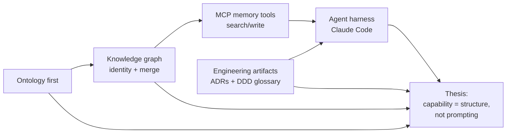

# Agentic AI systems: agent memory, agentic coding, and GraphRAG — Synthesis

> The thesis as of 2026-06-13. This is what the research currently argues, given everything ingested so far. It will evolve.

## Thesis

Across all three Decoding AI articles, Paul Iusztin's throughline is that the leverage in agentic systems lives in **structure, not prompting**. Whether the question is what an agent should *remember* (agent memory), how it should *retrieve* (GraphRAG), or how it should *build software* (the Squid multi-agent setup), Paul's consistent move is to push the hard problem upstream — into data modeling, ontology, and durable engineering artifacts — rather than into clever prompts or smarter retrieval tricks.

The sharpest statement is "GraphRAG isn't a retrieval algorithm, it's a data modeling problem" [[8 - Projects/Building Your Own AI Research OS/example_3_ingest_links/research-custom-urls/wiki/sources/web-building-agentic-graphrag-systems]]. But the same logic governs the other two pieces. Durable memory is an *identity-and-merge* problem solved by a typed knowledge graph, not a vector index — "a vector index gives you fuzzy semantic recall but no merge, no identity" [[8 - Projects/Building Your Own AI Research OS/example_3_ingest_links/research-custom-urls/wiki/sources/web-inside-neo4js-agent-memory]]. And agentic coding becomes reliable only when agents are anchored in compressed, canonical artifacts (ADRs, a DDD glossary) and a manager-style orchestration role — structure imposed on the *engineering* process [[8 - Projects/Building Your Own AI Research OS/example_3_ingest_links/research-custom-urls/wiki/sources/web-from-vibe-coding-to-real-engineering-team]].

The unifying claim, then, is that across both *what you build* (graph-backed memory exposed over MCP) and *how you build it* (a disciplined multi-agent team), Paul treats agent capability as a function of the schema and process you commit to in advance. The ontology comes before extraction; the ADR comes before the feature; the closed type system comes before the merge. Context engineering — keeping the agent's window canonical and de-duplicated — is the through-discipline that ties all three together [[8 - Projects/Building Your Own AI Research OS/example_3_ingest_links/research-custom-urls/wiki/concepts/context-engineering]].

## Supporting moves

1. **Ontology-first as the universal precondition**: In both the memory and GraphRAG pieces, the type schema must be designed before any extraction — skipping it produces label explosion (17 node types, 34 relationship types from five documents). [[8 - Projects/Building Your Own AI Research OS/example_3_ingest_links/research-custom-urls/wiki/concepts/ontology]], [[8 - Projects/Building Your Own AI Research OS/example_3_ingest_links/research-custom-urls/wiki/sources/web-building-agentic-graphrag-systems]]
2. **Knowledge graph as the substrate for durable memory**: Both articles converge on a labeled property graph (not RDF, not files, not vectors) because only a graph gives identity, merge, and multi-hop provenance — the foundation under both agent memory and GraphRAG retrieval. [[8 - Projects/Building Your Own AI Research OS/example_3_ingest_links/research-custom-urls/wiki/concepts/knowledge-graph]], [[8 - Projects/Building Your Own AI Research OS/example_3_ingest_links/research-custom-urls/wiki/concepts/agent-memory]]
3. **Memory becomes agentic via MCP**: The graph is turned into an autonomous capability by exposing `search_memory`/`write_memory` over a FastMCP server wired into harnesses, letting the agent decide when to read and write. [[8 - Projects/Building Your Own AI Research OS/example_3_ingest_links/research-custom-urls/wiki/entities/mcp]], [[8 - Projects/Building Your Own AI Research OS/example_3_ingest_links/research-custom-urls/wiki/sources/web-building-agentic-graphrag-systems]]
4. **Structure applied to the build process itself**: Squid imposes a real engineering team (PM/architect, TDD engineer, adversarial tester, diff-only reviewer) with a non-coding orchestrator and capped review loops — the same structure-over-improvisation ethos applied to coding. [[8 - Projects/Building Your Own AI Research OS/example_3_ingest_links/research-custom-urls/wiki/entities/claude-code]], [[8 - Projects/Building Your Own AI Research OS/example_3_ingest_links/research-custom-urls/wiki/sources/web-from-vibe-coding-to-real-engineering-team]]

## What it depends on

- **The 50-document degradation claim**: The case for structured memory rests on file-based wikis rotting past ~50 documents. If that threshold is much higher in practice, the urgency for a graph weakens. [[8 - Projects/Building Your Own AI Research OS/example_3_ingest_links/research-custom-urls/wiki/sources/web-inside-neo4js-agent-memory]]
- **Graphs being optional, not default**: Paul explicitly says do not reach for Neo4j by default — use Postgres/MongoDB for 2–3 hop traversals. The thesis is about *structure*, not graph databases specifically; it survives only if the structure argument is separable from the storage choice. [[8 - Projects/Building Your Own AI Research OS/example_3_ingest_links/research-custom-urls/wiki/sources/web-building-agentic-graphrag-systems]]
- **Single-author coherence**: All three sources are Paul's own. The thesis is internally consistent because it is one worldview, not because independent practitioners converged on it. [[8 - Projects/Building Your Own AI Research OS/example_3_ingest_links/research-custom-urls/wiki/sources/web-from-vibe-coding-to-real-engineering-team]]

## Counter-evidence

- The Squid agentic-coding piece deliberately *avoids* MCP wrappers in favor of direct CLIs (git, mongosh, gh), arguing LLMs have seen far more bash than MCP in training — directly opposite to the GraphRAG and memory pieces, which center MCP as the natural capability layer. These are arguably *different layers* (MCP for memory read/write, CLIs for deterministic developer tooling), but the tension is real and the dividing rule is never stated explicitly. [[8 - Projects/Building Your Own AI Research OS/example_3_ingest_links/research-custom-urls/wiki/sources/web-from-vibe-coding-to-real-engineering-team]]
- Retrieval composes neatly in one query, but final context compression is explicitly punted to the caller with no prescribed strategy — a gap in the "structure solves it" claim, since the last mile is left unstructured. [[8 - Projects/Building Your Own AI Research OS/example_3_ingest_links/research-custom-urls/wiki/sources/web-inside-neo4js-agent-memory]]

## What would change the thesis

A source showing that prompt- or retrieval-level tricks (better embeddings, longer context, smarter prompting) match graph-structured memory at scale would undercut the central claim. So would an independent practitioner reporting that ontology-first design is not worth its upfront cost in real deployments.

> Synthesis: The thesis is coherent and well-supported *internally* but rests on thin ground — three sources, all single-author (Paul himself), published within two weeks of each other. It reflects one disciplined, opinionated worldview rather than triangulated consensus, and it contains one genuine unresolved tension (MCP vs. CLI). Confidence is medium: the argument is strong as an articulation of Paul's stance, weaker as an established truth about agentic systems generally.
